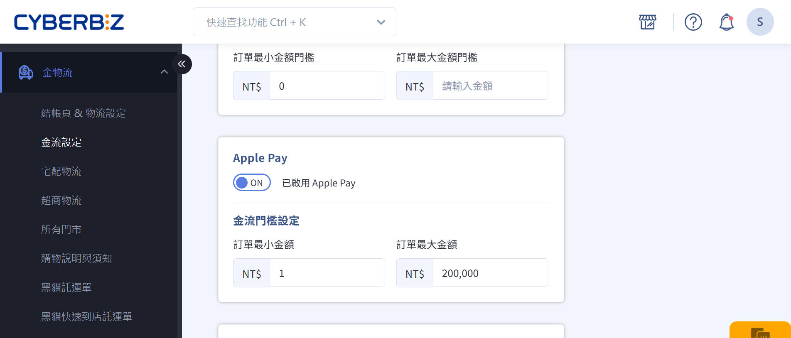

# 設定 Apple Pay
啟用 Apple Pay 支付選項，為顧客提供快速、安全且便捷的支付方式。
{ .subtitle }

[:lucide-sparkles:{ title="適用擴充" }](../../resources/conventions#適用擴充) | CYBERBIZ PAYMENTS

{ .hero-page }

??? quote "為何使用 Apple Pay？"
    - **加速結帳**：省去消費者手動輸入信用卡資訊的時間，直接透過手機快速輕鬆付款。
    - **改善體驗**：提供更方便流暢的消費體驗，降低結帳成本，提升消費慾望，進而提高轉單率。
    - **強化安全性**：透過 Apple 的 Touch ID/Face ID 身分驗證機制，確保交易安全有保障。
    - **自動啟用**：當您開通 CYBERBIZ PAYMENTS 時，會預設開啟 Apple Pay，無需額外申請或等待。
    - **費用實惠**：使用 CYBERBIZ PAYMENTS Apple Pay，費率與信用卡一次付清相同，無需額外負擔任何費用。

## 前提條件

- [x] 已[開通 **CYBERBIZ PAYMENTS**](申請%20CYBERBIZ%20PAYMENTS.md){ data-preview }

## 使用須知
### 裝置限制
- **必要條件：** Apple 裝置 + Safari 瀏覽器
- 不符合條件的裝置不會顯示 Apple Pay 選項
- 支援裝置清單：[Apple 官方文件 :lucide-external-link:](https://support.apple.com/zh-utw/102896)

### 付款限制
- **支援：** 一次付清
- **不支援：** 分期付款（需使用信用卡分期）

### 費用
- 費率同信用卡一次付清
- 無額外手續費
- 無年費

### 退款
- 退款流程同信用卡

## 操作流程

Apple Pay 通常會隨 CYBERBIZ PAYMENTS 自動啟用。您可以在後台設定其可用性及交易門檻。

1.  登入 CYBERBIZ 後台，前往 **金物流 > 金流設定**。
2.  在 CYBERBIZ PAYMENTS 區塊中，點擊 **:material-file-document-edit-outline: 編輯** 進入設定頁面。

	{ .screenshot }

3.  在 Apple Pay 設定區塊，您可以：
> 切換 **開啟/關閉 Apple Pay** 以啟用或停用此支付方式。  
> 設定 **金流門檻**：定義使用 Apple Pay 的訂單最大/最小金額。

	{ .screenshot }

4.  儲存您的設定。

## 常見問題

??? quote "Apple Pay 支援分期付款嗎？"
	不支援。Apple Pay 只能一次付清。如需分期，客戶必須選擇「信用卡分期」付款方式。

??? quote "開通 CYBERBIZ PAYMENTS 後需要另外申請 Apple Pay 嗎？"
	不需要。Apple Pay 會自動啟用，商家可在後台選擇開啟或關閉。

??? quote "為什麼客戶看不到 Apple Pay 選項？"
	可能原因：
	
	- 非 Apple 裝置
	- 非 Safari 瀏覽器
	- 後台已關閉 Apple Pay
	- 訂單金額超出設定的門檻範圍

??? quote "Apple Pay 的費率是多少？"
	與信用卡一次付清相同，依商家與 CYBERBIZ 的合約而定，無額外費用。

??? quote "可以設定訂單金額限制嗎？"
	可以。在後台設定最小/最大訂單金額。

??? quote "Apple Pay 退款要多久？"
	退款流程與時間同信用卡，通常 7-14 個工作天。

## 延伸閱讀

- [申請 CYBERBIZ PAYMENTS](申請 CYBERBIZ PAYMENTS)

