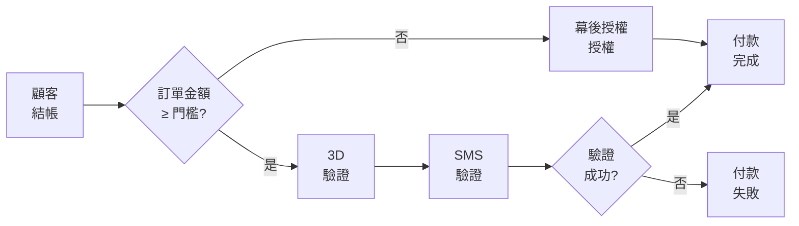

# 設定信用卡 3D 驗證門檻
:lucide-sparkles:{ title="適用擴充功能" } | CYBERBIZ PAYMENTS

設定交易金額門檻，以決定在結帳時何時觸發 *3D Secure* 驗證。

- 訂單金額 **≥ 門檻** → 3D 驗證（簡訊驗證）
- 訂單金額 **< 門檻** → 幕後授權（無需驗證）

??? quote "什麼是 3D Secure？"
	3D Secure（3DS）是一種線上信用卡支付的額外驗證機制，用以防止未經授權的交易。它要求持卡人在結帳時驗證身份，通常透過密碼、簡訊 OTP 或生物識別方式完成。

??? quote "什麼是「幕後授權」"
	後台自動授權指的是系統自動完成信用卡授權的支付流程，無需顧客進行額外驗證（例如輸入簡訊驗證碼或完成 3D Secure 驗證畫面）。

## 3D 驗證流程

## 前置條件

- [x] 已[開通 **CYBERBIZ PAYMENTS**](申請%20CYBERBIZ%20PAYMENTS.md){ data-preview }

## 使用須知

- **定期定額訂單**：只首筆執行 3D 驗證，後續扣款走幕後授權
- **適用卡別**：國內/國外信用卡
- **盜刷責任**：

| 設定       | 盜刷責任 | 損失承擔 |
|------------|----------|----------|
| 有 3D 驗證 | 持卡人   | 持卡人負擔 |
| 無 3D 驗證 | 商家     | 商家吸收 |

> 建議：門檻設 **1 元**，所有交易都經 3D 驗證。

## 設定步驟

1. 登入 CYBERBIZ 後台，前往 **金物流 > 金流設定**。
2. 在 CYBERBIZ PAYMENTS 欄位，點擊 **:material-file-document-edit-outline: 編輯**，進入設定頁面。
3. 在 **3D 驗證金額門檻** 欄位，輸入觸發的數值。
4. 儲存設定。

## 客戶結帳流程

### 一般付款（幕後授權）
訂單金額低於門檻時：

1. 客戶輸入信用卡資訊
2. 系統直接完成授權
3. 付款完成

### 3D 驗證付款

訂單金額達到門檻時：

1. 客戶輸入信用卡資訊
2. 系統轉址至發卡銀行
3. 客戶完成簡訊驗證
4. 驗證通過後完成付款

{ .screenshot }

## 故障排除

### 3D 驗證失敗
請客戶聯繫發卡銀行確認：

- 手機號碼是否正確
- 簡訊驗證服務是否開通
- 卡片是否支援 3D 驗證

## 常見問題
	    
??? quote "可以關閉 3D 驗證嗎？"
	可以，將門檻設定為一個極高的金額（例如 9999999），所有訂單都會走幕後授權。但不建議這樣做，會增加盜刷風險。
	    
??? quote "定期定額訂單每次都要 3D 驗證嗎？"
	不用。只有首筆訂單需要 3D 驗證，之後的扣款都是幕後授權，不會再要求客戶驗證。
	
??? quote "國外信用卡也支援 3D 驗證嗎？"
	是的，國內外信用卡都支援 3D 驗證。
	    
??? quote "修改門檻後，多久會生效？"
	立即生效。下一筆訂單就會套用新的門檻設定。

??? quote "3D 驗證失敗會扣款嗎？"
	不會。驗證失敗代表交易未完成，不會進行扣款。

## 延伸閱讀
- [[申請 CYBERBIZ PAYMENTS]]

---
