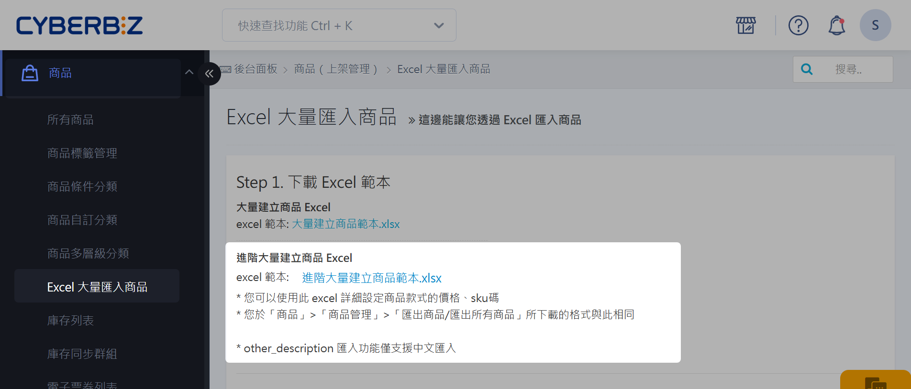
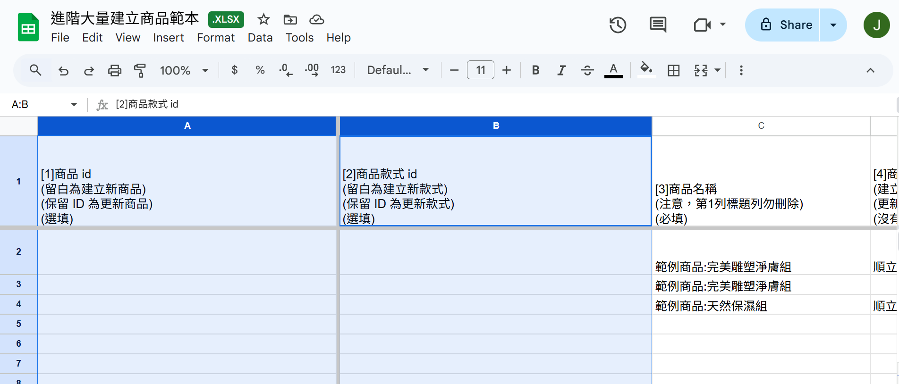
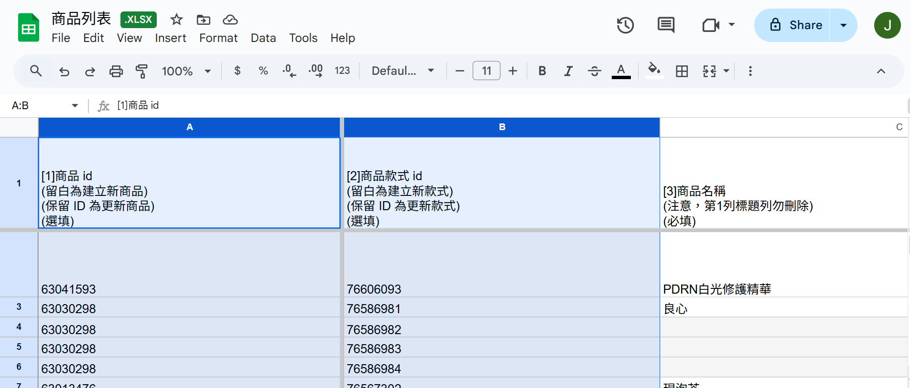

# Excel 大量匯入商品

使用 Excel 範本一次新增或更新大量商品。
{ .subtitle }

{ title="Excel 大量匯入商品：商品 > Excel 大量匯入商品" .hero-page }

## 使用須知

### Excel 格式與內容限制
	 
- 粗體字：Excel 檔案請勿使用粗體字，否則會導致上傳格式錯誤。
- 特殊符號：填寫商品名稱時，請勿使用特殊符號（如 `|` 和 `”`），以免商品無法儲存。
- 欄位性質：部分欄位支援性質不同，例如：限第一次上傳、可重複多次上傳、單一欄位、可逗號複選欄位、支援 HTML 等。
- SKU：需要與 Amazon 一致才能進行出貨。`北美站`。
	
### 圖床連結使用
		
透過 *圖床* 連結快速建立圖片時，請注意以下資訊：

- 圖片格式：僅支援 `jpg`, `jpeg`, `png`, `gif`, `webp` 等格式，且圖片大小最大不得超過 10 MB。
- 圖床權限：請務必將圖床權限設定為公開，才能成功上傳。
- 中文名稱：目前不支援中文名稱的圖床，建議先將圖片名稱轉為 UTF 格式再貼到 Excel 上傳。
- 匯入失敗：若上傳過程中因圖片大小或格式不符導致匯入失敗，整個匯入作業將停止。已上傳成功的圖片不會消失，但失敗後的圖片需另行上傳。
- 服務平台：建議可使用 Imgur 進行上傳。  
> 請依實際需求自行選擇與評估圖床服務；CYBERBIZ 不負責外部圖床服務之相關技術支援。

## 操作流程

### 下載 Excel 範本或匯出商品

=== "新增大量商品"

	1. 登入 CYBERBIZ 管理後台，前往 **商品 > Excel 大量匯入商品**。
	2. 點擊 **進階大量建立商品範本.xlsx** 下載範本。

	

=== "更新大量商品"

	1. 登入 CYBERBIZ 管理後台，前往 **商品 > 所有商品**。
	2. 選取所有欲更新的商品。
	3. 點擊 **Select**，選擇 **匯出商品**。

	

### 區分新增與更新商品

商品 Excel 檔案中的 A、B 欄位預設為隱藏。系統會根據這兩個欄位是否帶有系統數值，在上傳 Excel 檔案後判斷為 *新增商品* 或 *更新既有商品*。

=== "新增大量商品"

	下載的 Excel 範本，其 A、B 欄位為空值。上傳後將視為新增商品。

	

=== "更新大量商品"

	匯出的商品 Excel 表格，其 A、B 欄位會帶有系統數值。上傳後將視為更新既有商品。

	

### 商品 Excel 欄位說明

請依據 Excel 範本中的欄位及說明，填寫對應的商品資訊。以下為必填項目：

=== "EC"
	- 商品名稱：設定商品名稱，請勿使用特殊符號或 HTML。
	- 商品簡述類型：填寫 `html樣板文字` 或 `純文字`。
	- 商品款式售價：設定商品實際售價。

=== "EC + POS"
	- 商品名稱：設定商品名稱，請勿使用特殊符號或 HTML。
	- 商品簡述類型：填寫 `html樣板文字` 或 `純文字`。
	- 商品款式售價：設定商品實際售價。
	- 商品隸屬商店：指定商品所屬商店，若啟用 POS 為必填項目。
	- 商品款式 SKU：若為 POS 商品則屬必填項目。

### 匯入 Excel 檔案

1. 在 CYBERBIZ 管理後台，前往 **商品 > Excel 大量匯入商品**。
2. 點擊 **選擇檔案**，選擇編輯完的商品 Excel 檔。
3. 點擊 **確定上傳**。
4. 系統將依匯入結果發送相應的電子郵件通知，若有需要請依提示進行後續操作：
> **失敗**：系統將提示失敗原因如錯誤訊息，請更正後重新上傳。  
> **成功**：請耐心等候系統完成匯入作業，避免重複上傳導致資訊混亂。完成後會收到通知信件。  
> **完成**：匯入已確認完成，您可以查看更新成果或再次進行其他內容的更新。

## 常見問題

??? quote "為什麼我上傳 Excel 後，商品沒有成功新增或更新？"
    - 請檢查 Excel 檔案中是否有使用粗體字或商品名稱包含特殊符號。
    - 確認圖片連結是否符合格式與大小限制，且圖床權限已公開。
    - 檢查 A、B 欄位，是否正確[區分新增或更新商品](#區分新增與更新商品)。
    - 系統匯入需要時間，請耐心等候完成信件通知，避免重複上傳。

## 延伸閱讀

- [商品頁：商品標語 商品簡述 文字呈現修改](#)
- [SEO 優化教學](#)
- [從蝦皮搬遷商品](#)

