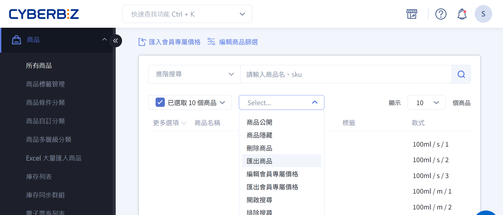
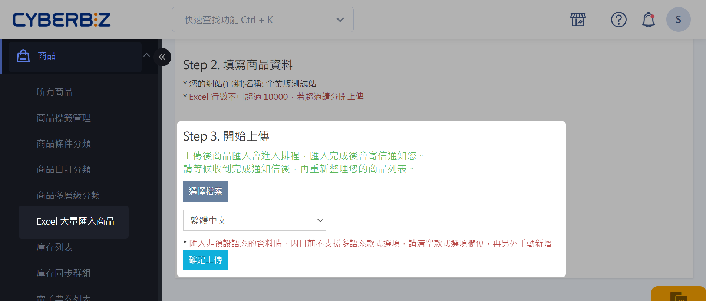

{ title="批次修改商品描述與配送設定" .hero-page }

## 批次修改商品描述與配送說明

透過 Excel 批次匯出、編輯與上傳，一次更新多筆商品的描述、溫層、配送方式與銷售通路，免逐一進入商品頁面編輯，大幅節省人工維護時間。適合的情境包含：

- 商品資訊需全面更新
- 配送方式或通路調整
- 新增溫層設定至多筆商品等。

整體操作流程分為三個階段：**匯出商品 Excel** > **編輯 Excel 內容** > **上傳 Excel 檔案**，上傳後系統會以排程處理並透過 EMAIL 通知結果。

!!! info "更新前請留意"
    - 商品通路一旦新增後將 **無法刪除**，請確認通路名稱無誤再行輸入。
    - 商品運送名稱請輸入後台已設定的物流名稱，輸入不存在的物流將導致匯入失敗。
    - 上傳時 `商品 id` 與 `商品款式 id` 欄位需保留系統數值才能更新既有商品，若留空將視為新增商品。

## 操作步驟
### 匯出商品 Excel 表格

=== "匯出部分商品"

	1. 登入 CYBERBIZ 管理後台，前往 **商品 > 所有商品**。
	2. 在商品列表中勾選欲修改的商品品項。
	3. 點擊操作選單，選擇 **匯出商品**，系統將自動下載 Excel 檔案至您的電腦。

	!!! tip "快速大量選取商品"
	    若需一次選取多筆商品，建議先使用 *進階搜尋* 篩選出符合條件的商品，
	    再點擊商品列表上方的 *「已選取_商品」* 勾選框，即可一次選取目前篩選結果中的所有商品。瞭解更多搜尋與篩選方式，請參閱[搜尋商品](../create-and-manage/product-management-interface.md#篩選器使用邏輯){ title="使用商品管理介面管理商品" }。

=== "匯出全部商品"

	1. 登入 CYBERBIZ 管理後台，前往 **商品 > 所有商品**。
	2. 點擊 **已選取__個商品** 欄位，選擇 **選取全部商品**。
	3. 點擊操作選單，選擇 **匯出商品**，系統將自動下載 Excel 檔案至您的電腦。
	
	{ title="匯出全部商品" .screenshot }

---

### 編輯 Excel 檔案

開啟下載的匯出商品 Excel 檔案，在對應欄位輸入或修改商品描述跟配送設定。後台實際設定與操作流程，請參閱[編輯商品描述與商品設定](../create-and-manage/edit-product-description-settings.md){ title="編輯商品描述與商品設定" }。

---

#### 商品描述

- 商品描述頁面包含「商品介紹」、「規格說明」、「運送方式」三個區塊。請分別在 Excel 表格的「商品介紹」、「規格說明」、「運送方式」欄位中輸入對應內容。
- 若需確認欄位內容在後台的呈現方式，請前往 **商品 > 所有商品 > 點擊特定商品 >「商品描述」頁籤**。

---

#### 商品通路

- 請輸入商品的出貨通路名稱。若輸入商店原先沒有的通路，系統將視為 **新增通路**。
- 留空表示 **適用全通路**。

!!! warning "注意"
    通路新增後將 **無法刪除**。

---

#### 商品溫層
- 請輸入 `常溫`、`冷藏` 或 `冷凍`。
- 留空表示 **預設為常溫**。
- 可複選多溫層，輸入時請使用 **英文逗號** 分隔，例如：常溫、冷藏、冷凍。

---

#### 商品運送名稱
- 請輸入配送物流名稱。請勿輸入後台未設定的物流名稱。
- 可複選多物流配送，輸入時請使用 **英文逗號** 分隔，例如：黑貓、宅配通。
- 留空表示 **適用全部配送方式**。

## 上傳 Excel 檔案
	
1. 登入 CYBERBIZ 管理後台，前往 **商品 > Excel 大量匯入商品**。
2. 上傳已編輯完成的 Excel 檔案。

{ title="上傳 Excel 檔案" }

!!! info "商品更新與新增規則說明"
    上傳的 Excel 檔案中，`商品 id` 與 `商品款式 id` 欄位必須填入系統既有數值，才能 *更新既有商品*。若欄位為空，系統將自動 *新增新商品*。如需詳細差異說明與操作範例，請參閱[新增與更新商品差異](excel-import-products.md#determine-add-or-update){ title="Excel 大量匯入商品" }。

## 等待匯入排程通知

=== ":material-progress-check: 資料匯入處理中"
    若輸入格式無誤，您將會收到「資料匯入處理中」的 EMAIL 通知。

    { title="資料匯入處理中" .screenshot }

=== ":material-check-circle-outline: 商品資料匯入成功" 

    當匯入作業完成後，您會再收到「商品 資料匯入成功」的 EMAIL 通知，表示批次修改商品內容已完成。

    { title="商品資料匯入成功" .screenshot }

## 後續操作 { #next-steps-batch-update }

批次更新完成後，建議接著閱讀下列文件，以更完整掌握商品描述與配送設定：

- :lucide-file-spreadsheet:{ .lg }  
  [__Excel 大量匯入商品__](excel-import-products.md){ title="Excel 大量匯入商品" }  
  了解 Excel 匯入的完整流程，包含新增商品、圖床連結與新增更新判斷規則。

- :lucide-file-pen:{ .lg }  
  [__編輯商品描述與商品設定__](../create-and-manage/edit-product-description-settings.md){ title="編輯商品描述與商品設定" }  
  認識商品描述、通路與物流屬性在後台的單筆編輯方式與呈現效果。

- :lucide-truck:{ .lg }  
  [__設定商品配送條件__](../shipping/setup-product-shipping-conditions.md){ title="設定商品配送條件（物流、溫層與出貨通路）" }  
  搞懂物流、溫層與出貨通路的後台設定邏輯與結帳拆單行為。

## 常見問題
