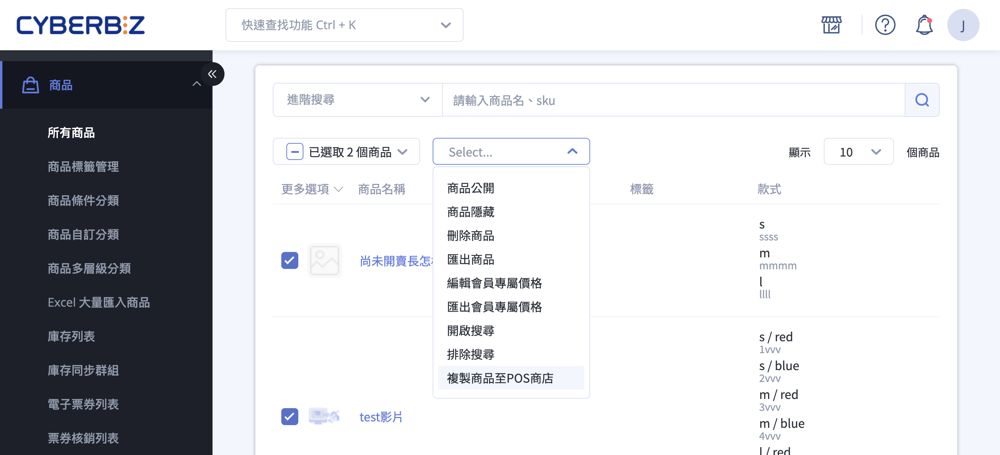

{ title="複製商品至 POS 商店" .hero-page }

## 複製商品至 POS 商店說明 { #intro-copy-to-pos }

「複製商品至 POS 商店」可協助您把已經建立好的商品，一次大量複製到一間或多間 POS 門市，讓門市快速擁有相同的商品資料。適合的情境包含：商品已在官網上架、想在新開的實體門市建立相同品項、或需要把熱銷商品同步給多家門市販售。

!!! info "提示"
    複製是「建立一份新的商品資料」到目標門市，與原商品各自獨立。複製完成後，門市端的售價、庫存、上架狀態都可單獨調整，不會互相影響。

## 使用前提與限制 { #prerequisites-copy-to-pos }

依您採用的方式不同，需要的條件也不同。請先確認下列項目：

- [x] **已開通 POS（門市銷售）功能**：商店需先開通 POS 功能，批量操作選單中才會出現此選項。
- [x] **帳號操作權限**：操作帳號需具備「可複製商品到 POS 商店」權限。若選單中沒有此選項，請聯絡商店管理員至權限設定開啟。
- [x] **商品款式已設定 SKU**：SKU 是每個商品款式的唯一識別碼，請先確認要複製的商品都已填寫 SKU。

!!! plan "兩種使用方式與適用方案"
    * **批次複製既有商品**：適用所有已開通 POS 功能的商店。於商品列表勾選商品後批次複製，詳見 [批次複製既有商品至 POS 商店][operate-copy-to-pos-bulk]。
    * **建立商品時直接指定門市**：僅 **POS 獨賣** 方案適用。在新增商品頁面即可直接選擇要同步販售的門市，詳見 [建立新商品時直接指定 POS 門市][operate-copy-to-pos-on-create]。

## 操作步驟 { #operate-copy-to-pos }

### 批次複製既有商品至 POS 商店 { #operate-copy-to-pos-bulk }

**後台路徑：** 「商品」→「所有商品」

1. **勾選商品：** 於商品列表勾選要複製的商品，可勾選單筆、整頁，或選取符合目前搜尋條件的全部商品。
2. **開啟複製選單：** 點選列表上方的批量操作選單，選擇 **「複製商品至 POS 商店」**。
3. **選擇目標門市：** 於彈出視窗的 **「POS 商店」** 欄位選擇要複製到的門市，可同時複選多間；若要一次選取全部，勾選 **「所有 POS 商店」** 即可。
4. **決定是否複製圖片：** 視需求勾選 **「連帶複製商品所有圖片」**[^media]。若不勾選，門市端的商品將沒有圖片，建議開啟以利門市人員辨識。
5. **送出複製：** 點擊 **「確認」**，系統會把作業排入排程處理[^queued]，完成後寄送通知信到您的帳號信箱。
6. **查看結果：** 收到通知信後，回到商品列表重新整理，即可看到已隸屬於該門市的新商品。若有商品複製失敗，通知信會附上 **「複製商品失敗列表」** 檔案，逐筆列出失敗原因[^failreason]。

[^media]: 若商店另有開通「商品影片」功能，此選項會顯示為「連帶複製商品所有圖片與影片」，可一併複製商品影片。
[^queued]: 送出後系統會提示「複製商品已加入排程，請勿重複操作」，請勿重複點擊以免重複建立。
[^failreason]: 最常見的失敗原因是目標門市已存在相同 SKU 的商品，詳見 [重要規範與限制][specs-copy-to-pos]。

---

### 建立新商品時直接指定 POS 門市 { #operate-copy-to-pos-on-create }

!!! plan "方案限制"
    此方式僅 **POS 獨賣** 方案適用。其他方案請改用上方的 [批次複製][operate-copy-to-pos-bulk] 方式。

**後台路徑：** 「商品」→ 新增商品

1. **新增商品：** 進入新增商品頁面，填寫商品名稱、款式與 SKU 等基本資料。
2. **指定販售門市：** 在 **「欲同步販售的 POS 門市」** 區塊，選擇 **「指定 POS 門市」** 後挑選門市，或選擇 **「全部 POS 門市」** 同步給所有門市。
3. **儲存商品：** 儲存後，系統會把商品同步建立到所選門市。此作業需要一些時間，完成後系統會自動寄送通知信。

---

## 重要規範與限制 { #specs-copy-to-pos }

- **SKU 不可重複：** 同一間 POS 門市內不允許出現相同 SKU 的商品。若目標門市已有相同 SKU，該商品就不會被複製，並列入失敗清單，原因顯示為「指定商店已有相同 SKU 商品」；其餘沒有衝突的商品仍會正常複製。
- **庫存預設為零：** 複製到 POS 門市的商品，庫存一律從 0 開始。您需要另外透過進銷存流程（如新增進倉單）為門市建立實際庫存後，商品才能在門市正常銷售。
- **預設不公開：** 複製後的商品在門市端預設為「不公開」狀態，確認資料與庫存無誤後，再自行上架販售。
- **圖片需自行選擇：** 圖片不會自動複製，需在複製時勾選「連帶複製商品所有圖片」才會一併帶入。
- **複製為獨立資料：** 複製後的商品與原商品各自獨立，事後修改其中一邊不會同步影響另一邊。

---

## 後續操作 { #next-steps-copy-to-pos }

複製完成後，建議接著完成下列設定，商品才能正式在門市銷售：

- :lucide-package-plus:{ .lg }  
  [__建立門市庫存__](../../../pos/inventory/index.md)  
  複製後庫存為 0，請透過進倉單等進銷存流程補齊門市實際庫存。

- :lucide-eye:{ .lg }  
  [__上架商品__](../../products/create-and-manage/create-update-products.md)  
  複製後預設為不公開，確認資料無誤後將商品設為公開。

- :lucide-tag:{ .lg }  
  [__大量填補商品 SKU__](../../../pos/get-started/bulk-update-product-skus.md)  
  若有商品因缺少或重複 SKU 而複製失敗，可先批次整理 SKU 再重新複製。

---

## 常見問題 { #faq-copy-to-pos }

??? quote "找不到「複製商品至 POS 商店」選項"
    { #faq-copy-to-pos-no-option }
    請依序確認下列項目：

    - 商店是否已開通 POS（門市銷售）功能。
    - 操作帳號是否具備「可複製商品到 POS 商店」權限，可請管理員至權限設定開啟。
    - 是否已先在列表勾選商品，並使用「整頁」或「全部」的選取方式。

??? quote "部分商品沒有複製成功怎麼辦"
    { #faq-copy-to-pos-partial-fail }
    系統完成後寄出的通知信會附上 **「複製商品失敗列表」** 檔案。最常見的原因是目標門市已存在相同 SKU 的商品。請調整 SKU 後，再針對失敗的商品重新複製即可。

??? quote "複製後門市看不到商品、或商品無法販售"
    { #faq-copy-to-pos-not-visible }
    這是正常的預設行為。複製後的商品預設為：

    - **不公開**：需自行至商品列表將商品設為公開。
    - **庫存為 0**：需透過進倉等流程補齊庫存後才能銷售。

??? quote "商品圖片沒有跟著複製過去"
    { #faq-copy-to-pos-no-image }
    圖片需要在複製時勾選 **「連帶複製商品所有圖片」** 才會帶入。若當初未勾選，可重新複製或於門市端的商品自行補上圖片。

??? quote "可以重複點擊複製嗎"
    { #faq-copy-to-pos-duplicate-submit }
    不建議。送出後作業會進入排程，畫面會提示「複製商品已加入排程，請勿重複操作」。重複點擊可能造成重複建立，請耐心等候通知信。

---

## 參考資料 { #reference-copy-to-pos }

- [POS 庫存管理](../../../pos/inventory/index.md)
- [商品上架與公開設定](../../products/create-and-manage/create-update-products.md)
- [大量填補商品 SKU](../../../pos/get-started/bulk-update-product-skus.md)
