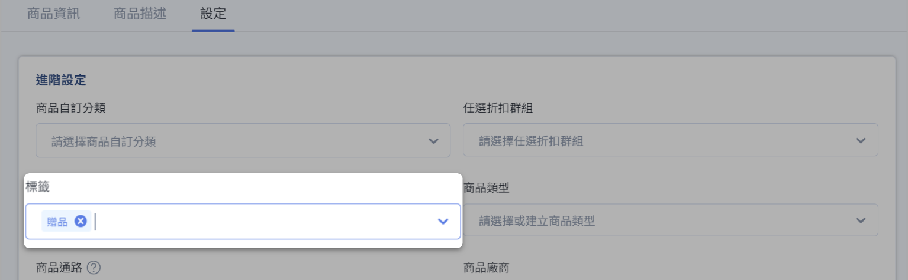

# 排除商品上傳第三方平台
設定排除標籤，讓商品不上傳至第三方平台。
{ .subtitle }

[:lucide-tag:{ title="適用方案" }](../../resources/conventions#適用方案) | 全方案
{ .doc-badge }

CYBERBIZ 會自動將商品資料同步至第三方銷售與廣告平台（如 Google Merchant Center、Facebook DPA、LINE 購物、美安等），以擴大商品曝光。若某些商品不適合出現在這些平台[^exclude-examples]，您可以透過商品標籤將其排除，系統即不會將該商品資料上傳至指定平台。

!!! example "適用情境"
    - 贈品或內部測試商品，不希望出現在廣告動態中。
    - 合約或授權限制，部分商品不得於特定平台曝光。
    - 避免特定商品消耗廣告預算。

## 排除標籤適用平台

當商品被設定排除標籤後，系統將不會把該商品資料上傳至以下第三方平台：

- [x] Google Merchant Center
- [x] Facebook 動態產品目錄 DPA
- [x] LINE 購物
- [x] 美安 (僅限 `贈品` 標籤)

## 操作步驟
	
您可以透過為商品添加特定標籤，來設定商品排除上傳至第三方平台：

1. 登入 CYBERBIZ 管理後台，前往 **商品 > 所有商品**。
2. 在商品列表中，點擊欲排除商品的 **商品名稱**，進入商品編輯頁面。
3. 在商品標籤欄位中，輸入以下任一排除標籤：
	 - `排除product feed`：此標籤適用於 Google Merchant Center、Facebook 動態產品目錄 DPA、Line 購物等平台。
	 - `贈品`：此標籤適用於所有第三方平台，包括美安。

	!!! warning "標籤輸入注意事項"
	    -   `排除product feed` 標籤中，「排除」與「product」之間請勿添加空格。
	    -   美安平台目前僅支援透過 `贈品` 標籤排除商品，不支援 `排除product feed` 標籤。

4. 點擊 **儲存** 以套用設定。

## 常見問題

??? quote "如果我同時設定了 `排除product feed` 和 `贈品` 標籤，會有什麼影響？"
    若同時設定兩個標籤，系統將優先依據 `贈品` 標籤的規則進行排除，確保商品不會上傳至所有支援的第三方平台。

??? quote "排除商品後，顧客還能在我的 CYBERBIZ 商店中找到並購買嗎？"
    可以。此排除設定僅影響商品是否上傳至第三方平台，不影響商品在您 CYBERBIZ 商店中的可見性與購買功能。顧客仍可透過商店內搜尋或直接連結找到並購買商品。

[^exclude-examples]: 例如贈品、內部測試商品、或合約限制不得對外曝光的商品。

## 後續操作

- :lucide-tag:{ .lg }  
  [__商品標籤管理設定__](../categories-and-tags/manage-product-tags.md)  
  了解如何新增、編輯及管理商品標籤，有效分類您的商品。

- :lucide-file-edit:{ .lg }  
  [__編輯商品描述與商品設定__](../create-and-manage/edit-product-description-settings.md)  
  設定商品內容、通路與物流屬性，確保前台呈現正確。

