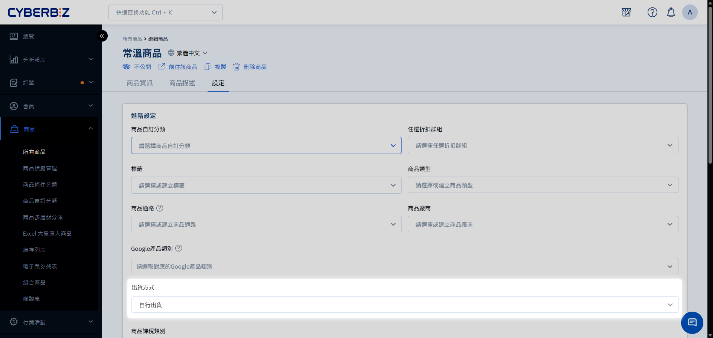
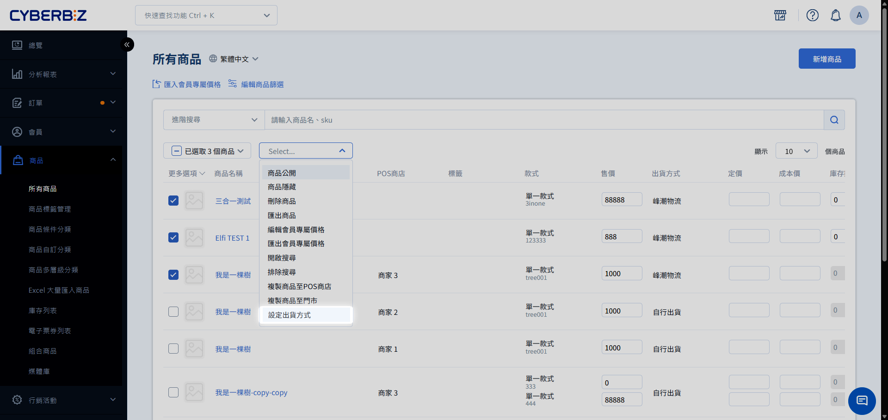
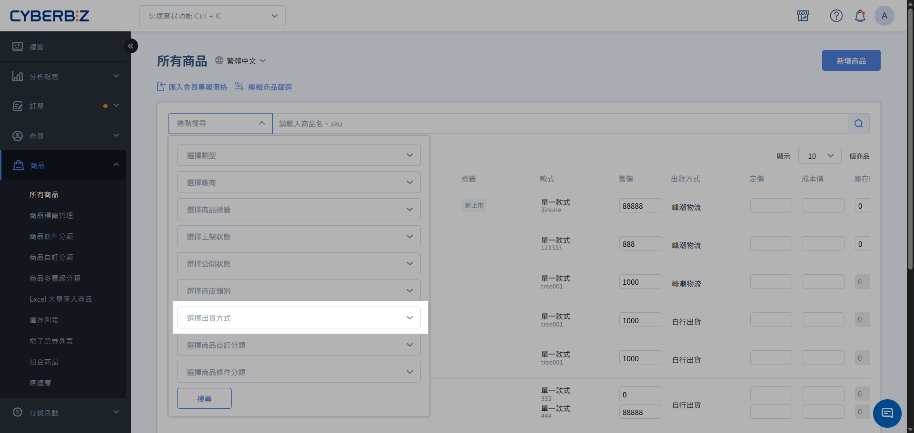

# 設定商品出貨方式

依商品的實際出貨來源，將商品指向自行出貨、第三方倉儲或跨境物流。
{ .subtitle }

[:lucide-layers:{ title="適用產品" }](../../../resources/conventions.md) | 智慧倉儲 / 跨境電商
{ .doc-badge }

## 使用須知

- **選項來源**：**出貨方式** 的可選項目會依商店已開通的物流功能顯示。

## 操作流程

### 單筆設定

1. 登入 CYBERBIZ 管理後台，前往 **商品 > 所有商品**。
2. 點擊目標商品，進入商品編輯頁。
3. 切換至 **設定** 分頁，在 **出貨方式** 選擇適用的出貨來源。
4. 點擊 **儲存**，完成商品出貨方式設定。

{ .screenshot }

### 批次設定

1. 前往 **商品 > 所有商品**，勾選要修改的商品。
2. 點擊 **更多操作 > 設定出貨方式**。
3. 選擇適用的出貨來源，完成批次變更。

!!! warning "批次設定限制"
    若商店已開啟 **快速到貨** 或 **POS** 功能，請先排除該類商品，再執行批次設定。

{ .screenshot }

### Excel 大量設定

1. 前往 **商品 > 所有商品**，勾選要修改的商品。
2. 點擊 **更多操作 > 匯出商品**，下載商品 Excel 檔案。
3. 在 Excel 的 `出貨方式` 欄位填入後台已存在的出貨來源名稱。
4. 保留 `商品 id` 與 `商品款式 id` 欄位中的既有數值。
5. 前往 **商品 > Excel 大量匯入商品**，上傳編輯完成的檔案。

!!! info "匯入結果"
    系統會以排程處理檔案，並透過 Email 通知匯入結果。完成後，回到商品列表確認商品的出貨方式。

如需了解 Excel 匯入的新增、更新判斷與完整流程，請參考[Excel 大量匯入商品](../bulk-operations/excel-import-products.md){ title="Excel 大量匯入商品" }。

## 驗證設定結果

- **方法一**：回到 **商品 > 所有商品**，使用 **進階搜尋**，以 **出貨方式** 條件篩選商品，確認篩選列表中的商品正確無誤。

    { .screenshot }

- **方法二**：開啟目標商品的 **設定** 分頁，確認 **出貨方式** 顯示為預期的出貨來源。

## 返回使用情境

智慧倉儲（拆單、混單）或 Amazon FBA 會依出貨方式產生對應訂單。完成本頁設定後，請返回原情境文件繼續操作。

- :lucide-git-branch:{ .lg }
  [__啟用部分串倉與拆單__](../../../wms/enable-partial-warehouse-integration-and-order-splitting.md){ title="啟用部分串倉與拆單" }
  依商品出貨來源分開結帳，並分別處理倉庫與商家訂單。

- :lucide-layers:{ .lg }
  [__啟用部分串倉與混單__](../../../wms/enable-partial-warehouse-integration-and-mixed-orders.md){ title="啟用部分串倉與混單" }
  將倉庫商品與自行出貨商品合併結帳，再分別完成出貨。

- :lucide-globe:{ .lg }
  [__Amazon FBA 跨境物流__](../../payments-and-logistics/amazon-fba-cross-border-logistics.md){ title="Amazon FBA 跨境物流" }
  綁定 Amazon SKU 與出貨方式，完成跨境訂單拋轉與貨態同步。

