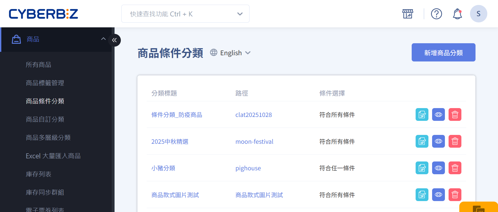
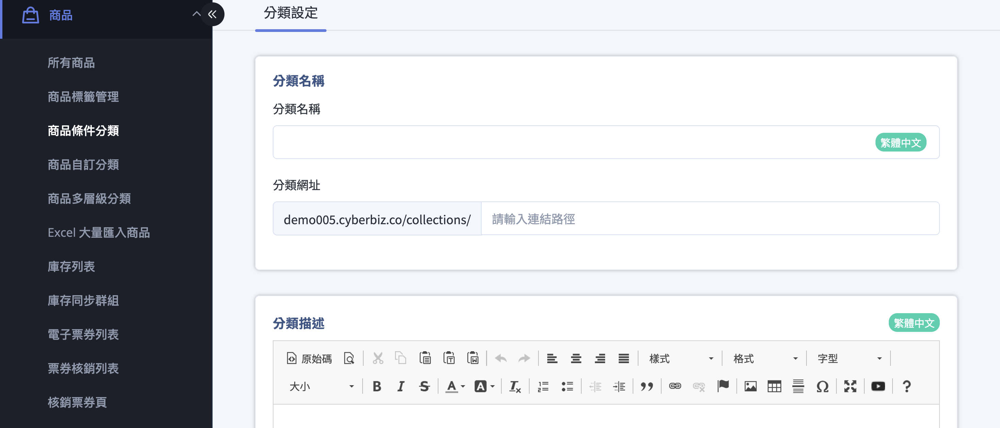
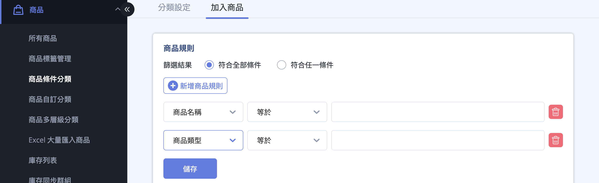
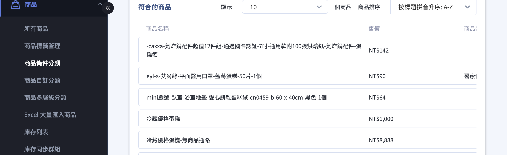
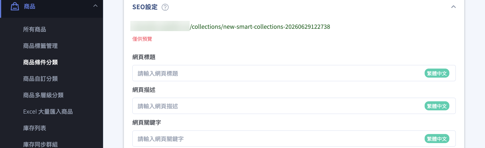
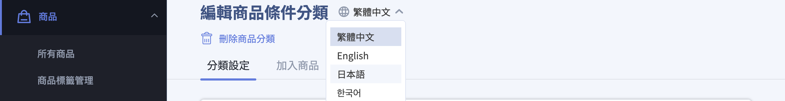
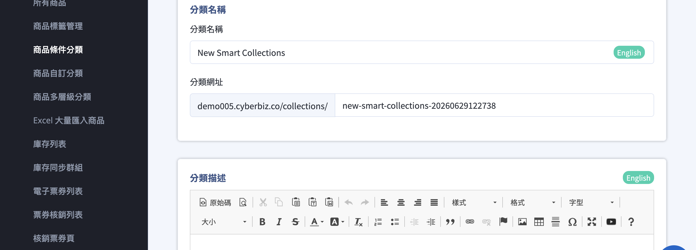

{ title="商品自動分類群組：商品 > 商品條件分類" .hero-page }

## 商品條件分類說明 { #intro-smart-collections }

「商品條件分類」讓您先設定一組商品篩選條件，凡是符合條件的商品就會自動歸入這個分類，不需要逐一手動挑選。當您日後新增商品、調整價格或商品庫存變動時，系統會自動把符合條件的商品納入
、把不再符合的商品移出，讓分類內容隨時保持最新。

與「自訂群組」(手動挑選商品加入)相比，兩者差異如下：

| 類型 | 商品如何加入 | 適合情境 |
| :-- | :-- | :-- |
| 商品條件分類 | 設定條件，符合的商品自動納入或移出 | 會持續變動的分類，例如「1,000 元以下」「夏季新品」「特定廠商」 |
| 自訂群組(手動) | 逐一手動挑選商品加入 | 固定、需精準控制成員的分類，例如活動精選 |

!!! info "提示"
    一個商品可以同時符合多個條件分類，也可以同時被自訂群組與條件分類收錄，彼此不衝突。

---

## 使用前提與限制 { #prerequisites-smart-collections }

開始設定條件分類前，請確認以下事項：

- [x] **商店已有商品**：條件分類是從現有商品中篩選，若店內尚無商品或無商品符合條件，分類結果會是空的。
- [x] **商品資料已填寫完整**：篩選會比對商品的名稱、類型、廠商、標籤、價格、庫存等欄位，這些欄位填得越完整，條件分類越準確。

!!! plan "方案/開通條件"
    本文後段的 [多國語系翻譯設定](#operate-smart-collections-multi-language) 為選用功能，需先開通多國語系商店功能。未開通時，分類編輯頁不會出現語言切換選單，僅能以預設語言(繁體中文)建立內容。如不確定是否已開通，請聯繫您的 CYBERBIZ 業務窗口確認。

---

## 操作步驟 { #operate-smart-collections }

以下依序說明如何建立一個條件分類、設定篩選條件、調整商品排序、公開上架，以及為各語言提供翻譯。

### 一、新增條件分類並填寫基本資料 { #operate-smart-collections-create }

1. **進入商品條件分類頁面：** 於後台左側選單點選「商品條件分類」，進入分類列表頁。
2. **新增分類：** 點擊頁面右上角的 **「新增商品分類」**，進入「分類設定」頁。
3. **填寫分類名稱：** 在 **「分類名稱」** 輸入這個分類的名稱，例如「夏季新品」。
4. **設定分類網址：** 在 **「分類網址」** 自訂這個分類頁的連結路徑；留空時系統會自動產生。
5. **填寫分類描述(選填)：** 在 **「分類描述」** 編輯器輸入要顯示在分類頁的說明文字。
6. **儲存：** 點擊頁面下方的 **「儲存」**。儲存後，頁面上方會出現 **「加入商品」** 分頁，即可繼續設定篩選條件。

!!! note "註釋"
    分類網址在同一商店內不可重複，且「all」為系統保留字，無法做為分類網址使用。

---

### 二、設定商品篩選條件 { #operate-smart-collections-rules }

條件分類的核心是「商品規則」。一條規則由 **篩選欄位**、**條件**、**比對值** 三個部分組成，例如：商品價格 → 小於 →
1,000。當您設定多條規則時，系統會依您選擇的組合方式判斷商品是否納入。

1. **切換到「加入商品」分頁：** 在分類設定頁上方，點選 **「加入商品」** 分頁。
2. **選擇條件組合方式：** 在 **「商品規則」** 區塊的 **「篩選結果」**，選擇 **「符合全部條件」** 或 **「符合任一條件」**。
3. **新增規則：** 點擊 **「新增商品規則」**，系統會新增一列規則設定。
4. **設定單一規則：** 在該列中，先選 **篩選欄位**，再選 **條件**，最後輸入 **比對值**。可用的欄位與條件請見 [篩選欄位對照表](../references/smart-collections-rule-columns.md#smart-collections-rule-columns){ title="條件分類篩選欄位對照表" data-preview } 與
[篩選條件對照表](../references/smart-collections-rule-relations.md#smart-collections-rule-relations){ title="條件分類篩選條件對照表" data-preview }。
5. **增減規則：** 重複上一步可加入多條規則；要移除某條規則，點該列右側的刪除圖示。
6. **儲存規則：** 點擊「商品規則」區塊下方的 **「儲存」**，系統會立即依規則重新計算符合的商品。

!!! info "規則的組合邏輯"

    * **單一規則內**：固定為「篩選欄位 + 條件 + 比對值」的單一比對。
    * **多條規則之間**：由「篩選結果」統一決定 —— 選 **「符合全部條件」** 代表商品需 **同時** 符合所有規則；選 **「符合任一條件」** 代表只要 **符合其中一條** 規則即納入。
    * 整個分類只能擇一使用「符合全部條件」或「符合任一條件」，無法逐條混用不同邏輯。

    !!! tip "技巧"
        若選了數值欄位(商品價格、定價、庫存現貨)，比對值請輸入數字；這類欄位只能搭配「等於、大於、小於」。

---

### 三、檢視符合商品與設定排序 { #operate-smart-collections-sort }

1. **檢視符合的商品：** 規則儲存後，下方 **「符合的商品」** 會列出目前命中的商品，包含商品名稱、售價、商品類型與廠商，方便您確認條件是否正確。
2. **選擇排序方式：** 在排序下拉選單選擇商品在前台分類頁的呈現順序，例如「按價格排序：最高-最低」或「暢銷商品排序」。完整選項請見
[商品排序方式對照表](../references/smart-collections-sort-order.md#smart-collections-sort-orders){ title="條件分類商品排序方式對照表" data-preview }。
3. **手動排序(選用)：** 若選擇「手動排序」，即可直接拖曳商品列調整先後順序。

!!! note "註釋"
    條件分類的商品是動態的 —— 之後只要有商品的資料變動到符合或不符合規則，系統就會自動納入或移出，您不需要再回來手動維護成員。

---

### 四、設定 SEO 與公開分類 { #operate-smart-collections-publish }

1. **填寫 SEO 設定(選填)：** 回到 **「分類設定」** 分頁，於下方 **「SEO設定」** 填寫網頁標題、網頁描述與網頁關鍵字，有助於搜尋引擎收錄這個分類頁。
2. **公開分類：** 回到「商品條件分類」列表頁，將該分類的狀態切換為 **「公開」**；設為 **「不公開」** 時，前台不會顯示這個分類。

!!! note "註釋"
    SEO 設定區塊只會在分類 **已建立並儲存後** 才出現，新增分類的當下尚未顯示。

---

### 五、多國語系翻譯設定 { #operate-smart-collections-multi-language }

!!! plan "方案/開通條件"
    此功能需先開通多國語系商店功能。未開通時，分類編輯頁的標題旁不會出現語言切換選單。支援的語言請見 [多國語系支援語言對照表](../references/multi-language-supported.md#multi-language-supported){ title="多國語系支援語言對照表" data-preview }。

若您的商店已開通多國語系，可為每一個條件分類的 **分類名稱** 與 **分類描述** 提供各語言的版本，讓不同語言的顧客在前台看到對應翻譯。

1. **進入要翻譯的分類：** 在「商品條件分類」列表頁點選分類進入編輯。請注意，語言切換選單只在 **已建立** 的分類才會出現，新增分類的當下無法切換語言。
2. **切換語言：** 點選分類編輯頁標題旁的 **「選擇語言」** 下拉選單，切換到要翻譯的語言。

    

3. **輸入該語言的內容：** 切換後，**「分類名稱」** 與 **「分類描述」** 欄位會標示目前的語言，輸入對應語言的翻譯即可。編輯方式與
[新增條件分類並填寫基本資料](#operate-smart-collections-create) 相同。

    

4. **儲存：** 點擊 **「儲存」** 保存該語言版本，再切換到下一個語言重複即可。

!!! note "註釋"
    * 僅 **分類名稱** 與 **分類描述** 可分語言翻譯；**分類網址** 與 **SEO 設定** 為全站共用，不會因語言而不同。
    * 切換語言會重新載入該語言的內容，建議切換前先儲存目前的修改，以免未存的內容遺失。

---

## 重要規範與限制 { #specs-smart-collections }

* **條件即時生效**：規則一經儲存，系統會立即重新計算符合的商品；之後商品資料變動也會自動更新分類內容。
* **分類網址唯一且有保留字**：同一商店內分類網址不可重複，且「all」無法做為分類網址。
* **數值與文字條件不可混用運算子**：數值欄位(商品價格、定價、庫存現貨)只能用「等於、大於、小於」；文字欄位才有「包含、不包含、以此開頭、以此結束」。
* **多語系翻譯範圍有限**：僅分類名稱與分類描述可翻譯，網址與 SEO 不分語言。
* **公開後才會在前台顯示**：分類需設為「公開」，顧客才看得到。

---

## 後續操作 { #next-steps-smart-collections }

<!-- - :lucide-package:{ .lg }  
  [__檢查商品資料__](../products/index.md)  
  確認商品的名稱、類型、廠商、標籤與價格填寫完整，條件分類才能正確命中。 -->

- :lucide-layout-template:{ .lg }  
  [__設定選單與導覽列__](../../website-appearance/navigation/setup-menus-navigation.md){ title="設定選單與導覽列" }  
  把建立好的條件分類放進前台選單或導覽列，讓顧客逛得到。

- :lucide-languages:{ .lg }  
  [__查看支援語言__](../references/multi-language-supported.md){ title="多國語系支援語言對照表" }  
  確認多國語系可翻譯的語言清單。

---

## 常見問題 { #faq-smart-collections }

??? quote "為什麼新增分類時找不到語言切換選單？"
    { #faq-smart-collections-language-selector-missing }
    語言切換選單需要同時符合兩個條件才會出現：

    * 商店已開通多國語系商店功能。
    * 該分類 **已建立並儲存**(新增分類的當下還不會出現)。

    若兩者都符合仍未看到，請聯繫 CYBERBIZ 業務窗口確認多國語系是否已開通。

??? quote "為什麼分類裡的商品會自己增加或減少？"
    { #faq-smart-collections-auto-update }
    這是條件分類的正常行為。系統會依您設定的規則 **自動** 納入符合的商品、移出不符合的商品。當商品的價格、庫存、標籤等資料變動時，分類成員就會跟著更新，您不需要手動維護。

??? quote "設定了條件，卻沒有任何商品符合？"
    { #faq-smart-collections-no-match }
    請依序檢查：

    * 組合方式是否選錯：多條規則時，「符合全部條件」要 **同時** 滿足所有規則，條件太多容易沒有商品命中，可改試「符合任一條件」。
    * 比對值是否正確：數值欄位需輸入數字；文字欄位建議與商品資料用字一致。
    * 商品本身的欄位(類型、廠商、標籤等)是否確實有填寫。

??? quote "翻譯了分類名稱，前台網址會跟著變嗎？"
    { #faq-smart-collections-url-not-translated }
    不會。**分類網址** 與 **SEO 設定** 為全站共用，不會因語言不同而改變；切換語言只會套用翻譯後的分類名稱與分類描述。

??? quote "「商品條件分類」和「自訂群組」差在哪？"
    { #faq-smart-collections-vs-custom }
    **商品條件分類** 是設定條件、由系統自動篩選商品；**自訂群組** 則是逐一手動挑選商品加入。前者適合會持續變動的分類(如「1,000 元以下」)，後者適合需要精準控制成員的分類(如活動精選)。

??? quote "商品條件分類群組可以手動加入或移除商品嗎？"
    { #faq-smart-collections-manual-add-remove }
    不可以。條件分類群組的商品內容 **完全由篩選規則決定**，無法手動加入或移除單一商品。若需要手動調整商品內容，請改用 **自訂分類群組**。

??? quote "條件分類群組中的商品多久會更新一次？"
    { #faq-smart-collections-update-frequency }
    商品條件分類會在以下情況即時或自動更新：

    - 商品資料（價格、庫存、標籤等）變更時
    - 分類篩選條件被修改並儲存後

    系統會重新比對商品資料，並更新群組內容，無須人工同步。

??? quote "條件分類群組可以用於多層級分類嗎？"
    { #faq-smart-collections-multi-level }
    可以。商品條件分類群組可作為 **多層級分類中的底層群組來源**，搭配大分類與中分類使用，建立清楚的分類架構。

??? quote "條件分類群組可以套用行銷活動嗎？"
    { #faq-smart-collections-marketing }
    可以。條件分類群組可用於設定多種行銷活動，例如：

    - 滿額折扣
    - 分類折扣
    - 單品限時優惠

    只要商品符合條件並被納入群組，即可自動套用對應的活動規則。

??? quote "條件分類群組會影響前台商品排序嗎？"
    { #faq-smart-collections-sort-impact }
    條件分類只負責「**商品是否被納入群組**」，不直接決定排序方式。商品在前台的顯示順序，需透過以下設定控制：

    - 群組內的 **商品排序方式（自動／手動）**
    - 前台頁面的排序邏輯設定

---

## 參考資料 { #reference-smart-collections }

* [條件分類篩選欄位對照表](../references/smart-collections-rule-columns.md)
* [條件分類篩選條件對照表](../references/smart-collections-rule-relations.md)
* [條件分類商品排序方式對照表](../references/smart-collections-sort-order.md)
* [多國語系支援語言對照表](../references/multi-language-supported.md)

