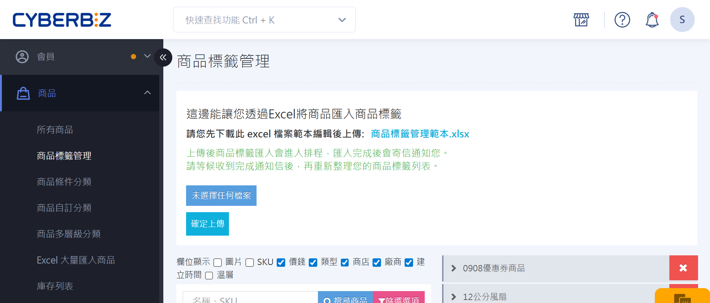
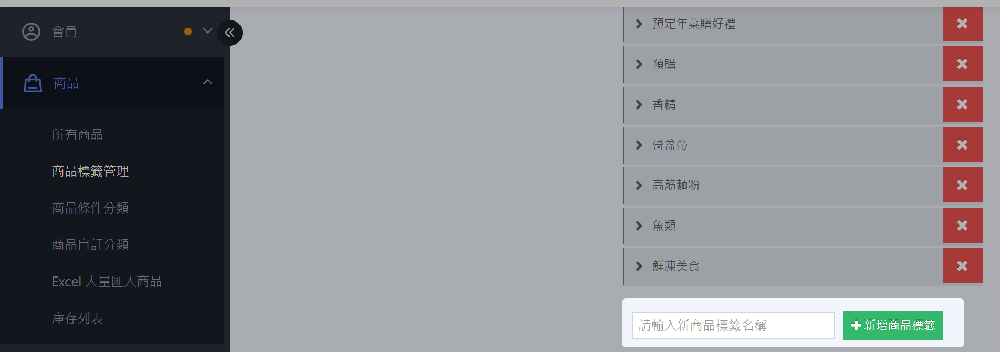
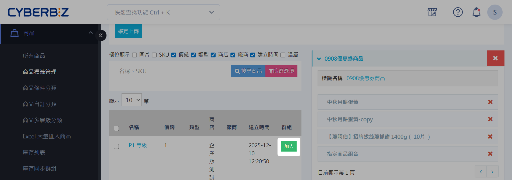
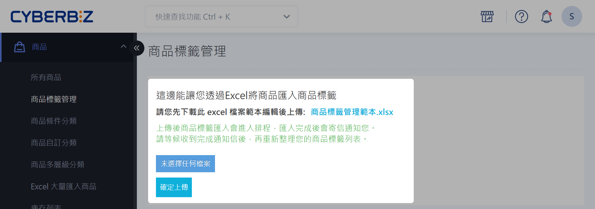
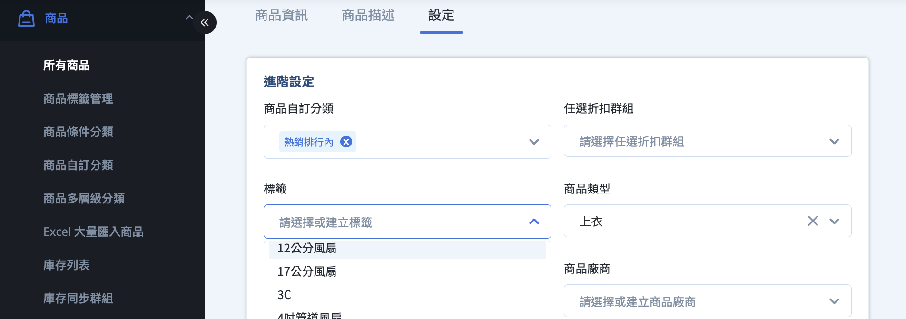
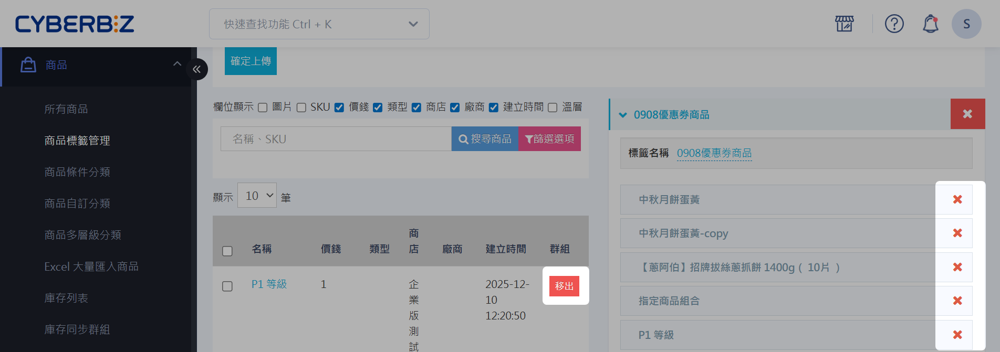
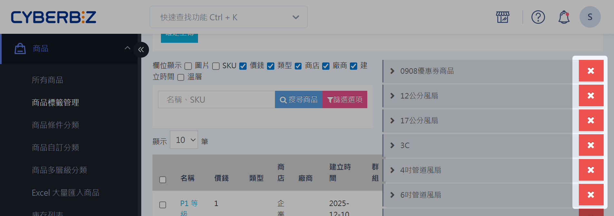
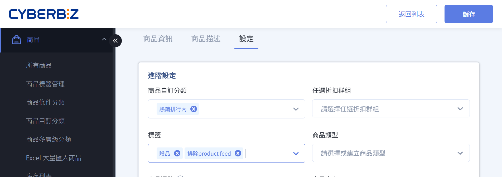

# 管理商品標籤
為商品建立與管理自訂標籤，以便分類、篩選、行銷應用及控制第三方平台同步。
{ .subtitle } 

{  title="管理商品標籤：商品 > 商品標籤管理"  .hero-page }

## 商品標籤使用情境

商品標籤可協助您更有效地管理商品及行銷活動：

- 商品分類管理：快速將不同類型商品標籤化，方便篩選與批量管理。
- 行銷活動應用：將商品批次加入標籤群組，便於促銷、組合或套裝銷售。
- 搜尋與操作效率提升：透過標籤快速定位商品，加快後台操作與管理流程。
- 排除第三方平台同步：設定特定標籤，將商品排除於系統的第三方平台資料同步（如 GMC、Facebook DPA、LINE、美安等）。

## 新增商品標籤

1. 登入 CYBERBIZ 管理後台，前往 **商品 > 商品標籤管理**。
2. 點擊 **新增標籤** 按鈕，在標籤名稱欄位輸入欲建立的標籤名稱（例如：衣服）。若畫面未顯示新增按鈕，請向下捲動至標籤列表底部。
3. 點擊 **儲存** 以套用變更。

## 將商品加入標籤群組

您可以透過兩種方式將商品加入標籤群組：

=== "手動加入"

	1. 登入 CYBERBIZ 管理後台，前往 **商品 > 商品標籤管理**。
	2. 在右方標籤列表中點擊展開欲編輯的標籤群組。
	3. **搜尋** :lucide-search: 或 **篩選** :lucide-funnel: 出欲加入標籤群組的商品。
	4. 點擊 **加入** 完成。

	

=== "Excel 匯入"

	!!! warning "注意事項"
		- 透過 Excel 匯入商品時，無法新增商品到不存在的標籤中。
		- 透過 Excel 匯入已在群組內的商品，系統將會略過，不會提醒。

	1. 登入 CYBERBIZ 管理後台，前往 **商品 > 商品標籤管理**。
	2. 點擊下載 **商品標籤管理範本.xlsx**。
	3. 編輯範本欄位：
		- 操作：選擇新增或是移出該筆商品。
		- 標籤名稱：輸入商品標籤名稱，須為後台已存在的標籤。
		- SKU：輸入商品 SKU。
		- 所有門市：`是` (門市欄位可以不填寫)；`否` (門市欄位必填)。
	4. 點擊 **選擇檔案** 上傳編輯好的商品標籤 Excel 檔案。
	5. 點擊 **確認上傳** 進行匯入動作。

	

### 從編輯頁設定商品標籤

1.  登入 CYBERBIZ 管理後台，前往 **商品 > 所有商品**。
2.  點選您要設定的商品，進入 **設定** 頁面。
3.  設定作為主要購買商品的標籤。

## 從標籤群組移出商品

1. 登入 CYBERBIZ 管理後台，前往 **商品 > 商品標籤管理**。
2. 在右方標籤列表中點擊展開欲編輯的標籤群組，或使用搜尋跟篩選功能定位欲編輯的商品。
3. 在商品列表中，點擊 :lucide-x: 或 **移出商品** 移除商品。

## 刪除商品標籤

1. 登入 CYBERBIZ 管理後台，前往 **商品 > 商品標籤管理**。
2. 在標籤群組列表中找到欲刪除的標籤群組。
3. 點擊標籤群組旁的 **刪除** 按鈕。
> :lucide-triangle-alert: 刪除標籤後，所有已綁定此標籤的商品將會自動取消綁定。

## 排除上傳至第三方平台標籤 :lucide-lock:

[:lucide-tag:{ title="適用方案" }](conventions.md#適用方案) | 企業

為商品設定特定標籤，將商品排除於系統的第三方平台資料同步機制之外。套用排除標籤後，該商品的資料將不會被上傳至下列第三方平台：

- :lucide-tags: [__Google Merchant Center__](../../integrations/google/設定 Google Merchant Center 並同步 CYBERBIZ 商品.md){ data-preview }    
- :simple-facebook: [__FB 動態產品目錄__](){ data-preview }
- :simple-line: [__LINE 購物__](../../integrations/line/申請與設定 LINE 購物導購.md){ data-preview }
- :simple-stryker: [__美安 SHOP.COM__](../../integrations/串接美安通路.md){ data-preview } 僅支援 `贈品` 標籤

1. 登入 CYBERBIZ 管理後台，前往 **商品 > 所有商品**。
2. 在商品列表中，點擊欲排除商品的 **商品名稱**，進入商品編輯頁面。
3. 點擊 **設定** 頁籤，在 **商品標籤** 欄位中，輸入以下任一排除標籤：
	 - `排除product feed`：適用於 GMC、Facebook 動態產品目錄 DPA、LINE 購物平台。
	 > :lucide-triangle-alert: *排除* 與 *product* 之間請勿添加空格。
	 - `贈品`：適用於所有第三方平台，包括美安。

4. 點擊 **儲存** 以套用設定。

## 後續步驟

- :lucide-printer:{ .lg }  
  [__商品標籤列印__]()  
  列印商品標籤。    
  [POS](){ .md-button .extension-tag }
- :fontawesome-brands-js: __JavaScript__ for interactivity

## 常見問題

??? quote "如果我同時設定了 `排除product feed` 和 `贈品` 標籤，會有什麼影響？"
    若同時設定兩個標籤，系統將優先依據 `贈品` 標籤的規則進行排除，確保商品不會上傳至所有支援的第三方平台。

## 延伸閱讀

- [批次修改商品描述與配送設定](批次修改商品描述與配送設定.md)
- [編輯商品描述與商品設定](編輯商品描述與商品設定.md)
