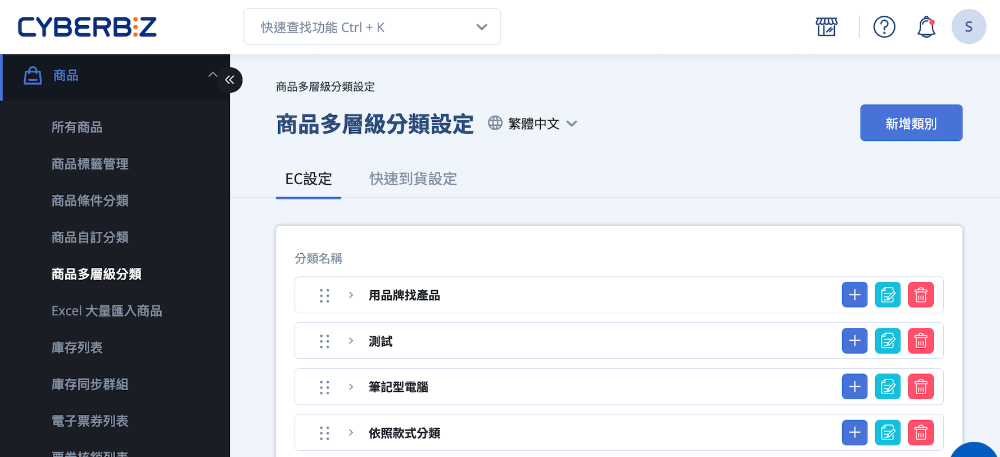
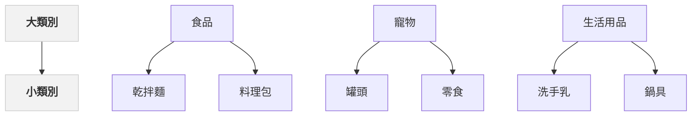
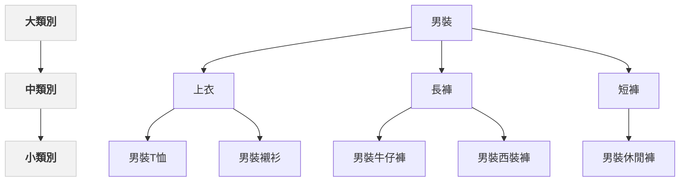

# 設定商品多層級分類

建立多層級商品分類（最多三層），整理群組、支援行銷活動與導覽列設定。
{ .subtitle }

[:lucide-tag:{ title="適用方案" }](conventions.md#適用方案) | 專業 PLUS / 進階 PLUS / 高手 PLUS / 企業  
[:lucide-bolt:{ title="適用功能" }](conventions.md#適用功能) |  拖拉版型
{ .doc-badge }

{ .hero-page }

## 商品多層級分類說明

商品多層級分類用於整理不同來源的 **商品分類群組**（包含自訂分類、條件分類與商品類型），可視為「**商品群組的資料夾結構**」，協助商家建立清楚、可調整的商品分類架構。

完成多層級分類設定後，商家可依分類層級套用 **導覽列顯示設定** 與 **行銷活動規則**，以支援前台瀏覽與分類行銷需求。

### 分類層級說明

商品多層級分類最多可建立 **三層結構**（由上而下）：

- **頂層（大類別）**：最上層的分類資料夾，用於概括整理全館商品類型。
- **中層（中類別）**：建立於大類別之下，用於進一步細分商品分類邏輯。
- **底層（小類別）**：實際對應商品分類群組，其來源可為：

	- 商品自訂分類
	- 商品條件分類
	- 商品設定頁中的商品類型

### 分類的資料夾概念

商品多層級分類僅作為 **分類結構管理用途**，每一層分類皆可視為資料夾：

- 調整分類層級或排序，不會影響群組內的商品名單
- 商品是否顯示，仍以對應的商品群組設定為準

!!! quote "詞彙提示"  

	- **小類別**：實際對應商品群組  
	- **分類**：僅用於建立資料夾結構，不代表商品清單本身

## 什麼情況需要商品多層級分類

建議在以下情況使用商品多層級分類功能：

- 商品數量較多，單一分類難以清楚整理
- 同一商品需要出現在不同分類位置（例如依用途或族群分類）
- 需要依分類層級設定導覽列、分類頁或行銷活動

## 設定商品多層級架構

### 雙層結構

#### 示意圖

#### 操作步驟

1. 登入 CYBERBIZ 管理後台，前往 **商品 > 商品多層級分類**。
2. 點選 **新增類別**，於新增分類頁面輸入 **類別標題**、**類別連結**。

	

3. 在大類別下，點選 **新增**。
	- 新增類別選項：選擇 **小類別**，輸入 **類別標題**、**類別連結**。
	- 群組類型可選擇「商品自訂分類」、「商品條件分類」、「商品類型」，點選後往下選擇指定群組。
	> :lucide-info: 小類別即為商品分類群組。相關設定請參閱 [設定自訂分類群組](設定商品自訂分類群組.md)、[設定商品條件分類群組](設定商品條件分類群組.md)、[商品類型](編輯商品描述與商品設定.md#進階設定)。

	

4. 設定完成畫面

	

5. 點擊 :lucide-grip-vertical: 可用拖拉的方式，變更分類排序或將中分類移動到其他大分類下。
   > :lucide-triangle-alert: 小分類無法移動到其他中分類下，請在中分類下直接新增小分類即可。

### 三層結構

#### 示意圖

#### 操作步驟

1. 登入 CYBERBIZ 管理後台，前往 **商品 > 商品多層級分類**。
2. 點選 **新增類別**，於新增分類頁面輸入 **類別標題**、**類別連結**。
	
	

3. 在大類別下，點選 **新增**。
	- 「新增類別選項」：選擇 **類別**，輸入「類別標題」、「類別連結」。

	

4. 在中類別下，點選「新增」。
	- 新增類別選項：選擇 **小類別**，輸入 **類別標題**、**類別連結**。
	- 群組類型可選擇「商品自訂分類」、「商品條件分類」、「商品類型」，點選後往下選擇指定群組。
	> :lucide-info: 小類別即為商品分類群組。相關設定請參閱 [設定自訂分類群組](設定商品自訂分類群組.md)、[設定商品條件分類群組](設定商品條件分類群組.md)、[商品類型](編輯商品描述與商品設定.md#進階設定)。
	
	

5. 設定完成畫面

	
	
6. 點擊 :lucide-grip-vertical: 可用拖拉的方式，變更分類排序或將中分類移動到其他大分類下。
   > :lucide-triangle-alert: 小分類無法移動到其他中分類下，請在中分類下直接新增小分類即可。

## 後續步驟

- :lucide-menu:{ .lg }  
  [__選單/導覽列設定__](#)   
  將多層級分類綁定導覽列，提升購物流程與體驗。
- :lucide-layers:{ .lg }   
  [__多層級分類滿額折扣__](設定商品多層級分類滿額折扣.md)     
  設定分類層級滿額折扣，自動套用至符合條件的商品。
- :material-point-of-sale:{ .lg }  
  [__POS 前台選單設定__](https://www.cyberbiz.io/support/?p=11224)  
  管理商品並建立 POS 前台選單，方便門市展示與操作。管理商品並建立 POS 選單。

## 常見問題

??? quote "商品多層級分類會影響商品名單嗎？"
    不會。商品多層級分類僅用於整理分類群組，不會影響群組內的商品名單。

??? quote "什麼情況不適合使用三層分類？"  
	- 商品種類單一或數量不多，單層或雙層分類即可滿足管理需求。  
	- 商店不需要在分類層級綁定導覽列或行銷活動。  
	- 避免增加不必要的管理複雜度，降低維護成本。

??? quote "中類別和小類別的差別是什麼？"  
	- **中類別**：位於大類別之下，用於進一步細分分類邏輯，主要作為資料夾結構管理。  
	- **小類別**：實際對應商品群組，來源可為自訂分類、條件分類或商品類型。