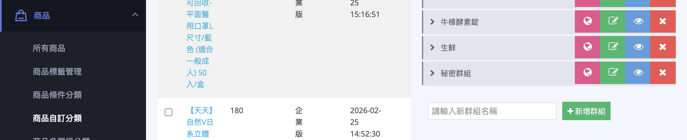
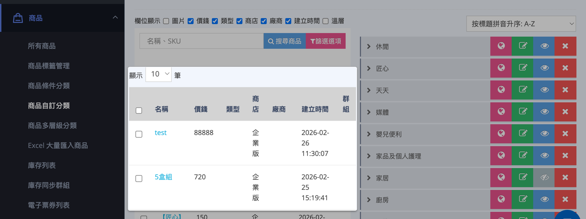
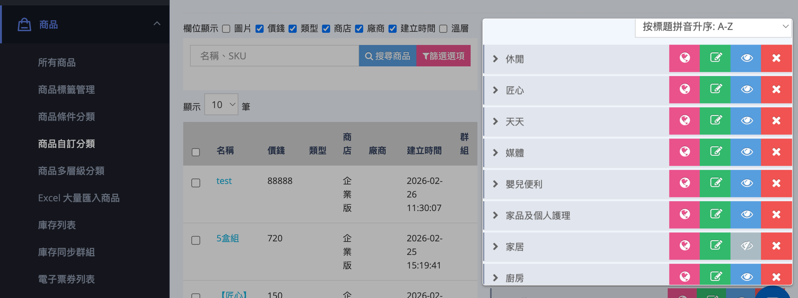
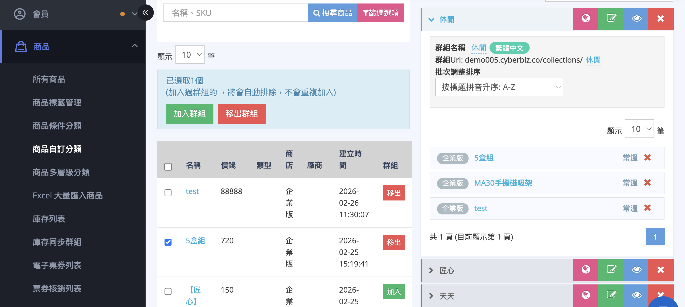
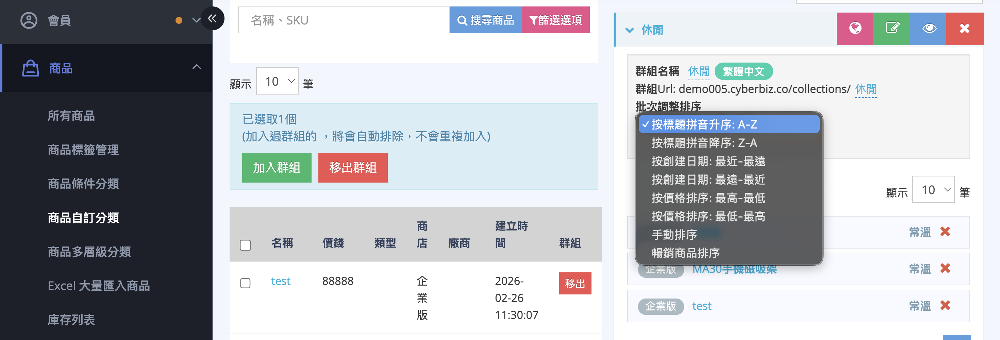
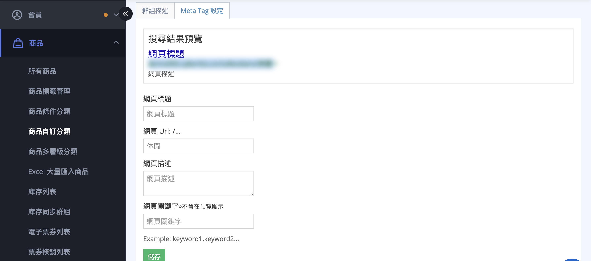

# 設定商品自訂分類群組
建立、編輯與管理商品自訂分類群組，優化商店頁面、支援行銷活動並提升 SEO 可見性。
{ .subtitle }

{ title="自訂商品分類群組：商品 > 商品自訂分類" .hero-page }

## 商品自訂分類說明

**商品自訂分類**（或稱自訂群組）功能允許商家透過 **手動勾選** 的方式將商品歸類，這不僅能使前台頁面整齊，方便消費者查找，更能針對特定主題（如：本月主打、聯名特賣）進行獨立的 SEO 優化與行銷操作。

以下為商品自訂分類的詳細說明與教學：

## 基礎設定與介面路徑

- **後台路徑**：進入 CYBERBIZ 管理後台，點選 **商品 > 商品自訂分類**。
- **新增群組**：在頁面最下方的群組名稱欄位輸入名稱後點擊 **新增群組**，該群組即會出現在上方的群組列表中。

	

### 管理介面概覽

- **商品列表（左側）**：顯示所有商店商品。可利用「欄位顯示」調整可見資訊（如溫層、SKU），或使用「搜尋」與「篩選」定位特定商品。

	

- **群組列表（右側）**：顯示已建立的自訂分類。可在此執行編輯、排序、切換公開狀態或刪除群組。

	- :material-earth: **瀏覽群組頁**：前往前台查看群組展示頁面。 
	- :material-square-edit-outline: **編輯群組**：修改群組名稱、描述與 Meta Tag。
	- :material-eye: **切換公開狀態**：控制群組在前台顯示。
	- :material-close: **刪除群組**：移除整個分類群組。

	

## 管理分類商品

### 篩選與搜尋商品

為提升管理效率，您可以使用「商品篩選器」進行多條件組合。點擊 **篩選按鈕 :lucide-filter:**（篩選選項）即可展開設定篩選項目：

- **商品類型**：篩選指定類型商品，可選多個類型。
- **商品廠商**：篩選指定廠商商品，可選多個廠商。
- **商品標籤**：篩選包含指定標籤的商品，可選多個標籤。
- **商家**：商品來源，依 POS 或官網來源篩選商品。

??? note "篩選邏輯與範例說明" 

	系統採用 **不同類別間交集（同時符合）、同類別內聯集（符合任一）** 的邏輯進行篩選。

	- **設定範例：**
	
		- **商品類型**：舒壓小物、鋼琴
		- **商品廠商**：根本、YAMAHA
		- **商品標籤**：舒壓、piano
		- **來源**：官網
	
	- **執行邏輯：**
	 (類型 `舒壓小物` 或 `鋼琴`) + (廠商 `根本` 或 `YAMAHA`) + (標籤 `舒壓` 或 `piano`) + (來源：官網)
	
	- **結果：**
	系統會顯示「同時符合這四類條件」的商品。例如：標籤為 **piano** 且廠商為 **YAMAHA** 的 **官網** 商品。

---

### 加入與移出商品

1. 從右側 **群組列表** 點選欲管理的分類。
    
2. **加入**：在左側商品清單點擊「加入」，或勾選多筆後點擊上方「加入群組」。
    
3. **移出**：在右側群組清單點擊「移出」或點擊叉叉按鈕 :lucide-x:；亦可勾選多筆執行「移出群組」。

---

### 調整商品排序

在群組列表中點擊「調整排序」下拉選單：

- **自動排序**：依系統預設邏輯排列。
    
- **手動排序**：選擇後可使用十字指標 :material-arrow-all: 點擊並拖曳商品，直接決定前台顯示順序。
    
!!! warning "排序限制" 
	若商品名稱包含系統不支援的特殊標點符號，可能導致手動排序功能異常。若發生此狀況，請進入商品編輯頁修正名稱。

## 進階設計與 SEO 優化

點選群組分類旁的 **綠色編輯按鈕 :material-square-edit-outline:** （編輯群組），可進行以下進階設定：

### 群組描述與置頂橫幅

在 **群組描述** 頁籤中，您可以透過編輯器自訂分類頁面的頂部內容：

- **多媒體支援**：插入活動圖片或 YouTube 影片。
    
- **行銷文案**：針對該分類撰寫導購文字，提升轉化率。
    

---

### SEO 與社群分享設定

在 **Meta Tag 設定** 頁籤中優化搜尋排名：

- **網頁描述與關鍵字**：自訂該分類頁面的 SEO 資訊。
- [**OG Image (轉貼預設圖)**](../../website-appearance/設定轉貼連結縮圖 (OG Image).md){ data-preview }  ：上傳特定圖片，確保連結分享至 LINE 或 Facebook 時顯示專屬縮圖。
    

---

## 應用情境與進階功能

- :lucide-folder-tree:{ .lg }   
  [__商品多層級分類__](設定商品多層級分類.md){ data-preview }       
  自訂分類可作為「小類別」，掛載於「大類別」或「中類別」之下，建立出三層式的樹狀結構選單。

- :lucide-menu:{ .lg }     
  [__選單/導覽列應用__](設定超商配送限制與物流排除.md)  
  設定好的自訂分類可以連結至官網導覽列、頁腳，或設定「全部商品」連結來顯示自訂分類中的所有項目。

- :lucide-languages:{ .lg }  
  [__多國語言設定__]()   
  若商店有開通多國語系，可在自訂分類頁面切換語系，個別編輯不同語言的群組名稱與描述。

- :lucide-eye-off:{ .lg }  
  [__秘密群組 (秘密商店)__](設定秘密商品群組.md){ data-preview }    
  可利用自訂分類建立秘密賣場，並配合關閉該商品的「站內搜尋功能」，僅提供連結給特定對象（如網紅、團購主）購買。

- :lucide-clock:{ .lg }  
  [__單品限時折扣__]()  
  商家可以針對特定自訂分類的商品，批次加入單品限時折扣活動中進行促銷。

- :material-point-of-sale:{ .lg }  
  [__POS 系統支援__]()  
  使用 POS 的商家必須建立自訂分類或商品類型，才能進一步設定 POS 的多層級分類選單。

## 常見問題

??? quote "前台導覽列的商品的分類一次最多可以顯示幾個？"
	最多 20 個。

??? quote "如果我刪除了商品群組，群組內的商品會被刪除嗎？"
    不會。刪除商品群組僅會移除該分類群組，群組內的商品仍會保留在您的商品列表中。
