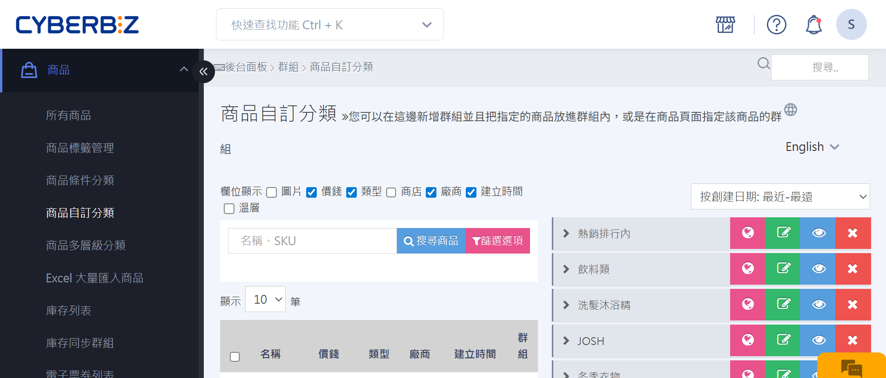
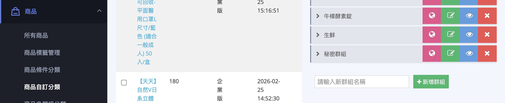
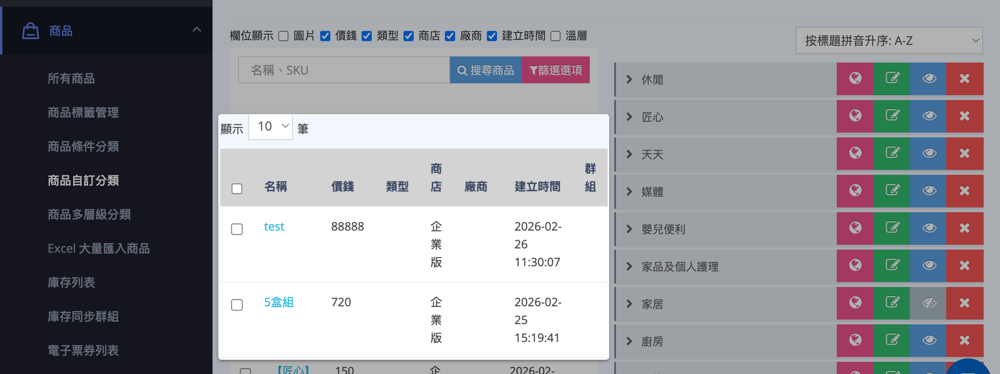
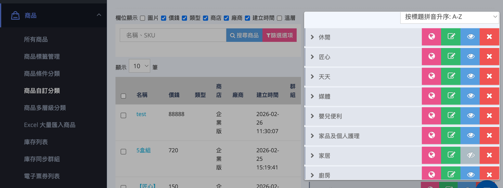
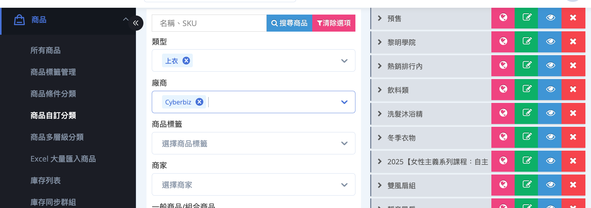
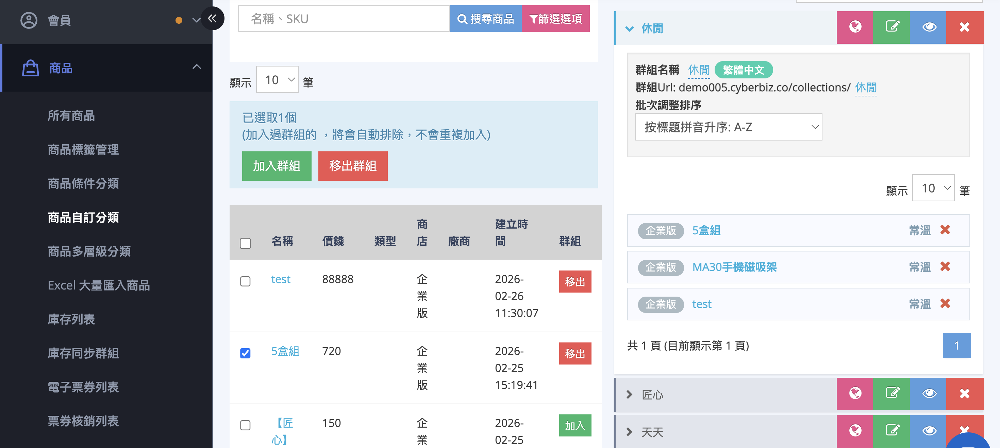
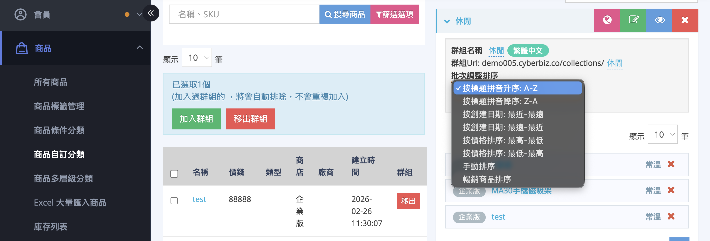
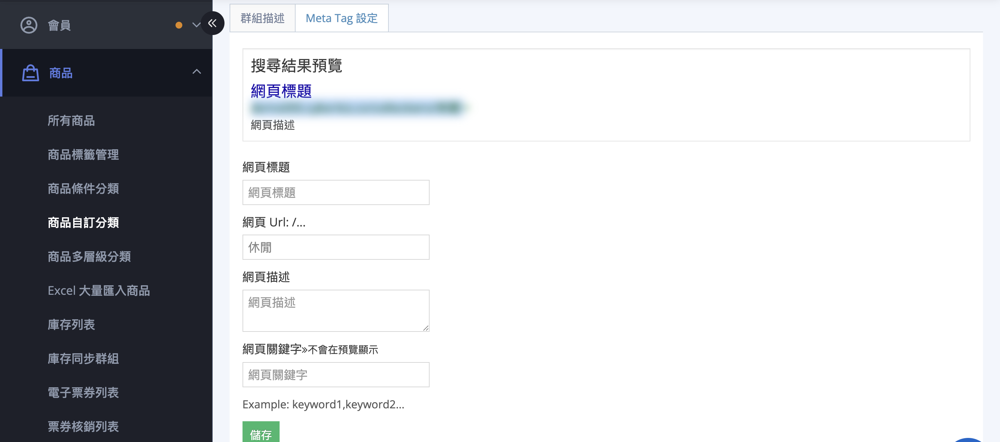
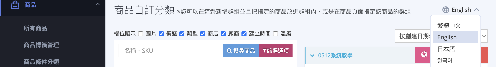

{{ subtitle(page.meta.description) }}

{ title="自訂商品分類群組：商品 > 商品自訂分類" .hero-page }

## 商品自訂分類說明

**商品自訂分類**（或稱自訂群組）功能允許商家透過 **手動勾選** 的方式將商品歸類，這不僅能使前台頁面整齊，方便消費者查找，更能針對特定主題（如：本月主打、聯名特賣）進行獨立的 SEO 優化與行銷操作。

## 基礎設定與介面路徑

- **後台路徑**：進入 CYBERBIZ 管理後台，點選 **商品 > 商品自訂分類**。
- **新增群組**：在頁面最下方的群組名稱欄位輸入名稱後點擊 **新增群組**，該群組即會出現在上方的群組列表中。

	

### 管理介面概覽

- **商品列表（左側）**：顯示所有商店商品。可利用「欄位顯示」調整可見資訊（如溫層、SKU），或使用「搜尋」與「篩選」定位特定商品。

	

- **群組列表（右側）**：顯示已建立的自訂分類。可在此執行編輯、排序、切換公開狀態或刪除群組。

	- :material-earth: **瀏覽群組頁**：前往前台查看群組展示頁面。 
	- :material-square-edit-outline: **編輯群組**：修改群組名稱、描述與 Meta Tag。
	- :material-eye: **切換公開狀態**：控制群組在前台顯示。
	- :material-close: **刪除群組**：移除整個分類群組。

	

## 管理分類商品

### 篩選與搜尋商品

為提升管理效率，您可以使用「商品篩選器」進行多條件組合。點擊 **篩選按鈕 :lucide-filter:**（篩選選項）即可展開設定篩選項目：

- **商品類型**：篩選指定類型商品，可選多個類型。
- **商品廠商**：篩選指定廠商商品，可選多個廠商。
- **商品標籤**：篩選包含指定標籤的商品，可選多個標籤。
- **商家**：商品來源，依 POS 或官網來源篩選商品。

??? note "篩選邏輯與範例說明" 

	系統採用 **不同類別間交集（同時符合）、同類別內聯集（符合任一）** 的邏輯進行篩選。

	- **設定範例：**
	
		- **商品類型**：舒壓小物、鋼琴
		- **商品廠商**：根本、YAMAHA
		- **商品標籤**：舒壓、piano
		- **來源**：官網
	
	- **執行邏輯：**
	 (類型 `舒壓小物` 或 `鋼琴`) + (廠商 `根本` 或 `YAMAHA`) + (標籤 `舒壓` 或 `piano`) + (來源：官網)
	
	- **結果：**
	系統會顯示「同時符合這四類條件」的商品。例如：標籤為 **piano** 且廠商為 **YAMAHA** 的 **官網** 商品。

---

### 加入與移出商品

1. 從右側 **群組列表** 點選欲管理的分類。
    
2. **加入**：在左側商品清單點擊「加入」，或勾選多筆後點擊上方「加入群組」。
    
3. **移出**：在右側群組清單點擊「移出」或點擊叉叉按鈕 :lucide-x:；亦可勾選多筆執行「移出群組」。

---

### 調整商品排序

在群組列表中點擊「調整排序」下拉選單：

- **自動排序**：依系統預設邏輯排列。
    
- **手動排序**：選擇後可使用十字指標 :material-arrow-all: 點擊並拖曳商品，直接決定前台顯示順序。
    
!!! warning "排序限制" 
	若商品名稱包含系統不支援的特殊標點符號，可能導致手動排序功能異常。若發生此狀況，請進入商品編輯頁修正名稱。

## 進階設計與 SEO 優化

點選群組分類旁的 **綠色編輯按鈕 :material-square-edit-outline:** （編輯群組），可進行以下進階設定：

### 群組描述與置頂橫幅

在 **群組描述** 頁籤中，您可以透過編輯器自訂分類頁面的頂部內容：

- **多媒體支援**：插入活動圖片或 YouTube 影片。
    
- **行銷文案**：針對該分類撰寫導購文字，提升轉化率。
    

---

### SEO 與社群分享設定

在 **Meta Tag 設定** 頁籤中優化搜尋排名：

- **網頁描述與關鍵字**：自訂該分類頁面的 SEO 資訊。
- [**OG Image (轉貼預設圖)**](../../website-appearance/設定轉貼連結縮圖 (OG Image).md#商品群組頁自訂分類){ data-preview }  ：上傳特定圖片，確保連結分享至 LINE 或 Facebook 時顯示專屬縮圖。
    

## 多國語系設定 { #operate-custom-collections-multilingual }

!!! plan "開通條件"
    多國語系為加值功能，**不分方案皆需另行開通**，請聯繫專屬客戶顧問。開通後頁面右上角會出現 **「選擇語言」** 下拉選單；未開通的商家不會看到此選單，亦無法進行多語系編輯。

### 各欄位的語系行為 { #operate-custom-collections-multilingual-fields }

切換語系後可編輯的欄位分為兩類：**獨立儲存** 的會依語系分別保存；**跨語系共用** 的只需設定一次，所有語系皆套用同一份資料。

| 欄位 | 是否獨立儲存 | 未填寫該語系時，前台行為 |
| :-- | :-- | :-- |
| 群組名稱 | 獨立 | 自動顯示 **預設語系** 內容 |
| 群組描述 | 獨立 | 自動顯示 **預設語系** 內容 |
| 網頁標題 / 網頁描述 / 網頁關鍵字 | 獨立 | **空白**，不會自動帶入預設語系內容 |
| 群組 URL | 共用 | 所有語系使用同一個網址 |
| 加入的商品 | 共用 | 所有語系顯示同一批商品 |

!!! warning "SEO 三欄不會自動抓取備用資訊"
    群組名稱與群組描述未填寫時會自動顯示預設語系內容，但 **網頁標題、網頁描述、網頁關鍵字（SEO 三欄）不會**。若希望非預設語系的群組頁面也具備完整 SEO，必須在切換到該語系後 **逐欄填寫** 並儲存，否則該語系頁面的 SEO meta tag 將為空。

### 切換語系編輯流程 { #operate-custom-collections-multilingual-edit }

1. **切換到目標語系：** 進入「商品群組」>「商品自訂分類」後，於頁面右上角的 **「選擇語言」** 下拉選單選擇要編輯的語系。系統會自動載入該語系已儲存的內容。

    

2. **編輯群組名稱與描述：** 點擊群組列表中欲編輯的群組進入編輯頁面，於 **「群組描述」** 分頁填入該語系的「群組名稱」與「群組描述」，按 **「儲存」**。
3. **填寫 SEO Meta Tag：** 切到 **「Meta Tag 設定」** 分頁，填入該語系的「網頁標題」、「網頁描述」、「網頁關鍵字」，按 **「儲存」**。
4. **重複完成其他語系：** 重新展開「選擇語言」下拉切換到下一個語系，重複步驟 2-3，直至所有需要支援的語系皆已填寫完畢。

!!! tip "建議的填寫順序"
    先把預設語系（多數商家為繁體中文）的所有欄位填妥後，再切換到其他語系。如此即便其他語系的「群組名稱」與「群組描述」忘記填寫，前台仍會自動顯示預設語系內容，不會在前台留白。

## 應用情境與進階功能

- :lucide-folder-tree:{ .lg }   
  [__商品多層級分類__](設定商品多層級分類.md){ data-preview }       
  自訂分類可作為「小類別」，掛載於「大類別」或「中類別」之下，建立出三層式的樹狀結構選單。

- :lucide-menu:{ .lg }     
  [__選單/導覽列應用__](設定超商配送限制與物流排除.md)  
  設定好的自訂分類可以連結至官網導覽列、頁腳，或設定「全部商品」連結來顯示自訂分類中的所有項目。

- :lucide-languages:{ .lg }  
  [__多國語言設定__]()   
  若商店有開通多國語系，可在自訂分類頁面切換語系，個別編輯不同語言的群組名稱與描述。

- :lucide-eye-off:{ .lg }  
  [__秘密群組 (秘密商店)__](設定秘密商品群組.md){ data-preview }    
  可利用自訂分類建立秘密賣場，並配合關閉該商品的「站內搜尋功能」，僅提供連結給特定對象（如網紅、團購主）購買。

- :lucide-clock:{ .lg }  
  [__單品限時折扣__]()  
  商家可以針對特定自訂分類的商品，批次加入單品限時折扣活動中進行促銷。

- :material-point-of-sale:{ .lg }  
  [__POS 系統支援__]()  
  使用 POS 的商家必須建立自訂分類或商品類型，才能進一步設定 POS 的多層級分類選單。

## 常見問題

??? quote "前台導覽列的商品的分類一次最多可以顯示幾個？"
	最多 20 個。

??? quote "如果我刪除了商品群組，群組內的商品會被刪除嗎？"
    不會。刪除商品群組僅會移除該分類群組，群組內的商品仍會保留在您的商品列表中。

---

依照行銷活動或主題手動挑選商品建立群組，作為店面分類頁、選單連結或廣告活動的著陸頁。
{ .subtitle }

## 商品自訂分類介紹 { #intro-custom-collections }

「商品自訂分類」讓商家依 **自選的商品清單** 建立群組（例如「夏日折扣」、「新品上市」、「節慶禮盒」），並產生獨立的前台分類頁網址。與「商品條件分類」（依據商品標籤、商品類型、價格等條件**自動納入**符合的商品）不同，自訂分類的成員商品完全由商家手動挑選。

每個群組都可以單獨設定：

- 群組名稱與前台網址
- 群組描述（顯示於前台分類頁，可加入圖片與排版）
- 網頁標題、描述、關鍵字（SEO Meta Tag）
- 群組內商品的排序方式

## 頁面功能總覽 { #overview-custom-collections }

進入「商品自訂分類」頁面後，畫面分為左右兩欄：

| 區塊 | 內容 |
| :-- | :-- |
| **左欄** | 商家所有商品的搜尋表格。可篩選並勾選商品，加入目前選取的群組。 |
| **右欄** | 群組排序下拉、群組列表（可展開）、頁面下方的「新增群組」表單。 |

點擊群組列表中的群組標題，會將該群組設為「選取狀態」並展開內容（群組名稱、URL、群組內商品列表）；點擊群組旁的綠色編輯按鈕，則會切換到群組描述與 SEO 的編輯模式。

## 使用前提與限制 { #prerequisites-custom-collections }

- [x] **方案群組數量上限**：依商家方案不同，自訂分類群組總數可能有上限。若達上限，新增群組時系統會擋下並提示。
- [x] **多國語系（選用）**：若需要在不同語系的店面前台顯示不同的群組名稱、描述與 SEO，需另行開通多國語系加值功能。詳見 [多國語系設定](#operate-custom-collections-multilingual)。

## 操作步驟 { #operate-custom-collections }

### 新增群組 { #operate-custom-collections-create }

1. **輸入群組名稱：** 在右欄最下方的「請輸入新群組名稱」欄位，輸入要建立的群組名稱。
2. **送出建立：** 點擊 **「新增群組」** 按鈕，系統會立即建立群組並加入右欄列表頂端。

!!! tip "新增表單只有名稱欄位"
    新增群組時僅需名稱。網址（URL）系統會依名稱自動產生，後續可在群組設定中修改為更易讀的網址。

---

### 編輯群組名稱、網址與商品排序方式 { #operate-custom-collections-edit-basic }

1. **展開群組：** 在右欄群組列表點擊欲編輯的群組標題，將該群組展開為選取狀態。
2. **修改欄位：** 群組展開後可看到以下欄位：
    - **「群組名稱」**：群組顯示在前台與後台的名稱。
    - **「群組URL」**：前台分類頁的網址尾段，例如 `summer-sale`，前台網址會是 `your-shop.com/collections/summer-sale`。
    - **「批次調整排序」**：選擇群組內商品的排序規則（手動或自動）。
3. **變更後自動儲存：** 編輯後系統會自動儲存。若 URL 與其他群組重複或格式不合法，會在欄位旁顯示錯誤提示。

---

### 加入商品到群組 { #operate-custom-collections-add-products }

1. **展開目標群組：** 在右欄群組列表點擊欲加入商品的群組，確認其為選取狀態。
2. **搜尋商品：** 在左欄的商品搜尋表格輸入商品名稱、編號或設定篩選條件，找出要加入的商品。
3. **勾選並加入：** 勾選欲加入的商品（可單筆或批次勾選），點擊表格上方的加入按鈕，所選商品即會出現在右欄群組的商品列表中。

!!! note "同一商品可加入多個群組"
    同一個商品可同時屬於任意數量的自訂分類群組，例如「夏日特賣」與「上衣熱銷」可以同時包含同一件衣服，相互不影響。

---

### 從群組移除商品 { #operate-custom-collections-remove-products }

1. **展開群組：** 點擊欲編輯的群組標題，確認其為選取狀態。
2. **找到商品列：** 在右欄的群組商品列表中找出欲移除的商品。
3. **點擊移除：** 點擊商品列右側的紅色 **「X」** 圖示，商品即會從此群組中移除。

!!! warning "移除商品不會刪除商品本身"
    從群組移除商品只是解除該商品與群組的關聯，商品本身仍存在，也不會影響該商品在其他群組中的成員資格。

---

### 調整群組內商品順序 { #operate-custom-collections-reorder-products }

群組內商品的顯示順序會直接影響前台分類頁的呈現。可透過「批次調整排序」欄位切換手動或自動排序模式。

#### 切換為手動排序模式 { #operate-custom-collections-reorder-products-manual }

1. 在群組展開狀態下，將 **「批次調整排序」** 改為手動排序的選項。
2. 切換後，群組商品列表的每筆商品左側會出現拖曳手把與序號欄位。

#### 拖曳調整 { #operate-custom-collections-reorder-products-drag }

按住商品列左側的拖曳手把（四向箭頭圖示），上下拖移至目標位置鬆開即可。

#### 直接輸入序號 { #operate-custom-collections-reorder-products-input }

點擊商品列的「#」序號欄位，輸入目標數字後按 ++enter++ 或點擊空白處，商品即會移到指定位置。

!!! tip "選擇自動排序時不可手動拖曳"
    若「批次調整排序」設為依名稱、依售價等自動選項，則不會出現拖曳手把與序號欄位；商品會依規則自動排序。

---

### 編輯群組描述 <small>前台分類頁文案</small> { #operate-custom-collections-description }

群組描述會顯示在前台分類頁的標題下方，適合放品牌故事、活動規則或活動圖文。

1. **進入編輯模式：** 在右欄群組列表中，點擊群組標題右側的 **綠色編輯（鉛筆）** 按鈕。
2. **停留於「群組描述」分頁：** 進入編輯模式後預設為此分頁。
3. **撰寫描述：** 使用富文本編輯器撰寫文字、調整樣式、插入圖片或超連結。
4. **儲存：** 點擊 **「儲存」**，畫面右上角會顯示「群組描述已儲存」提示。
5. **回到群組列表：** 點擊左上方的 **「返回群組列表」** 按鈕回到群組列表畫面。

!!! warning "切換語系或返回前先儲存"
    若描述有變更但未儲存，切換語系或點擊「返回群組列表」時，系統會跳出「將會失去未儲存的資料，是否確定繼續？」提示。確認前請務必先儲存。

---

### 設定 SEO <small>搜尋引擎優化</small> { #operate-custom-collections-seo }

每個群組頁可獨立設定 SEO meta tag，影響該分類頁在 Google 等搜尋引擎中的顯示效果。

1. **進入編輯模式：** 點擊群組標題右側的 **綠色編輯（鉛筆）** 按鈕。
2. **切換到「Meta Tag 設定」分頁：** 由上方分頁切換。
3. **填寫 SEO 三欄：**
    - **「網頁標題」**：搜尋結果上方顯示的標題，建議 50~60 字以內。
    - **「網頁描述」**：搜尋結果下方的摘要，建議 150 字以內。
    - **「網頁關鍵字」**：給搜尋引擎參考的關鍵字清單。**此欄位不會在前台或預覽中顯示**。
4. **查看預覽：** 頁面下方的「搜尋結果預覽」區塊會即時顯示在 Google 搜尋結果中的呈現樣式。
5. **儲存：** 點擊 **「儲存」**，畫面右上角會顯示「設定已儲存」提示。

!!! tip "群組 URL 也會影響 SEO"
    SEO 預覽中顯示的網址 (`your-shop.com/collections/{handle}`) 來自群組設定中的「群組URL」。若想優化網址結構，可在群組編輯區（非 Meta Tag 分頁）修改 URL 為更有意義的字串。

---

### 公開 / 隱藏群組 { #operate-custom-collections-publish }

新建立的群組預設為公開狀態。若需要暫時下架（例如活動準備中、季節限定群組換季），可切換為隱藏狀態。

1. **找到群組：** 在右欄群組列表中找到目標群組。
2. **點擊眼睛圖示：** 群組標題右側有眼睛圖示，圖示狀態代表目前的公開狀態：
    - **眼睛開啟** 表示目前為**公開**：點擊後切換為隱藏。
    - **眼睛關閉** 表示目前為**隱藏**：點擊後切換為公開。
3. 切換後系統即時更新，不需額外按儲存。

!!! warning "隱藏不等於刪除"
    隱藏的群組仍保留所有設定與商品成員，前台不顯示但商家後台仍可隨時切回公開。

---

### 預覽群組 <small>在前台瀏覽</small> { #operate-custom-collections-browse }

1. **點擊「瀏覽群組」按鈕：** 在群組列表中，點擊群組標題右側的 **粉色地球圖示**。
2. 系統會在新分頁開啟該群組的前台分類頁，可立即確認商品排序、群組描述與整體呈現。

---

### 刪除群組 { #operate-custom-collections-delete }

1. **點擊刪除按鈕：** 在群組列表中，點擊群組標題右側的 **紅色 X 圖示**。
2. **確認刪除：** 系統會跳出確認視窗「確定要刪除群組」，再次點擊確認即會刪除。

!!! warning "刪除為不可逆動作"
    刪除群組後，該群組設定與前台網址會立即失效，無法復原。若該前台網址有外部連結、廣告投放或社群分享指向，請預先處理對外的導流。**群組內的商品本身不會被刪除**，只是不再屬於此群組。

---

### 排序群組列表 { #operate-custom-collections-sort-list }

右欄上方有排序下拉選單，可切換群組列表的顯示順序：

| 選項 | 說明 |
| :-- | :-- |
| **按創建日期：最近-最遠** | 最新建立的群組排在最前面（**預設**）。 |
| **按創建日期：最遠-最近** | 最早建立的群組排在最前面。 |
| **按標題拼音升序：A-Z** | 群組名稱按字母順序排列。 |
| **按標題拼音升序：Z-A** | 群組名稱按字母倒序排列。 |

此設定會記憶在瀏覽器中，下次進入頁面仍維持上次的選擇。

---

### 多國語系設定 { #operate-custom-collections-multilingual }

!!! plan "開通條件"
    多國語系為加值功能，**不分方案皆需另行開通**，請聯繫專屬客戶顧問。開通後頁面右上角會出現 **「選擇語言」** 下拉選單；未開通的商家不會看到此選單，亦無法進行多語系編輯。

#### 各欄位的語系行為 { #operate-custom-collections-multilingual-fields }

切換語系後可編輯的欄位分為兩類：**獨立儲存** 的會依語系分別保存；**跨語系共用** 的只需設定一次，所有語系皆套用同一份資料。

| 欄位 | 是否獨立儲存 | 未填寫該語系時，前台行為 |
| :-- | :-- | :-- |
| 群組名稱 | 獨立 | 自動顯示 **預設語系** 內容 |
| 群組描述 | 獨立 | 自動顯示 **預設語系** 內容 |
| 網頁標題 / 網頁描述 / 網頁關鍵字 | 獨立 | **空白**，不會自動帶入預設語系內容 |
| 群組 URL | 共用 | 所有語系使用同一個網址 |
| 加入的商品 | 共用 | 所有語系顯示同一批商品 |

!!! warning "SEO 三欄不會自動抓取預設資訊"
    群組名稱與群組描述未填寫時會自動顯示預設語系內容，但 **網頁標題、網頁描述、網頁關鍵字（SEO 三欄）不會**。若希望非預設語系的群組頁面也具備完整 SEO，必須在切換到該語系後**逐欄填寫**並儲存，否則該語系頁面的 SEO meta tag 將為空。

#### 切換語系編輯流程 { #operate-custom-collections-multilingual-edit }

1. **切換到目標語系：** 進入「商品自訂分類」頁面後，於頁面右上角的 **「選擇語言」** 下拉選單選擇要編輯的語系。系統會自動載入該語系已儲存的內容。
2. **編輯群組名稱與描述：** 點擊群組列表中欲編輯的群組進入編輯頁面，於 **「群組描述」** 分頁填入該語系的「群組名稱」與「群組描述」，按 **「儲存」**。
3. **填寫 SEO Meta Tag：** 切到 **「Meta Tag 設定」** 分頁，填入該語系的「網頁標題」、「網頁描述」、「網頁關鍵字」，按 **「儲存」**。
4. **重複完成其他語系：** 重新展開「選擇語言」下拉切換到下一個語系，重複步驟 2-3，直至所有需要支援的語系皆已填寫完畢。

!!! tip "建議的填寫順序"
    先把預設語系（多數商家為繁體中文）的所有欄位填妥後，再切換到其他語系。如此即便其他語系的「群組名稱」與「群組描述」忘記填寫，前台仍會自動顯示預設語系內容，不會在前台留白。

## 重要規範與限制 { #specs-custom-collections }

- **群組數量上限依方案不同**：商家方案會限制可建立的自訂分類群組總數，達上限後新增時會被系統擋下。
- **群組 URL 不可重複**：同一商店內不同群組的 URL 必須唯一。
- **商品成員數量無系統上限**：單一群組內可加入的商品數量沒有硬性限制。
- **刪除群組為不可逆動作**：群組刪除後無法復原，前台網址同步失效。
- **群組描述與 SEO 各語系獨立**：群組名稱與描述支援未填時 fallback 至預設語系；但 SEO 三欄不會。詳見 [多國語系設定](#operate-custom-collections-multilingual)。

## 常見問題 { #faq-custom-collections }

??? quote "「商品自訂分類」與「商品條件分類」有什麼不同？"
    { #faq-custom-collections-vs-smart }
    兩者都是商品分類群組，差別在於成員商品的決定方式：

    - **商品自訂分類**：由商家**手動挑選**商品成員，適合行銷主題、節慶活動、限定組合等需要明確選品的情境。
    - **商品條件分類**：依商家設定的條件（例如商品標籤、商品類型、價格區間）**自動納入**符合條件的商品；新商品上架時若符合條件會自動加入。

??? quote "一個商品可以同時加入多個群組嗎？"
    { #faq-custom-collections-multi-group }
    可以。同一商品可同時屬於任意數量的自訂分類群組，相互不影響。

??? quote "刪除群組後，商品也會跟著被刪除嗎？"
    { #faq-custom-collections-delete-products }
    不會。刪除群組只是解除群組與商品之間的關聯，商品本身仍存在，也不會影響該商品在其他群組中的成員資格。

??? quote "為什麼新增群組時，系統提示已達上限？"
    { #faq-custom-collections-limit-reached }
    商家方案會限制可建立的自訂分類群組總數。若已達上限，需先刪除不再使用的群組，或聯繫專屬客戶顧問升級方案 / 加購群組數量。

??? quote "為什麼我看不到頁面右上角的「選擇語言」下拉？"
    { #faq-custom-collections-no-language-selector }
    多國語系為加值功能，**不分方案皆需另行開通**。請聯繫專屬客戶顧問開通多國語系後，畫面右上角才會出現「選擇語言」選單，方可進行多語系編輯。

??? quote "切換語系後填的 SEO，為什麼前台還是空白？"
    { #faq-custom-collections-seo-empty }
    SEO 三欄（網頁標題、網頁描述、網頁關鍵字）**不會** fallback 至預設語系。請確認該語系下的 SEO 欄位已逐欄填寫並儲存。詳見 [多國語系設定](#operate-custom-collections-multilingual)。

??? quote "群組 URL 可以使用中文嗎？"
    { #faq-custom-collections-handle-chinese }
    系統不限定字元，但建議使用英文小寫字母、數字與連字號（例如 `summer-sale`），便於分享、SEO 與避免瀏覽器網址列顯示編碼後的亂碼。

---

## 參考資料 { #reference-custom-collections }

- :lucide-tags:{ .lg }
  **商品條件分類**
  依條件自動納入商品的群組類型，與本文功能互補。

- :lucide-image:{ .lg }
  **群組圖片與前台版型**
  群組於前台的呈現受版型設定影響，相關設定請見店面版型編輯說明。

- :lucide-languages:{ .lg }
  **多國語系開通**
  多國語系為加值功能，請聯繫專屬客戶顧問。

