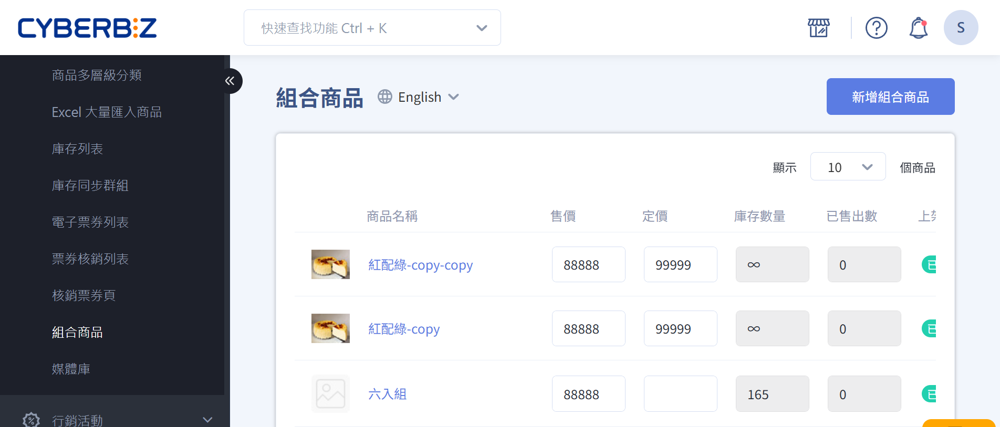
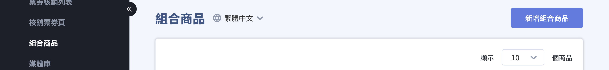
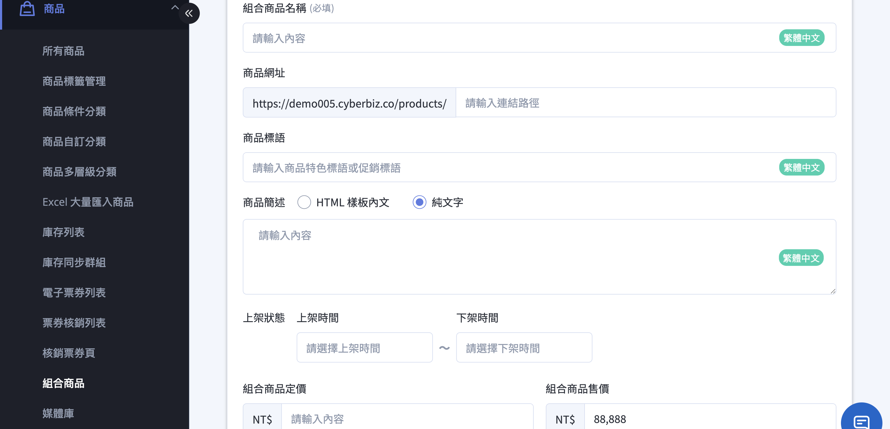
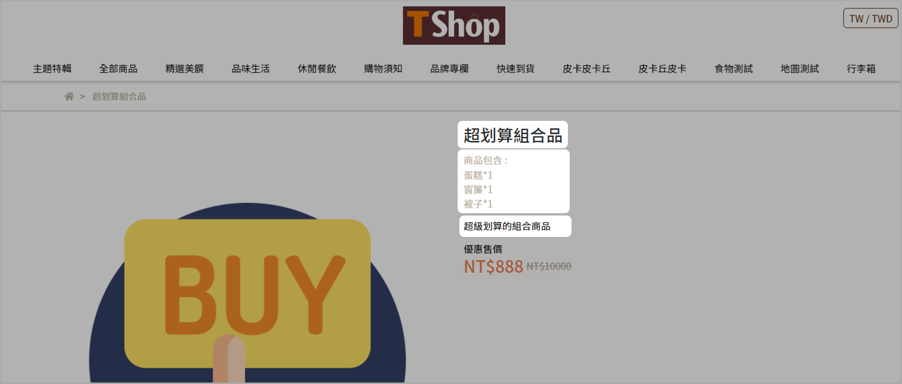
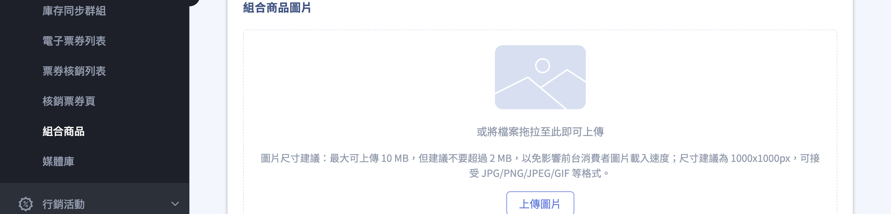
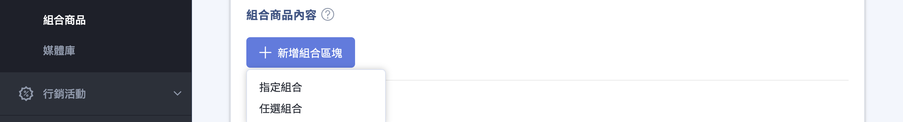
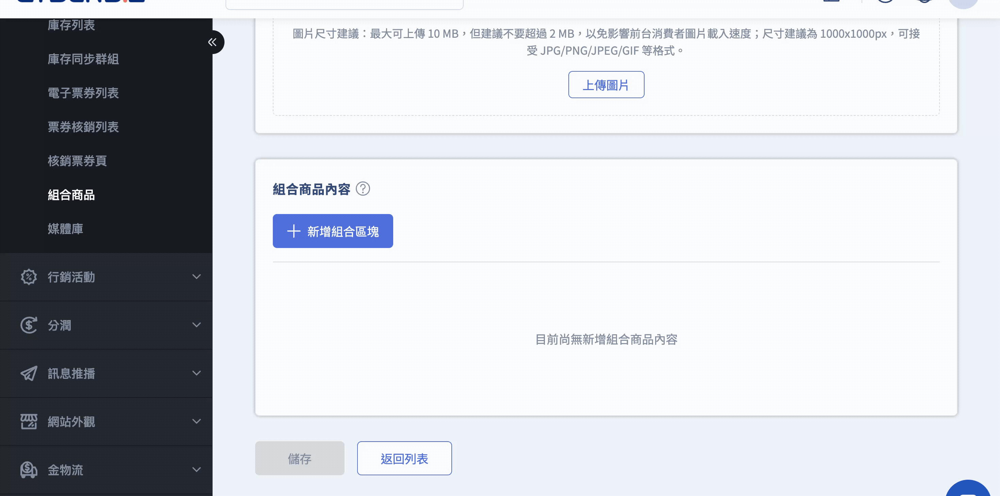
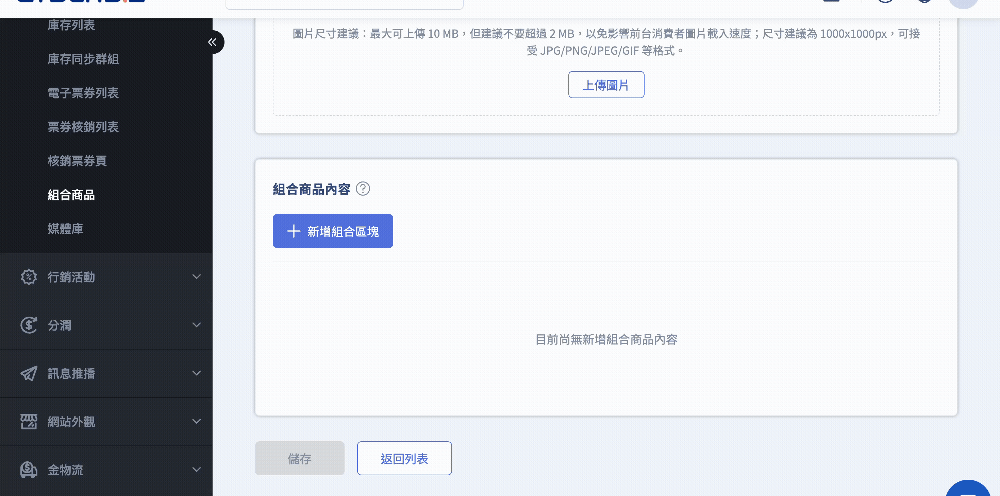
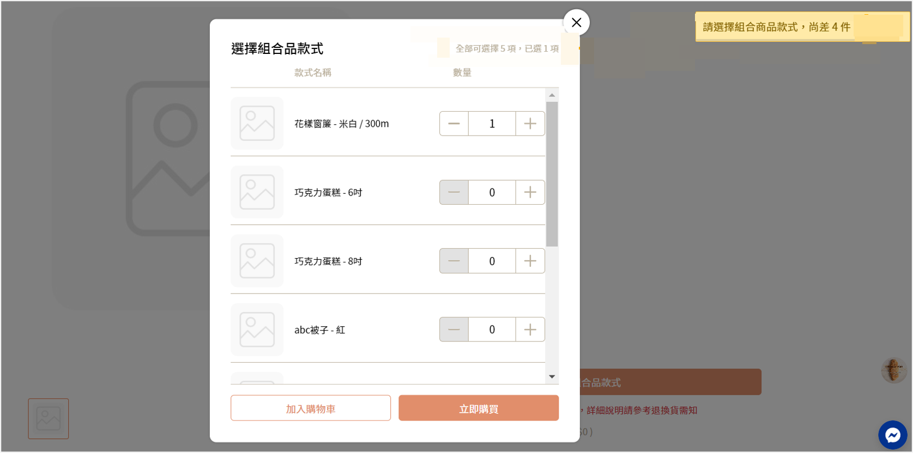
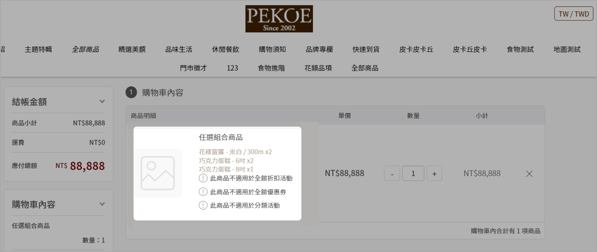

# 新增與設定組合商品
建立指定或任選組合商品，設定子商品內容、價格、庫存與銷售規則。
{ .subtitle }

[:lucide-tag:{ title="適用方案" }](../../../resources/conventions#適用方案) | 所有 PLUS / 企業
{ .doc-badge }

!!! info "版本差異說明"
    「組合商品」在 PLUS 方案中屬於「行銷 A」選配模組（11 選 2），商家需確認已選配該模組方可使用。企業版則直接內建此功能。

{ title="新增組合商品：商品 > 新增組合商品" .hero-page }

## 組合商品說明

=== "一般、PLUS"

    組合商品是將兩個或以上的商品組合成單一商品進行販售的商品類型。商家可設定固定內容的 指定組合商品，或讓消費者自行選擇內容的 任選組合商品。常見的應用情境如下：

    - 套裝優惠：將多個商品打包，以組合價格吸引購買。
    - 活動促銷：例如聖誕禮盒、周年慶組合。
    - 增加平均訂單價值：鼓勵一次購買多個商品，提高銷售額。
    - 清理庫存：將銷售速度較慢的商品與熱銷商品組合販售，加速庫存周轉。

=== "企業"

	一個組合品可由多個 **指定組合商品** 或 **任選組合商品** 混合建立。它的特色如下：

	- **固定與任選並存**：打破單一規則限制，支援在同一個組合中同時配置 **固定必買（指定組合）** 與 **自由配（任選組合）** 區塊。商家可輕鬆打造如「主餐固定 + 飲料任選」的套餐情境，極大化銷售彈性。

	!!! example "混合式組合商品範例"
		新機開學祭｜平板主機＋原廠配件＋週邊任選超值套餐

		- **組成方式**：混合「指定組合區塊」與「任選組合區塊」。
    	- **商品內容**：
			1.  **區塊一（指定）**：平板電腦 1 件、原廠保護殼 1 件。
			2.  **區塊二（任選）**：配件池（保護貼、鍵盤、觸控筆等）任選 2 件。
    	- **選購方式**：消費者購買此套餐時，一定會拿到一台平板主機與一個原廠保護殼（必買組合），但配件部分可以自由決定要如何搭配。

## 組合商品功能限制

組合商品在系統中的限制如下：

- **不支援的屬性設定**：
    
    - 商品標籤、商品類型、商品廠商    
    - Google 產品類別
    - SEO 設定    
    - 快速到貨      
    - 商品關聯群組
        
- **批次操作限制**：
    
    - 暫不支援組合商品的批次新增或批次編輯
        
- **重量計算**：
    
    - 組合商品不計入子商品重量，系統固定認定為 0 公斤
    - 結帳頁會依據物流材積限制進行判斷

### 組合商品適用行銷活動

以下表格說明組合商品可參與的行銷活動及限制：

=== ":material-check-circle: 適用"
	| 行銷活動 | 備註說明 | 適用狀態 |
	|-----------|-----------|-----------|	
	| 優惠券、免運券 |  | :material-check: |
	| 訂單金額免運門檻（超商 + 宅配） |  | :material-check: |
	| 首購禮（活動規則 : 消費門檻） |  | :material-check: |
	| 滿額送紅利 (會員紅利點數) |  | :material-check: |
	| 分潤 |  | :material-check: |
	| 推薦分潤折扣碼 |  | :material-check: |
	| 紅利折抵 |  | :material-check: |
	| 指定組合品：定期定額、一頁式活動頁 | | :material-check: |

=== ":material-alert: 有條件適用"
	| 行銷活動 | 備註說明 | 適用狀態 |
	|-----------|-----------|-----------|
	| 訂單加價購 | 組合品不能作為 *加價購品* | :material-alert-outline: |
	| 訂單滿額贈 | 組合品不能作為 *滿額贈品* | :material-alert-outline: |

=== ":material-close-circle: 不適用"
	| 行銷活動 | 備註說明 | 適用狀態 |
	|-----------|-----------|-----------|
	| 任選折扣 |  | :material-close: |
	| 紅配綠 |  | :material-close: |
	| 單品折扣 |  | :material-close: |
	| 綁商品送優惠券 |  | :material-close: |
	| 綁商品送紅利 |  | :material-close: |
	| 首購禮（商品標籤） |  | :material-close: |
	| 商品多層級分類滿額折扣 |  | :material-close: |
	| 滿額送優惠券 (全館活動 – 優惠券) |  | :material-close: |
	| 紅利商城 |  | :material-close: |
	| 商品限購 |  | :material-close: |
	| 全館活動 (金額/百分比) |  | :material-close: |
	| 商品加價購 |  | :material-close: |
	| 商品滿額贈 / 商品滿件贈 |  | :material-close: |
	| 任選組合品 | | :material-close: |

## 組合商品出貨

當組合商品訂單成立後，系統在產生超商或宅配託運單時，會同時生成以下四份文件。所有文件皆包含組合商品中所有子商品的詳細資訊：

- **訂單明細**：顯示訂單內各商品及組合商品內容。
- **出貨明細**：列出待出貨商品及數量。
- **揀貨單**：提供倉庫揀貨依據，包含組合商品內子商品。
- **託運單**：作為物流運送文件，包含組合商品所有子商品資訊。

## 子商品庫存管理

組合商品是否可供購買（庫存是否足夠），取決於其 子商品 的庫存數量及設定。若其中任一子商品庫存不足，且該子商品庫存不足時設定為 **停止銷售**，則該組合商品將無法購買。進一步瞭解[商品庫存相關設定](create-update-products.md#operate-product-create-inventory){ title="新增與更新商品" }。

!!! info "子商品下架或停止販售的處理方式"  
	- 組合商品內的子商品 **上架狀態** 可為 _下架_ 或 _不公開_。
	  - 若子商品已停止販售，請將該子商品從組合商品中移除。

|**子商品 A 款式設定**|**子商品 B 款式設定**|**商品組合 C (A + B) 可購買數量**|
|---|---|---|
|庫存不足停止銷售 (庫存數量 = 10)|庫存不足停止銷售 (庫存數量 = 20)|10|
|庫存不足繼續銷售 (庫存數量 = 10)|庫存不足停止銷售 (庫存數量 = 20)|20|
|無限數量 (不管理庫存)|庫存不足停止銷售 (庫存數量 = 20)|20|
|庫存不足繼續銷售 (庫存數量 = 10)|庫存不足繼續銷售 (庫存數量 = 10)|無限|
|無限數量 (不管理庫存)|庫存不足繼續銷售 (庫存數量 = 10)|無限|
|庫存不足停止銷售 (庫存數量 = 0)|庫存不足停止銷售** (庫存數量 = 20)|庫存不足|

## 組合商品價差計算

在訂單報表、Excel/CSV 匯出以及 API 回傳中，系統提供 **組合品價差** 欄位，用於幫助商家快速對帳及分析折扣分配。

!!! info-clean "計算邏輯"

    組合商品的價格與價差計算規則如下：

    - **組合品折扣** = 子商品總價 − 組合品售價
    - **折扣分配**：將組合品折扣依比例分配至各子商品 
    - **組合品價差** = 子商品原價 − 分配後的最終價格
        
    !!! warning "注意"
        組合品價差反映每個子商品分攤折扣後的差額，用於對帳與報表分析，不影響實際結帳金額。

??? example "計算範例"

    假設一個組合品包含三個子商品：

    - 組合品售價：850 元
    - 子商品原價總和：900 元
    - 總折扣：50 元
        
    |子商品|最終價格|組合品價差|
    |---|---|---|
    |A|94|6|
    |B|283|17|
    |C|473|27|

    **說明**：

    - 「最終價格」為折扣按比例分配至子商品後的價格
    - 「組合品價差」為原價減去最終價格的差額
    - 三個子商品的組合品價差總和 = 50 元（與總折扣一致）

## 新增組合商品

透過組合商品功能，商家可以將多個子商品打包銷售，提升銷售彈性及促銷效率。

### 步驟 1：進入組合商品管理

1. 登入 CYBERBIZ 管理後台，前往 **商品 > 組合商品**。
2. 點擊 **新增組合商品**。

---

### 步驟 2：編輯組合商品資訊

在編輯頁面中設定組合商品的[基本設定](create-update-products.md#operate-product-create-basic){ title="新增與更新商品" }。

#### 基本設定

- **組合商品名稱**：避免使用特殊符號（如 `|` 或 `”`），不可使用 HTML。
- **商品網址**：建議使用英文，利於 SEO 與 GA 分析。若未設定，系統會自動使用 **商品名稱** 作為網址。
- **商品標語**：顯示於商品頁的簡短文字，可用於強調組合商品特色。
- **商品簡述**：建議 1–3 句，避免冗長段落。顯示於商品頁的簡短描述。
- **上架狀態**：設定商品上架與下架時間，未填寫表示商品永久上架；非上架時間將顯示 404。

!!! tip "建議說明組合商品內容物"  
	為避免消費者誤解商品內容，建議在 **商品簡述** 或 **商品標語** 中清楚列出組合商品所包含的子商品與數量。

??? info-clean "前台顯示範例"

    - 商品名稱：超划算組合品
    - 商品簡述：  
      商品包含   
      蛋糕*1   
      窗簾*1   
      被子*1
    - 商品標語：超級划算的組合商品

    !!! quote ""
      { title="組合商品前台顯示" }

---

#### 組合商品圖片

建議上傳包含組合商品內容物的圖片，以清晰呈現商品組合。

---

### 步驟 3：設定組合商品內容

=== "一般、PLUS"

    組合商品可設定為兩種類型：

    - **指定組合商品**：商品固定，顧客無法變更。
    - **任選組合商品**：消費者可從預設清單中選擇子商品，只要達到 **任選組合總數** 即可。

    
      
    !!! warning "組合商品建立後，組合類型不可修改"

    ---

    #### 指定組合商品設定

    1. 選取 **指定組合商品**。 
    2. 點擊 **選擇商品**，在彈窗中搜尋欲加入的商品。
    3. 勾選欲加入的商品。
    4. 點擊 **確定** 將商品加入組合商品。

    { title="指定組合商品設定" }

    ---

    #### 任選組合商品設定

    1. 選取 **任選組合商品**。
    2. 在 **任選組合總數** 欄位填入消費者需選購的總數。 
    3. 點擊 **選擇商品**，在彈窗中搜尋欲加入的商品。
    4. 勾選欲加入的子商品。
    5. 點擊 **確定** 將商品加入組合商品。

    { title="任選組合商品設定" }

    !!! info "庫存數量計算方式請參考 [庫存管理](#子商品庫存管理) 的「商品組合 C」。"

=== "企業"

    #### 建立組合品

    1. **新增組合區塊**：點擊按鈕建立第一個內容區塊。
    2. **選擇區塊類型**：

        - **固定組合**：區塊內商品與數量由商家固定，顧客不可更改。
        - **任選組合**：設定該區塊的 **任選數量總額**，顧客可從清單中自由挑選。

        { .screenshot }

    3. **加入商品**：在區塊內點擊 **選擇商品**，於彈窗中勾選商品。

        - **快速搜尋**：輸入商品名稱或 SKU 碼找尋指定商品。
        - **批次篩選**：點擊 **進階搜尋**，開啟篩選器，篩選符合條件的商品。

        { .screenshot }

    4. **設定購買數量**：

        === "指定組合"

            指定每個商品的購買數量。

            { .screenshot }

        === "任選組合"

            指定組合內商品的購買總額。

            { .screenshot }

    5. **實現混合模組**（關鍵步驟）：再次點擊 **新增組合區塊** 建立第二個區塊。

        > 範例：您可以將區塊 A 設為「固定組合」放置主商品，區塊 B 設為「任選組合」提供贈品或配件選購。

    6. **自訂區塊資訊**：

        - **編輯區塊名稱**：點擊區塊標題（如「區塊 1」）可自訂名稱，此名稱將顯示於前台，引導顧客選購。
        - **調整排序**：拖曳區塊左側的圖示，即可調整各區塊在前台頁面的顯示順序。

        { .screenshot }

    !!! warning "確認適用溫層與物流"
        前往 **設定** 頁籤設定配送規格時，請務必遵循以下規則：

        - **上架條件**：組合品內的所有單品，必須具備 **至少一個共同的溫層與物流選項**，方可將組合品設為公開。
        - **異常處理**：若組合品內因單品衝突而導致無適用之溫層與物流，組合品狀態無法設為公開，前台商品頁將會顯示 404 錯誤頁面。
        - **排除方式**：請編輯各單品的物流與溫層，使其有共同的溫層/物流，或將特殊溫層/物流的商品從該組合品中移除。

## 前台結帳與購物車行為

=== "一般、PLUS"

    - 消費者必須選購至後台設定的 **任選組合總數** 才能加入購物車。
    - 若達到選購上限，前台會提示 **已達上限**。
    
    { title="任選組合前台呈現" }

    - 購物車與結帳頁會判斷組合商品是否符合物流材積限制。  
    - 組合商品僅支援單一溫層，不支援[多通路觸發多購物車](../shipping/setup-product-shipping-conditions.md#多通路購物車拆分){ title="設定商品配送條件（物流、溫層與出貨通路）" }。

    { title="組合商品購物車" }

=== "企業"

    前台商品頁將依據您在後台設定的 **組合區塊** 依序呈現。

    { .screenshot }

    === "指定組合區塊"

        當消費者瀏覽 **指定組合區塊** 時，商品品項與數量固定，無法編輯。

        { .small-image }

    === "任選組合區塊"

        當消費者瀏覽 **任選組合區塊** 時：

        1. **查看選購進度**：區塊右上方會即時顯示 **已選 0 / N 項** 的提示。隨著消費者加減商品，數字會即時同步，未達門檻時系統將限制無法加入購物車。
        2. **展開商品清單**：系統預設會自動展開第一個商品的款式選單。消費者亦可點擊右側的 **倒三角形** 箭頭，自由折疊或展開其他想看的商品。
        3. **增減款式數量**：消費者可透過 **+** 與 **-** 按鈕，彈性調配不同款式的購買件數，直到滿足該區塊的總件數要求。

        { .small-image }

## 後續步驟

- :lucide-pencil:{ .lg }   
  [__編輯商品描述與商品設定__](edit-product-slogan-and-description.md){ title="編輯商品描述與商品設定" }     
  匯入編輯過的商品 Excel 檔案，同步更新多筆商品的商品描述與配送相關設定。

- :lucide-boxes:{ .lg }  
  [__組合商品（加工品）__](../../../wms/processed-products.md){ title="加工商品" }   
  將組合商品對應至 WMS 加工商品，出貨時自動扣除各子品項庫存。   

## 常見問題
??? quote "組合商品可以修改組合類型嗎？"
    商品一旦建立後，組合類型（指定組合或任選組合）即無法修改。若需更改，建議重新建立商品。

??? quote "組合商品內的子商品庫存不足會影響銷售嗎？"
    是的，若組合商品內的任一子商品庫存不足，且該子商品設定為 *庫存不足時停止銷售*，則整個組合商品將無法購買。
