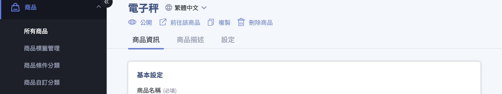
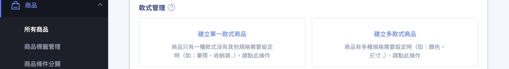
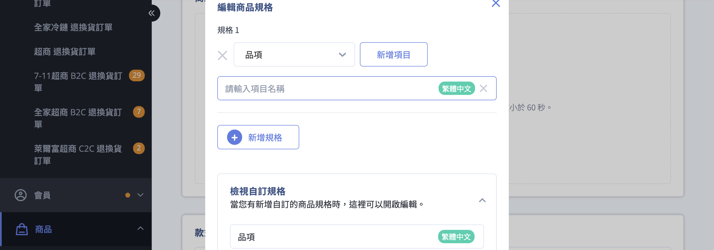
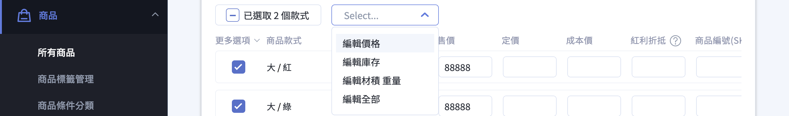
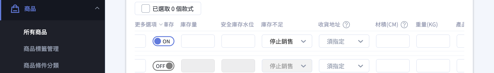
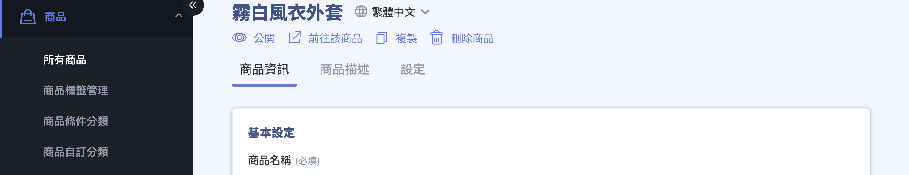
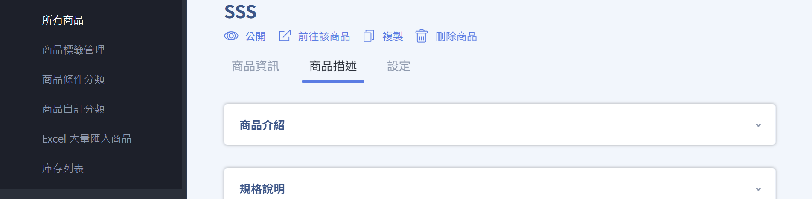
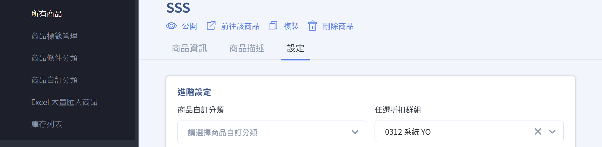
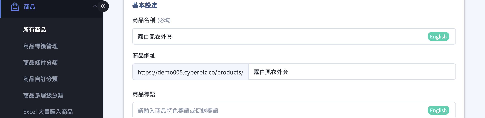

{ title="新增商品： 商品 > 所有商品 > 新增商品" .hero-page }

## 新增商品介紹 { #intro-product }

在 CYBERBIZ 後台，所有要在前台官網販售的商品都從 **新增商品** 開始建立。一支商品的設定分散在商品編輯頁上方的分頁中：

- **商品資訊：** 商品名稱、圖片、款式、價格、庫存等銷售核心設定，新增商品時即可填寫。
- **商品描述：** 商品介紹、規格描述、運送方式等說明性內容。
- **設定：** 進階設定(出貨方式、溫層、標籤、課稅類別、商品群組)與 SEO。

{ title="商品編輯頁-分頁" }

!!! info "提示"
    **商品描述** 與 **設定** 分頁只會在商品 **儲存後** 才出現。新增商品時請先填妥「商品資訊」並儲存，系統會進入編輯模式，上方才會展開其餘分頁。

??? tip "大量新增或更新商品？"
    若需一次建立或修改大量商品，可改用 Excel 批次匯入，毋需逐筆手動操作。詳見 [大量匯入商品](../bulk-operations/excel-import-products.md){ title="Excel 大量匯入商品" }。

---

## 使用前提與限制 { #prerequisites-product }

開始前，以下功能會影響您看到的欄位與可用選項。多數為內建，部分為開通功能或與經營站別相關，一般商店不一定全部具備：
<!-- - [x] **管理庫存(內建)：** 所有方案皆可在款式管理中開啟，無需額外開通。 -->
- [x] **會員專屬價格(VIP)：** 需先建立 VIP 群組，才能在款式管理中設定各群組專屬售價。
- [x] **商品影片 `PLUS版/企業`：** 僅支援 **拖拉版型** 的主題，前台才能正常顯示。
- [x] **前台多國功能(多國語系)：** 開通後商品編輯頁右上角會出現 **語言切換**，可逐語言填寫商品文字內容，詳見 [多國語系商品內容](#operate-product-edit-multilang)。
- [x] **跨境 / 海外站別：** 經營日本站等海外站別，或開通海外倉儲(如 Amazon 物流)時，會多出課稅類別與出貨方式等設定，詳見 [跨境銷售相關設定](#operate-product-edit-crossborder)。

---

## 操作步驟 { #operate-product }

以下分為 **新增商品** 與 **編輯既有商品** 兩種情境。新增時先完成「商品資訊」並儲存，之後即可在編輯模式補充描述、設定，以及進行上下架、多國語系與跨境等設定。

!!! tip "技巧"
    商品編輯頁中的 **「儲存」** 適用於所有分頁。建議每完成一個分頁就先儲存一次，避免切換分頁或語言時遺失內容。

### 新增商品：基本設定 { #operate-product-create-basic }

進入後台「商品」>「所有商品」，點擊右上角 **「新增商品」** 進入商品編輯頁，於 **基本設定** 區塊填入核心資訊：

1. **填寫商品名稱：** 商品在前台顯示的名稱，為 **必填**，且不可使用 `|` 或換行等特殊符號。
2. **設定商品網址：** 商品頁的網址路徑，建議使用英文，有利於 SEO 與後續的成效分析。
3. **填寫商品標語與簡述：** 顯示在商品名稱附近的特色或促銷短句，以及商品的簡短描述（[客製說明](edit-product-slogan-and-description.md){ title="編輯商品簡述與商品標語" }）。
4. **設定上架狀態：** 設定 **上架時間** 與 **下架時間**；兩者皆留空代表立即上架、永不下架[^status]。
5. **設定商品搜尋：** 決定商品是否能被站內搜尋找到。設為[排除搜尋](../discoverability/product-search-visibility.md){ title="設定商品搜尋可見性" }後，顧客仍可透過 商品連結 進入購買。

{ title="商品基本設定" }

[^status]: 各上架與公開狀態的意義請見 [商品狀態對照表](../references/product-statuses.md){ title="商品狀態對照表" }。

---

### 新增商品：商品圖片與影片 { #operate-product-create-media }

於 **商品圖片** 區塊上傳圖片：

1. **上傳圖片：** 點擊 **「上傳圖片」**，或直接將檔案拖拉至上傳區。
2. **留意圖片規格：** 建議尺寸為 1000x1000px，可接受 JPG / PNG / JPEG / GIF。單張建議不超過 2 MB，前台載入較快。

{ title="設定商品圖片" }

??? info "跨通路投放提醒：Google 購物廣告（GMC）"
    { #gmc-picture-specs }
    若您計畫同步商品至 Google 進行投放，圖片需符合 [Google 圖片規範 :lucide-external-link:](https://support.google.com/merchants/answer/6324350#Image_guidelines)。不符合規範的圖片可能導致商品審核失敗。

    ??? example "查看 Google 圖片禁忌與範例"

        | 規範 | 說明 |
        | :--- | :--- |
        | 不可包含價格資訊 | 避免在圖片中標示售價或折扣金額 |
        | 不可包含促銷文字 | 如「免運」、「特價」、「限時優惠」等 |
        | 不可添加浮水印或 Logo | 商品圖片不得覆蓋品牌標識 |
        | 需清晰呈現商品主體 | 背景建議使用白色或純色，商品占比建議 85% 以上 |

        

        :lucide-check: 符合規範
        { title="GMC 無浮水印" .screenshot }

        :lucide-x: 不符合規範
        { title="GMC 有浮水印" .screenshot }

        

!!! plan "方案 / 開通功能"
    [**商品影片**](setup-product-videos.md){ title="設定商品影片" } PLUS版 / 企業版限定功能，且僅支援 **拖拉版型** 的主題，前台才會顯示。

---

### 新增商品：款式、價格與庫存 { #operate-product-create-variants }

要設定售價與庫存，必須先建立 **款式**。於 **款式管理** 區塊選擇建立方式：

- **建立單一款式商品：** 商品沒有其他規格時使用（例：筆筒、收納袋）。
- **建立多款式商品：** 商品有多種規格時使用（例：顏色、尺寸）。

{ title="款式管理建立方式選擇" }

建立 **多款式商品** 時：

1. **編輯商品規格：** 點擊 **「編輯商品規格」**，新增規格（如「顏色」）與規格項目（如「紅」、「藍」）。
2. **留意規格上限：** 單一商品最多 3 種規格，每種規格至少需有 1 個項目，且同一規格內的項目不可重複。

{ title="編輯商品規格" }

每個款式可設定以下欄位：

- **售價：** 實際銷售金額。
- **定價：** 建議售價（劃線價）。
- **成本價：** 僅供內部分析，不會顯示於前台（開通功能）。
- **商品編號(SKU)：** 商品的內部料號，結帳與庫存皆以此識別[^sku]。
- **重量(KG)、材積(CM)：** 結帳時系統依物流設定的運費級距計算運費（材積為方案限定功能）。

{ title="款式欄位詳細設定" }

??? tip "技巧：批次套用款式"
    建立多款式商品後，可一次套用相同設定到多個款式。在款式區上方選擇 **編輯價格、編輯庫存、編輯材積 重量** 等，勾選要套用的款式並輸入數值後點擊 **「套用」**。輸入欄留空則不影響原款式內容。

    { title="款式批次編輯操作" }

[^sku]: 不同方案對商品 SKU 總數有上限；若新增時提示已達上限，代表方案的商品數量已用罄。

---

### 新增商品：管理庫存 { #operate-product-create-inventory }

在款式中開啟 **管理庫存** 後，會多出以下欄位：

1. **庫存量：** 商品可販售的數量；未開啟管理庫存時視為無限量。
2. **安全庫存水位：** 庫存的警示門檻。當款式庫存降到此數量時，系統會寄送低庫存通知信，提醒您及時補貨。留空則不提醒。
3. **庫存不足時的處理：** 設定庫存歸零時是否允許顧客繼續購買。
    - **停止銷售：** 一般商品建議選此，避免超賣。若需配合使用 [**商品到貨通知**](../engagement/setup-back-in-stock-notifications.md){ title="設定商品到貨通知" }，亦須選擇此項。
    - **繼續銷售：** 開放 **預購商品** 時選此。

!!! tip "預購商品設定"
    { #setup-preorder-products }
    將「庫存不足時的處理」設為 **繼續銷售**，即可讓商品在庫存歸零時仍開放顧客下單，達到預購模式的效果。無需另外建立預購商品類型，直接使用現有商品即可運作。若需將預購與現貨在結帳時自動拆分，請見 [設定結帳自動拆分多購物車](../../products/checkout/checkout-split-multi-cart.md#設定預購商品通路){ title="將預購與現貨自動分開結帳" }。

{ title="管理庫存設定" }

填妥商品資訊後，點擊左下角 **「儲存」**。儲存成功後系統進入編輯模式，上方會展開 **商品描述** 與 **設定** 分頁，可繼續補充內容。

---

### 編輯既有商品：進入編輯頁 { #operate-product-edit-entry }

要修改已建立的商品：

1. **找到商品：** 進入「商品」>「所有商品」，於列表中找到目標商品。
2. **進入編輯：** 點擊商品名稱即進入商品編輯頁，上方可切換 **商品資訊、商品描述、設定** 分頁。
3. **修改後儲存：** 調整任一分頁內容後，點擊左下角 **「儲存」** 即更新。

{ title="商品編輯頁總覽" }

---

### 編輯既有商品：商品描述 { #operate-product-edit-description }

切換至 **商品描述** 分頁，以文章編輯器填寫三個區塊：

- **商品描述：** 商品的主要介紹內容。
- **規格描述：** 商品規格、材質、尺寸等說明。
- **運送方式：** 出貨與配送相關說明。

填寫完成後點擊 **「儲存」**。

{ title="編輯商品描述" }

---

### 編輯既有商品：設定分頁 { #operate-product-edit-settings }

切換至 **設定** 分頁，可進行下列進階設定：

- **商品類型 / 商品通路 / 商品廠商：** 用於後台分類與管理。此三項新增後無法刪除或改名，請謹慎命名。
- **標籤：** 為商品加上標籤，方便後台管理與前台分類。
- **出貨方式：** 選擇 **自行出貨** 或已開通的倉儲物流[^warehouse]。
- **運送溫層與物流配送：** 設定常溫、冷藏或冷凍，並勾選此商品可使用的物流[^temperature]。
- **SEO 設定：** 依商品特性填寫，有助於提升搜尋引擎排名。
- **商品關聯群組：** 選擇既有的 [**商品自訂分類**](../categories-and-tags/custom-collections.md){ title="設定商品自訂分類群組" } 或 [**商品條件分類**](../categories-and-tags/smart-collections.md){ title="設定商品條件分類群組" }，設定後該群組商品會顯示在商品頁下方的相關商品區。

{ title="商品進階設定" }

[^warehouse]: 可選的出貨倉庫依已開通的物流功能動態顯示，詳見 [出貨方式對照表](../references/product-warehouse.md){ title="出貨方式對照表" }。
[^temperature]: 溫層為方案限定功能，各溫層意義詳見 [運送溫層對照表](../references/product-temperature.md){ title="運送溫層對照表" }。

---

### 編輯既有商品：上下架與管理動作 { #operate-product-edit-actions }

在商品編輯頁 **左上角** 可進行以下管理動作：

- **公開 / 不公開：** 切換商品在前台是否陳列販售。設為 **不公開** 後，前台隱藏且連結無法購買。
- **複製：** 以現有商品為範本快速建立新商品；系統會要求先填寫新款式的 **商品編號(SKU)** 再複製[^copy-sku]。
- **前往該商品：** 開啟前台的實際商品頁，確認顧客看到的呈現。
- **刪除商品：** 將商品自後台移除，刪除後無法復原，請謹慎操作。

{ title="商品管理動作快捷鍵" }

[^copy-sku]: 複製時會跳出「編輯商品編號(SKU)」視窗，因每個款式 SKU 不可重複，須先填妥新 SKU 才能完成複製。

---

### 多國語系商品內容 { #operate-product-edit-multilang }

若已開通 **[前台多國功能](../../website-management/setup-multi-language-and-multi-currency.md)**，商品編輯頁標題右側會出現 **語言切換** 選單，可為每一種語言分別填寫商品的文字內容。一般單一語言的商店可略過本節。

填寫前，請先了解 **哪些欄位需逐語言填寫、哪些是所有語言共用** 的：

- **需逐語言填寫(文字類)：** 商品名稱、商品標語、商品簡述，以及 **商品描述** 分頁中的文字內容，以及規格。
- **所有語言共用：** 價格、款式、SKU、庫存、商品圖片、商品分類與標籤等。這些只需設定一次，切換語言不會改變。

操作步驟如下：

1. **以主要語言填妥商品：** 先選定一個主要語言，依一般流程輸入商品名稱、價格、款式、圖片等內容，並點擊 **「儲存」**。
2. **切換語言：** 在標題右側的語言選單點選要編輯的語言。若有尚未儲存的變更，系統會先提示請您儲存[^lang-save]。

    { title="切換語言選單" }

3. **輸入翻譯內容：** 切換語言後，於文字類欄位填入該語言的翻譯(商品描述分頁的內容也需逐語言填寫)。

    { title="編輯不同語言內容" }

4. **儲存並切換下一語言：** 點擊 **「儲存」**，再重複上述步驟完成其他語言。

!!! info "提示"
    價格、款式、庫存與圖片屬於 **共用欄位**，在任一語言下修改都會套用到所有語言；切換語言看到的價格不變屬正常現象。

[^lang-save]: 系統提示文字為「編輯多國語言前，請先儲存變更中的內容」。

---

### 跨境銷售相關設定 { #operate-product-edit-crossborder }

系統沒有獨立的「跨境商品」類型，跨境銷售所需的設定 **分散在一般欄位中**。經營海外站別或使用海外倉儲時，以下設定與跨境直接相關：

- **出貨方式(設定分頁)：** 使用海外倉儲(如 Amazon 物流)出貨時，於 **出貨方式** 選擇對應倉庫；透過該倉出貨的商品，**SKU 須與倉庫內的 SKU 完全一致** 才能順利拋單[^fba-sku]。
- **重量與材積(款式)：** 海外物流多以重量或材積計費，請於款式中確實填寫 **重量(KG)** 與 **材積(CM)**。
- **商品課稅類別(設定分頁)：** 經營 **日本站** 的台灣商家，可於設定分頁選擇商品課稅類別。
- **Google 產品類別(設定分頁)：** 指定商品在 Google Merchant Center 動態產品饋給中的分類，有助於 Google 購物廣告曝光；未設定時 Google 會自動指定分類。

!!! note "報關資料不在商品頁設定"
    跨境出貨的報關方式、關稅負擔等是在 **出貨階段** 依所選物流商填寫，不在商品編輯頁。

[^fba-sku]: SKU 不一致是跨境倉儲拋單失敗最常見的原因。

---

## 重要規範與限制 { #specs-product }

- **商品名稱：** 為必填，長度上限 255 字，且不可使用 `|`、換行等特殊符號。
- **款式規格數量：** 單一商品最多 3 種規格，每種規格至少 1 個項目，同規格內項目不可重複。
- **商品編號(SKU)：** 同一商店內不可重複；複製商品時須重新指定。
- **多國語系欄位：** 僅文字類欄位(名稱、標語、簡述、描述)需逐語言填寫；價格、款式、庫存、圖片為所有語言共用。
- **商品類型 / 通路 / 廠商：** 新增後無法刪除或修改名稱。
- **POS 門市商品：** 無法設定為「公開」，僅供門市端使用。
- **商品影片與款式圖片：** 僅支援拖拉版型的主題，前台才會顯示。

---

## 後續操作 { #next-steps-product }

- :lucide-file-spreadsheet:{ .lg }  
  [__大量匯入商品__](../bulk-operations/excel-import-products.md){ title="Excel 大量匯入商品" }   
  以 Excel 一次新增或更新大量商品與款式。

- :lucide-tags:{ .lg }  
  [__設定會員專屬價格(VIP)__](../pricing/setup-vip-member-pricing.md){ title="設定 VIP 會員專屬價格" }  
  為不同 VIP 群組設定專屬售價。

- :lucide-languages:{ .lg }  
  [__設定前台多國語言與多幣別__](../../website-management/setup-multi-language-and-multi-currency.md){ title="設定前台多國語言與多幣別" }  
  建立多語系官網與在地幣別顯示。

- :lucide-search:{ .lg }  
  [__Google 購物廣告設定(GMC)__](../../integrations/google/setup-google-merchant-center.md){ title="設定 Google Merchant Center 並同步 CYBERBIZ 商品" }  
  將商品同步至 Google Merchant Center。

---

## 常見問題 { #faq-product }

??? quote "商品很多，要一支一支建立嗎？"
    { #faq-product-bulk-import }
    不需要。商品數量多時，建議使用 **Excel 批次匯入** 一次建立或更新，詳見 [大量匯入商品](../bulk-operations/excel-import-products.md){ title="Excel 大量匯入商品" }。

??? quote "為什麼設定了售價，前台卻顯示「須設定」或無法購買？"
    { #faq-product-no-price }
    請確認您已先 **建立款式**。售價、庫存、SKU 都掛在款式上，沒有款式就無法設定價格與販售。請於款式管理選擇「建立單一款式商品」或「建立多款式商品」後再設定。

??? quote "新增商品後，為什麼找不到「商品描述」和「設定」分頁？"
    { #faq-product-no-tabs }
    這兩個分頁需在商品 **儲存後** 才會出現。請先在「商品資訊」填妥必填的商品名稱並點擊「儲存」，系統進入編輯模式後，上方就會展開其餘分頁。

??? quote "找不到「材積(CM)」或「成本價」欄位？"
    { #faq-product-no-meas }
    材積與成本價皆為方案限定功能，開通後才會在款式中顯示。若僅看到「重量(KG)」「售價」而無這些欄位，代表尚未開通，請聯繫業務窗口。

??? quote "找不到語言切換選單？"
    { #faq-product-no-language-switch }
    語言切換僅在開通 **前台多國功能** 後才會出現在商品編輯頁標題右側。若沒有看到，代表店家尚未開通此功能，請聯繫 CYBERBIZ 客服。

??? quote "商品設為「不公開」和「排除搜尋」有什麼不同？"
    { #faq-product-hidden-vs-search }
    **不公開** 會讓商品完全從前台隱藏，連結也無法購買；**排除搜尋** 只是讓商品不出現在站內搜尋結果，顧客仍可透過商品連結正常購買。詳見 [商品狀態對照表](../references/product-statuses.md#reference-product-statuses){ title="商品狀態對照表" }。

---

## 參考資料 { #reference-product }

- [商品狀態對照表](../references/product-statuses.md){ title="商品狀態對照表" }
- [出貨方式對照表](../references/product-warehouse.md){ title="出貨方式對照表" }
- [運送溫層對照表](../references/product-temperature.md){ title="運送溫層對照表" }

<!---->
<!-- --- -->
<!---->
<!-- 建立並設定單一商品的基本資訊、圖片、影片與款式，上架商品。 -->
<!-- { .subtitle } -->
<!---->
<!-- { title="新增商品： 商品 > 所有商品 > 新增商品" .hero-page } -->
<!---->
<!-- ## 新增與更新商品說明 { #overview } -->
<!---->
<!-- 在 CYBERBIZ 系統中，新增與更新商品可以透過「[單筆操作](#add-single)」或「Excel 大量匯入」兩種方式進行。 -->
<!---->
<!-- ??? info "部分欄位需先開通"  -->
<!--     以下欄位依方案 / 加值功能顯示，一般商店不一定全部具備： -->
<!---->
<!--     - **售價、庫存：** 所有方案內建，無需開通。 -->
<!--     - **商品影片：** PLUS版 / 企業，且需 **拖拉版型** 主題。 -->
<!--     - **材積（CM）：** 加值功能，開通後才會出現於款式。 -->
<!--     - **多國語系欄位：** 需開通 **前台多國功能**。 -->
<!--     - **Amazon 物流（FBA）：** 開通後出貨方式可選 Amazon 物流，SKU 須與 Amazon 倉庫一致。 -->
<!---->
<!-- ## 單筆新增商品 { #add-single } -->
<!---->
<!-- 適用於少量商品上架，可精細設定每項資訊。 -->
<!---->
<!-- 1. 登入管理後台，前往 「商品」>「所有商品」>「新增商品」。 -->
<!-- 2. 依序設定相關商品資訊：[基本設定](#basic-settings)、[商品圖片](#product-images)、[商品影片](#product-video)、[款式](#variants)、[庫存管理](#inventory)。 -->
<!-- 3. 點擊 **儲存** 以套用變更。 -->
<!---->
<!--  -->
<!---->
<!-- --- -->
<!---->
<!-- ### 基本設定 { #basic-settings } -->
<!---->
<!-- | 欄位名稱 | 設定說明與規範 | 預設值 / 注意事項 | -->
<!-- | :--- | :--- | :--- | -->
<!-- | **商品名稱** | 填寫商品對外顯示的標題。 | 請避免使用特殊符號（如 `|`、`"`、`'`），以確保資料正常存取。 | -->
<!-- | **商品網址** | 定義商品頁面的最後一段路徑（Slug）。  建議使用全英文小寫，並以連字號 `-` 分隔單字。 | 若未填寫，系統將預設使用「商品名稱」作為網址後綴。 | -->
<!-- | **商品標語/簡述** | 輸入吸引消費者的行銷短語。  支援純文字，或[切換 HTML 模式進行進階排版](edit-product-slogan-and-description.md){ title="編輯商品簡述與商品標語" }。 | — | -->
<!-- | **上架狀態** | 設定商品的有效銷售時間區間（排程設定）。 | 若未填寫則為「永久上架」。 **注意：** 若當前時間不在區間內，前台將顯示 404 頁面。 | -->
<!-- | **搜尋功能** | 決定商品是否可被站內搜尋或搜尋引擎（如 Google）找到。 | 關閉後，商品僅能透過 **商品連結** 直接進入。 | -->
<!---->
<!-- { title="商品基本設定" } -->
<!---->
<!-- --- -->
<!---->
<!-- ### 商品圖片 { #product-images } -->
<!---->
<!-- 點擊 **上傳圖片** 或拖拉圖片進行上傳。上傳商品圖片時，請參考以下技術規格： -->
<!---->
<!-- | 項目 | 規格 | 說明 | -->
<!-- | :--- | :--- | :--- | -->
<!-- | 尺寸 | 1000 × 1000 px | 正方形比例為佳 | -->
<!-- | 檔案大小 | 最大 10 MB，建議不超過 2 MB | 過大圖片會影響載入速度 | -->
<!-- | 支援格式 | JPG / PNG / JPEG / GIF | 建議使用 JPG 或 PNG | -->
<!---->
<!-- !!! info "跨通路投放提醒：Google 購物廣告（GMC）" -->
<!--     若您計畫同步商品至 Google 進行投放，圖片需符合 [Google 圖片規範  -->
<!-- :lucide-external-link:](https://support.google.com/merchants/answer/6324350#Image_guidelines)。不符合規範的圖片可能導致商品審核失敗。 -->
<!---->
<!--     ??? example "查看 Google 圖片禁忌與範例" -->
<!---->
<!--         | 規範 | 說明 | -->
<!--         | :--- | :--- | -->
<!--         | 不可包含價格資訊 | 避免在圖片中標示售價或折扣金額 | -->
<!--         | 不可包含促銷文字 | 如「免運」、「特價」、「限時優惠」等 | -->
<!--         | 不可添加浮水印或 Logo | 商品圖片不得覆蓋品牌標識 | -->
<!--         | 需清晰呈現商品主體 | 背景建議使用白色或純色，商品占比建議 85% 以上 | -->
<!---->
<!--         
 -->
<!---->
<!--         :lucide-check: 符合規範 -->
<!--         { title="GMC 無浮水印" .screenshot } -->
<!---->
<!--         :lucide-x: 不符合規範 -->
<!--         { title="GMC 有浮水印" .screenshot } -->
<!---->
<!--         
 -->
<!---->
<!-- { title="設定商品圖片" } -->
<!---->
<!-- --- -->
<!---->
<!-- ### 商品影片 { #product-video } -->
<!---->
<!-- [:lucide-tag:{ title="適用方案" }](conventions.md#適用方案) | PLUS / 企業   -->
<!-- [:lucide-bolt:{ title="適用功能" }](conventions.md#適用功能) | 拖拉版型 -->
<!---->
<!-- - 解析度：最高支援 1280 × 1280 像素。 -->
<!-- - 建議比例：9:16，此比例最佳化於 Facebook 廣告版位。 -->
<!-- - 影片格式：僅支援 MP4 格式。 -->
<!-- - 影片長度：最長 60 秒。 -->
<!-- - 檔案大小：最大 30 MB，載入速度會受使用者網路影響，建議在符合規格下盡量壓縮檔案。 -->
<!-- - 音訊支援：目前不支援音訊輸出，上傳影片將以靜音模式播放。 -->
<!---->
<!-- !!! info "更多商品影片相關](setup-product-videos.md)影片](設定商品影片.md){ title="設定商品影片" }。" -->
<!---->
<!-- --- -->
<!---->
<!-- ### 款式管理 { #variants }  -->
<!---->
<!-- 要設定售價與庫存，需先建立 **款式**： -->
<!---->
<!-- - **單一款式：** 設定售價（實際銷售額）、定價（建議售價）、成本價（內部分析用，前台不可見）及商品編號（SKU）。 -->
<!-- - **多款式商品：** 點擊 **「編輯商品規格」**，依序加入顏色、尺寸等規格，每組規格至少需有一個項目（最多 3 種規格）。 -->
<!-- - **同步套用：** 多個款式價格或庫存相同時，於款式區上方選擇 **編輯價格 / 編輯庫存 / 編輯材積 重量 / 編輯全部**，勾選款式輸入數值後點 **「套用」** 即可批次填入。 -->
<!---->
<!-- !!! note "跨境 / 海外站別" -->
<!--     - **規格用英文：** 北美站等英文站別，規格名稱與項目建議以英文命名。 -->
<!--     - **重量與材積：** 海外物流多以重量或材積計費，請於款式中確實填寫（材積為加值功能，開通後才會出現「材積（CM）」欄位）。 -->
<!--     - **報關資訊：** 報關所需資料（如品名、原產國等）是在 **出貨階段** 依所選跨境物流商填寫，**不在商品頁設定**。 -->
<!---->
<!-- --- -->
<!---->
<!-- ### 管理庫存 { #inventory } -->
<!---->
<!-- 開啟功能後，可設定庫存量與「安全庫存水位」。當庫存歸零時，可選擇「停止銷售」或「繼續銷售（開放預購）」。 -->
<!---->
<!-- --- -->
<!---->
<!-- ### 多國語系：逐語言填寫商品內容 { #multilang } -->
<!---->
<!-- 若您的商店已開通 **前台多國功能**，商品編輯頁標題右側會出現 **語言切換**（語言圖示與下拉選單），可針對每一種語言分別輸入文字內容。 -->
<!---->
<!-- 請留意 **哪些欄位需逐語言翻譯、哪些欄位是所有語言共用** 的： -->
<!---->
<!-- - **需逐語言翻譯：** 商品名稱、商品標語、商品簡述、商品規格、規格項目，以及商品描述頁的內容（於 [編輯商品描述與商品設定](edit-product-description-settings.md){ title="編輯商品描述與商品設定" } 另述）。 -->
<!-- - **所有語言共用：** 價格、款式、SKU、庫存、商品圖片、分類與標籤。這些只需設定一次，切換語言不會改變。 -->
<!---->
<!-- 操作方式： -->
<!---->
<!-- 1. 先選定一個 **優先語言**，依一般流程填妥商品內容並 **儲存**。 -->
<!-- 2. 從標題右側下拉切換語言。切換前若有未儲存的變更，系統會跳出提示「編輯多國語言前，請先儲存變更中的內容」，請先儲存。 -->
<!-- 3. 切換後，可翻譯欄位旁會顯示目前編輯的語言標籤，於各欄位填入該語言的翻譯文字。 -->
<!-- 4. 點擊 **儲存**，再重複切換其他語言。 -->
<!---->
<!-- ## 更新既有商品 { #update-product } -->
<!---->
<!-- 若需修改已存在的商品資訊，可透過以下方式： -->
<!---->
<!-- === ":lucide-square-pen: 單筆修改" -->
<!---->
<!--     在商品列表點擊特定商品，進入編輯頁面後修改內容，完成後務必點擊 **「儲存」**。多國語系商店請留意切換到正確的語系再修改。 -->
<!---->
<!-- === ":lucide-import: 批次修改（Excel）" -->
<!---->
<!--     1. 進入「商品」>「所有商品」，勾選欲修改的品項，點選 **「匯出商品」**。 -->
<!--     2. 開啟下載的 Excel，在對應欄位輸入欲修改的資訊（如描述、通路、溫層或配送方式）。 -->
<!--     3. 進入 **「Excel 大量匯入商品」** 頁面，上傳編輯後的檔案。詳見 [Excel 大量匯入商品](../bulk-operations/excel-import-products.md){ title="Excel 大量匯入商品" }。 -->
<!---->
<!-- === ":lucide-receipt-text: 訂單內商品編輯" -->
<!---->
<!--     在「所有訂單」中，可針對單筆訂單明細頁執行 **「編輯訂單」**，增減商品數量或新增「已下架 / 不公開」的商品。 -->
<!---->
<!-- ## Excel 大量操作之關鍵差異 { #excel-diff } -->
<!---->
<!-- 透過 Excel 進行批次作業時，系統判斷「新增」或「更新」的邏輯在於 **隱藏欄位**： -->
<!---->
<!-- - **新增商品：** 使用後台提供的「下載 Excel 範本」，其隱藏的 **A 欄（商品 ID）與 B 欄（款式 ID）為空值**。上傳後系統會判定為建立全新商品。 -->
<!-- - **更新商品：** 必須先從「商品列表」**匯出既有商品**，匯出的表格中 **A、B 欄會帶有系統產生的 ID 數值**。上傳此檔案後，系統會比對 ID 並覆蓋（更新）原有商品內容。 -->
<!---->
<!-- 完整說明請見 [Excel 大量匯入商品](../bulk-operations/excel-import-products.md){ title="Excel 大量匯入商品" }。 -->
<!---->
<!-- ## 重要注意事項與提醒 { #notes } -->
<!---->
<!-- - **SKU 碼重要性：** 若商家使用串倉服務、POS 系統或 Amazon FBA，**SKU 碼為必填且須具備唯一性**；使用 Amazon FBA 出貨時，SKU 須與 Amazon 倉庫一致才能順利拋單。 -->
<!-- - **多國語系：** 若網站開啟多國語系功能，上架時需切換語系標籤分別填寫（名稱、簡述、規格等欄位均支援多語編輯），詳見 [多國語系：逐語言填寫商品內容](#multilang)。 -->
<!-- - **排除同步：** 若商品不欲顯示於 Google、LINE 導購或 Facebook 商店，可在標籤欄位輸入「 **贈品** 」或「 **排除 product feed** 」。 -->
<!-- - **匯入狀態：** 檔案上傳後會進入背景排程，請等候系統發送的「資料匯入完成」電子郵件通知。若失敗，信件中會提示失敗原因。 -->
<!---->
<!-- ## 後續步驟 { #next-steps } -->
<!---->
<!-- 
 -->
<!---->
<!-- - :lucide-import:{ .lg }    -->
<!--   [__新增大量商品__](../bulk-operations/excel-import-products.md){ title="Excel 大量匯入商品" }    -->
<!--   透過 Excel 批量匯入商品，批次上架商品。 -->
<!-- - :lucide-boxes:{ .lg }    -->
<!--   [__新增組合商品__](create-and-setup-combo-products.md#新增組合商品){ title="新增與設定組合商品" }   -->
<!--   建立指定或任選組合商品。 -->
<!-- - :lucide-edit-3:{ .lg }    -->
<!--   [__編輯商品描述與設定__](edit-product-description-settings.md){ title="編輯商品描述與商品設定" }    -->
<!--   編輯商品描述及設定頁籤資訊。 -->
<!-- - :lucide-bell:{ .lg } ](../engagement/setup-back-in-stock-notifications.md)./engagement/設定商品到貨通知.md){ title="設定商品到貨通知" }   -->
<!--   設定到貨通知，通知顧客追蹤商品已補貨。 -->
<!-- - :lucide-check-square:{ .lg }    -->
<!--   [__批次修改商品資訊__](../bulk-operations/batch-update-product-descriptions-shipping.md){ title="批次修改商品描述與配送設定" }   -->
<!--   批次更新多筆商品的資訊與設定。 -->
<!-- - :lucide-search-x:{ .lg }    -->
<!--](../discoverability/product-search-visibility.md)ty/設定商品搜尋可見性.md){ title="設定商品搜尋可見性" }    -->
<!--   設定商品不在特定搜尋結果中顯示。 -->
<!---->
<!-- 
 -->
<!---->
<!-- ## 常見問題 { #faq } -->
<!---->
<!-- ??? quote "商品名稱可以使用特殊符號或 HTML 嗎？" -->
<!--     商品名稱 **不可使用特殊符號**（如 `|` 或 `"`），也 **不可使用 HTML 標籤**。請使用純文字設定商品名稱。 -->
<!---->
<!-- ??? quote "多款式商品設定時，有規格項目的數量限制嗎？" -->
<!--     單一商品最多可設定 3 種規格，每組規格至少需有 1 個項目。例如設定「顏色」規格，則至少需新增一種顏色選項。 -->
<!---->
<!-- ??? quote "開了多國語系，為什麼改了價格，其他語言的價格沒跟著變？" -->
<!--     這是正常的。價格、款式、庫存、圖片屬於 **所有語言共用** 的欄位，只需設定一次；需要逐語言分別填寫的只有文字類欄位（名稱、標語、簡述、規格、描述）。 -->
<!---->
<!-- ??? quote "找不到語言切換的下拉選單？" -->
<!--     語言切換僅在開通 **前台多國功能** 後才會出現在商品編輯頁標題右側。若沒有看到，代表店家尚未開通此功能，請聯繫 CYBERBIZ 客服。 -->
<!---->
<!-- --- -->
<!---->
<!-- 建立並設定單一商品的基本資訊、圖片、影片與款式，上架商品。 -->
<!-- { .subtitle } -->
<!---->
<!-- { title="新增商品： 商品 > 所有商品 > 新增商品" .hero-page } -->
<!---->
<!---->
<!-- ## 新增與更新商品說明 -->
<!---->
<!-- 在 CYBERBIZ 系統中，新增與更新商品可以透過「[單筆操作](#單筆新增商品)」或「Excel 大量匯入」兩種方式進行。 -->
<!---->
<!-- ## 單筆新增商品 -->
<!---->
<!-- 適用於少量商品上架，可精細設定每項資訊。 -->
<!---->
<!-- 1. 登入 CYBERBIZ 管理後台，點選 「商品」>「所有商品」>「新增商品」。 -->
<!-- 2. 依序設定相關商品資訊：[基本設定](#基本設定)、[商品圖片](#商品圖片)、[商品影片](#商品影片)、[款式](#款式管理)、[庫存管理](#管理庫存)。 -->
<!-- 3. 點擊 **儲存** 以套用變更。 -->
<!---->
<!--  -->
<!---->
<!-- --- -->
<!---->
<!-- ### 基本設定 -->
<!---->
<!-- | 欄位名稱 | 設定說明與規範 | 預設值 / 注意事項 | -->
<!-- | :--- | :--- | :--- | -->
<!-- | **商品名稱** | 填寫商品對外顯示的標題。 | 請避免使用特殊符號（如 `|`、`"`、`'`），以確保資料庫正常存取。 | -->
<!-- | **商品網址** | 定義商品頁面的最後一段路徑（Slug）。  建議使用全英文小寫，並以連字號 `-` 分隔單字。 | 若未填寫，系統將預設使用「商品名稱」作為網址後綴。 | -->
<!-- | **商品標語/簡述** | 輸入吸引消費者的行銷短語。  支援純文字，或[切換 HTML 模式進行進階排版](edit-product-slogan-and-description.md){ title="編輯商品簡述與商品標語" }。 | — | -->
<!-- | **上架狀態** | 設定商品的有效銷售時間區間（排程設定）。 | 若未填寫則為「永久上架」。 **注意：** 若當前時間不在區間內，前台將顯示 404 頁面。 | -->
<!-- | **搜尋功能** | 決定商品是否可被站內搜尋或搜尋引擎（如 Google）找到。 | 關閉後，商品僅能透過 [**商品連結**](#保留特定存取途徑) 直接進入。 | -->
<!---->
<!-- <!-- -->
<!-- *   **商品名稱**：填寫商品標題。請避免使用特殊符號（如 `|`、`"`、`'`），以確保資料庫能正確儲存。 -->
<!-- *   **商品網址**：定義商品頁面的最後一段網址結構。建議使用全英文與小寫字母，並以連字號 `-` 分隔單字[^*]。 -->
<!--     - **預設值**：若未設定，系統將預設使用「商品名稱」作為網址後綴。 -->
<!--     - **商品標語/商品簡述**：輸入吸引消費者的行銷短語。支援純文字輸入，或切換至 HTML 模式進行進階排版。[進階設定說明](edit-product-slogan-and-description.md){ title="編輯商品簡述與商品標語" } -->
<!-- *   **上架狀態（排程設定）**：設定商品的有效銷售區間。若目前時間不在設定的區間內，該頁面將會顯示 404 找不到頁面。 -->
<!--     - **預設值**：若未設定，則為「永久上架」。 -->
<!-- *   **搜尋功能**：決定商品是否可被站內搜尋或 Google 搜尋引擎找到。關閉後，商品僅能透過商品頁面的直接連結進入。 -->
<!---->
<!-- { title="商品基本設定" } -->
<!---->
<!-- [^*]: 英文網址在搜尋引擎 (SEO) 權重較高，且能避免在數據分析報表中出現語意不明的亂碼。 -->
<!---->
<!-- --- -->
<!---->
<!-- ### 商品圖片 -->
<!---->
<!-- 點擊 **上傳圖片** 或拖拉圖片進行上傳。上傳商品圖片時，請參考以下技術規格： -->
<!---->
<!-- | 項目 | 規格 | 說明 | -->
<!-- | :--- | :--- | :--- | -->
<!-- | 尺寸 | 1000 × 1000 px | 正方形比例為佳 | -->
<!-- | 檔案大小 | 最大 10 MB，建議不超過 2 MB | 過大圖片會影響載入速度 | -->
<!-- | 支援格式 | JPG / PNG / JPEG / GIF | 建議使用 JPG 或 PNG | -->
<!---->
<!---->
<!-- !!! info "跨通路投放提醒：Google 購物廣告 (GMC)" -->
<!--     若您計畫同步商品至 Google 進行投放，圖片需符合 [Google 圖片規範 :lucide-external-link:](https://support.google.com/merchants/answer/6324350#Image_guidelines)。不符合規範的圖片可能導致商品審核失敗。 -->
<!---->
<!--     ??? example "查看 Google 圖片禁忌與範例" -->
<!---->
<!--         | 規範 | 說明 | -->
<!--         | :--- | :--- | -->
<!--         | 不可包含價格資訊 | 避免在圖片中標示售價或折扣金額 | -->
<!--         | 不可包含促銷文字 | 如「免運」、「特價」、「限時優惠」等 | -->
<!--         | 不可添加浮水印或 Logo | 商品圖片不得覆蓋品牌標識 | -->
<!--         | 需清晰呈現商品主體 | 背景建議使用白色或純色，商品占比建議 85% 以上 | -->
<!---->
<!--         
 -->
<!---->
<!--         :lucide-check: 符合規範 -->
<!--         { title="GMC 無浮水印" .screenshot } -->
<!---->
<!--         :lucide-x: 不符合規範 -->
<!--         { title="GMC 有浮水印" .screenshot } -->
<!---->
<!--         
 -->
<!---->
<!-- { title="設定商品圖片" } -->
<!---->
<!-- --- -->
<!---->
<!-- ### 商品影片 -->
<!---->
<!-- [:lucide-tag:{ title="適用方案" }](conventions.md#適用方案) | PLUS / 企業   -->
<!-- [:lucide-bolt:{ title="適用功能" }](conventions.md#適用功能) | 拖拉版型 -->
<!---->
<!-- - 解析度：最高支援 1280 × 1280 像素。 -->
<!-- - 建議比例：9:16，此比例最佳化於 Facebook 廣告版位。 -->
<!-- - 影片格式：僅支援 MP4 格式。 -->
<!-- - 影片長度：最長 60 秒。 -->
<!-- - 檔案大小：最大 30 MB，載入速度會受使用者網路影響，建議在符合規格下盡量壓縮檔案。 -->
<!-- - 音訊支援：目前不支援音訊輸出，上傳影片將以靜音模式播放。 -->
<!---->
<!-- !!!](setup-product-videos.md)片相關設定，請參閱[設定商品影片](設定商品影片.md){ title="設定商品影片" }。" -->
<!---->
<!-- --- -->
<!---->
<!-- ### 款式管理 -->
<!---->
<!-- === "一般商品" -->
<!---->
<!--     *   **單一款式**：設定售價（實際銷售額）、定價（建議售價）、成本價（內部分析用，消費者不可見）及商品編號 (SKU)。 -->
<!--     *   **多款式商品**：點選「新增規格」，依序加入顏色、尺寸等項目，每組規格下方至少需有一個細項。 -->
<!--     *   **同步套用**：若多個款式價格或庫存相同，可勾選後選擇「同步套用」，一次性輸入金額即可完成。 -->
<!---->
<!-- === "跨境商品" -->
<!---->
<!--     *   **單一款式**：設定售價（實際銷售額）、定價（建議售價）、成本價（內部分析用，消費者不可見）及商品編號 (SKU)。 -->
<!--     *   **多款式商品**：點選「新增規格」，依序加入顏色、尺寸等項目，每組規格下方至少需有一個細項。 **北美站請使用英文規格名稱**。 -->
<!--     *   **同步套用**：若多個款式價格或庫存相同，可勾選後選擇「同步套用」，一次性輸入金額即可完成。 -->
<!--     *   **報關資訊**：若使用 CYBERBIZ EXPRESS，須額外補填 JANCODE、成分、原產國等報關資訊，建議以日文或英文填寫。 -->
<!---->
<!-- --- -->
<!---->
<!-- ### 管理庫存 -->
<!---->
<!-- 開啟功能後，可設定庫存量與「安全庫存水位」。當庫存歸零時，可選擇「停止銷售」或「繼續銷售（開放預購）」。 -->
<!---->
<!-- ## 更新既有商品 -->
<!---->
<!-- 若需修改已存在的商品資訊，可透過以下方式： -->
<!---->
<!-- === ":lucide-square-pen: 單筆修改" -->
<!---->
<!--     在商品列表點擊特定商品，進入編輯頁面後修改內容，完成後務必點擊 **「儲存」**。多國語系商店請留意切換到正確的語系再修改。 -->
<!---->
<!-- === ":lucide-import: 批次修改（Excel）" -->
<!---->
<!--     1. 進入「商品」>「所有商品」，勾選欲修改的品項，點選 **「匯出商品」**。 -->
<!--     2. 開啟下載的 Excel，在對應欄位輸入欲修改的資訊（如描述、通路、溫層或配送方式）。 -->
<!--     3. 進入 **「Excel 大量匯入商品」** 頁面，上傳編輯後的檔案。詳見 [Excel 大量匯入商品](../bulk-operations/excel-import-products.md){ title="Excel 大量匯入商品" }。 -->
<!---->
<!-- === ":lucide-receipt-text: 訂單內商品編輯" -->
<!---->
<!--     在「所有訂單」中，可針對單筆訂單明細頁執行 **「編輯訂單」**，增減商品數量或新增「已下架 / 不公開」的商品。 -->
<!---->
<!-- ## Excel 大量操作之關鍵差異 -->
<!---->
<!-- 透過 Excel 進行批次作業時，系統判斷「新增」或「更新」的邏輯在於 **隱藏欄位**： -->
<!---->
<!-- *   **新增商品**：使用後台提供的「下載 Excel 範本」，其隱藏的 **A 欄（商品 ID）與 B 欄（款式 ID）內容為空值**。上傳後系統會判定為建立全新商品。 -->
<!-- *   **更新商品**：必須先從「商品列表」中 **匯出既有商品**，匯出的表格中 **A、B 欄會帶有系統產生的 ID 數值**。上傳此檔案後，系統會比對 ID 並覆蓋（更新）原有的商品內容。 -->
<!---->
<!-- ## 重要注意事項與提醒 -->
<!---->
<!-- *   **SKU 碼重要性**：若商家使用串倉服務或 POS 系統，**SKU 碼為必填項目**且必須具備唯一性。 -->
<!-- *   **多國語系**：若網站開啟多國語系功能，上架時需注意切換語系標籤（如名稱、簡述、規格等欄位均支援多語編輯）。 -->
<!-- *   **排除同步**：若商品不欲顯示於 Google、LINE 直播或 Facebook 商店，可在標籤欄位輸入「 **贈品** 」或「 **排除product feed** 」。 -->
<!-- *   **匯入狀態**：檔案上傳後會進入背景排程，商家應等候系統發送的「資料匯入完成」電子郵件通知。若失敗，信件中會提示失敗原因。 -->
<!---->
<!---->
<!---->
<!-- ## 後續步驟 -->
<!---->
<!-- 
 -->
<!---->
<!-- - :lucide-import:{ .lg }    -->
<!--   [__新增大量商品__](../bulk-operations/excel-import-products.md){ title="Excel 大量匯入商品" }    -->
<!--   透過 Excel 批量匯入商品，批次上架商品。 -->
<!-- - :lucide-boxes:{ .lg }    -->
<!--   [__新增組合商品__](create-and-setup-combo-products.md#新增組合商品){ title="新增與設定組合商品" }   -->
<!--   建立指定或任選組合商品。 -->
<!-- - :lucide-edit-3:{ .lg }    -->
<!--   [__編輯商品描述與設定__](edit-product-description-settings.md){ title="編輯商品描述與商品設定" }    -->
<!--   編輯商品描述及設定頁籤資訊。 -->
<!-- - :lucide-bell:{ .lg }    -->
<!--   [__商品到貨通知__](../engagement/設定商品到貨通知.md){ title="設定商品到貨通知" }   -->
<!--   設定到貨通知，通知顧客追蹤商品已補貨。 -->
<!-- - :lucide-check-square:{ .lg }    -->
<!--   批次更新多筆商品的資訊與設定。 -->
<!-- - :lucide-search-x:{ .](../discoverability/product-search-visibility.md)../discoverability/設定商品搜尋可見性.md){ title="設定商品搜尋可見性" }    -->
<!--   設定商品不在特定搜尋結果中顯示。 -->
<!---->
<!-- 
 -->
<!---->
<!-- ## 常見問題 -->
<!---->
<!-- ??? quote "商品名稱可以使用特殊符號或 HTML 嗎？" -->
<!--     商品名稱 **不可使用特殊符號**（如 `\|` 或 `”`），也 **不可使用 HTML 標籤**。請使用純文字設定商品名稱。 -->
<!---->
<!-- ??? quote "多款式商品設定時，有規格項目的數量限制嗎？" -->
<!--     每個款式至少需有 *1* 個項目。例如，若設定顏色規格，則至少需新增一種顏色選項。 -->
<!---->
<!-- [^1]: 台灣國內物流材積計算方式。 -->
<!-- [^2]: 海外物流通常依重量計價。 -->
<!---->
<!---->
