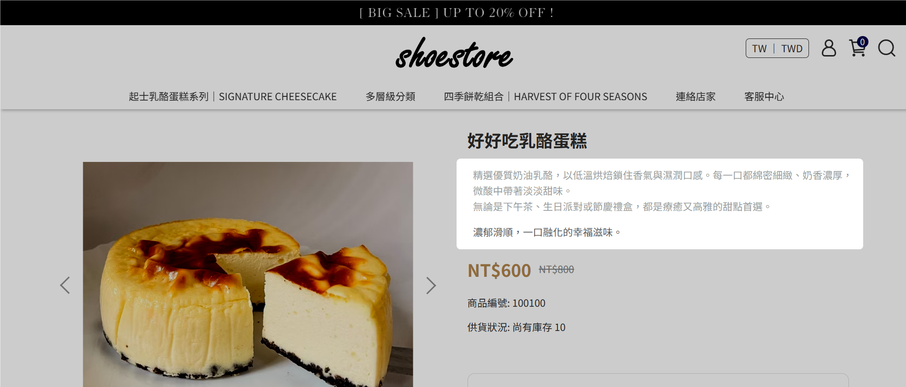
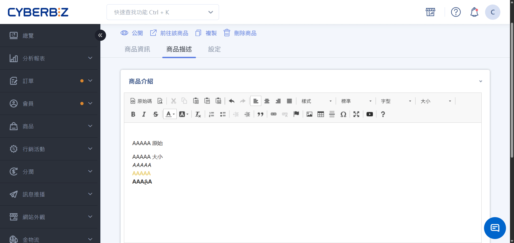
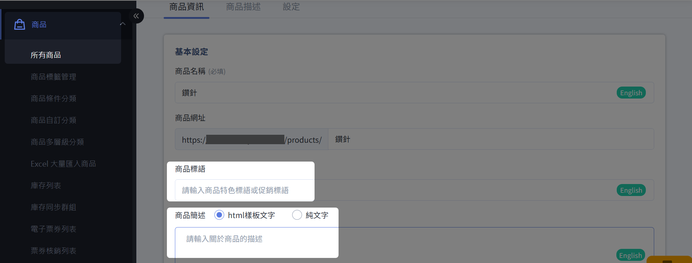
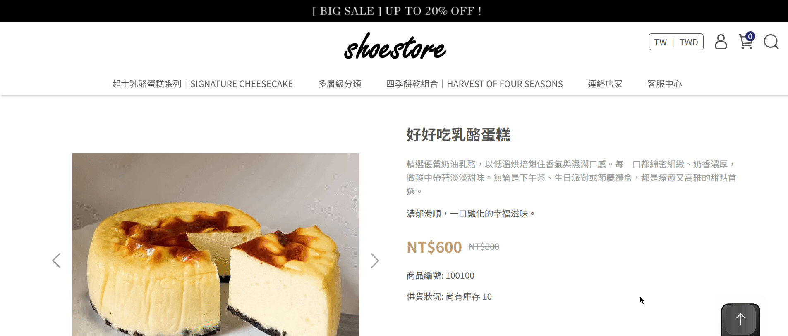
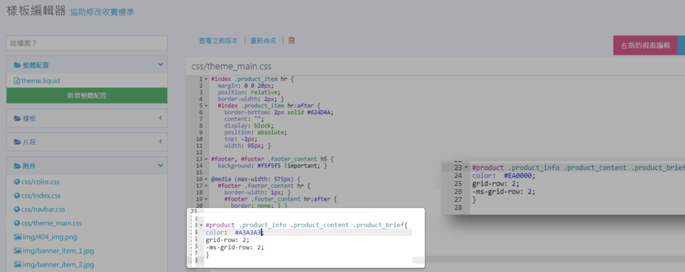

{ title="商品簡述與標語" .hero-page }

## 商品簡述與商品標語說明

商品簡述 與 商品標語 是顯示於商品頁面的文字欄位，用於補充商品特色與重點資訊。商家可以客製化商品頁中 **「商品標語」** 與 **「商品簡述」** 的文字呈現，包含修改文字顏色、字型、大小及分行等。

??? info-clean "前台顯示位置"

    - 商品簡述：精選優質奶油乳酪，以低溫烘焙鎖住香氣與濕潤囗感。每一囗都綿密細緻、奶香濃厚,微酸中帶著淡淡甜味。無論是下午茶、生日派對或節慶禮，都是療癒又高雅的甜點首選。
    - 商品標語：濃郁滑順，一囗融化的幸福滋味。

    !!! quote ""
      { title="商品簡述與標語前台顯示位置" }

## 使用前提與限制

- **版型限制**：**拖拉版型** 可能不支援部分程式碼編輯，請以您的後台實際開放功能為主。
- **責任說明**：CYBERBIZ 提供開放的程式碼編輯權限，但 **不提供現有文件外的修改指導、語法教學或代碼撰寫服務**，建議委託專業工程師處理。
- **恢復機制**：若修改後導致版面跑版或異常，可利用樣版編輯器內的「**查看之前版本**」功能[回溯至先前版本](../../website-appearance/code-customization/restore-code-theme-editor.md#操作步驟)。
- **常見跑版原因**：通常是因為 HTML 語法標籤未正確閉合（例如缺少結束標籤 ``），這會導致頁面呈現受到影響。
- **前台呈現順序**：在部分版型中，前台顯示的「商品標語」與「商品簡述」位置可能會與後台欄位順序相反。

## 操作步驟

商家可以透過以下兩種方式客製商品簡述與商品標語的文字樣式，維持品牌一致性並強化行銷效果：

- [個別修改文字樣式](#個別修改文字樣式)：修改個別商品的文案樣式
- [全站調整文字呈現](#全站調整文字呈現)：修改全站 CSS 設定檔案

!!! info "商品語法設定優先規則"
    商品標語與商品簡述欄位的語法設定 **優先** 於樣板編輯器的全站樣式。若同時修改樣板編輯器與個別商品，系統將以個別商品設定為準。

### 個別修改文字樣式

由於後台的「商品標語」與「商品簡述」欄位本身不支援格式編輯器，您可以利用「商品介紹」的編輯器作為工具來產生程式碼。

1. **進入編輯頁面**：前往「商品」>「所有商品」> 點選欲編輯的商品。
2. **產生程式碼**：
    - 在「商品描述」的編輯器中，先將格式由「標準」改為「**標準(DIV)**」。
    - 輸入您想要的文字內容，並設定好顏色、大小、粗體等樣式。
    - 點擊編輯器左上方的「**原始碼**」按鈕。

    { title="產生HTML程式碼" }

3. **套用樣式**：
    - 將出現的 HTML 程式碼複製起來，並隨即刪除編輯器內的內容（以保持商品描述乾淨）。
    - 將複製的程式碼貼入上方的「**商品標語**」或「**商品簡述**」欄位中。
    - 按下「儲存」後即可在商品頁看到修改效果。

    { title="商品標語與簡述欄位" }

    !!! info "此欄位內的語法編輯權限 **優先於** 樣版編輯器，即個別設定會覆蓋全站設定。"

---

### 全站調整文字呈現

!!! warning "程式碼修改注意事項"

	- 拖拉版型不支援部分程式碼編輯功能，請以後台開放功能為主，避免操作無效或錯誤。
	- 公開版型程式碼可自行調整，但 **務必先備份原始檔案**。樣板編輯器提供查看之前版本功能，可[回溯至先前版本](../../website-appearance/code-customization/restore-code-theme-editor.md)。
	- 若需進一步客製化修改，請委託具備經驗的工程師處理，確保系統穩定性。

若您希望一次更改全站所有商品的標語或簡述顏色、大小，可透過 CSS 語法進行修改。

1. **查找樣式代碼**：
    - 在官網商品頁面，點選瀏覽器右上角「工具」>「開發人員工具」。或按 ++ctrl+shift+c++（Windows/Linux）或 ++cmd+option+c++（Mac）直接開啟開發人員工具並啟用元素選取模式。  
    - 利用箭頭工具選取您想修改的文字位置，並在右下角 **Styles** 區域查找並複製對應的 CSS 程式碼。

    { title="開發人員工具檢視CSS" }

2. **進入後台修改**：
    - 前往「網站外觀」>「套版主題管理」>「選擇操作：CSS/HTML編輯器」。
    - 點開檔案 **`css/theme_main.css`**。
    - 將複製的代碼貼到檔案最後面，並修改 `color:` 後方的色碼或 `font-size:` 的數值。您可參考 [色碼表 :material-open-in-new:](https://www.ifreesite.com/color/) 選擇合適顏色代碼。  

    { title="CSS 編輯器 theme_main.css" }

3. **儲存與預覽**：儲存後，全站所有商品的該位置文字都會同步變更顏色或大小。

!!! tip "恢復機制"
    若不滿意修改結果，可[回溯至先前版本](../../website-appearance/code-customization/restore-code-theme-editor.md)。

## 常見問題
??? quote "為什麼我的群組頁面出現跑版？"
    這通常是 HTML 語法編輯錯誤所導致，例如標籤未正確閉合，如下文的錯誤範例。

    - :material-check: **正確寫法**： `浙江風味，甘鹹好下飯`
    - :material-close: **錯誤範例**： `浙江風味，甘鹹好下飯>`
    - :material-fire: **建議**：HTML 相關問題仍委託專業人士處理，CYBERBIZ 無法提供個別協助。

    { title="常見問題跑版" .screenshot }

??? quote "CYBERBIZ 是否提供個別程式碼修改協助？"
    CYBERBIZ 僅提供現有文件內修改資訊，無法提供文件外程式碼修改協助。若需進一步修改，可透過 [APP MARKET](https://appmarket.cyberbiz.io/category/store_design) 聯繫外部設計廠商。
