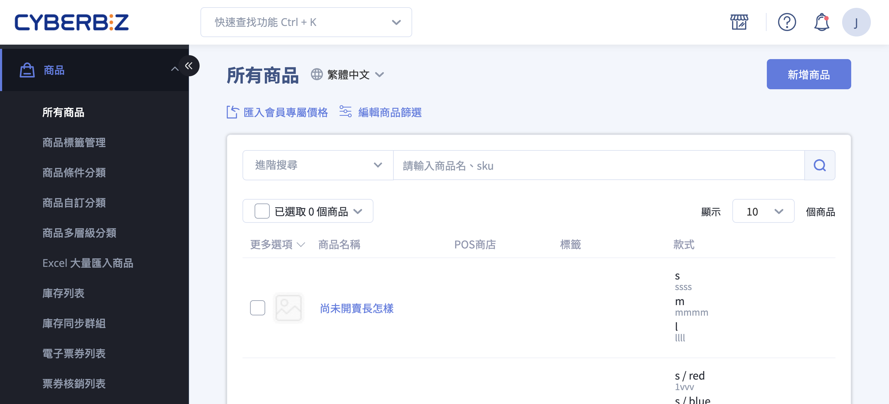{ title="商品管理介面總覽" .hero-page }

## 商品管理介面說明

**商品管理介面** 主要位於後台路徑： **「商品」>「所有商品」**。該介面整合了商品上架、快速篩選、批次修改及跨通路管理等核心功能，協助商家高效維護商店品項。

## 介面功能介紹

在「所有商品」列表中，商家可以對商品執行以下基本操作：

*   [**新增商品**](#新增商品)：點選右上角按鈕進行單筆或批次上架。
*   [**快速搜尋**](#關鍵字搜尋)與[**筆數調整**](#商品列表)：可透過關鍵字查找商品，或調整每頁顯示的商品筆數。
*   [**狀態切換與預覽**](#快捷按鈕)：點選「眼睛圖示」可直接切換公開或隱藏商品，或點擊連結快速前往前台預覽商品頁。
*   [**刪除商品**](#快捷按鈕)：針對不再販售的品項進行移除。

## 篩選器使用邏輯

當商品數量龐大時，建議善用篩選器以提升編輯效率：

*   **多重條件篩選**：可選擇商品【類型】、【廠商】、【標籤】、【上架狀態】、【公開狀態】及【商家】進行精確定位。
*   **橫向篩選 (OR)**：同一欄位勾選多個條件時，系統會篩選出符合「任一條件」[^3]的商品。
*   **直向篩選 (AND)**：跨欄位設定條件時，系統僅會顯示「完全符合所有條件」[^4]的商品。
*   **上架狀態辨識**：系統會以標籤標示「已上架」、「已下架」（過期）或「未上架」（時間未到），滑鼠懸停於標籤上可查看具體日期。

    { title="上架狀態辨識" }

=== ":lucide-search: 關鍵字搜尋"
	輸入 商品名稱 或 SKU 快速搜尋商品。
	
	1. 登入 CYBERBIZ 管理後台，前往 **商品 > 所有商品**。
	2. 在頁面上方的搜尋欄位中，輸入欲查詢的 **商品名稱** 或 **SKU**。
	3. 按下 ++enter++ 鍵或點擊 **搜尋圖示** :material-magnify:，系統將顯示符合條件的商品列表。
	
	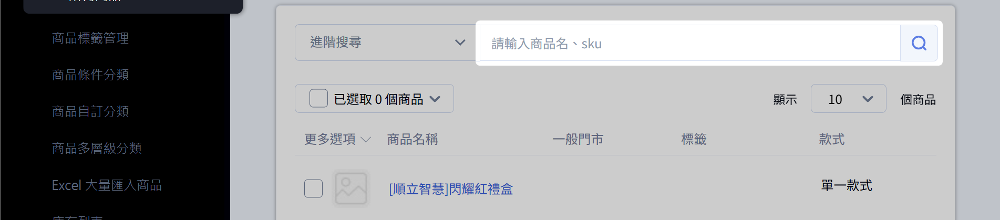{ title="商品搜尋列" }

=== ":lucide-funnel: 進階條件篩選"
	使用篩選器套用多項特定條件，以精確定位目標商品。
	
	1. 登入 CYBERBIZ 管理後台，前往 **商品 > 所有商品**。
	2. 點擊搜尋欄位旁的 **進階搜尋**，展開下拉選單。
	3. 點選一個或多個 **篩選群組欄位**[^2]，如 **商品類型**、 **商品廠商**、 **商品標籤**。
	4. 選擇各欄位的篩選條件。
	5. 點擊 **搜尋**，系統將顯示符合所有條件的商品列表。
	
	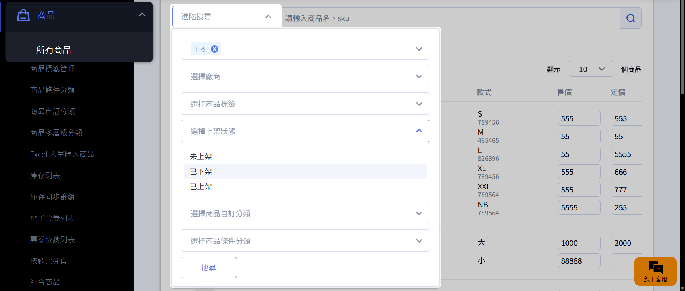{ title="進階條件篩選" }
	
=== ":lucide-blend: 組合搜尋條件"
	結合 關鍵字搜尋 與 進階條件篩選，設定多重篩選邏輯，鎖定符合複雜條件的特定商品。
	
	1. 設定[進階篩選條件](#進階條件篩選)： 點擊搜尋欄位旁的 **進階搜尋**，選擇商品屬性或分類，點擊 **搜尋** 以套用篩選條件。
	2. [輸入關鍵字](#關鍵字搜尋)： 在搜尋欄位中輸入商品名稱或 SKU，按下 ++enter++ 鍵或點擊 **搜尋圖示** :material-magnify: 以進一步限縮搜尋結果。
	
    > :lucide-flame: **批次操作特定商品**  
	篩選出商品清單後，先[大量選取](#選取大量商品)再[選擇操作項目](#批次操作)，即可對特定商品進行批次操作。
	
	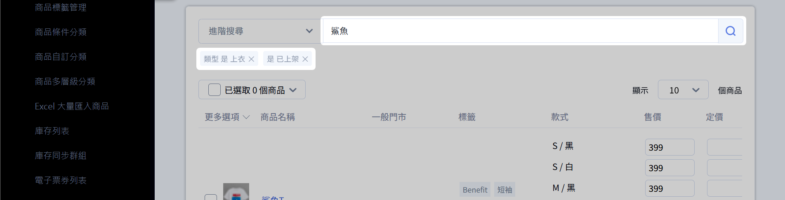{ title="組合搜尋條件" }

## 批次作業功能

透過勾選列表左側的核取方塊，商家可以進行 **批次操作**，支援項目包括：

*   **狀態與權限**：批次公開、隱藏、刪除、開啟或[排除搜尋](#商品搜尋與能見度管理)功能。
*   **匯出資料**：[匯出商品總表](../bulk-operations/batch-update-product-descriptions-shipping.md#匯出商品-excel-表格)或[會員專屬價格表](../pricing/setup-vip-member-pricing.md#步驟一匯出會員專屬價格)。
*   **通路管理**：將官網商品[大量複製至 POS 門市商店](../bulk-operations/copy-products-to-pos-stores.md)。

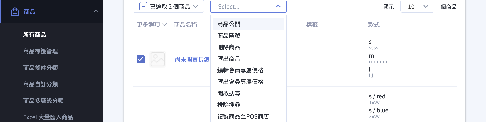{ title="批次作業功能" }

### 選取大量商品

=== "當頁所有商品"

    1. 登入 CYBERBIZ 管理後台，前往 **商品 > 所有商品**。
    2. 點擊 **Select** 操作選單中的 :lucide-square: ，可一次選取當頁顯示的所有商品 。

    !!! tip "點擊 **顯示 __ 個商品**，可以調整商品列表每頁顯示的商品數量。"

	{ title="選取當頁商品" }

=== "全館商品"

	1. 清除所有搜尋跟篩選條件。
	2. 點擊 **已選取__個商品**，選擇 **選取全部商品**。
	
	{ title="選取全館商品" }

=== "符合條件商品"

	1. [進行商品檢索](#篩選器使用邏輯)，產生篩選後的商品列表清單。
	2. 點擊 **已選取__個商品**，選擇 **選取全部商品**。
	
	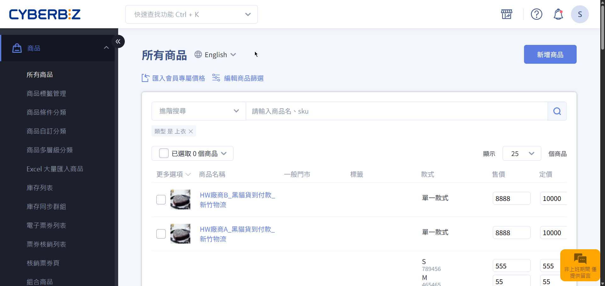{ title="選取篩選結果" }

---

### 批次操作

1. [選取多個商品後](#選取大量商品)。
2. 點擊 **Select** 操作選單 ，選擇批次操作選項[^1]。  

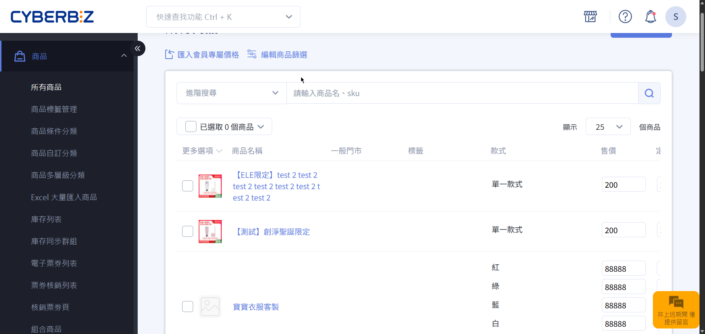{ title="批次操作流程" }

!!! warning "注意事項"
    當勾選「選取全部商品」時，系統為了避免誤操作，會限制部分批次功能，僅保留匯出及複製至 POS 商店等操作。

- :lucide-file-spreadsheet: [__批次修改商品資訊__](../bulk-operations/Excel 大量匯入商品#更新大量商品){ title="批次修改商品資訊" }
- :lucide-layers: [__批次操作多款式商品__](create-update-products.md#operate-product-create-variants){ title="新增與更新商品" }

## 商品搜尋與能見度管理

在管理介面中，商家可以個別設定商品的「商品搜尋功能」：

=== ":lucide-toggle-left: 單筆操作"

    1. 登入 CYBERBIZ 管理後台，前往 **商品 > 所有商品**。
    2. 在商品列表中找到 **商品搜尋** 欄位。若未顯示，請拖曳下方滾動條。
    3. 切換 **商品搜尋** 開關：
        - 開啟 (ON)：商品可被搜尋。
        - 關閉 (OFF)：商品將被隱藏。

    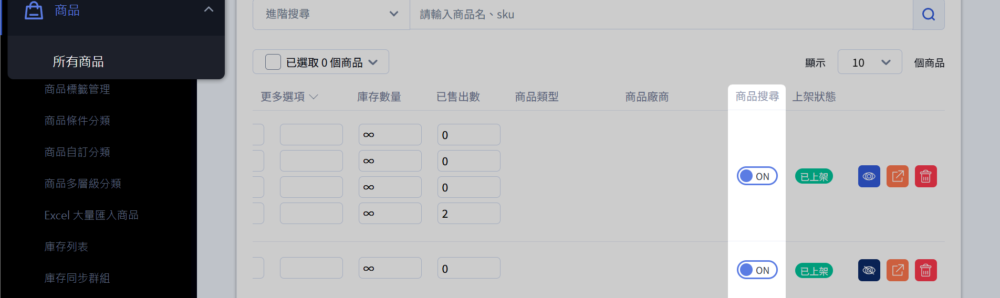{ title="搜尋開關" }

=== ":lucide-square-check: 批次操作"

    1. 登入 CYBERBIZ 管理後台，前往 **商品 > 所有商品**。
    2. 勾選多個欲排除搜尋的商品。
    3. 點擊 **Select** 下拉操作選單 ，選擇 **排除搜尋**。  

    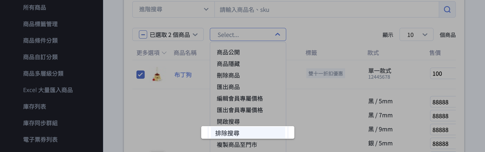{ title="批次排除商品搜尋" }

??? info "排除搜尋的效果"

    關閉此功能後，系統將隱藏該商品於以下路徑：

    - **站內搜尋**：無法透過商店搜尋框找到商品。瞭解 [如何設定站內搜尋](../discoverability/setup-site-search.md){ title="設定站內搜尋功能" }
    - **系統預設清單**：商品不會出現在前台「所有商品 (/collections/all)」頁面。
    - **外部搜尋引擎 (如 Google)**：系統會自動發送 **不索引指令** (`noindex`)，告知搜尋引擎不要收錄此商品頁面。

    **注意**： Google 移除搜尋結果的時間取決於其爬蟲更新頻率（通常需數天至數週），變更設定後搜尋結果不會立即消失。 

    !!! tip "保留購買途徑"
        本功能僅排除「搜尋發現」，不影響透過 商品連結 進行存取。若顧客持有該商品的直接網址（例如透過社群導購、EDM 或 LINE 私訊發送），仍可正常進入頁面並下單購買。此設定非常適合用於製作「隱藏版優惠」或「特定會員專屬商品」。

- :lucide-search-check: [__設定商品搜尋可見性__](../discoverability/product-search-visibility.md){ title="設定商品搜尋可見性" }

## 跨通路同步管理

若商家有串接其他電商平台，管理介面會顯示相關關聯狀態：

*   **蝦皮同步**：可查看「關聯平台」欄位的蝦皮圖示是否亮起，確認官網與蝦皮賣場的庫存是否已建立關聯。
*   **標籤排除**：若有品項不欲上傳至 Google Merchant Center 或 Facebook 商店，可在商品管理頁面的標籤欄位輸入「贈品」或「排除product feed」。

---

## 新增商品

建立單一商品、設定相關資訊並上架商品。

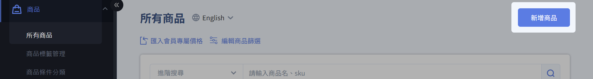{ title="新增商品按鈕" } 

- :lucide-package-plus: [__新增與更新商品__](create-update-products.md){ title="新增與更新商品" }
- :lucide-upload: [__新增大量商品__](../bulk-operations/excel-import-products.md){ title="新增大量商品" }

## 商品列表

透過以下功能快速搜尋、篩選與管理商品列表。

- `請輸入商品名、SKU`：使用關鍵字快速搜尋商品
- `進階搜尋`：篩選商品
- `已選取_個商品`：選擇商品進行批量作業
- `顯示_個商品`：調整每頁顯示商品筆數

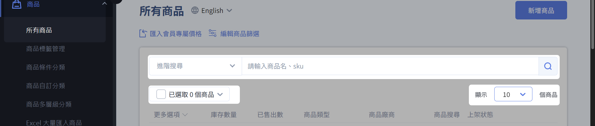{ title="商品列表" }

## 快捷按鈕

- :lucide-eye: 設定商品是否公開：:lucide-eye-off: 未公開；:lucide-eye: 公開。
- :lucide-external-link: 快速前往前台商品頁
- :lucide-trash-2: 刪除商品

{ title="快捷按鈕" }

## 庫存列表

檢視已[開啟管理庫存功能](create-update-products.md#operate-product-create-inventory){ title="新增與更新商品" }以及庫存設定有限數量的商品。

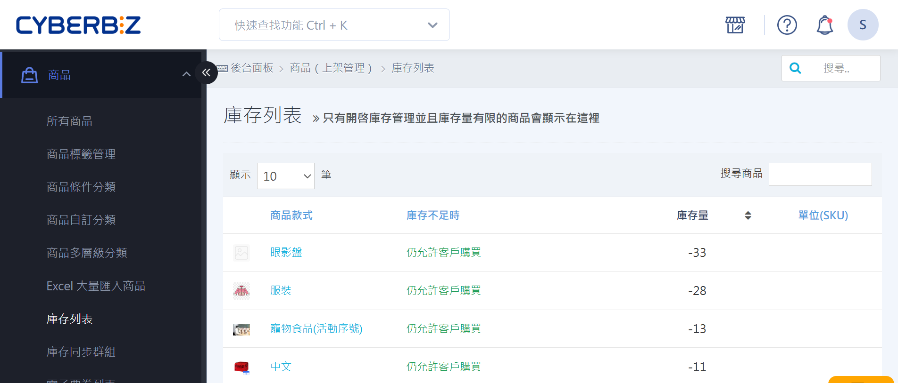{ title="庫存列表" }

- :lucide-bell: [__庫存水位通知__](create-update-products.md#operate-product-create-inventory){ title="新增與更新商品" }

## 常見問題
??? quote "為什麼搜尋不到商品？"
	- 確認關鍵字或 SKU 正確
	- 檢查篩選條件是否過多
	- 商品是否已刪除或不可見

??? quote "搜尋結果可以匯出嗎？"
	目前不支援直接匯出，有商品匯出需求請使用 [Excel 匯出功能](../bulk-operations/batch-update-product-descriptions-shipping.md#匯出商品-excel-表格)。

??? quote "可以儲存篩選條件嗎？"
	目前系統不支援儲存。

[^1]: 實際可使用的批次操作選項會因方案而異。
[^2]: 實際可使用的篩選群組欄位因方案或後台設定而異。
[^3]: 例如篩選「衣服」和「鞋子」類型，系統會顯示屬於「衣服」或「鞋子」任一類型的商品。
[^4]: 例如篩選「衣服」類型且「已上架」狀態，系統只顯示類型為「衣服」且狀態為「已上架」的商品。
