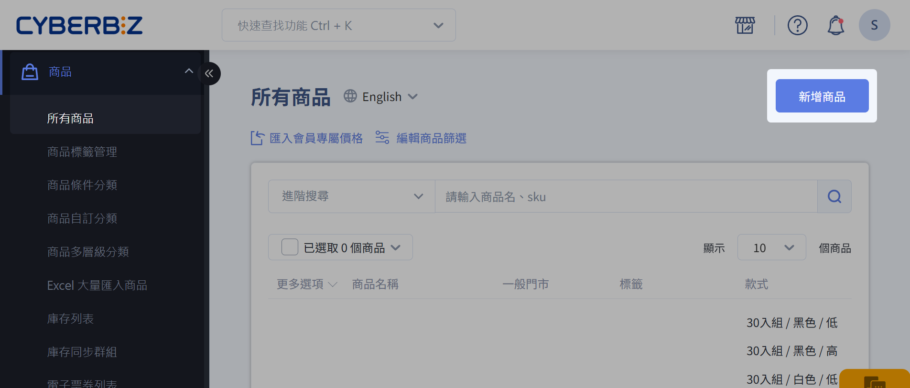
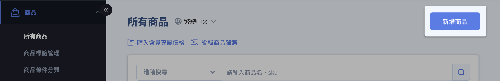
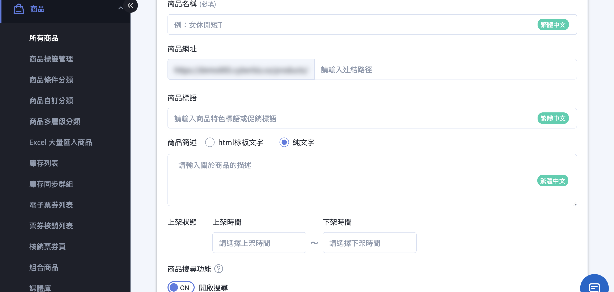
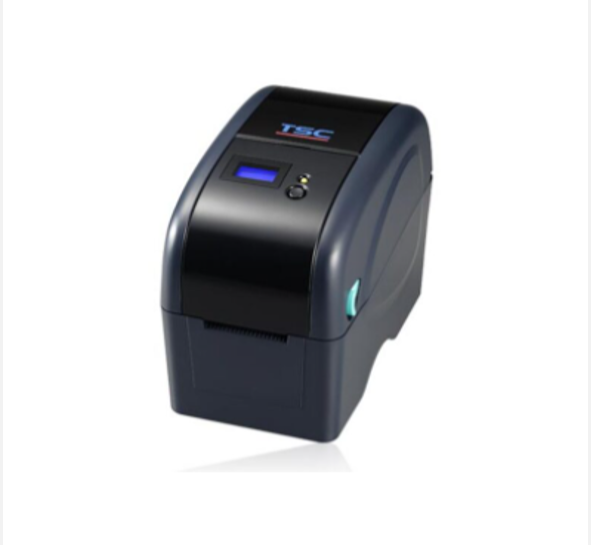
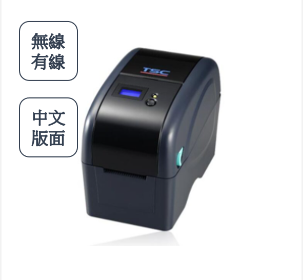
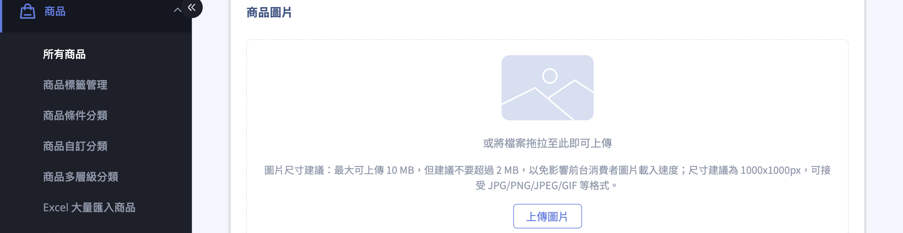

建立並設定單一商品的基本資訊、圖片、影片與款式，上架商品。
{ .subtitle }

{ title="新增商品： 商品 > 所有商品 > 新增商品" .hero-page }

## 新增與更新商品說明 { #overview }

在 CYBERBIZ 系統中，新增與更新商品可以透過「[單筆操作](#add-single)」或「Excel 大量匯入」兩種方式進行。

??? info "部分欄位需先開通" 
    以下欄位依方案 / 加值功能顯示，一般商店不一定全部具備：

    - **售價、庫存：** 所有方案內建，無需開通。
    - **商品影片：** PLUS版 / 企業，且需 **拖拉版型** 主題。
    - **材積（CM）：** 加值功能，開通後才會出現於款式。
    - **多國語系欄位：** 需開通 **前台多國功能**。
    - **Amazon 物流（FBA）：** 開通後出貨方式可選 Amazon 物流，SKU 須與 Amazon 倉庫一致。

## 單筆新增商品 { #add-single }

適用於少量商品上架，可精細設定每項資訊。

1. 登入管理後台，前往 「商品」>「所有商品」>「新增商品」。
2. 依序設定相關商品資訊：[基本設定](#basic-settings)、[商品圖片](#product-images)、[商品影片](#product-video)、[款式](#variants)、[庫存管理](#inventory)。
3. 點擊 **儲存** 以套用變更。

---

### 基本設定 { #basic-settings }

| 欄位名稱 | 設定說明與規範 | 預設值 / 注意事項 |
| :--- | :--- | :--- |
| **商品名稱** | 填寫商品對外顯示的標題。 | 請避免使用特殊符號（如 `|`、`"`、`'`），以確保資料正常存取。 |
| **商品網址** | 定義商品頁面的最後一段路徑（Slug）。  建議使用全英文小寫，並以連字號 `-` 分隔單字。 | 若未填寫，系統將預設使用「商品名稱」作為網址後綴。 |
| **商品標語/簡述** | 輸入吸引消費者的行銷短語。  支援純文字，或[切換 HTML 模式進行進階排版](編輯商品簡述與商品標語.md){ data-preview }。 | — |
| **上架狀態** | 設定商品的有效銷售時間區間（排程設定）。 | 若未填寫則為「永久上架」。 **注意：** 若當前時間不在區間內，前台將顯示 404 頁面。 |
| **搜尋功能** | 決定商品是否可被站內搜尋或搜尋引擎（如 Google）找到。 | 關閉後，商品僅能透過 **商品連結** 直接進入。 |

---

### 商品圖片 { #product-images }

點擊 **上傳圖片** 或拖拉圖片進行上傳。上傳商品圖片時，請參考以下技術規格：

| 項目 | 規格 | 說明 |
| :--- | :--- | :--- |
| 尺寸 | 1000 × 1000 px | 正方形比例為佳 |
| 檔案大小 | 最大 10 MB，建議不超過 2 MB | 過大圖片會影響載入速度 |
| 支援格式 | JPG / PNG / JPEG / GIF | 建議使用 JPG 或 PNG |

!!! info "跨通路投放提醒：Google 購物廣告（GMC）"
    若您計畫同步商品至 Google 進行投放，圖片需符合 [Google 圖片規範 
:lucide-external-link:](https://support.google.com/merchants/answer/6324350#Image_guidelines)。不符合規範的圖片可能導致商品審核失敗。

    ??? example "查看 Google 圖片禁忌與範例"

        | 規範 | 說明 |
        | :--- | :--- |
        | 不可包含價格資訊 | 避免在圖片中標示售價或折扣金額 |
        | 不可包含促銷文字 | 如「免運」、「特價」、「限時優惠」等 |
        | 不可添加浮水印或 Logo | 商品圖片不得覆蓋品牌標識 |
        | 需清晰呈現商品主體 | 背景建議使用白色或純色，商品占比建議 85% 以上 |

        

        :lucide-check: 符合規範
        { .screenshot }

        :lucide-x: 不符合規範
        { .screenshot }

        

---

### 商品影片 { #product-video }

[:lucide-tag:{ title="適用方案" }](conventions.md#適用方案) | PLUS / 企業  
[:lucide-bolt:{ title="適用功能" }](conventions.md#適用功能) | 拖拉版型

- 解析度：最高支援 1280 × 1280 像素。
- 建議比例：9:16，此比例最佳化於 Facebook 廣告版位。
- 影片格式：僅支援 MP4 格式。
- 影片長度：最長 60 秒。
- 檔案大小：最大 30 MB，載入速度會受使用者網路影響，建議在符合規格下盡量壓縮檔案。
- 音訊支援：目前不支援音訊輸出，上傳影片將以靜音模式播放。

!!! info "更多商品影片相關設定，請參閱 [設定商品影片](設定商品影片.md){ data-preview }。"

---

### 款式管理 { #variants } 

要設定售價與庫存，需先建立 **款式**：

- **單一款式：** 設定售價（實際銷售額）、定價（建議售價）、成本價（內部分析用，前台不可見）及商品編號（SKU）。
- **多款式商品：** 點擊 **「編輯商品規格」**，依序加入顏色、尺寸等規格，每組規格至少需有一個項目（最多 3 種規格）。
- **同步套用：** 多個款式價格或庫存相同時，於款式區上方選擇 **編輯價格 / 編輯庫存 / 編輯材積 重量 / 編輯全部**，勾選款式輸入數值後點 **「套用」** 即可批次填入。

!!! note "跨境 / 海外站別"
    - **規格用英文：** 北美站等英文站別，規格名稱與項目建議以英文命名。
    - **重量與材積：** 海外物流多以重量或材積計費，請於款式中確實填寫（材積為加值功能，開通後才會出現「材積（CM）」欄位）。
    - **報關資訊：** 報關所需資料（如品名、原產國等）是在 **出貨階段** 依所選跨境物流商填寫，**不在商品頁設定**。

---

### 管理庫存 { #inventory }

開啟功能後，可設定庫存量與「安全庫存水位」。當庫存歸零時，可選擇「停止銷售」或「繼續銷售（開放預購）」。

---

### 多國語系：逐語言填寫商品內容 { #multilang }

若您的商店已開通 **前台多國功能**，商品編輯頁標題右側會出現 **語言切換**（語言圖示與下拉選單），可針對每一種語言分別輸入文字內容。

請留意 **哪些欄位需逐語言翻譯、哪些欄位是所有語言共用** 的：

- **需逐語言翻譯：** 商品名稱、商品標語、商品簡述、商品規格、規格項目，以及商品描述頁的內容（於 [編輯商品描述與商品設定](編輯商品描述與商品設定.md){ data-preview } 另述）。
- **所有語言共用：** 價格、款式、SKU、庫存、商品圖片、分類與標籤。這些只需設定一次，切換語言不會改變。

操作方式：

1. 先選定一個 **優先語言**，依一般流程填妥商品內容並 **儲存**。
2. 從標題右側下拉切換語言。切換前若有未儲存的變更，系統會跳出提示「編輯多國語言前，請先儲存變更中的內容」，請先儲存。
3. 切換後，可翻譯欄位旁會顯示目前編輯的語言標籤，於各欄位填入該語言的翻譯文字。
4. 點擊 **儲存**，再重複切換其他語言。

## 更新既有商品 { #update-product }

若需修改已存在的商品資訊，可透過以下方式：

=== ":lucide-square-pen: 單筆修改"

    在商品列表點擊特定商品，進入編輯頁面後修改內容，完成後務必點擊 **「儲存」**。多國語系商店請留意切換到正確的語系再修改。

=== ":lucide-import: 批次修改（Excel）"

    1. 進入「商品」>「所有商品」，勾選欲修改的品項，點選 **「匯出商品」**。
    2. 開啟下載的 Excel，在對應欄位輸入欲修改的資訊（如描述、通路、溫層或配送方式）。
    3. 進入 **「Excel 大量匯入商品」** 頁面，上傳編輯後的檔案。詳見 [Excel 大量匯入商品](../bulk-operations/Excel 大量匯入商品.md){ data-preview }。

=== ":lucide-receipt-text: 訂單內商品編輯"

    在「所有訂單」中，可針對單筆訂單明細頁執行 **「編輯訂單」**，增減商品數量或新增「已下架 / 不公開」的商品。

## Excel 大量操作之關鍵差異 { #excel-diff }

透過 Excel 進行批次作業時，系統判斷「新增」或「更新」的邏輯在於 **隱藏欄位**：

- **新增商品：** 使用後台提供的「下載 Excel 範本」，其隱藏的 **A 欄（商品 ID）與 B 欄（款式 ID）為空值**。上傳後系統會判定為建立全新商品。
- **更新商品：** 必須先從「商品列表」**匯出既有商品**，匯出的表格中 **A、B 欄會帶有系統產生的 ID 數值**。上傳此檔案後，系統會比對 ID 並覆蓋（更新）原有商品內容。

完整說明請見 [Excel 大量匯入商品](../bulk-operations/Excel 大量匯入商品.md){ data-preview }。

## 重要注意事項與提醒 { #notes }

- **SKU 碼重要性：** 若商家使用串倉服務、POS 系統或 Amazon FBA，**SKU 碼為必填且須具備唯一性**；使用 Amazon FBA 出貨時，SKU 須與 Amazon 倉庫一致才能順利拋單。
- **多國語系：** 若網站開啟多國語系功能，上架時需切換語系標籤分別填寫（名稱、簡述、規格等欄位均支援多語編輯），詳見 [多國語系：逐語言填寫商品內容](#multilang)。
- **排除同步：** 若商品不欲顯示於 Google、LINE 導購或 Facebook 商店，可在標籤欄位輸入「**贈品**」或「**排除 product feed**」。
- **匯入狀態：** 檔案上傳後會進入背景排程，請等候系統發送的「資料匯入完成」電子郵件通知。若失敗，信件中會提示失敗原因。

## 後續步驟 { #next-steps }

- :lucide-import:{ .lg }   
  [__新增大量商品__](../bulk-operations/Excel 大量匯入商品.md){ data-preview }   
  透過 Excel 批量匯入商品，批次上架商品。
- :lucide-boxes:{ .lg }   
  [__新增組合商品__](新增與設定組合商品.md#新增組合商品)  
  建立指定或任選組合商品。
- :lucide-edit-3:{ .lg }   
  [__編輯商品描述與設定__](編輯商品描述與商品設定.md){ data-preview }   
  編輯商品描述及設定頁籤資訊。
- :lucide-bell:{ .lg }   
  [__商品到貨通知__](../engagement/設定商品到貨通知.md){ data-preview }  
  設定到貨通知，通知顧客追蹤商品已補貨。
- :lucide-check-square:{ .lg }   
  [__批次修改商品資訊__](../bulk-operations/批次修改商品描述與配送設定.md){ data-preview }  
  批次更新多筆商品的資訊與設定。
- :lucide-search-x:{ .lg }   
  [__設定商品排除搜尋__](../discoverability/設定商品搜尋可見性.md){ data-preview }   
  設定商品不在特定搜尋結果中顯示。

## 常見問題 { #faq }

??? quote "商品名稱可以使用特殊符號或 HTML 嗎？"
    商品名稱 **不可使用特殊符號**（如 `|` 或 `"`），也 **不可使用 HTML 標籤**。請使用純文字設定商品名稱。

??? quote "多款式商品設定時，有規格項目的數量限制嗎？"
    單一商品最多可設定 3 種規格，每組規格至少需有 1 個項目。例如設定「顏色」規格，則至少需新增一種顏色選項。

??? quote "開了多國語系，為什麼改了價格，其他語言的價格沒跟著變？"
    這是正常的。價格、款式、庫存、圖片屬於 **所有語言共用** 的欄位，只需設定一次；需要逐語言分別填寫的只有文字類欄位（名稱、標語、簡述、規格、描述）。

??? quote "找不到語言切換的下拉選單？"
    語言切換僅在開通 **前台多國功能** 後才會出現在商品編輯頁標題右側。若沒有看到，代表店家尚未開通此功能，請聯繫 CYBERBIZ 客服。

---

建立並設定單一商品的基本資訊、圖片、影片與款式，上架商品。
{ .subtitle }

{ title="新增商品： 商品 > 所有商品 > 新增商品" .hero-page }

## 新增與更新商品說明

在 CYBERBIZ 系統中，新增與更新商品可以透過「[單筆操作](#單筆新增商品)」或「Excel 大量匯入」兩種方式進行。

## 單筆新增商品

適用於少量商品上架，可精細設定每項資訊。

1. 登入 CYBERBIZ 管理後台，點選 「商品」>「所有商品」>「新增商品」。
2. 依序設定相關商品資訊：[基本設定](#基本設定){ data-preview }、[商品圖片](#商品圖片){ data-preview }、[商品影片](#商品影片){ data-preview }、[款式](#款式管理){ data-preview }、[庫存管理](#管理庫存){ data-preview }。
3. 點擊 **儲存** 以套用變更。

---

### 基本設定

| 欄位名稱 | 設定說明與規範 | 預設值 / 注意事項 |
| :--- | :--- | :--- |
| **商品名稱** | 填寫商品對外顯示的標題。 | 請避免使用特殊符號（如 `|`、`"`、`'`），以確保資料庫正常存取。 |
| **商品網址** | 定義商品頁面的最後一段路徑（Slug）。  建議使用全英文小寫，並以連字號 `-` 分隔單字。 | 若未填寫，系統將預設使用「商品名稱」作為網址後綴。 |
| **商品標語/簡述** | 輸入吸引消費者的行銷短語。  支援純文字，或[切換 HTML 模式進行進階排版](編輯商品簡述與商品標語.md){ data-preview }。 | — |
| **上架狀態** | 設定商品的有效銷售時間區間（排程設定）。 | 若未填寫則為「永久上架」。 **注意：** 若當前時間不在區間內，前台將顯示 404 頁面。 |
| **搜尋功能** | 決定商品是否可被站內搜尋或搜尋引擎（如 Google）找到。 | 關閉後，商品僅能透過 [**商品連結**](#保留特定存取途徑) 直接進入。 |

<!--
*   **商品名稱**：填寫商品標題。請避免使用特殊符號（如 `|`、`"`、`'`），以確保資料庫能正確儲存。
*   **商品網址**：定義商品頁面的最後一段網址結構。建議使用全英文與小寫字母，並以連字號 `-` 分隔單字[^*]。
    - **預設值**：若未設定，系統將預設使用「商品名稱」作為網址後綴。
* **商品標語/商品簡述**：輸入吸引消費者的行銷短語。支援純文字輸入，或切換至 HTML 模式進行進階排版。[進階設定說明](編輯商品簡述與商品標語.md){ data-preview }
*   **上架狀態（排程設定）**：設定商品的有效銷售區間。若目前時間不在設定的區間內，該頁面將會顯示 404 找不到頁面。
    - **預設值**：若未設定，則為「永久上架」。
*   **搜尋功能**：決定商品是否可被站內搜尋或 Google 搜尋引擎找到。關閉後，商品僅能透過商品頁面的直接連結進入。
-->

[^*]: 英文網址在搜尋引擎 (SEO) 權重較高，且能避免在數據分析報表中出現語意不明的亂碼。

---

### 商品圖片

點擊 **上傳圖片** 或拖拉圖片進行上傳。上傳商品圖片時，請參考以下技術規格：

| 項目 | 規格 | 說明 |
| :--- | :--- | :--- |
| 尺寸 | 1000 × 1000 px | 正方形比例為佳 |
| 檔案大小 | 最大 10 MB，建議不超過 2 MB | 過大圖片會影響載入速度 |
| 支援格式 | JPG / PNG / JPEG / GIF | 建議使用 JPG 或 PNG |

!!! info "跨通路投放提醒：Google 購物廣告 (GMC)"
    若您計畫同步商品至 Google 進行投放，圖片需符合 [Google 圖片規範 :lucide-external-link:](https://support.google.com/merchants/answer/6324350#Image_guidelines)。不符合規範的圖片可能導致商品審核失敗。

    ??? example "查看 Google 圖片禁忌與範例"

        | 規範 | 說明 |
        | :--- | :--- |
        | 不可包含價格資訊 | 避免在圖片中標示售價或折扣金額 |
        | 不可包含促銷文字 | 如「免運」、「特價」、「限時優惠」等 |
        | 不可添加浮水印或 Logo | 商品圖片不得覆蓋品牌標識 |
        | 需清晰呈現商品主體 | 背景建議使用白色或純色，商品占比建議 85% 以上 |

        

        :lucide-check: 符合規範
        { .screenshot }

        :lucide-x: 不符合規範
        { .screenshot }

        

    

---

### 商品影片

[:lucide-tag:{ title="適用方案" }](conventions.md#適用方案) | PLUS / 企業  
[:lucide-bolt:{ title="適用功能" }](conventions.md#適用功能) | 拖拉版型

- 解析度：最高支援 1280 × 1280 像素。
- 建議比例：9:16，此比例最佳化於 Facebook 廣告版位。
- 影片格式：僅支援 MP4 格式。
- 影片長度：最長 60 秒。
- 檔案大小：最大 30 MB，載入速度會受使用者網路影響，建議在符合規格下盡量壓縮檔案。
- 音訊支援：目前不支援音訊輸出，上傳影片將以靜音模式播放。

!!! info "更多商品影片相關設定，請參閱[設定商品影片](設定商品影片.md)。"

---

### 款式管理

=== "一般商品"

    *   **單一款式**：設定售價（實際銷售額）、定價（建議售價）、成本價（內部分析用，消費者不可見）及商品編號 (SKU)。
    *   **多款式商品**：點選「新增規格」，依序加入顏色、尺寸等項目，每組規格下方至少需有一個細項。
    *   **同步套用**：若多個款式價格或庫存相同，可勾選後選擇「同步套用」，一次性輸入金額即可完成。

=== "跨境商品"

    *   **單一款式**：設定售價（實際銷售額）、定價（建議售價）、成本價（內部分析用，消費者不可見）及商品編號 (SKU)。
    *   **多款式商品**：點選「新增規格」，依序加入顏色、尺寸等項目，每組規格下方至少需有一個細項。**北美站請使用英文規格名稱**。
    *   **同步套用**：若多個款式價格或庫存相同，可勾選後選擇「同步套用」，一次性輸入金額即可完成。
    *   **報關資訊**：若使用 CYBERBIZ EXPRESS，須額外補填 JANCODE、成分、原產國等報關資訊，建議以日文或英文填寫。

---

### 管理庫存

開啟功能後，可設定庫存量與「安全庫存水位」。當庫存歸零時，可選擇「停止銷售」或「繼續銷售（開放預購）」。

## 更新既有商品

若需修改已存在的商品資訊，可透過以下方式：

=== ":lucide-square-pen: 單筆修改"

    在商品列表點擊特定商品，進入編輯頁面後修改內容，完成後務必點擊「儲存」。

=== ":lucide-import: 批次修改 (Excel)"

=== "訂單內商品編輯"

1.  **單筆修改**：在商品列表點擊特定商品，進入編輯頁面後修改內容，完成後務必點擊「儲存」。
2.  **批次修改內容 (Excel)**：
    *   **步驟一**：進入「商品」>「所有商品」，勾選欲修改的品項，點選「**匯出商品**」。
    *   **步驟二**：開啟下載的 Excel，在對應欄位輸入欲修改的資訊（如描述、通路、溫層或配送方式）。
    *   **步驟三**：進入「**Excel 大量匯入商品**」頁面，上傳編輯後的檔案。
3.  **訂單內商品編輯**：在「所有訂單」中，可針對單筆訂單明細頁執行「編輯訂單」，增減商品數量或新增「已下架/不公開」的商品。

## Excel 大量操作之關鍵差異

透過 Excel 進行批次作業時，系統判斷「新增」或「更新」的邏輯在於**隱藏欄位**：

*   **新增商品**：使用後台提供的「下載 Excel 範本」，其隱藏的 **A 欄（商品 ID）與 B 欄（款式 ID）內容為空值**。上傳後系統會判定為建立全新商品。
*   **更新商品**：必須先從「商品列表」中**匯出既有商品**，匯出的表格中 **A、B 欄會帶有系統產生的 ID 數值**。上傳此檔案後，系統會比對 ID 並覆蓋（更新）原有的商品內容。

## 重要注意事項與提醒

*   **SKU 碼重要性**：若商家使用串倉服務或 POS 系統，**SKU 碼為必填項目**且必須具備唯一性。
*   **多國語系**：若網站開啟多國語系功能，上架時需注意切換語系標籤（如名稱、簡述、規格等欄位均支援多語編輯）。
*   **排除同步**：若商品不欲顯示於 Google、LINE 直播或 Facebook 商店，可在標籤欄位輸入「**贈品**」或「**排除product feed**」。
*   **匯入狀態**：檔案上傳後會進入背景排程，商家應等候系統發送的「資料匯入完成」電子郵件通知。若失敗，信件中會提示失敗原因。

## 後續步驟

- :lucide-import:{ .lg }   
  [__新增大量商品__](../bulk-operations/Excel 大量匯入商品.md){ data-preview }   
  透過 Excel 批量匯入商品，批次上架商品。
- :lucide-boxes:{ .lg }   
  [__新增組合商品__](新增與設定組合商品.md#新增組合商品)  
  建立指定或任選組合商品。
- :lucide-edit-3:{ .lg }   
  [__編輯商品描述與設定__](編輯商品描述與商品設定.md){ data-preview }   
  編輯商品描述及設定頁籤資訊。
- :lucide-bell:{ .lg }   
  [__商品到貨通知__](../engagement/設定商品到貨通知.md){ data-preview }  
  設定到貨通知，通知顧客追蹤商品已補貨。
- :lucide-check-square:{ .lg }   
  [__批次修改商品資訊__](../bulk-operations/批次修改商品描述與配送設定.md){ data-preview }  
  批次更新多筆商品的資訊與設定。
- :lucide-search-x:{ .lg }   
  [__設定商品排除搜尋__](../discoverability/設定商品搜尋可見性.md){ data-preview }   
  設定商品不在特定搜尋結果中顯示。

## 常見問題

??? quote "商品名稱可以使用特殊符號或 HTML 嗎？"
    商品名稱**不可使用特殊符號**（如 `\|` 或 `”`），也**不可使用 HTML 標籤**。請使用純文字設定商品名稱。
    
??? quote "多款式商品設定時，有規格項目的數量限制嗎？"
    每個款式至少需有 *1* 個項目。例如，若設定顏色規格，則至少需新增一種顏色選項。

[^1]: 台灣國內物流材積計算方式。
[^2]: 海外物流通常依重量計價。
