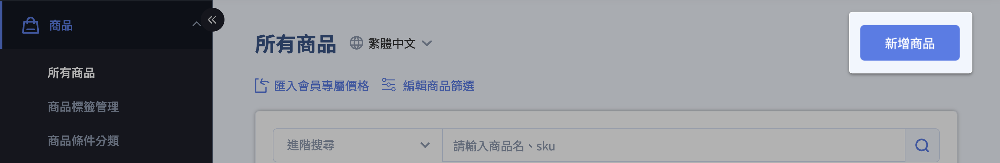
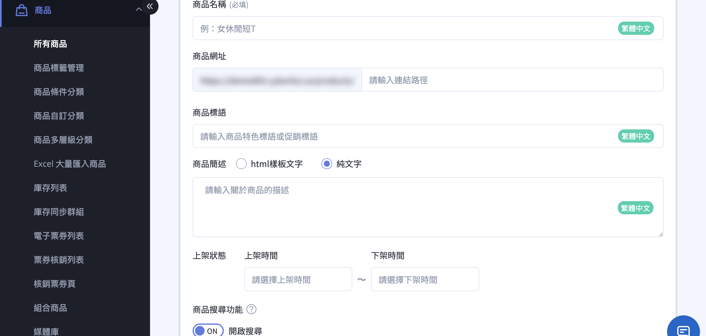
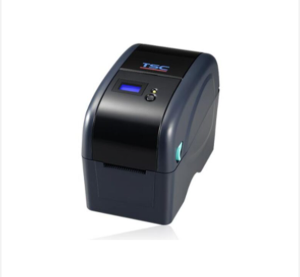
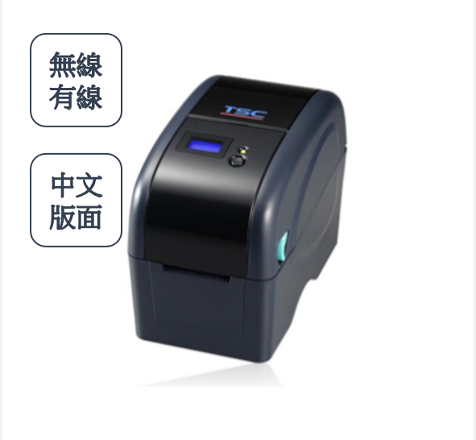
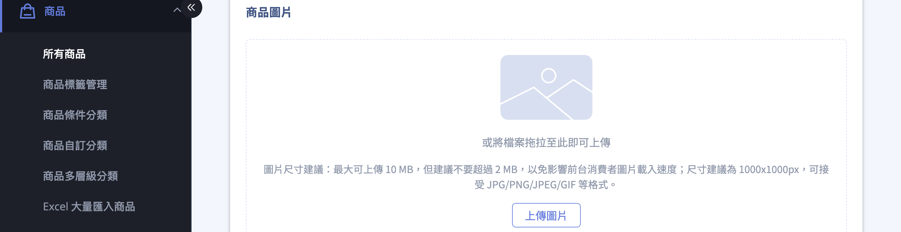

建立並設定單一商品的基本資訊、圖片、影片與款式，上架商品。
{ .subtitle }

{ title="新增商品： 商品 > 所有商品 > 新增商品" .hero-page }

## 新增與更新商品說明

在 CYBERBIZ 系統中，新增與更新商品可以透過「[單筆操作](#單筆新增商品)」或「Excel 大量匯入」兩種方式進行。

## 單筆新增商品

適用於少量商品上架，可精細設定每項資訊。

1. 登入 CYBERBIZ 管理後台，點選 「商品」>「所有商品」>「新增商品」。
2. 依序設定相關商品資訊：[基本設定](#基本設定){ data-preview }、[商品圖片](#商品圖片){ data-preview }、[商品影片](#商品影片){ data-preview }、[款式](#款式管理){ data-preview }、[庫存管理](#管理庫存){ data-preview }。
3. 點擊 **儲存** 以套用變更。

---

### 基本設定

*   **商品名稱**：填寫商品標題。請避免使用特殊符號（如 `|`、`"`、`'`），以確保資料庫能正確儲存。
*   **商品網址**：定義商品頁面的最後一段網址結構。建議使用全英文與小寫字母，並以連字號 `-` 分隔單字[^*]。
    - **預設值**：若未設定，系統將預設使用「商品名稱」作為網址後綴。
* **商品標語/商品簡述**：輸入吸引消費者的行銷短語。支援純文字輸入，或切換至 HTML 模式進行進階排版。[進階設定說明](編輯商品簡述與商品標語.md){ data-preview }
*   **上架狀態（排程設定）**：設定商品的有效銷售區間。若目前時間不在設定的區間內，該頁面將會顯示 404 找不到頁面。
    - **預設值**：若未設定，則為「永久上架」。
*   **搜尋功能**：決定商品是否可被站內搜尋或 Google 搜尋引擎找到。關閉後，商品僅能透過商品頁面的直接連結進入。

[^*]: 英文網址在搜尋引擎 (SEO) 權重較高，且能避免在數據分析報表中出現語意不明的亂碼。

---

### 商品圖片

點擊 **上傳圖片** 或拖拉圖片進行上傳。上傳商品圖片時，請參考以下技術規格：

| 項目 | 規格 | 說明 |
| :--- | :--- | :--- |
| 尺寸 | 1000 × 1000 px | 正方形比例為佳 |
| 檔案大小 | 最大 10 MB，建議不超過 2 MB | 過大圖片會影響載入速度 |
| 支援格式 | JPG / PNG / JPEG / GIF | 建議使用 JPG 或 PNG |

!!! info "跨通路投放提醒：Google 購物廣告 (GMC)"
    若您計畫同步商品至 Google 進行投放，圖片需符合 [Google 圖片規範 :lucide-external-link:](https://support.google.com/merchants/answer/6324350#Image_guidelines)。不符合規範的圖片可能導致商品審核失敗。

    ??? example "查看 Google 圖片禁忌與範例"

        | 規範 | 說明 |
        | :--- | :--- |
        | 不可包含價格資訊 | 避免在圖片中標示售價或折扣金額 |
        | 不可包含促銷文字 | 如「免運」、「特價」、「限時優惠」等 |
        | 不可添加浮水印或 Logo | 商品圖片不得覆蓋品牌標識 |
        | 需清晰呈現商品主體 | 背景建議使用白色或純色，商品占比建議 85% 以上 |

        

        :lucide-check: 符合規範
        { .screenshot }

        :lucide-x: 不符合規範
        { .screenshot }

        

    

---

### 商品影片

[:lucide-tag:{ title="適用方案" }](conventions.md#適用方案) | PLUS / 企業  
[:lucide-bolt:{ title="適用功能" }](conventions.md#適用功能) | 拖拉版型

- 解析度：最高支援 1280 × 1280 像素。
- 建議比例：9:16，此比例最佳化於 Facebook 廣告版位。
- 影片格式：僅支援 MP4 格式。
- 影片長度：最長 60 秒。
- 檔案大小：最大 30 MB，載入速度會受使用者網路影響，建議在符合規格下盡量壓縮檔案。
- 音訊支援：目前不支援音訊輸出，上傳影片將以靜音模式播放。

!!! info "更多商品影片相關設定，請參閱[設定商品影片](設定商品影片.md)。"

---

### 款式管理

*   **單一款式**：設定售價（實際銷售額）、定價（建議售價）、成本價（內部分析用，消費者不可見）及商品編號 (SKU)。
*   **多款式商品**：點選「新增規格」，依序加入顏色、尺寸等項目，每組規格下方至少需有一個細項。
*   **同步套用**：若多個款式價格或庫存相同，可勾選後選擇「同步套用」，一次性輸入金額即可完成。

---

### 管理庫存

開啟功能後，可設定庫存量與「安全庫存水位」。當庫存歸零時，可選擇「停止銷售」或「繼續銷售（開放預購）」。

## 更新既有商品

若需修改已存在的商品資訊，可透過以下方式：

=== ":lucide-square-pen: 單筆修改"

    在商品列表點擊特定商品，進入編輯頁面後修改內容，完成後務必點擊「儲存」。

=== ":lucide-import: 批次修改 (Excel)"

=== "訂單內商品編輯"

1.  **單筆修改**：在商品列表點擊特定商品，進入編輯頁面後修改內容，完成後務必點擊「儲存」。
2.  **批次修改內容 (Excel)**：
    *   **步驟一**：進入「商品」>「所有商品」，勾選欲修改的品項，點選「**匯出商品**」。
    *   **步驟二**：開啟下載的 Excel，在對應欄位輸入欲修改的資訊（如描述、通路、溫層或配送方式）。
    *   **步驟三**：進入「**Excel 大量匯入商品**」頁面，上傳編輯後的檔案。
3.  **訂單內商品編輯**：在「所有訂單」中，可針對單筆訂單明細頁執行「編輯訂單」，增減商品數量或新增「已下架/不公開」的商品。

## Excel 大量操作之關鍵差異

透過 Excel 進行批次作業時，系統判斷「新增」或「更新」的邏輯在於**隱藏欄位**：

*   **新增商品**：使用後台提供的「下載 Excel 範本」，其隱藏的 **A 欄（商品 ID）與 B 欄（款式 ID）內容為空值**。上傳後系統會判定為建立全新商品。
*   **更新商品**：必須先從「商品列表」中**匯出既有商品**，匯出的表格中 **A、B 欄會帶有系統產生的 ID 數值**。上傳此檔案後，系統會比對 ID 並覆蓋（更新）原有的商品內容。

## 重要注意事項與提醒

*   **SKU 碼重要性**：若商家使用串倉服務或 POS 系統，**SKU 碼為必填項目**且必須具備唯一性。
*   **跨境商品**：若使用 CYBERBIZ EXPRESS，須額外補填 JANCODE、成分、原產國等報關資訊，且建議以日文或英文填寫。
*   **多國語系**：若網站開啟多國語系功能，上架時需注意切換語系標籤（如名稱、簡述、規格等欄位均支援多語編輯）。
*   **排除同步**：若商品不欲顯示於 Google、LINE 直播或 Facebook 商店，可在標籤欄位輸入「**贈品**」或「**排除product feed**」。
*   **匯入狀態**：檔案上傳後會進入背景排程，商家應等候系統發送的「資料匯入完成」電子郵件通知。若失敗，信件中會提示失敗原因。

您是否需要我為您進階說明，如何利用「組合商品」或「紅利商城」來建立特殊的商品行銷模組？

1. 登入 CYBERBIZ 管理後台，前往 **商品 > 所有商品 > 新增商品**。
2. 依序填寫 *商品資訊* 內容：
	- [基本設定](#基本設定)
	- [商品圖片](#商品圖片)
	- [商品影片](#商品影片)
	- [款式管理](#款式管理)
3. 點擊 **儲存**，商品將依上架狀態所設定的時間自動上架或延後上架。	 

!!! info "更多商品相關設定，請參閱[編輯商品描述與商品設定](編輯商品描述與商品設定.md)。"

---

## 基本設定

- 商品名稱：避免使用特殊符號（如 `|` 或 `”`），不可使用 HTML。
- 商品網址：建議使用英文網址，有助於 SEO 與 GA 分析。若未設定，系統將自動套用 *商品名稱* 作為網址。
- 商品標語：顯示於 *商品頁面* 的簡短文字。瞭解 [如何客製文字樣式](編輯商品簡述與商品標語.md)。
- 商品簡述：建議以 1–3 句呈現，避免過長段落與冗餘格。顯示於 *商品頁面* 的簡短文字。瞭解 [如何客製文字樣式](編輯商品簡述與商品標語.md)。
- 上架狀態：設定商品上架及下架時間，未填寫 > 商品永久上架；非上架時間 > 頁面顯示 404。
- 商品搜尋功能： `ON` 可被搜尋；`OFF` 無法被搜尋，但仍可透過 *商品連結* 供部分顧客購買。瞭解 [關閉商品搜尋效果](設定商品搜尋可見性.md#商品排除搜尋效果)。

前台顯示畫面

## 商品圖片

- 尺寸建議：1000 × 1000 像素 (px)。
- 檔案大小：最大 10 MB，建議不超過 2 MB，以提升網站載入效能。
- 平台兼容：可參考[設定 Google 購物廣告](../integrations/設定 Google 購物廣告)，並提升廣告成效。

### Google 圖片規範

為確保商品可順利通過 Google Merchant Center 審核，請遵循以下圖片規範：

- 不可包含價格資訊
- 不可包含促銷或宣傳文字（如「免運」、「特價」）
- 不可添加品牌浮水印或 Logo 覆蓋商品
- 圖片需清晰呈現商品主體

為確保廣告正常投放，請確認商品圖片符合 [Google 產品資料規格 :lucide-external-link:](https://support.google.com/merchants/answer/6324350#Image_guidelines)。

??? example "GMC 平台圖片範例"
    

    :lucide-check: 符合規範：無浮水印
    { .screenshot }

    :lucide-x: 不符合規範：有浮水印 
    { .screenshot }

    

## 商品影片
[:lucide-tag:{ title="適用方案" }](conventions.md#適用方案) | PLUS / 企業  [:lucide-bolt:{ title="適用功能" }](conventions.md#適用功能) | 拖拉版型

- 解析度：最高支援 1280 × 1280 像素。
- 建議比例：9:16，此比例最佳化於 Facebook 廣告版位。
- 影片格式：僅支援 MP4 格式。
- 影片長度：最長 60 秒。
- 檔案大小：最大 30 MB，載入速度會受使用者網路影響，建議在符合規格下盡量壓縮檔案。
- 音訊支援：目前不支援音訊輸出，上傳影片將以靜音模式播放。

!!! info "更多商品影片相關設定，請參閱[設定商品影片](設定商品影片.md)。"

## 款式管理
	
根據商品規格建立不同類型商品：

- [單一款式商品](#單一款式商品)：商品只有一種規格，如單一顏色跟尺寸。
- [多款式商品](#多款式商品)：商品有多種規格需要設定，如不同的顏色跟尺寸。

??? note "商品款式、規格跟規格項目差異"

	- 規格 = 商品的分類方式（例如：顏色、尺寸）
	- 規格項目 = 特定分類下的選項內容（例如：顏色下的紅色、尺寸下的　M 號）
	- 款式 = 實際販售的規格組合（例如：紅色 + M 號）

	| 顏色 \\ 尺寸規格 | S 號 | M 號 | 
	|--------------|------|------| 
	| 紅色 | 款式 1 | 款式 2 | 
	| 藍色 | 款式 3 | 款式 4 |

### 單一款式商品

1. 點擊 **建立單一款式商品**，進入商品編輯頁面。
2. 依照需求設定以下商品款式資訊欄位，完成後點擊 **儲存** 套用設定。

#### 商品價格與編號

- 售價：實際銷售金額。
- 定價：建議售價。
- 成本價 :lucide-lock:：供內部分析使用，*專業* 與 *專業PLUS* 版不適用。
- 紅利折抵：設定可折抵紅利上限。
- 商品編號 SKU：商品編號，串倉、POS 系統必填。

#### 庫存管理

- 管理庫存：開啟以設定庫存相關欄位。
- 庫存量：可販售商品數量。設定有限庫存量的商品可以在[庫存列表](使用商品管理介面管理商品.md#庫存列表)中快速檢視。
- 安全庫存水位：低於此數量，系統會發信通知給[已設定之收件者](系統通知設定.md)，進一步了解如何[設定到貨通知](設定商品到貨通知.md){ data-preview }。
- 庫存不足時：商品庫存為 0 時，是否允許顧客購買。
	- `停止銷售`：一般商品建議選項，避免商品超賣。了解如何[設定到貨通知](設定商品到貨通知.md)。 
	- `繼續銷售`：預購商品選項，選擇以開放商品預購。庫存 0 時顯示 *預購商品* 選項。了解如何[設定預購通路](設定多購物車#設定預購通路)。

#### 物流設定

- 收貨地址：設定是否需填寫地址。一般網購商品皆需填寫，數位商品可設定為 *不需填寫*。
- 材積：包裹長 + 寬 + 高 [^1]。了解[進階設定](設定商品超商物流限制與排除選項.md){ data-preview }。
> 材積 > *105* cm > 僅可宅配；材積 > *150* cm > 宅配可分箱並加印託運單  
- 重量：商品重量，*請注意各家物流重量上限* [^2]。
> 超商 ≤ *10* kg；宅配 ≤ *20* kg。
- 產品廠商編號：可註記廠商編號。方便內部管理與物流使用。
	
??? example "材積計算範例"
	假設寄送一箱月餅禮盒，5 盒/箱，超商材積限制 105 公分。 

	| 單盒材積 | 總材積計算 | 判斷結果 | 配送方式 |
	|----------|------------|----------|----------
	| 20 公分  | 20 × 5 = 100 < 105 | :material-check: 符合超商材積限制 | 超商取貨 |
	| 25 公分  | 25 × 5 = 125 > 105 | :material-close: 超過限制 | 宅配 |

### 多款式商品

1. 點擊 **建立多款式商品**，進入編輯頁面。
2. 設定商品規格與規格項目，每個規格下至少需有一個項目。  
> 最多可設定 3 種規格，可直接在欄位中自訂規格名稱。每個規格下的項目數量不限，同樣可自訂名稱。

	
	
3. 可修改欄位名稱及商品屬性。

	{ .screenshot }
	
4. 完成設定後，各款式可單獨管理售價、庫存與 SKU。

	{ title="多款式商品後台顯示" }

	{ title="多款式商品前台顯示" }

#### 批次操作多款式商品

透過批次操作選單，一次套用相同的商品資訊（如價格、庫存、圖片、材積與重量）至多個款式商品。

1. 選取欲批次設定的商品款式。
2. 點擊 **操作選單**，選擇批次操作選項（如價格、庫存等），進入編輯頁面。
3. 輸入相關商品資訊，點擊 **套用** 以套用變更。

## 後續步驟

- :lucide-import:{ .lg }   
  [__新增大量商品__](Excel 大量匯入商品.md){ data-preview }   
  透過 Excel 批量匯入商品，批次上架商品。
- :lucide-boxes:{ .lg }   
  [__新增組合商品__](新增與設定組合商品.md#新增組合商品)  
  建立指定或任選組合商品。
- :lucide-edit-3:{ .lg }   
  [__編輯商品描述與設定__](編輯商品描述與商品設定.md){ data-preview }   
  編輯商品描述及設定頁籤資訊。
- :lucide-bell:{ .lg }   
  [__商品到貨通知__](設定商品到貨通知.md){ data-preview }  
  設定到貨通知，通知顧客追蹤商品已補貨。
- :lucide-check-square:{ .lg }   
  [__批次修改商品資訊__](批次修改商品描述與配送設定.md){ data-preview }  
  批次更新多筆商品的資訊與設定。
- :lucide-search-x:{ .lg }   
  [__設定商品排除搜尋__](設定商品搜尋可見性.md){ data-preview }   
  設定商品不在特定搜尋結果中顯示。

## 常見問題

??? quote "商品名稱可以使用特殊符號或 HTML 嗎？"
    商品名稱**不可使用特殊符號**（如 `\|` 或 `”`），也**不可使用 HTML 標籤**。請使用純文字設定商品名稱。
    
??? quote "多款式商品設定時，有規格項目的數量限制嗎？"
    每個款式至少需有 *1* 個項目。例如，若設定顏色規格，則至少需新增一種顏色選項。

[^1]: 台灣國內物流材積計算方式。
[^2]: 海外物流通常依重量計價。
