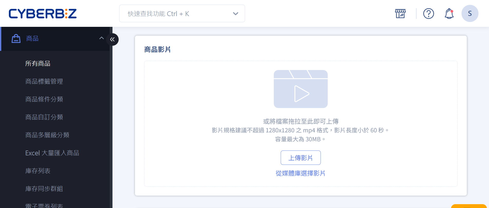

# 設定商品影片
上傳商品影片、管理媒體庫、提升商品頁視覺呈現。
{ .subtitle }

[:lucide-tag:{ title="適用方案" }](conventions.md#適用方案) | 專業PLUS / / 進階 PLUS / 高手 PLUS / 企業  
[:lucide-bolt:{ title="適用功能" }](conventions.md#適用功能) | 拖拉版型
{ .doc-badge }

{ title="設定商品影片：商品 > 所有商品 > 商品名稱 > 商品影片" .hero-page }

## 商品影片適用範圍

=== "支援"	
	| 區塊/頁面       | 支援顯示影片 |
	| --------------- | ------------ |
	| 商品頁          | :material-check: |
	| 首頁商品區塊彈窗        | :material-check: |
	| 商品分類頁彈窗          | :material-check: |
	| 新版任選折扣頁彈窗       | :material-check: |
	| 商品多層級分類頁彈窗     | :material-check: |
	| 紅利商城彈窗            | :material-check: |
	| 快速到貨彈窗            | :material-check: |
	| 一頁式商店商品區塊彈窗    | :material-check: |

=== "不支援"
	| 區塊/頁面       | 支援顯示影片 |
	| --------------- | ------------ |
	| 群組頁          | :material-close: |
	| 商品放大鏡       | :material-close: |

## 商品影片規格限制

為確保影片能順利上傳、處理及於前台正常播放，請遵循以下技術規格：

- 解析度：最高支援 1280 × 1280 像素。
- 建議比例：9:16，此比例最佳化於 Facebook 廣告版位。
- 影片格式：僅支援 MP4 格式。
- 影片長度：最長 60 秒。
- 檔案大小：最大 30 MB，載入速度會受使用者網路影響，建議在符合規格下盡量壓縮檔案。
- 音訊支援：目前不支援音訊輸出，上傳影片將以靜音模式播放。

## 上傳商品影片

=== "新增商品時上傳影片"

	1. 登入 CYBERBIZ 管理後台，前往 **商品 > 所有商品 > 新增商品**。
	2. 在商品影片區塊點擊 **上傳** 按鈕，選擇本機影片檔案。
	3. 確認影片與商品資訊無誤後，點擊 **儲存**，系統將處理影片上傳，請耐心等待完成。
	4. 上傳後的影片可在[媒體庫](#媒體庫影片管理)統一管理。

=== "為既有商品新增影片"

	1. 登入 CYBERBIZ 管理後台，前往 **商品 > 所有商品**。
	2. 在商品列表中，點擊欲編輯的商品名稱，進入商品編輯頁面。
	3. 在商品影片區塊點擊 **上傳** 按鈕，選擇本機影片檔案；若已有上傳過影片，可直接點擊 **從媒體庫選擇影片**。
	4. 確認影片正確後，點擊 **儲存**，系統將處理影片上傳，請耐心等待完成。

## 影片彈窗顯示設定

統一設定影片在商品彈窗中的顯示位置，以提升前台展示效果。

1. 登入 CYBERBIZ 管理後台，前往 **網站外觀 > 套版主題管理 > 網站設定 > 全站設定**。
2. 在 **商品影片設定** 區塊選擇影片顯示位置
	- `置於商品圖片之前`：影片會在商品圖片之前播放。    
	- `置於商品圖片之後`：影片會在商品圖片之後播放。

## 媒體庫影片管理

1. 登入 CYBERBIZ 管理後台，前往 **商品 > 媒體庫**。
2. 集中管理所有影片檔案，可進行 **搜尋影片 :lucide-search:**、**刪除影片 :lucide-trash-2:**，及 **上傳影片** 操作。
> 影片上傳後，編輯商品頁面時可選擇 **從媒體庫選擇影片**，直接為商品新增影片。

## 後續操作

- :lucide-video:{ .lg }   
  [__投放 Meta 目錄型廣告__](#)     
  將影片同步至 Meta 目錄並建立目錄型廣告

## 常見問題
??? quote "為什麼我的商品影片沒有聲音？"
    商品影片功能目前不支援音訊輸出，影片將以靜音方式播放。

??? quote "影片上傳失敗怎麼辦？"
    - 確認影片檔案大小是否超過 30 MB。
    - 確認影片格式為 MP4。
    - 若仍無法上傳，請聯絡客服支援。

??? quote "商品影片只能在拖拉版型顯示嗎？"
    是的，商品影片功能僅支援拖拉版型，其他版型無法顯示影片。

??? quote "我可以調整影片在彈窗中的顯示順序嗎？"
    可以，上傳後可在後台設定彈窗影片顯示順序為第一格或最後一格。
    
