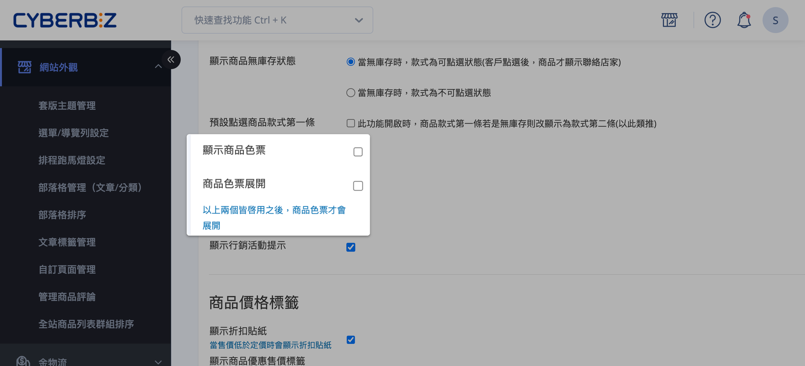
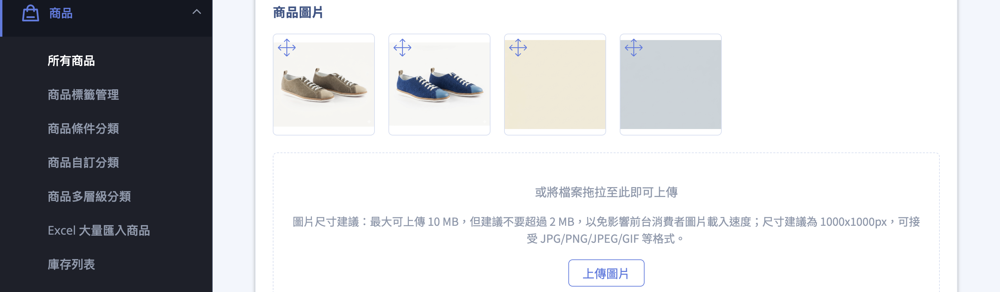
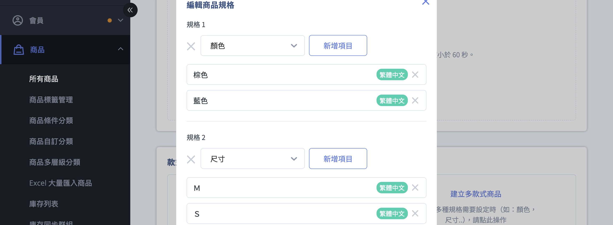
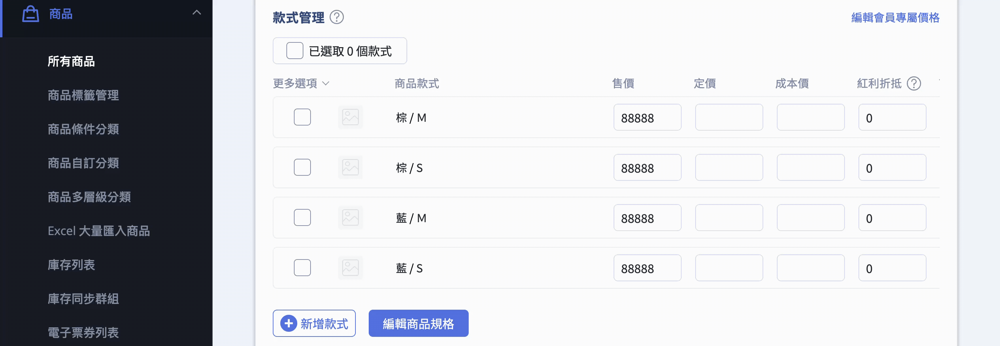
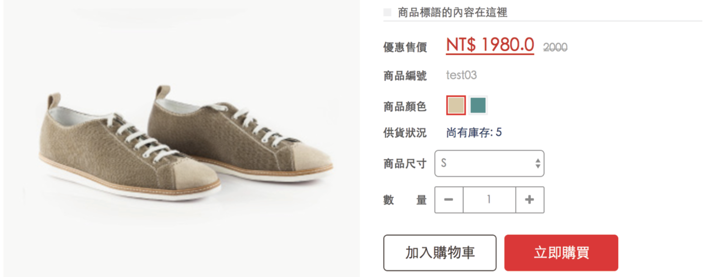
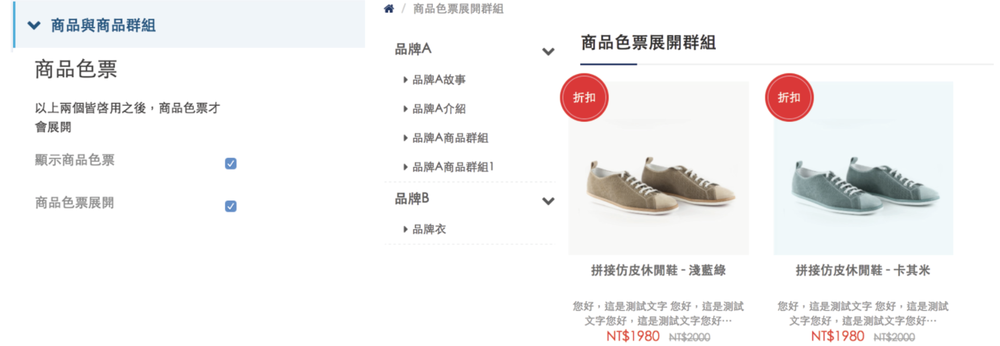

設定預設版型商品的色票與款式圖片，讓消費者能直觀瀏覽並選擇款式。
{ .subtitle }

[:lucide-bolt:{ title="適用功能" }](../../resources/conventions#適用功能) | 預設版型
{ .doc-badge }

{ .hero-page }

## 色票功能說明

**色票功能**，主要是為了讓消費者在瀏覽商品頁面或商品群組頁面時，能直觀地看到商品提供的所有款式（如顏色或花色），並在選擇特定款式後，頁面能呈現對應的款式圖片，以便了解商品細節。

??? info "拖拉版型使用者"
    若您使用的是「拖拉版型」，請參閱[設定商品色票與款式圖片-拖拉版型](設定商品色票與款式圖片-拖拉版型.md){ data-preview }。

## 前置設定：開啟顯示功能

在使用此功能前，必須先在後台啟用相關開關，商品頁面才會顯示色票。

1. **進入操作頁面**：「網站外觀」>「套版主題管理」>「網站設定」>「商品群組與商品頁設定」>「商品頁設定」。
2. **開啟功能**：勾選顯示色票的選項（**顯示商品色票**、**商品色票展開**）並點擊 **儲存** 套用變更。

## 色票與規格設定流程

### 步驟一：設定色票圖示

系統透過圖片的「相對位置」自動配對款式實照與色票圖示。請將圖片上傳至「商品圖片」區塊（上傳規範請參考 [商品圖片設定](../creation/新增與更新商品.md#商品圖片){ data-preview }），並遵循 「先圖後色」 的分段排序邏輯。

1. **進入編輯介面**：前往 商品 > 所有商品，新增商品或編輯現有商品。
2. **上傳圖片**：於「商品圖片」區塊上傳所有款式的 **商品圖** 與相應的 **色票圖**。
3. **調整排序**：利用圖片上的 :lucide-move: 圖示，以拖放方式將圖片區分為前後兩段：

    - **前半部（圖）**：依序排列各款式的 款式圖片（例如：棕鞋、藍鞋）。
    - **後半部（色）**：依序排列對應位置的 色票圖示（例如：棕標、藍標）。

!!! warning "排序順序警示"
    實照與色票的總數必須一致，且順序必須對應（左側第 1 張對應右側第 1 張）。若採交錯排列或數量不符，前台色票將無法正確連動指定款式圖片。

### 步驟二：款式規格管理（關鍵步驟）

完成 [圖片上傳](#步驟一設定色票圖示){ data-preview } 後，請向下捲動至 「款式與庫存」 區塊。為了讓系統正確對應色票，規格的設定順序與命名具有硬性限制。

1.  **規格順序**：若要使用色票功能，必須將「**顏色**」設定為 **第一個規格**，前台才會正確顯示。
2.  **規格名稱**：
    *   第一個規格請設定為「**顏色**」，並依據您上傳的圖片順序來設置顏色項目。
    *   第二個規格若有需求可設定為「**尺寸**」（請務必使用“尺”“寸”這兩個中文字）。
3.  **其他款式**：確認前兩項規格設定完成後，再繼續設定其他額外的款式項目。

### 步驟三：填寫商品款式資料

完成規格設定後，系統將自動生成款式列表。請根據各款式的組合，完善庫存與詳細資訊。

1.  依照上述設定的顏色及尺寸順序，依序填入各個款式的詳細資料。
2.  **庫存管理**：根據需求設定是否要「管理庫存」，並填寫商品庫存量，系統將據此在網頁前台顯示供貨狀態。

### 步驟四：前台畫面顯示

## 常見問題

??? quote "商品色票會顯示在哪個位置？"

    色票將會展開顯示在 **商品群組頁面**（Category/Collection Page），該商品的各個顏色款式都會直接呈現在群組列表中。

    

??? quote "如果不希望使用色票功能，該如何取消？"

    若不需此功能，請至「網站設定」中關閉「顯示商品色票」即可。

??? quote "此功能是否適用於所有版型？"

    本教學僅適用於 **預設版型**。若您使用的是「拖拉版型」，請參閱[拖拉版型專屬的色票功能教學](設定商品色票與款式圖片-拖拉版型.md){ data-preview }。

??? quote "色票圖片的上傳規範為何？"

    圖片需上傳至「商品圖片」區塊，必須遵循「先圖後色」的分段排序邏輯。前半部依序排列各款式的款式圖片（例如：棕鞋、藍鞋），後半部依序排列對應位置的色票圖示（例如：棕標、藍標）。實照與色票的總數必須一致，且順序必須完全對應。

??? quote "為什麼前台色票無法正確連動款式圖片？"

    可能原因包括：

    - 實照與色票的數量不一致
    - 圖片順序採交錯排列而非分段排列
    - 「顏色」未設定為第一個規格

??? quote "規格名稱可以自訂嗎？"

    第一個規格必須設定為「**顏色**」才能啟用色票功能。第二個規格若有需求可設定為「**尺寸**」，請務必使用「尺」「寸」這兩個中文字。

