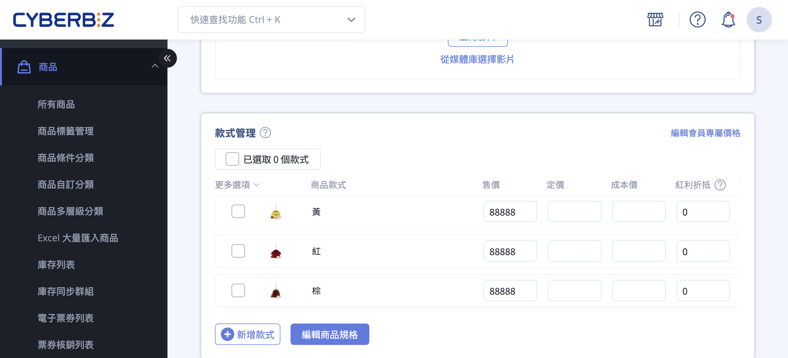
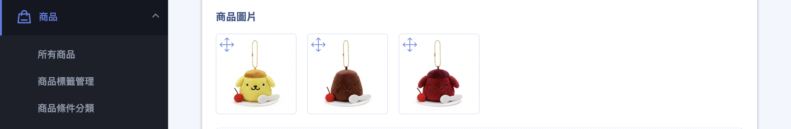
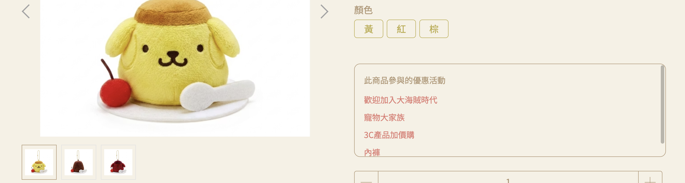
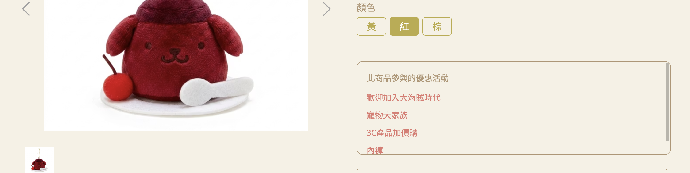

{ .subtitle }

[:lucide-bolt:{ title="適用功能" }](../../resources/conventions#適用功能) | 拖拉版型
{ .doc-badge }

{ .hero-page }

## 商品色票功能說明

**色票功能** 主要目的是為了讓消費者在前台瀏覽商品時，能透過點選特定款式（如顏色、穿搭、規格等），即時呈現該款式對應的圖片，幫助消費者了解商品細節並提升購買意願。

!!! warning "注意事項"
    *   **紅利商城**目前不支援色票功能。
    *   若要讓 Facebook 商店的商品圖片也能隨顏色正確變換，建議務必開啟此功能並依照顏色順序放置圖片。

## 功能適用條件

- [x] 此功能 **僅限使用「拖拉版型」** 的用戶使用。
- [x] 適用於企業版、PLUS 版等支援拖拉版型的方案。

## 後台設定步驟

1. **進入商品編輯頁面**：前往 商品 > 所有商品，點擊 **新增商品** 或搜尋並選擇現有商品進入編輯介面。
1.  **建立多款式商品**：

    *   完成 [商品基本設定](新增與更新商品.md#基本設定){ data-preview } 後，點選「建立多款式商品」或「編輯規格」。
    - 點選 **新增規格**，將名稱設定為「顏色」（或自定義款式名稱），並在細項中新增項目（如：紅色、藍色）。完成後依序點擊彈窗內的 **儲存**，以及商品編輯頁下方的 **儲存** 以正式套用規格。

    

3.  **上傳款式對應圖片**：

    *   儲存規格後，規格名稱前方會自動出現 **圖片視窗圖示**。

    !!! warning "若未看到圖片視窗圖示，代表規格尚未完全套用。請先點選頁面下方的 **儲存** 按鈕，重新整理後即可看到該功能。"

    *   點選該圖示後，可透過「資料夾拖進檔案」或「選擇上傳圖片」兩種方式上傳款式圖。
    *   上傳後，針對該特定款式選擇對應的圖片。

    

4.  **確認圖片同步**：在款式選單中上傳的圖片，也會同步顯示在商品主圖清單中。

    

5.  **儲存並預覽**：設定完成後，點選上方「儲存設定」，並點擊「前往該商品」查看[前台呈現效果](#前台呈現效果){ data-preview }。

    

## 開啟前台顯示（全站設定）

若要在商品列表頁（如首頁、分類頁）顯示色票小圖，必須完成以下全站設定：

**【後台路徑】：** `網站外觀` > `套版主題管理` > `網站設定` > `全站設定`。

1.  進入「全站設定」頁面。
2.  找到「商品相關設定」區塊。
3.  勾選啟動「**顯示商品色票小圖**」功能。
4.  **顯示位置**：完成後，色票小圖會出現在商品群組頁、商品多層級分類頁等列表頁面。

## 前台呈現效果

在商品頁中中，商品下方會出現不同顏色款式的色票小圖，方便消費者直接點選預覽不同款式的外觀。

=== ":lucide-gallery-thumbnails: 尚未選擇款式前"
    消費者可以查看該商品的所有產品圖。

    

=== ":lucide-mouse-pointer-click: 選擇特定款式後"
    系統會自動篩選並僅顯示與該款式（如特定顏色）關聯的圖片。

    

## 後續操作

- :lucide-store:{ .lg }   
  [__Facebook 商店設定__](../../integrations/fb/mbe/設定 Facebook 跟 Instagram 商店.md){ data-preview }       
  完成色票設定後，可進一步設定 Facebook 與 Instagram 商店，讓商品圖片能在社群平台上呈現多款式效果。

## 常見問題

