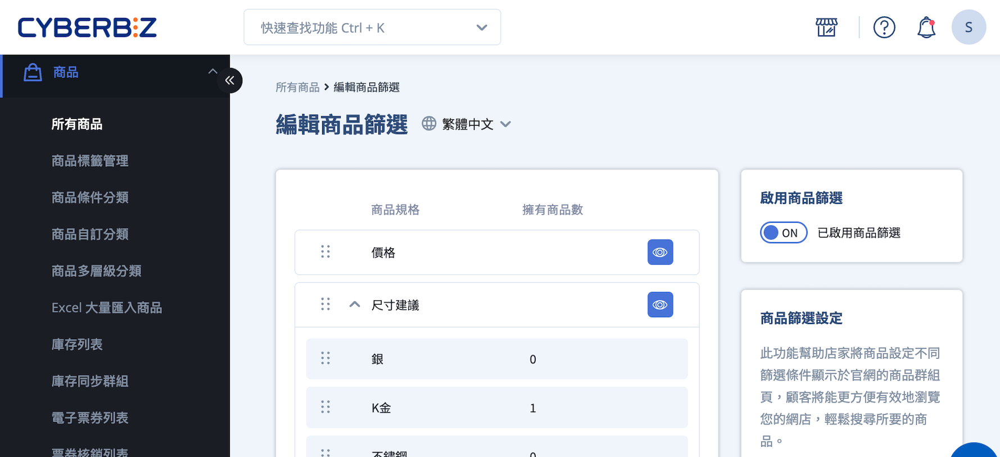
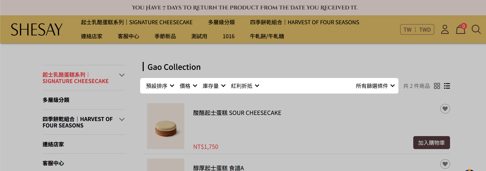
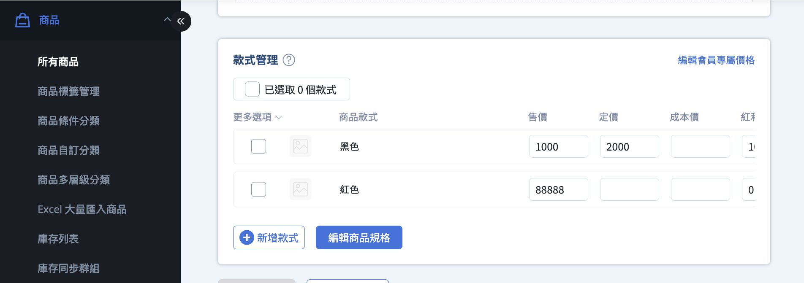
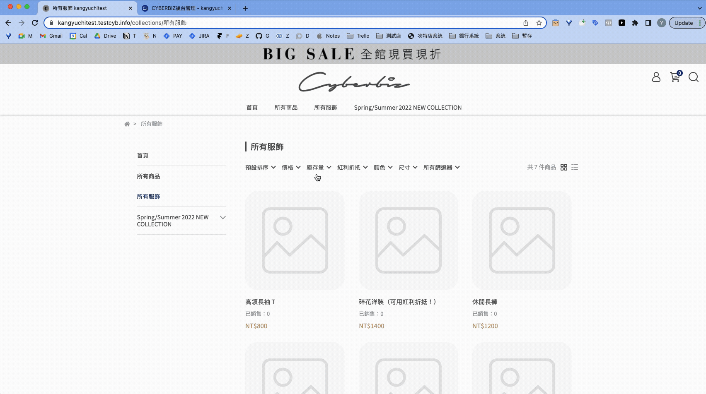
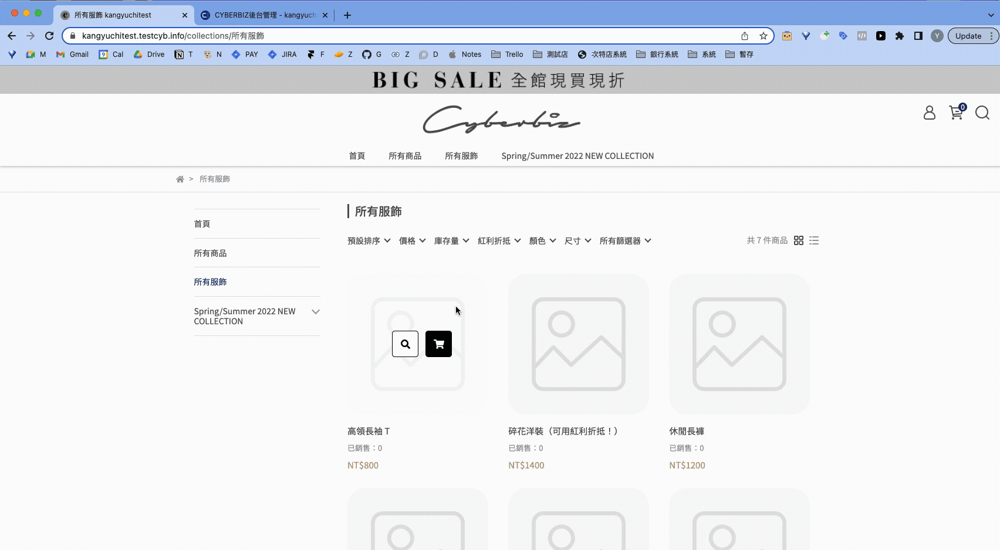
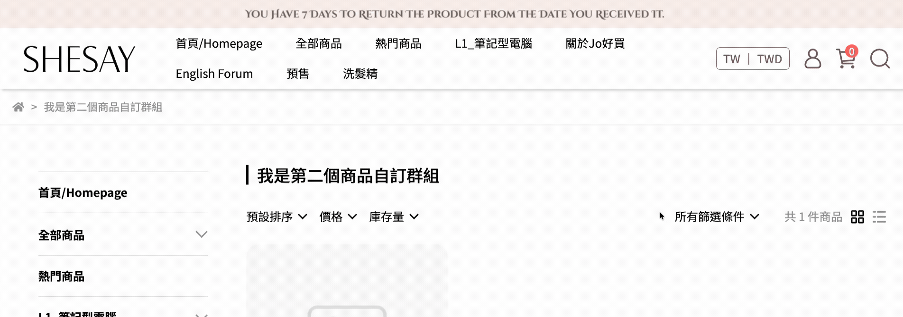

設定並管理顧客可使用的商品篩選器，改善前台購物體驗。
{ .subtitle } 

[:lucide-tag:{ title="適用方案" }](conventions.md#適用方案) | 進階 / 高手 / 進階 PLUS / 高手 PLUS / 企業  
[:lucide-bolt:{ title="適用功能" }](conventions.md#適用功能) | 拖拉版型
{ .doc-badge }

{ .hero-page }

## 前台商品篩選器說明

前台商品篩選器可讓顧客依 **價格、庫存、紅利折抵、商品規格** 等維度篩選商品。

#### 前台顯示畫面

### 使用前須知

- :lucide-check: 支援 **自訂分類頁**
- :lucide-check: 支援 **條件分類頁** `/collections`
- :lucide-x: 不支援 **多層級分類頁** `/categories`

### 預設篩選器

系統內建以下 **預設篩選器**。其篩選條件為系統固定設定，商家無法新增、刪除或修改子條件。

#### 價格

- 依商品價格範圍篩選商品。
    
- 篩選依據為商品各款式的 **最低價至最高價區間**。
    
#### 庫存量

- **有庫存商品**：商品庫存量大於 0，或設定為庫存量無限。
    
- **預購商品**：商品庫存量為 0，且已啟用「庫存不足仍可銷售」。
    
#### 紅利折抵

- **可折抵紅利商品**：商品設定的紅利折抵數量大於 0。

!!! info "自動生成商品規格篩選器"  
	系統會自動擷取商店內所有 **商品規格** 作為篩選器項目。如需調整篩選器顯示項目，請參閱 [編輯商品規格](#步驟四編輯商品規格)。

### 篩選邏輯說明

| 邏輯類型 | 適用情境 | 篩選結果 | 範例 |
|----------|----------|----------|------|
| **交集（AND）** | 勾選 *不同篩選器* 的子條件 | 商品需同時符合所有條件 | `顏色:紅` 且 `尺寸:S` → 顯示顏色為紅色且尺寸為 S 的商品 |
| **聯集（OR）** | 勾選 *同一篩選器* 的多個子條件 | 商品符合任一條件即可 | `顏色:紅` 或 `顏色:黑` → 顯示顏色為紅色或黑色的商品 |

## 商家端操作流程

### 步驟一：進入商品篩選器設定

1. 登入 CYBERBIZ 管理後台，前往 **商品 > 所有商品**。
2. 點擊 **編輯商品篩選** 按鈕，進入編輯頁面。

### 步驟二：啟用前台商品篩選器

點擊 **啟用商品篩選** 開關 :material-toggle-switch: 開啟或關閉前台顯示。

### 步驟三：篩選器與子條件說明

系統會自動抓取商店內所有 **商品規格** 作為篩選器，例如 *顏色*、*尺寸*、*材質*。

- **篩選器**：篩選商品的維度，例如「材質」。
- **子條件**：篩選器下的選項，例如「棉」、「聚酯纖維」、「亞麻」。

### 步驟四：編輯商品規格

1. 登入 CYBERBIZ 管理後台，前往 **商品 > 所有商品**。
2. 選擇欲編輯商品，進入商品編輯頁。
3. 在 **款式管理** 區點擊 **編輯商品規格**。

### 步驟五：調整篩選器與子條件排序

拖曳篩選器或子條件左側 :material-drag-vertical: 圖示調整顯示順序。

### 步驟六：編輯篩選器顯示狀態

點擊右側 :material-eye-outline:（公開）或 :material-eye-off-outline:（未公開）切換篩選器前台顯示。

## 顧客端操作與前台顯示

### 前台顯示差異
商品篩選器在前台的顯示方式會因裝置類型而異。
	
=== ":material-monitor-dashboard: 桌機"
	- 桌機前台最多顯示 5 個篩選器
    - 超過 5 個需點擊「所有篩選器」查看其餘項目

	{ .screenshot }

=== ":material-cellphone: 手機"
	手機網頁前台的所有篩選器，皆需點擊「所有篩選器」才會顯示。

	

### 子條件商品數顯示

子條件後方的括號數字，表示符合該子條件的商品數量。

### 調整篩選條件

點擊 **所有篩選條件** 彈出視窗，調整公開篩選群組與選項。

### 清除篩選條件

套用篩選器後，可點擊 **清除所有篩選** 一次性移除所有已套用的條件。
	

## 常見問題

??? quote "商品篩選器是否支援所有商品分類頁面？"
	否。僅適用於 **自訂分類頁** 與 **條件分類頁** (`/collections`)。不支援多層級分類頁 (`/categories`)。

??? quote "為什麼我的篩選器沒有顯示在前台？"

    - 請確認篩選器已設定為 *公開*。
    - 桌機最多顯示 5 個篩選器；手機需點擊「所有篩選器」才能查看。
