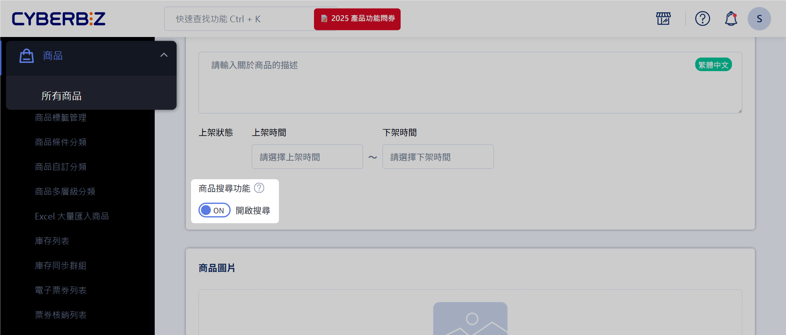
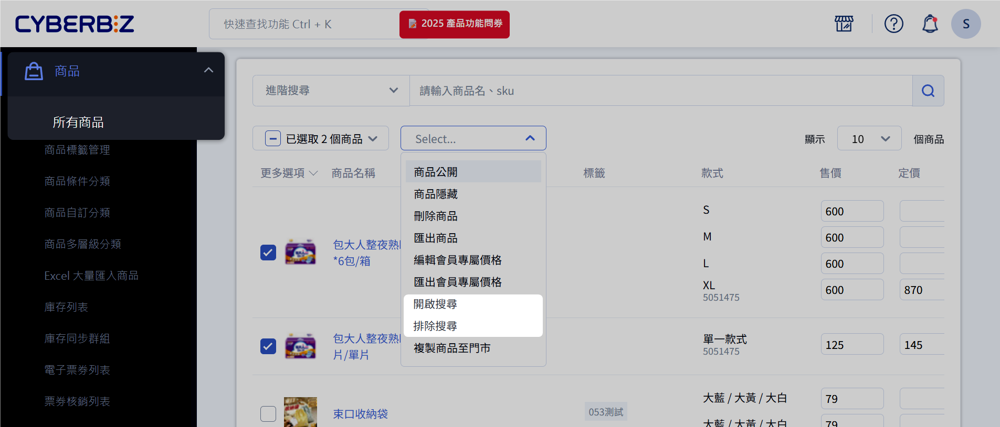
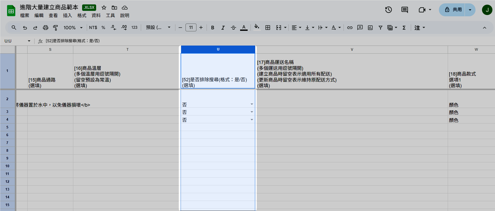

# 設定商品搜尋可見性

控制商品是否顯示於站內與 Google 搜尋結果，避免不必要的曝光。
{ .subtitle }

{ .hero-page }

## 商品可見性狀態比較

商品搜尋可見性可分為三種主要狀態，建議依需求選擇：

| 狀態 | 說明 | 前台/搜尋影響 |
|------|------|----------------|
| 排除搜尋 | 商品仍存在系統中，但不顯示於站內搜尋或 Google 搜尋結果 | 可透過直接連結購買；避免曝光 |
| 下架 | 商品暫時停止販售，前台不可見 | 不會顯示於前台，也無法透過連結購買 |
| 不公開 | 商品僅對特定通路或群組可見 | 一般前台與搜尋不可見；特定條件下可被訪問 |

> 提示：使用「排除搜尋」適合短期隱藏或活動前準備；「下架」適合暫停販售；「不公開」適合特定群組或通路限定商品。

## 商品排除搜尋效果

啟用排除搜尋功能後，商品將不會出現在以下結果頁面：
	
- Google 搜尋結果
- CYBERBIZ 站內搜尋
- 前台全部商品群組頁面 `collection all`
- 商品分類頁 :lucide-triangle-alert: 若商品已被加入特定分類，仍會顯示

## 商品排除搜尋設定路徑

您可以透過以下途徑設定商品排除搜尋功能：

### 所有商品頁面

在商品列表頁面，快速切換個別商品的搜尋狀態。

1. 在 CYBERBIZ 電商後台，前往 **商品 > 所有商品**。
2. 在商品列表中找到 **商品搜尋** 欄位（若未顯示，請拖曳下方滾動條）。
3. 切換 **商品搜尋** 功能開關。
	- `開啟 (ON)`：商品可被搜尋（顯示於搜尋結果）。
	- `關閉 (OFF)`：商品排除搜尋（不顯示於搜尋結果）。
4. 系統會自動儲存設定。

### 新增/編輯商品頁面

在新增或編輯商品時，設定商品的預設搜尋狀態。

1. 在 CYBERBIZ 電商後台，前往 **商品 > 所有商品**。
2. 點擊 **新增商品** 或既有商品進入商品編輯頁面。
3. 在基本設定區塊找到 **商品搜尋功能** 開關。
	- `開啟 (ON)`：商品可被搜尋（顯示於搜尋結果）。
	- `關閉 (OFF)`：商品排除搜尋（不顯示於搜尋結果）。
4. 點擊右上角 **儲存**，完成設定。

### 商品操作選單

選取單個或多個商品，透過操作選單調整商品的搜尋狀態。

1. 在 CYBERBIZ 電商後台，前往 **商品 > 所有商品**。
2. 選取欲調整搜尋狀態的商品。
3. 點擊 **操作選單**。
4. 選擇 **開啟搜尋** 或 **排除搜尋**，以設定商品搜尋狀態。

  

### Excel 批次匯入

當您需要大量新增或更新商品時，透過 Excel 範本設定搜尋狀態。

1. 在 CYBERBIZ 電商後台，前往 **商品 > Excel 大量匯入商品**。
2. 點擊下載 **進階大量建立商品範本**。
3. 在 Excel 範本的 **是否排除搜尋** 欄位設定每筆商品（`是` 或 `否`）。
4. 上傳已編輯的 Excel 檔案，點擊 **確定上傳**。
5. 系統將依設定批次套用。

  
	
## 常見問題

??? quote "商品排除搜尋後，顧客還可以購買嗎?"
    可以。排除搜尋僅隱藏搜尋結果，透過 [**商品連結**](#) 顧客仍能直接訪問該商品並完成購買。

??? quote "排除搜尋功能會影響 Google 搜尋引擎的索引嗎？"
    是的，設定為排除搜尋的商品將不會被 Google 搜尋引擎索引，因此不會出現在 Google 搜尋結果中。
