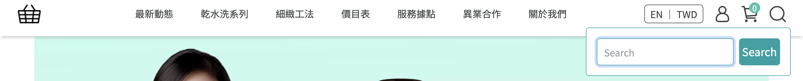

{ .subtitle }

{ .doc-badge }

{ .hero-page }

## 站內搜尋功能說明

CYBERBIZ 平台的前台介面中，**搜尋（放大鏡）功能** 是協助消費者快速定位商品的關鍵工具。

## 搜尋功能基本說明

*   **功能位置**：消費者欲搜尋商品時，可點擊前台介面上的 **放大鏡圖示** :lucide-search: 並輸入關鍵字進行查找。

    

*   **搜尋範圍**：系統預設的搜尋結果包含以下欄位：

    | 搜尋欄位 | 說明 | 設定位置 |
    |---|---|---|
    | 商品名稱 | 商品的主要識別名稱 | [商品基本設定](../creation/新增單一商品.md#基本設定){ data-preview } |
    | 商品分類群組名稱 | 包含自訂分類跟條件分類等商品群組的名稱。  （ 如商品網址 `https://xxx/collections/mygroup` 中的 `mygroup`) | [自訂分類設定](../categorization/設定商品自訂分類群組.md#加入與移出商品){ data-preview }、[條件分類設定](../categorization/設定商品條件分類群組.md#建立商品條件分類){ data-preview }。 |
    | 商品廠商 | 商品的廠商名稱，會顯示於前台 | [商品編輯頁 > 設定](../creation/編輯商品描述與商品設定.md#進階設定){ data-preview } |
    | 商品類型 | 商品的類型標籤 | [商品編輯頁 > 設定](../creation/編輯商品描述與商品設定.md#進階設定){ data-preview } |
    | 商品通路 | 商品的通路標籤（預購、現貨、常溫等）| [商品編輯頁 > 設定](../creation/編輯商品描述與商品設定.md#進階設定){ data-preview } |
    | 商品款式 | 款式名稱（如顏色 M、尺寸 XL）| [商品款式設定](../creation/新增單一商品.md#款式管理){ data-preview } |
    | SKU | 商品的庫存管理編號 | [商品款式設定](../creation/新增單一商品.md#款式管理){ data-preview } |
    | 商品介紹 | 商品的詳細說明文字 | [商品編輯頁 > 商品描述](../creation/編輯商品描述與商品設定.md#商品描述){ data-preview } |

*   **搜尋邏輯與分詞**：

    *   商品名稱採用 **分詞搜尋**。若標題中使用「空格」或「短橫線 (-)」（如 "ER-1410"），系統會將其切分為獨立單詞（如 "ER" 與 "1410"），搜尋時必須完全符合分詞內容。
    *   若在 **SKU 欄位** 輸入完整型號（如 "ER1410"），即使商品名稱有分詞（如 "ER-14010"），搜尋 "1410" 也能被尋找到。

## 後台設定與管理

商家可以根據品牌需求，決定搜尋功能的顯示狀態或排除特定商品：

1.  **全站搜尋欄位開關**：

    *   **路徑**：進入後台「網站外觀」>「套版主題管理」>「網站設定」>「全站設定」（或導覽列設定）。
    *   **設定**：在導覽列相關設定中，可選擇**顯示或不顯示搜尋欄位**。

2.  **個別商品排除搜尋**：

    *   若有部分商品（如贈品或測試品）不希望被搜尋到，可至商品管理介面進行設定。
    *   商家可利用**批次操作**，勾選商品後選擇「排除搜尋」。被排除的商品將無法透過站內搜尋框、所有商品列表或 Google 搜尋引擎找到，僅能透過直接連結進入。

3.  **透過關鍵字排除（進階）**：

    *   若要建立秘密賣場或排除含有特定字眼的商品，可進入「程式碼編輯器」修改 `search.liquid` 檔案，利用 `without: "title", "特定名稱"` 語法來達成。

## 站內搜尋數據追蹤 (GA4)

商家可以透過 **Google Analytics 4 (GA4)** 監控消費者的搜尋行為，以優化選品或 SEO：

- :lucide-toggle-left:{ .lg }   
  [__開啟站內搜尋追蹤__](../../integrations/google/ga/設定 GA4 站內搜尋追蹤.md){ data-preview }       
  至 GA4 後台的「資料串流」中，開啟「加強型評估」內的 **站內搜尋** 追蹤。

- :lucide-bar-chart-2:{ .lg }   
  [__查看搜尋報表__](../../integrations/google/ga/設定 GA4 站內搜尋追蹤.md#如何查看追蹤成果){ data-preview }    
  在 GA4 即時報表中查看 `view_search_results` 事件與 `search_term` 參數，掌握使用者查詢過的關鍵字及頻率。

## 常見異常排除

*   **搜不到商品**：請檢查關鍵字是否包含系統無法辨識的**特殊符號**，或確認商品標題的分詞邏輯是否正確。
*   **APP 搜尋**：若有使用 CYBERBIZ APP，首頁亦設有搜尋欄位，讓消費者隨時查找品項。

## 後續操作

- :lucide-import:{ .lg }
  [____]()
  。

- :lucide-ban:{ .lg }
  [____]()
  。

## 常見問題

??? quote ""

