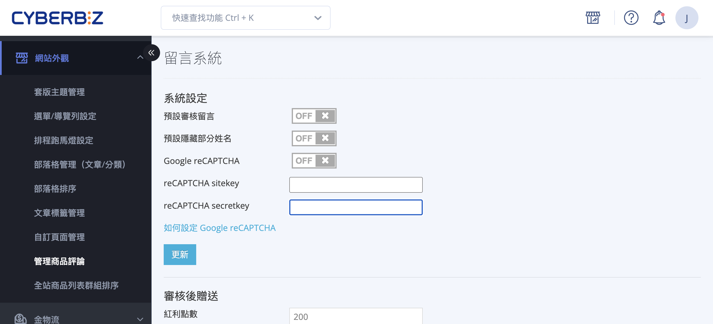
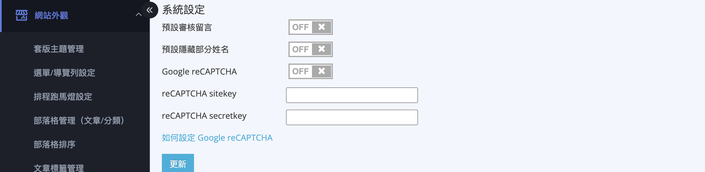
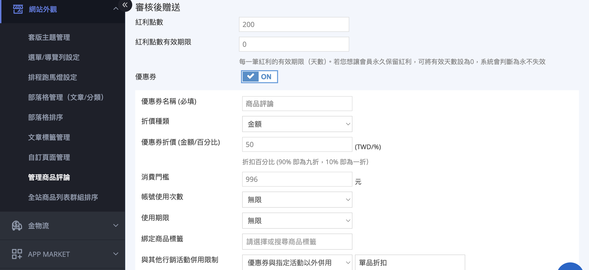
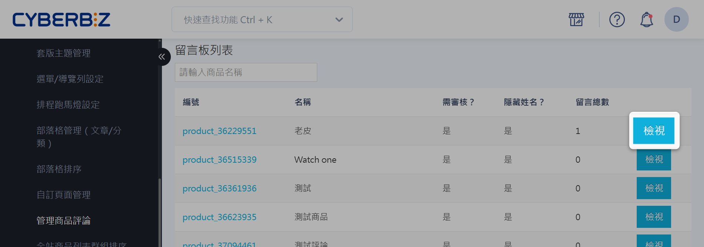
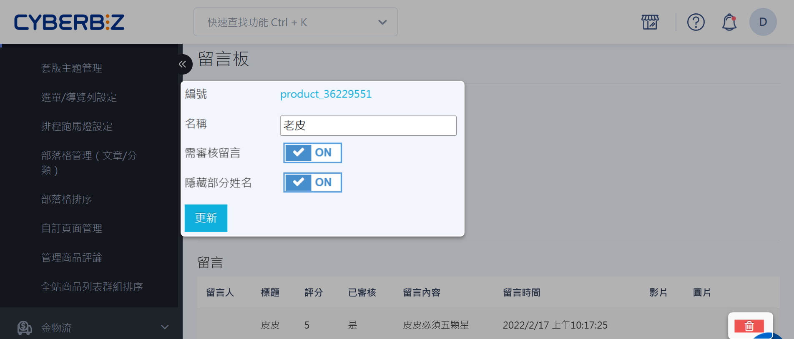
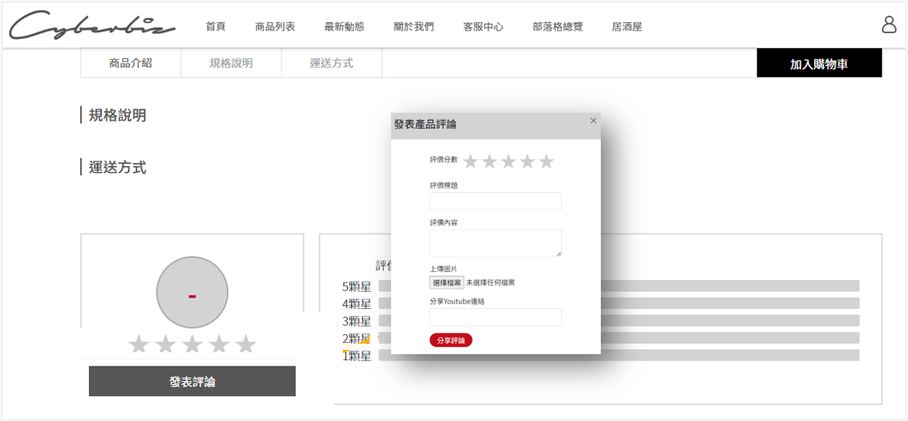
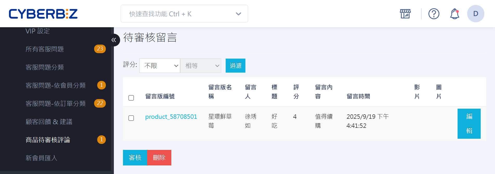
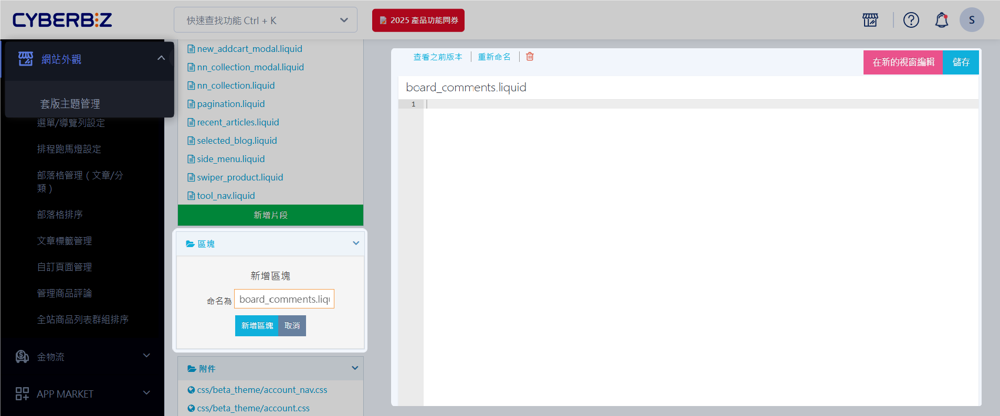

{ title="管理商品評論" .hero-page }

## 商品評論說明

商品評論功能讓顧客在商品頁面發表星級評價與留言，商家可於後台審核、編輯或刪除評論，並透過紅利點數獎勵鼓勵顧客分享購物體驗。搭配 [Google reCAPTCHA](../../website-appearance/customer-interaction/enable-comment-recaptcha.md){ title="啟用留言區 reCAPTCHA" } 可有效防止垃圾留言，協助商家建立商品信任度、提升轉換率並收集真實顧客回饋。


<div class="grid cards borderless two-columns" markdown>

- { title="商品頁商品評論區" }
- { title="商品評論提示" }

</div>


??? info-clean "商品評論流程"

    ```mermaid { data-search-exclude }

    %%{init: {
      "logLevel": "debug",
      "theme": "base",
      "gitGraph": {
      "showBranches": true,
      "showCommitLabel": true,
      "mainBranchName": "商家"
      }
    }}%%
    gitGraph
      commit id: "商品上架"
      commit id: "開通商品評論功能" tag: "洽客服人員" type: HIGHLIGHT
      commit id: "設定評論功能" 
      branch "顧客"
      checkout "顧客"
      commit id: "顧客發表評論"
      checkout "商家"
      merge "顧客" id: "審核商品評論"
      commit id: "編輯"
      commit id: "審核"
      checkout "顧客"
      merge "商家" id: "前台顯示評論"
      checkout "商家"
      merge "顧客" id: "刪除" type: REVERSE

    ```

## 使用前提與限制

- [x] 需先洽客服人員開通商品評論功能。	
- [x] FB分享功能 : 需至「第三方整合」→「臉書 Facebook 設定」→「設定 應用程式ID (APP ID) 及 應用程式密鑰 (App Secret)」填寫完畢，才可以使用。


## 操作流程

### 設定商品評論功能 { #manage-product-reviews }

進入 **網站外觀 > 管理商品評論** 後，頁面上方有 [系統設定](#系統設定) 與 [審核後贈送](#審核後贈送) 兩個獨立區塊，各自有專屬的 **更新** 按鈕，設定後請分別儲存。

#### 系統設定

1. 登入 CYBERBIZ 電商後台，前往 **網站外觀 > 管理商品評論**。
2. 於 **系統設定** 區塊依需求調整：
    - **預設審核留言**：開啟後，顧客送出的評論需經商家手動審核才會顯示於前台[^1]。
    - **預設隱藏部分姓名**：開啟後，前台顯示評論者姓名時會部分隱藏。
    - **Google reCAPTCHA**：開啟安全驗證以防止機器人與垃圾留言，並於下方填入 **reCAPTCHA sitekey** 與 **reCAPTCHA secretkey**。瞭解 [如何設定留言區 reCAPTCHA](../../website-appearance/customer-interaction/enable-comment-recaptcha.md){ title="啟用留言區 reCAPTCHA" }。
3. 點擊 **系統設定** 區塊的 **更新**，套用變更。

[^1]: 此設定僅套用於日後新增的留言板，不會影響既有的留言板。



---

#### 審核後贈送

!!! plan "方案 / 開通條件"
    * **紅利點數** 為基本回饋設定，可直接使用。
    * 加贈 **優惠券** 需先開通「個人折價券」功能；若 **折價種類** 要選用 **百分比**，另需開通對應的百分比折價券功能。

設定商家在 **會員 > 商品待審核評論** 審核通過顧客評論後，自動贈送給該顧客的回饋。可單獨贈送紅利點數，也可同時加贈優惠券。

1. 設定要贈送的 **紅利點數**：
    - **紅利點數**：填入審核通過後要贈送的點數；填 0 表示不贈送紅利。
    - **紅利點數有效期限**：每一筆紅利的有效天數；填 0 代表永久不失效。
2. 若要同時加贈優惠券，開啟 **優惠券** 開關，並完成下列設定：
    - **優惠券名稱(必填)**：顧客在優惠券列表看到的名稱。
    - **折價種類**：選擇 **金額** 或 **百分比**[^2]。
    - **優惠券折價(金額/百分比)**：填入折抵的金額(元)或折扣百分比。
    - **消費門檻**：訂單金額需達此門檻(元)才可使用此優惠券。
    - **帳號使用次數**：選 **無限**，或選 **指定次數** 並填入每個帳號可使用的次數。
    - **使用期限**：選 **無限**、**有效使用天數**(自取得日起算)或 **有效使用區間**(指定起訖日期)。
    - **綁定商品標籤**：限定優惠券可折抵的商品標籤；不選則不限定商品。
    - **與其他行銷活動併用限制**：選 **無限制**、**優惠券與指定活動以外併用**，或 **如遇指定活動不得使用此優惠券**；選後兩者時再指定要限制的活動。
3. 點擊 **審核後贈送** 區塊的 **更新**，套用變更。

[^2]: 百分比以 2 位數字輸入，90% 即為九折、10% 即為一折。



---

### 檢視留言板
所有商品的留言板皆可在此細部設定，按下 **檢視** 可對個別留言板進行編輯。

{ title="留言板列表" }

---

### 設定留言板
在留言板列表點擊「檢視」特定留言板，可進入留言版編輯頁，對各別留言板進行設定。點擊 **垃圾桶 :material-trash-can-outline:** 可刪除商品評論。

{ title="留言板設定" }

---

### 發表商品評論 <small>顧客端</small>

!!! info "顧客需登入會員後，方可於商品頁面發表評論。"

1. 顧客在商品頁面點選 **發表評論** 按鈕。
2. 系統將跳出彈跳視窗，顧客可在此填寫星級評價與評論內容。

{ title="前台發表評論" }

---

### 審核商品評論

商家可在後台審核顧客提交的商品評論。

1. 登入 CYBERBIZ 管理後台，前往 **會員 > 商品待審核評論**。
2. 選擇審核動作。
	- **審核**：將評論顯示於前台，通過審核後即可公開。
	- **刪除**：刪除該評論。  
	- **編輯**：修改評論內容，進行調整或修正。  

{ title="審核商品評論" }

---

### 隱藏商品評論功能

!!! warning "若選擇自行移除程式碼，CYBERBIZ 將不提供恢復功能協助。"

若您暫時不希望顯示商品評論功能，可透過樣版編輯器隱藏。

=== "拖拉版型"

	１. 登入 CYBERBIZ 後台，前往 **網站外觀 > 套版主題管理 > 選擇操作 : CSS/HTML編輯器**。
	2. 在「區塊」選單中點選「新增區塊」。將新增區塊命名為 `board_comments.liquid`。
	3. 點擊打開新增的 `board_comments.liquid` 的區塊檔案。  
    4. 將檔案內容（右方區域）留白即可隱藏商品評論功能。點擊 :material-trash-can-outline: 刪除 `board_comments.liquid` 文件即可恢復商品評論功能。

	{ title="隱藏商品評論功能" }

=== "一般版型"

	1. 登入 CYBERBIZ 後台，前往 **網站外觀 > 套版主題管理 > 選擇操作 : CSS/HTML編輯器**。

	2. 搜尋並打開 `product.liquid` 文件，找到 `shop.plugins.board_comments` 這段程式碼。  
	3. 以 HTML 註解符號 `<!--` 與 `-->` 包覆整段程式碼以 *註解程式碼*，即可停用並隱藏商品評論功能，無需刪除程式碼。

	4. 點擊 **儲存** 套用更新。

    { title="一般版型隱藏評論" .screenshot }

## 後續步驟

<div class="grid cards" markdown>

- [__啟用留言區 reCAPTCHA__](../../website-appearance/customer-interaction/enable-comment-recaptcha.md){ title="啟用留言區 reCAPTCHA" }  
  防止機器人訊息及垃圾留言。

</div>

## 常見問題

??? quote "顧客發表評論是否需要登入會員？"
    是的，顧客必須登入會員後才能發表商品評論。

??? quote "如果自行移除樣版編輯器中的程式碼，CYBERBIZ 會提供恢復功能嗎？"
    若您自行移除樣版編輯器中的程式碼，CYBERBIZ 不提供恢復功能等操作。請務必自行保留程式碼備份。
