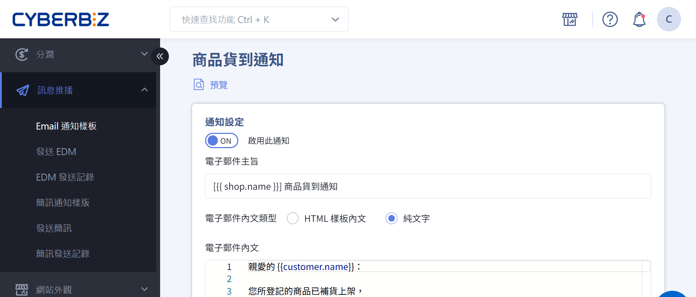
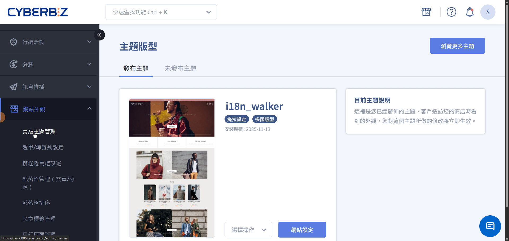
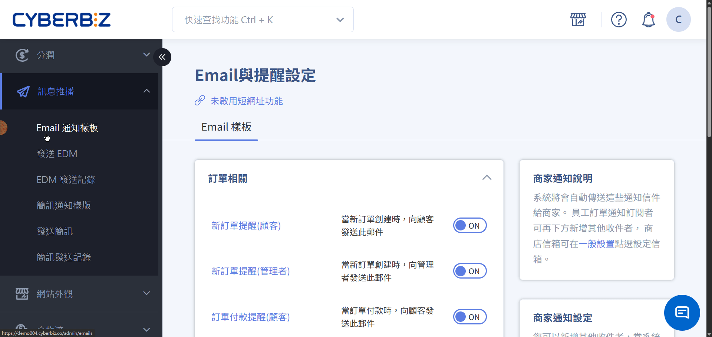

{ title="商品到貨通知" .hero-page }

## 商品到貨通知說明

商品到貨通知功能讓缺貨商品在前台顯示「已售完，貨到通知我」按鈕，顧客點擊後系統會記錄登記。當商品補庫存時，系統自動發送 Email 通知已登記的會員，幫助商家掌握補貨後的即時銷售機會，提升回購率與顧客體驗。

!!! example "適用情境"
    - 熱銷商品經常缺貨，希望補貨後第一時間通知等待的顧客。
    - 限量或季節性商品，透過到貨通知創造期待感並促進轉換。
    - 降低缺貨造成的流失，將等待中的顧客轉化為實際訂單。

## 使用前提與限制

以下限制為系統層級限制。

- 此功能支援版型版本號 3.47.0 及以上。請確認您的版型版本號是否符合要求。
- 每位會員對同一商品僅能接收一次到貨通知。通知發送後，系統會自動取消該商品的到貨追蹤，若需再次接收通知，需重新登記。

!!! info "到貨通知觸發要件"

    商品到貨提醒功能的觸發條件如下：

    - [x] 商品需開啟 [管理庫存](#setup-restock-inventory-stop-selling)，且庫存為 `0`  
    - [x] 庫存不足時需設定為[停止銷售](#setup-restock-inventory-stop-selling)，前台商品頁才會顯示 **已售完，貨到通知我** 按鈕  
    - [x] 商品庫存狀態需設定為 [當無庫存時，款式為可點選狀態](#setup-restock-variant-clickable)，顧客點選商品款式後，商品才會顯示 **貨到通知** 選項。

## 開啟商品到貨提醒功能 

### 設定庫存管理與停止銷售 { #setup-restock-inventory-stop-selling }
1. 在 CYBERBIZ 管理後台，前往 **商品 > 所有商品**。
2. 點擊要設定的商品名稱，進入商品編輯頁面。
3. 在 **款式管理** 區塊，確認開啟 **管理庫存** 功能 ，並將 **庫存不足** 時的設定調整為 *停止銷售* 。

{ title="設定庫存管理與停止銷售" }

---

### 設定無庫存時商品款式可點選 { #setup-restock-variant-clickable }

=== "拖拉版型"
	1. 在 CYBERBIZ 管理後台，前往 **網站外觀 > 套版主題管理 > 網站設定 > 商品頁面 > 基本設定**。
	2. 勾選 **無庫存時，商品款式狀態設定** 中的 **款式可點選**。

	{ title="無庫存款式可點選設定" }

=== "一般版型"
	1. 在 CYBERBIZ 管理後台，前往 **網站外觀 > 套版主題管理 > 網站設定 > 商品群組與商品頁設定**。
	2. 勾選 **顯示商品無庫存狀態** 中的 **當無庫存時，款式為可點選狀態**。
	
	{ title="商品貨到通知02" .screenshot }

---

### 會員登記貨到通知

!!! warning "補貨通知僅限一次"
    每位會員僅能收到一次補貨通知。通知發送後，該會員的補貨登記將自動取消。若商品再次售罄，會員需重新點擊 **已售完，貨到通知我** 按鈕才能再次登記。

本節說明顧客於前台的實際操作與系統回饋。
	
1. 會員在商品頁點擊 **已售完，貨到通知我** 按鈕後，按鈕會變更為 **已登記補貨通知**。 
2. 當商品庫存從 `0` 更新為 `> 0` 或無限庫存時，系統將自動發送補貨通知信給已登記的會員。

- { title="已售完，貨到通知我" }
- { title="已登記補貨通知" }

## 到貨通知 Email 樣板設定

自訂商品貨到通知的 Email 樣板內容。

1. 在 CYBERBIZ 管理後台，前往 **訊息推播 > Email 通知樣板 > 顧客相關 > 商品貨到通知**。
2. 在 **電子郵件內文類型** 選項，選擇 **HTML 樣板內文** 或 **純文字**。
3. 在 **電子郵件內文** 中更改電子郵件內文。
4. 點擊 **:material-file-search-outline: 預覽** 查看修改內容。 
5. 確認無誤後，點擊 **儲存**，套用變更。

!!! warning "請勿任意修改 `{{}}` 內的文字，此為系統自動帶入的變數，更動可能導致功能異常。"

{ title="到貨通知Email樣板設定" }

- :lucide-mail:{ .lg } [__設定與管理 Email 通知樣板__](../../notifications/manage-email-templates.md){ title="設定與管理 Email 通知樣板" }

## 後續操作

- :lucide-file-edit:{ .lg }  
  [__編輯商品描述與商品設定__](../create-and-manage/edit-product-description-settings.md){ title="編輯商品描述與商品設定" }  
  設定商品內容、通路與物流屬性，確保前台呈現正確並支援搜尋與行銷需求。
- :lucide-package-plus:{ .lg }  
  [__新增與更新商品__](../create-and-manage/create-update-products.md){ title="新增與更新商品" }  
  完成商品從新增、設定款式與價格、撰寫描述，到後續編輯、複製、上下架的完整流程。

