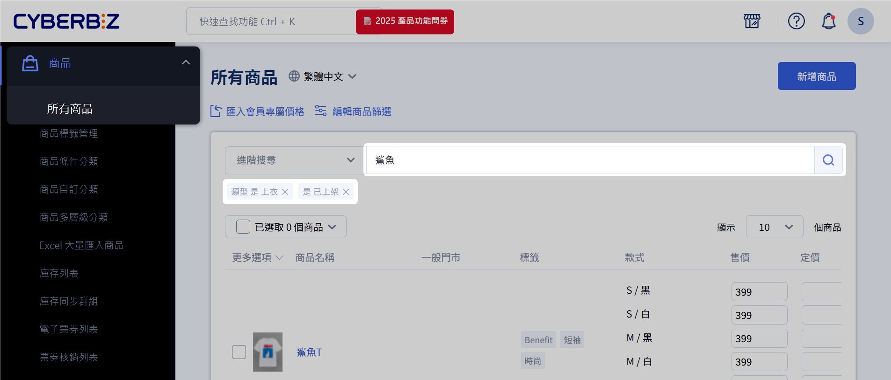
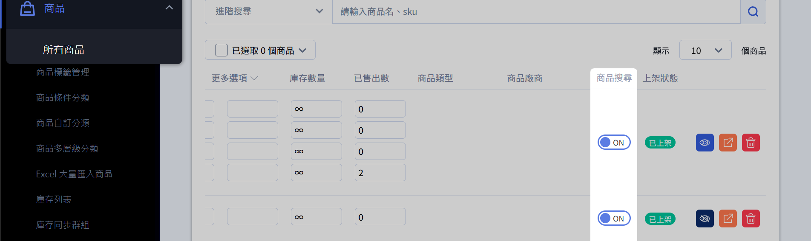

# 商品管理快速上手
掌握商品管理後台的基本操作，包括搜尋、篩選、批次操作。
{ .subtitle }

## 商品管理介面總覽
本頁面介紹「所有商品頁面」主要功能區塊與操作按鈕。

### 後台路徑
「商品」→「所有商品」

### 功能區塊
- 新增商品
- 篩選商品項目 / 進階搜尋 → [[後台搜尋商品]]
- 商品排除搜尋 → [[商品排除搜尋]]
- 批次操作 / 大量選取 → [[批次修改商品]]
- 調整顯示筆數
- 商品公開 / 隱藏
- 快速前往商品前台
- 刪除商品

=== ":material-link: 進一步操作"
- [[後台搜尋商品]] — 搜尋並篩選目標商品
- [[商品排除搜尋]] — 設定商品搜尋可見性
- [[批次修改商品]] — 對篩選結果進行批次操作

## 後台搜尋商品

### 關鍵字搜尋
輸入 *商品名稱* 或 SKU 快速搜尋商品。

1. 登入 CYBERBIZ 管理後台，前往 **商品 > 所有商品**。
2. 在頁面上方的搜尋欄位中，輸入欲查詢的 **商品名稱** 或 **SKU**。
3. 按下 ++enter++ 鍵或點擊「搜尋圖示」:material-magnify:，系統將顯示符合條件的商品列表。

### 進階條件篩選
使用篩選器套用多項特定條件，以精確定位目標商品。

1. 登入 CYBERBIZ 管理後台，前往 **商品 > 所有商品**。
2. 點擊搜尋欄位旁的 **進階搜尋**，展開下拉選單。
3. 點選一個或多個 **篩選群組欄位**，如 **商品類型**、**商品廠商**、**商品標籤**。
> 實際可使用的篩選群組欄位因 `方案` 或 `後台設定` 而異。
4. 選擇各欄位的篩選條件。
5. 點擊 **搜尋**，系統將顯示符合所有條件的商品列表。

#### 篩選欄位的條件運算邏輯
系統會依篩選欄位，自動套用對應的邏輯規則：

| 篩選群組欄位    | 套用邏輯               | 範例條件                 | 篩選結果說明                 |
| --------- | ------------------ | -------------------- | ---------------------- |
| **同欄位條件** | 聯集（OR 邏輯）：滿足任一條件即符合 | 類型：`衣服` 跟 `鞋子`       | 顯示所有屬於「衣服」或「鞋子」類型的商品   |
| **跨欄位條件** | 交集（AND 邏輯）：必須同時滿足所有條件 | 類型：`衣服` 且 上架狀態：`已上架` | 顯示同時符合「衣服」類型且「已上架」的商品。 |
	
### 組合搜尋條件
結合 **關鍵字搜尋** 與 **進階條件篩選**，設定多重篩選邏輯，鎖定符合複雜條件的特定商品。

1. 設定[進階篩選條件](#進階條件篩選)： 點擊搜尋欄位旁的 **進階搜尋**，選擇商品屬性或分類，點擊 **搜尋** 以套用篩選條件。
2. [輸入關鍵字]([#關鍵字搜尋)： 在搜尋欄位中輸入商品名稱或 SKU，按下 ++enter++ 鍵或點擊「搜尋圖示」（:material-magnify:）以進一步限縮搜尋結果。

## 商品排除搜尋
設定商品是否可被站內搜尋或 Google 索引。

1. 登入 CYBERBIZ 管理後台，前往 **商品 > 所有商品**。
2. 在商品列表中找到 **商品搜尋** 欄位。
> 若未顯示，請拖曳下方滾動條。
3. 啟用 / 關閉「排除搜尋」選項

!!! note "關閉商品搜尋效果"

	- CYBERBIZ 站內無法搜尋到該商品。
	- 前台 collection all 商品頁不顯示商品。
	- Google 搜尋引擎不索引。
	
	> 更多設定細節，請參考[設定商品排除搜尋](設定商品排除搜尋)。

## 大量選取商品批次修改商品
對篩選出的商品可進行批次操作，包括：
- 商品公開 / 隱藏
- 刪除商品
- 匯出商品
- 編輯會員專屬價格（高級方案）
- 複製商品至 POS 商店（POS 用戶）

![[商品管理介面08.png]]

## 如何批次選取商品？

可使用以下方式：

- 勾選單筆商品
- 勾選本頁所有商品
- 使用「選取全部符合條件的商品」

---

## 批次操作可以做哪些事？

選取後可執行：

- 公開 / 隱藏
- 刪除商品
- 匯出商品
- 開啟搜尋 / 排除搜尋
- 設定會員價格（特定方案）
- 複製至 POS 商店（特定方案）

---

## 全選與批次操作有什麼差異？

| 操作方式 | 影響範圍 | 適合情境 |
|----------|----------|----------|
| 批次操作 | 當頁商品 | 少量調整 |
| 全選 | 符合搜尋條件的所有商品 | 大量調整 |

## 快速上手 (Quickstart)
以下步驟可快速完成商品管理日常操作：

1. 登入 CYBERBIZ 後台 → [[商品管理介面總覽]]
2. 搜尋商品（關鍵字或進階篩選） → [[後台搜尋商品]]
3. 設定商品可見性 → [[商品排除搜尋]]
4. 批次操作 / 編輯商品 → [[批次修改商品]]
5. 檢查操作結果是否符合預期

---

## 常見問題
??? question "為什麼搜尋不到商品？"
- 確認關鍵字或 SKU 正確
- 檢查篩選條件過多
- 商品是否已刪除或不可見

??? question "搜尋結果可以匯出嗎？"
- 目前不支援直接匯出，請使用 Excel 匯出功能

??? question "可以儲存篩選條件嗎？"
- 系統不支援儲存，需重新設定

## 延伸閱讀
- [[商品管理介面總覽]]
- [[後台搜尋商品]]
- [[商品排除搜尋]]
- [[批次修改商品]]
