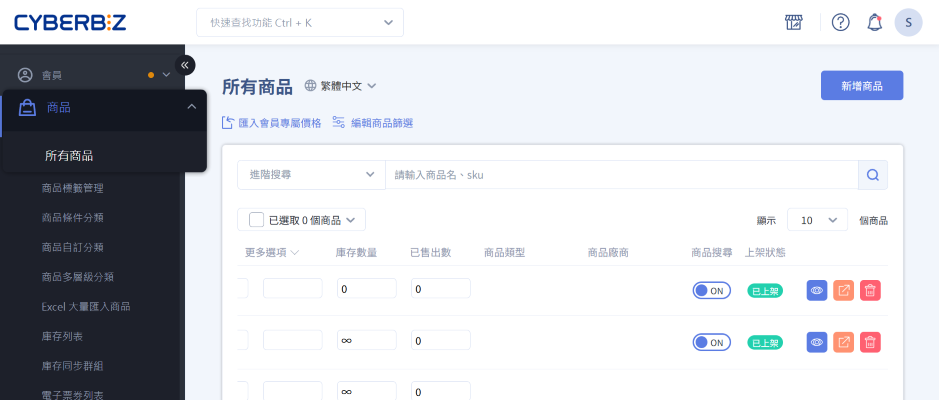

# 商品管理

 
<big>__開始使用__</big>  
管理商品與庫存資料。  
快速建立商品、管理分類與群組，並即時掌握庫存與補貨狀態。  
 
[了解基本操作 :lucide-circle-arrow-right:](商品管理快速上手#商品管理介面總覽)  

---

### 快速上手

- :lucide-search:{ .lg }     
	__搜尋與篩選商品__  
    [檢索商品](快速上手商品管理.md#後台搜尋商品)

- :lucide-check-square:{ .lg }     
	__批次管理商品__  
    [選取大量商品](快速上手商品管理.md#選取大量商品)  
    [匯出商品資料 Excel 表格](批次修改商品資訊#匯出商品-excel-表格)

- :lucide-eye:{ .lg }      
	__商品顯示控制__  
    [快速設定商品公開狀態](快速上手商品管理.md#快捷按鈕)  
    [將商品從搜尋中排除](設定商品排除搜尋)

---

### 上架商品

- :lucide-package-plus: __新增與更新商品__

	  ---
	  建立新商品或更新既有商品資訊與設定。  
	  [建立單一商品](archive/新增單一商品.md)  
	  [建立組合商品 :lucide-lock:](新增組合商品.md)  
	  [建立預購商品](設定多購物車.md#預購商品)

- :lucide-file-text: __商品內容設定__

	  ---
      設定商品標題、描述、規格與多媒體資源。  
	  [設定商品資訊](新增單一商品.md#操作流程)  
	  [編輯商品描述與設定](編輯商品描述與設定.md)  
	  [設定商品標語與簡述](編輯商品簡述與商品標語.md)  
	  [上傳商品影片 :lucide-lock:](設定商品影片)  

- :lucide-import: __Excel 批次匯入與更新__

	  ---
      以 Excel 大量建立或修改商品資料。  
	  [Excel 大量匯入商品](Excel 大量匯入商品.md)  
	  [批次修改商品資訊](批次修改商品資訊.md)  

- :lucide-refresh-cw: __第三方平台同步__

	  ---
      控制商品是否同步至外部平台。  
	  [排除上傳至第三方平台 :lucide-lock:](設定商品標籤#排除上傳至第三方平台標籤)

---

### 分類與群組

- :lucide-tag: __商品標籤管理__

	  ---
      建立與管理商品標籤，以利搜尋與分組。  
	  [商品標籤管理](設定商品標籤.md)

- :lucide-group: __商品群組__

	  ---
      依條件或分類管理商品集合。  
	  [自訂分類群組設定](設定商品分類群組.md)  
	  [條件分類群組設定](設定條件分類群組.md)  
	  [加價購設定](設定加價購群組.md)  
	  [不適用折扣群組設定 :lucide-lock:](設定不適用折扣群組.md)  
	  [單品限時折扣設定 :lucide-lock:](設定單品限時折扣群組.md)  

- :lucide-navigation: __導覽列與前台顯示__

	  ---
      管理前台分類排序與篩選功能。  
	  [商品多層級分類設定](設定商品多層級分類.md)  
	  [群組排序管理](設定前台商品群組排序.md)  
	  [群組篩選器](設定前台商品篩選器.md)

---

### 銷售與通知

- :lucide-circle-percent: __優惠與價格設定__

	  ---
      設定商品折扣、優惠與會員價格。  
	  [VIP 專屬價格設定](設定 VIP 會員專屬價格.md)  
	  [任選折扣群組設定](設定任選折扣群組.md)  
	  [單品限時折扣群組](設定單品限時折扣群組.md)  
	  [折扣類型指南](#)
	  
- :lucide-shopping-cart: __多購物車管理__

	  ---
      管理不同銷售通路與購物流程。  
	  [多購物車設定](設定多購物車.md)

- :lucide-bell: __商品到貨通知__

	  ---
      設定缺貨商品的到貨提醒。  
	  [商品貨到通知](設定商品到貨通知.md)

- :lucide-star: __評論與留言區管理__

	  ---
      管理顧客評論與互動功能。  
	  [啟用商品評論 :lucide-lock:](商品評論指南.md)  
	  [啟用留言區 reCAPTCHA :lucide-lock:](啟用留言區 reCAPTCHA.md)  

- :lucide-tag: __廣告管理__

	---
	[串接 Google 購物廣告](設定 Google 購物廣告)  
	[自動化廣告](設定自動化廣告)
	

---

### 配送物流

- :lucide-settings-2: __配送方式設定__

	  ---
      綁定商品適用物流。  
	  [一般宅配設定](設定商品配送屬性（一般宅配）.md)  
	  [宅配貨到付款設定](設定商品配送屬性（宅配貨到付款）.md)  
	  [自訂物流](#)

- :lucide-ban: __配送限制__

	---
    限制商品適用之物流選項。  
	[超商物流限制與排除設定](設定商品超商物流限制與排除選項.md)  
	

---

### 電子票券
[:lucide-lock:{ title="適用方案" }](../../resources/conventions#適用方案) | PLUS 企業

- :lucide-rocket: __快速設定__

	  ---
	  [電子票券設定指南](電子票券指南.md)  
	  [新增電子票券](電子票券指南#新增電子票券)

- :lucide-circle-percent: __票券優惠__

	---
	[票券優惠設定](電子票券優惠設定.md)  

- :lucide-key: __門市權限__

	---
    [建立電子票券門市店員帳號](電子票券指南#建立電子票券門市店員帳號)  
	[設定門市權限](設定電子票券門市權限.md)

---

### 常見問題

=== "資料與 Excel 匯入"

	??? quote "SKU 長度限制？"
		 每個 SKU 欄位最多可輸入 255 個字元。
	
	??? quote "Excel 大量修改商品資訊的功能，無法刪除款式是正常的嗎？"
		Excel 匯入商品沒有刪除的功能。 [Excel 大量匯入商品](Excel 大量匯入商品){ data-preview }
		
	??? quote "Excel 匯入商品如何判斷是否成功？"
	    匯入結果可依通知信判斷：

	    - *僅收到「失敗」信*：表示匯入在前期檢查即失敗，常見原因為檔案格式不符（非 `.xlsx`）。
	    - *先收到「成功」，再收到「失敗」*：表示匯入已通過前期檢查，但在逐列匯入時出現錯誤。可能原因包括欄位格式錯誤、匯入值不合法或指定 ID 不存在，請參考失敗通知信說明。
	    - *先收到「成功」，再收到「完成」*：表示匯入完成成功。但若 Excel 某列全空，該列及後續列將未被匯入，需商家自行修正。  
	      
	    [Excel 大量匯入商品](Excel 大量匯入商品#匯入-excel-檔案){ data-preview }

=== "配送與物流"

	??? quote "如果串倉的話，我可以將同一支商品建立出兩個不一樣的 SKU 嗎？"
		可以請峰潮以 *加工品* 的方式，將建立一個 *加工品品項* 後將原本商品加入此加工品中。

	??? quote "使用黑貓快速到店，商品到店時系統是否會發送簡訊或 Email 給消費者？"
		系統完全不會發送任何簡訊或 email 就算有開樣版也不包含在內，到店只有黑貓會傳簡訊通知消費者。

=== "分類與標籤"

	??? quote "前台導覽列的商品的分類一次最多可以顯示幾個？"
		最多 20 個。[設定商品分類群組](設定商品分類群組){ data-preview }

	??? quote "商品標籤已沒有綁定任何商品，但商品加價購仍有顯示未使用的商品標籤？"
		*一般版* 的商品標籤是無法完全刪除的，只有企業版能夠完全刪除。所以會導致一般版的商家在商品加價購會出現所有新增過的商品標籤。

