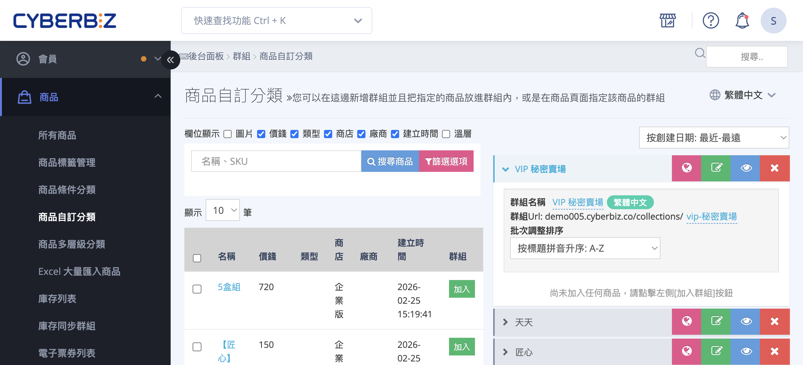

# 設定秘密商品群組

建立隱藏商品群組，透過專屬連結提供給特定顧客購買。
{ .subtitle }

{ .hero-page }

## 秘密群組說明

**秘密群組**（或稱秘密商店）主要用於提供不對外公開的連結給特定客群（如經銷商、團購主、員工等）進行購買。

以下是秘密群組設定的詳細操作說明與應用教學：

## 設定秘密商店（群組）步驟

1. **建立商品分類：** 進入管理後台，路徑為 **商品 > 商品自訂分類**。
2. **新增群組：** 點選右下角「新增群組」，輸入自訂名稱（例如：VIP 秘密賣場）。
3. **加入商品：** 從左側商品列表中勾選欲販售的商品加入該群組。

## 隱藏商品與避免搜尋之設定

為了確保一般消費者無法在官網找到秘密群組內的商品，需執行以下設定：

- [x] **關閉商品站內搜尋：**
    - 進入 **商品 > 所有商品** > 點進該商品頁面的 **商品資訊** 頁籤，或直接點擊秘密群組中的商品名稱，進入頁面。
    - 將「**商品搜尋功能**」設定為 **關閉**。
    - **影響範圍：** 官網搜尋框無法檢索、前台「所有商品 (Collection/All)」頁面不會顯示，且 Google 搜尋引擎不予收錄。

	

- [x] **導覽列規範：** 建立秘密商店後，**請勿** 將此群組連結設定於官網導覽列或選單中，以免一般使用者誤點進入。
- [x] **排除特定關鍵字（進階）：** 可透過修改程式碼 `search.liquid`，設定含有[特定字眼的商品不出現在搜尋結果中](../sales/設定搜尋結果中排除特定關鍵字商品.md){ data-preview }  。

## 秘密群組的應用情境

秘密群組常搭配「推薦人分潤」 功能使用，作為網紅或特定團主的導購工具：

- **專屬分潤連結：** 商家可將秘密群組的網址加上推薦人代碼（例如：`www.yourshop.com/collections/秘密群組?rcode=RAYTEST`）貼給特定對象。
- **特定用戶購買：** 只有持有該完整連結的用戶才能進入頁面下單，一般客戶無法透過搜尋找到該專區。

- :lucide-hand-coins:{ .lg }    
  [__推薦人分潤__](../../profit-sharing/設定推薦人分潤方案.md){ data-preview }     
  搭配推薦連結，追蹤第三方導購成效並計算分潤。

## 注意事項與建議

- **外部搜尋引擎風險：** 雖然商品已關閉站內搜尋，但「秘密群組頁」仍可能被 Google 搜尋引擎索引。
- **SEO 排除設定：** 若希望完全避免在 Google 搜尋結果中曝光，建議至 **Google Search Console** 設定排除該秘密群組頁面，阻擋外部搜尋。
- **恢復機制：** 若在修改程碼時發生錯誤，可利用編輯器中的「查看之前版本」功能[回溯至預設版本](../../website-appearance/使用樣板編輯器恢復網頁代碼.md){ data-preview }  。

## 相關操作

- :lucide-folder-plus:{ .lg }  
  [__商品自訂分類__](設定商品自訂分類群組.md){ data-preview }    
  自訂商品分類群組。

## 常見問題

??? quote "建立秘密群組後，商品會自動排除搜尋嗎？"
    不會。秘密群組僅是將商品歸類，您仍需手動進入商品編輯頁面，將群組內商品的「商品搜尋功能」設定為 `關閉 (OFF)`，才能排除站內搜尋。

??? quote "秘密群組的商品可以被一般顧客購買嗎？"
    如果一般顧客獲得了秘密群組的直接連結，並且該群組內的商品沒有設定「關閉站內搜尋」，那麼他們仍然可以訪問並購買。為確保專屬性，建議將群組內商品設定為排除搜尋。