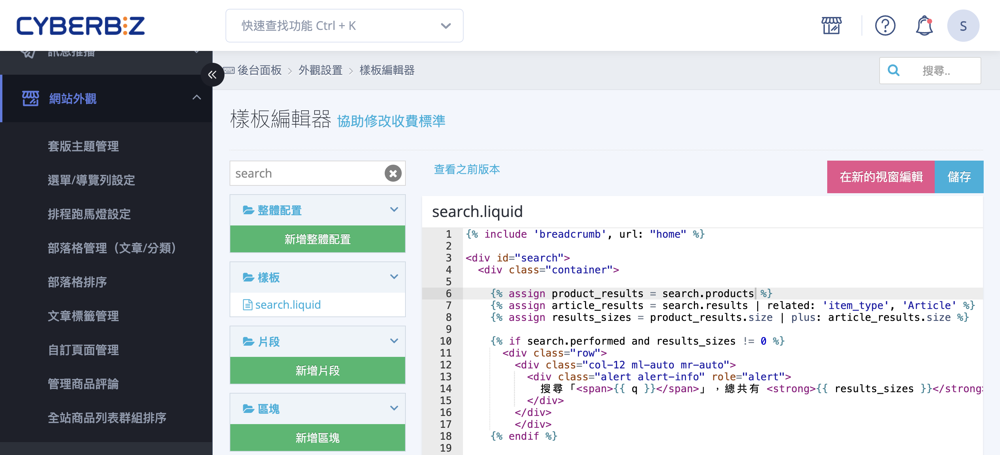
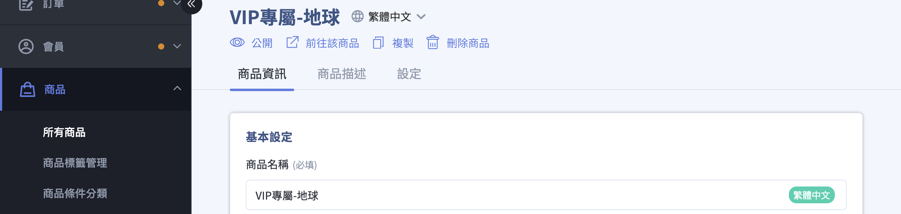

透過修改 Liquid 模板語法，在官網搜尋結果中排除特定關鍵字商品。
{ .subtitle }

[:lucide-bolt:{ title="適用功能" }](../../resources/conventions#適用功能) | 一般版型（舊版）
{ .doc-badge }

{ .hero-page }

## 搜尋排除特定關鍵字商品說明

您可以透過修改程式碼的方式，將包含特定關鍵字的商品（例如：加價購商品、團購專屬品、秘密賣場商品）從前台搜尋結果中排除。

以下為「搜尋功能排除特定關鍵字」的操作流程說明：

## 適用版本與限制

- **版型限制**：本教學 **僅適用於「預設版型（一般版型）」**，拖拉版型不適用此方法。
- **責任說明**：官方提供程式碼編輯權限，但不提供語法教學或代碼撰寫服務，若修改有誤請利用恢復功能回溯版本。

## 操作步驟

1. **進入路徑**：登入 CYBERBIZ 管理後台，前往 **網站外觀 > 套版主題管理 >CSS/HTML 編輯器**。
2. **搜尋檔案**：在編輯器中搜尋並點開 **`search.liquid`** 檔案。
3. **修改程式碼**：
    - 在檔案中找到這一行：``。
    - 將其修改為： ``。
    - **運作邏輯**：只要商品名稱中含有您設定的「特定名稱1」或「特定名稱2」字眼（如 VIP 專屬），該商品就不會出現在前台搜尋結果中。

	```liquid title="search.liquid" hl_lines="6"
	<div id="search">
	  <!-- search container start -->
	  <div class="container">
	
	  <!-- resolve search.results -->
	  
	  
	  
	  
	  
	    
	  
	  
	  <!-- 有搜尋結果 -->
	```

4. **商品名稱設定**：回到 **商品 > 所有商品**，將您想排除搜尋的商品 **修改品名**，加入您在程式碼中設定的指定關鍵字在商品名稱前（如 VIP 專屬-地球）。

	

5. **測試成果**：設定完成並儲存後，可至官網前台使用放大鏡搜尋該關鍵字商品，確認是否已成功隱藏。

## 注意事項

- **精準設定**：請確保程式碼中的關鍵字與商品品名中的關鍵字完全一致。
- **恢復機制**：若修改後導致頁面異常，可點擊編輯器中的 **查看之前版本**，可[回溯至先前版本](../../website-appearance/使用樣板編輯器恢復網頁代碼.md#操作步驟){ data-preview }。


## 後續操作

<div class="grid cards" markdown>

- :lucide-eye-off:{ .lg }   
  [__秘密商品群組__](../organization/設定秘密商品群組.md){ data-preview }       
  搭配「秘密群組」使用，讓特定客群可透過直接連結購買，但一般消費者無法透過站內搜尋找到該商品。

- :lucide-rotate-ccw:{ .lg }     
  [__恢復樣板版本__](../../website-appearance/使用樣板編輯器恢復網頁代碼.md){ data-preview }    
  透過版本紀錄將樣板還原至特定時間點。

</div>

## 常見問題

??? quote "如果我想排除多個不同的關鍵字，該如何撰寫程式碼" 
	您可以透過連續使用 `| without: "title", "關鍵字"` 語法來達成。例如，若要同時排除包含「加價購」與「測試品」的商品，語法如下： ``。

??? quote "為什麼我修改了程式碼，搜尋結果還是看得到該商品" 
	請檢查以下三點：
	
	 1. **關鍵字完全一致**：程式碼中的字串（如「VIP」）必須與商品名稱中的字眼完全相同（包含全形半形、大小寫）。 
	 2. **變數覆蓋**：請確認在 `search.liquid` 下方渲染商品列表的地方，使用的是 `product_results` 這個變數，而非原始的 `search.products`。 
	 3. **快取延遲**：有時瀏覽器或系統快取會導致更新延遲，請嘗試開啟「無痕視窗」重新測試。

??? quote "排除關鍵字後，會影響 SEO 搜尋引擎（如 Google）的抓取嗎" 
	**不會。** 此修改僅作用於 CYBERBIZ 站內的搜尋引擎邏輯（Liquid 渲染層次）。Google 等外部搜尋引擎仍會根據您的商品頁面進行索引。若要完全防止 Google 抓取該頁面，需另外設定 `noindex` 標籤。

??? quote "我可以改用「商品標籤 (Tag)」來排除商品嗎" 
	可以。若要改用標籤排除，請將語法中的 `"title"` 修改為 `"tags"`。例如： ``。 這樣只要商品標籤含有 `Hidden`，就不會出現在搜尋結果中，且不會影響前台顯示的商品標題美觀。

??? quote "這項設定會影響「所有商品」分類頁面的顯示嗎" 
	**不會。** 此修改僅針對 `search.liquid`（搜尋結果頁）。如果您希望在「所有商品」或特定「分類頁」也隱藏這些商品，需同步修改 `collection.liquid` 內對應的邏輯。
