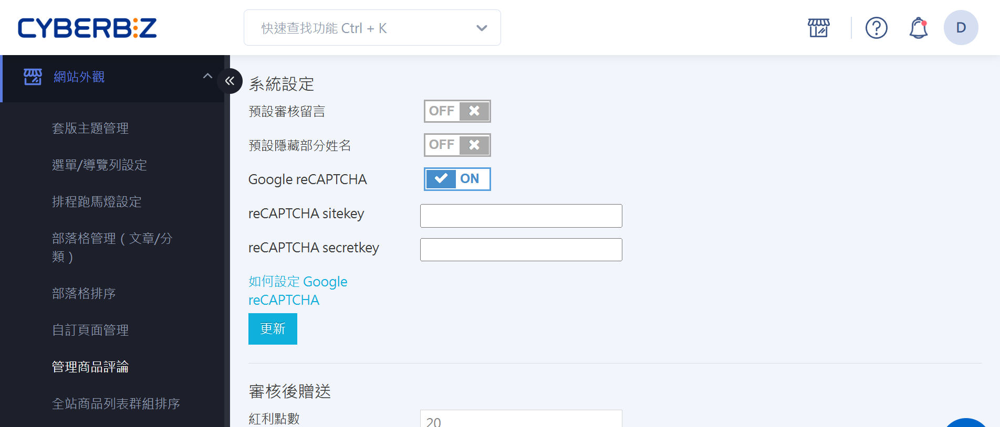
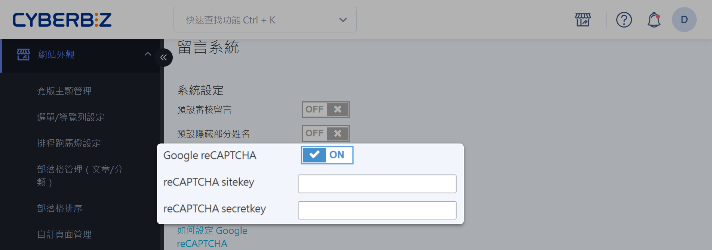
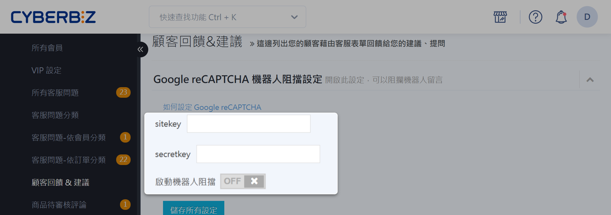

# 啟用留言區 reCAPTCHA

啟用 Google reCAPTCHA 防止機器人訊息及垃圾留言，保護留言區，提升網站安全性及顧客互動品質。 
{ .subtitle }

[:lucide-toggle-right:{ title="適用功能" }](../../resources/conventions#適用功能) | 拖拉版型

{ .hero-page }

## 什麼是 reCAPTCHA？

reCAPTCHA 是 Google 提供的安全驗證服務，用於區分真人與自動化程式操作，保護網站表單、留言區與交易流程免受機器人攻擊。

啟用 reCAPTCHA 可帶來以下助益：

- **防範垃圾留言**：降低商品評論區與聯絡表單遭自動化濫用的風險。  
- **提升網站安全性**：辨識非人類操作，減少詐欺與惡意行為。  
- **維護互動品質**：確保提交內容的真實性，改善整體使用體驗。

更多資訊請參閱 [reCAPTCHA 官方文件 :material-open-in-new:](https://cloud.google.com/security/products/recaptcha?hl=zh_tw)。

## 使用須知

### 適用範圍

- [x] 商品頁面評論區。
- [x] 聯絡我們頁面。

### 費用
- Google reCAPTCHA 提供免費用量配額，若超出免費用量，顧客將無法進行留言。
> 達到免費用量上限前，Google 會透過電子郵件通知商家。
- 更多資訊，請看[配額與限制 :material-open-in-new:](https://docs.cloud.google.com/recaptcha/quotas?hl=zh-tw)

## 操作流程

### 申請 reCAPTCHA 金鑰

1. 前往 [Google reCAPTCHA 管理控制台 :material-open-in-new:](https://www.google.com/recaptcha/admin/)，並登入您的 Google 帳號。
2. 依序填寫註冊資訊：
	- **標籤**：依您的需求命名此 reCAPTCHA （例如：`您的商店名稱_reCAPTCHA`）。  
	- **reCAPTCHA 類型**：選擇「驗證問題」，並勾選「隱形 reCAPTCHA 標記」[^隱形 reCAPTCHA]。  
	- **網域**：輸入您的官網網址。
	> :lucide-triangle-alert: 請勿填入網址前綴 `https://` 與後綴 `/...`。  
	> 例如：若您的官網網址為 `https://_demo1234.cyberbiz.co_ /zh-TW`，請僅填入 `_demo1234.cyberbiz.co_`。

	- **Google Cloud Platform**：依您的需求選擇專案。  

3. 點擊 **提交** 按鈕，取得 Google reCAPTCHA 的 **網站金鑰 (sitekey)** 與 **密鑰 (secretkey)**。

4. 複製並妥善保存 **網站金鑰** 跟 **密鑰**，後續將用於綁定步驟。

{ .screenshot }

### 綁定 reCAPTCHA 金鑰至商品評論區
[:lucide-lock:{ title="適用方案" }](../../resources/conventions#適用方案) | PLUS / 企業

!!! info "商品評論為 *企業版* 及 *PLUS版* 用戶限定功能，若有需求請洽客服人員開通，相關設定請參閱 [如何管理商品評論](管理商品評論.md)。"

1. 登入 CYBERBIZ 電商後台，前往 **網站外觀 > 管理商品評論**。
2. 點擊 **Google reCAPTCHA** 開關，以開啟功能（ON）。
3. 貼上金鑰：
	- **reCAPTCHA sitekey**：將在申請過程中取得的 **網站金鑰** 填入此欄位。  
	- **reCAPTCHA secretkey**：將在申請過程中取得的 **密鑰** 填入此欄位。  
4. 點擊 **更新** 套用變更。

### 綁定 reCAPTCHA 金鑰至聯絡我們頁面

1. 登入 CYBERBIZ 管理後台，前往 **會員 > 顧客回饋 & 建議**。
2. 點擊 **啟動機器人阻擋** 開關，以開啟功能（ON）。
3. 貼上金鑰：
	- **sitekey**：將申請過程中取得的 **網站金鑰** 填入此欄位。  
	- **secret key**：將申請過程中取得的 **密鑰** 填入此欄位。
4. 點擊 **儲存所有設定** 套用變更。

## 常見問題
??? quote "一組 Google reCAPTCHA 帳號可以綁定多個網域嗎？"
    是的，一組 Google reCAPTCHA 帳號可以綁定多個網域。您可以使用同一組密鑰綁定商品評論與聯絡我們頁面。

??? quote "Google reCAPTCHA 有免費用量配額嗎？"
    Google reCAPTCHA 提供免費用量配額。當達到免費用量上限前，Google 會透過電子郵件通知商家。若超出免費用量，顧客將無法進行留言，請自行向 Google 升級方案。了解相關[費用](#費用)。

??? quote "如果金鑰填寫錯誤會怎麼樣？"
    請確保金鑰填寫正確，否則留言功能將無法正常使用。如有錯誤訊息 (如下圖)，請檢查金鑰是否填寫無誤。

    

??? quote "此 reCAPTCHA 功能是否適用於所有版型網站？"
    此功能僅限拖拉版型網站使用。

## 延伸閱讀

- [設定商品評論功能](#)

[^隱形 reCAPTCHA]: 隱形 reCAPTCHA 可在顧客互動時自動判斷是否為機器人，通常不會打斷顧客操作，僅在系統判斷為可疑時才出現驗證題目。這能同時減少顧客操作干擾，並提升網站防護力。