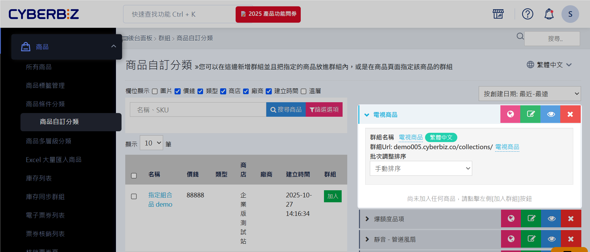
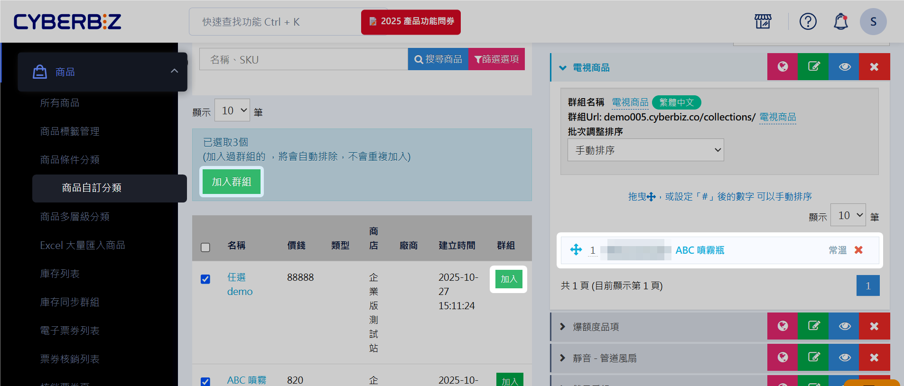
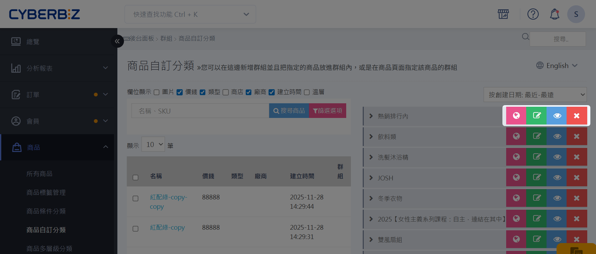
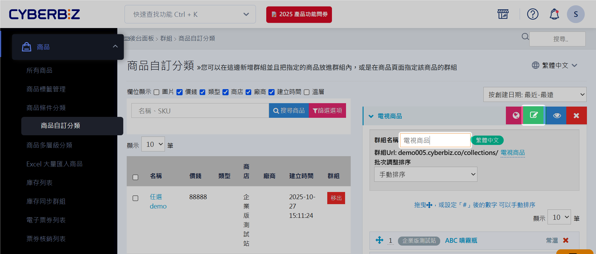
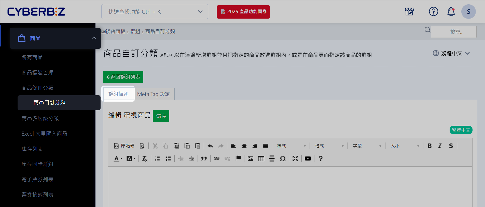
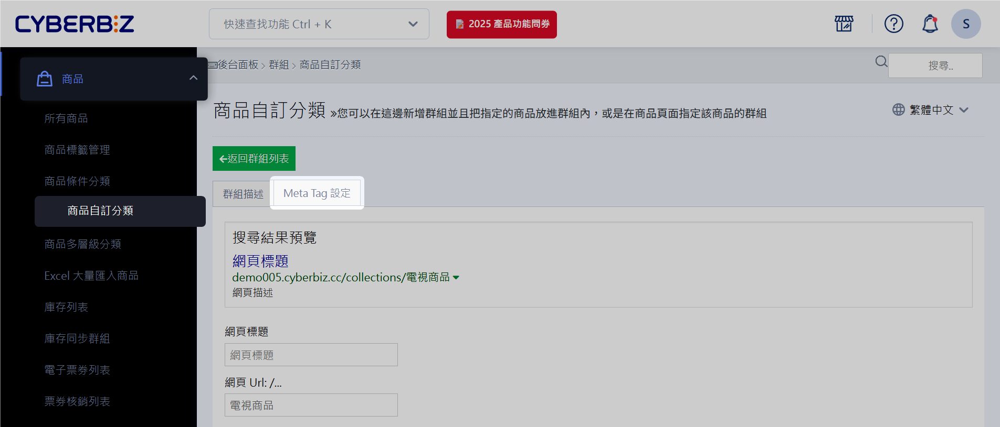

# 建立商品自訂分類群組
自訂分類群組手動整理商品，優化商店頁面、支援行銷活動並提升 SEO 可見性。
{ .subtitle }

{ title="自訂商品分類群組：商品 > 商品自訂分類" .hero-page }

!!! tip "應用情境"
	- 商品歸類與頁面優化：手動勾選商品，將其歸類至自訂分類，使商店頁面更整齊，提升消費者查找商品的便利性。
	- 行銷活動應用：可針對特定分類商品進行行銷活動，例如[單品限時折扣](設定單品限時折扣群組)，有效提升銷售效果。
	- SEO 優化：各自訂分類可獨立設定分類描述與關鍵字，優化 SEO 表現，讓商品更容易被搜尋引擎找到。

## 商品自訂分類介面說明

登入 CYBERBIZ 管理後台，前往 **商品 > 商品自訂分類**，即可進入商品自訂分類管理介面。

介面功能說明如下：

- 欄位顯示：依需求勾選要顯示於商品列表中的商品欄位。
- 搜尋商品：輸入關鍵字（商品名稱或 SKU）以快速搜尋商品。
- 篩選選項：依商品類型、廠商、商品標籤或商家等條件篩選商品。點擊可展開篩選條件進行設定。
- 商品列表：顯示符合目前搜尋與篩選條件的商品。
- 群組列表：顯示已建立的分類群組，可編輯群組名稱、網址與商品排序方式。

### 篩選商品

## 將商品加入分類群組

1. 在群組列表下方欄位中輸入欲新增的群組名稱。
2. 點擊 **新增群組** 按鈕，建立新的商品分類群組。
3. 在群組列表中，點擊欲新增商品的分類群組名稱。
> 被選取的分類群組會展開顯示相關資訊。

	
	
4. 使用關鍵字（名稱、SKU）搜尋商品或設定條件篩選項目定位目標商品。
> 更多細節，請看如何[篩選商品建立分類群組](篩選商品建立分類群組)。
	- 單筆加入：勾選欲加入選定群組的單一商品，點擊「加入」。
	- 批次加入：勾選多個商品後，點擊「加入群組」。
	
5. 成功加入的商品會顯示於右方展開的商品群組清單中，顯示所屬商店、名稱及溫層等資訊。

	

**移出商品**

- 單筆移出：勾選欲加入選定群組的單一商品，點擊「移出」。或點擊右方商品群組清單中的 :material-close:。
- 批次移出：勾選多個商品後，點擊「移出群組」。

	

**快捷按鈕功能**

-  :material-earth:  **瀏覽群組頁**：點擊前往官網前台，查看該群組的展示畫面。
- :material-square-edit-outline:  **編輯群組**：點擊進入群組編輯頁面，設定群組描述與 Meta Tag。
- :material-eye: **切換公開狀態**：點擊切換群組在前台的顯示狀態。
- :material-close: **刪除群組**：點擊移除選定的商品群組。

**排序商品**  

1. 點擊 **調整排序** 下拉選單，依據需求選擇預設選項自動排序或手動排序。
2. 選擇 **手動排序**，然後點擊 :material-arrow-all: 拖曳商品以調整順序。

> :lucide-triangle-alert: 若 *商品名稱* 包含系統不支援的標點符號，可能導致排序功能無法正常運作。點擊名稱可進入編輯頁面修改。

## 編輯分類描述與 SEO 設定

1. 在 CYBERBIZ 管理後台，前往 **商品 >商品自訂分類**，選擇欲編輯的群組，然後點擊 **編輯群組** :material-square-edit-outline:。
> 點擊「群組名稱」可直接對其編輯。

	

2. 在 **群組描述** 頁籤的編輯器中，輸入或修改商品群組的文字描述。
3. 完成編輯後，點擊 **儲存** 套用變更。

	

4. 設定群組頁橫幅  
> 在前台商品群組頁設計置頂橫幅，作為行銷活動或重點資訊的展示區塊。
	
	- 點擊 **群組描述** 頁籤。
	- 在編輯器內新增圖片、影片及相關文字敘述等。

	

	
	- 
	- 

	

5. 設定 Meta Tag
> 在 **Meta Tag 設定** 頁籤中，設定商品群組的關鍵字與 SEO 相關資訊，以提升搜尋引擎排名。

	

## 後續步驟

- :lucide-menu:{ .lg }  
   [__POS 前台選單設定__](#)  
   設定 POS 商品多層級分類，並建立商品自訂分類或商品類型。  
   [POS](){ .md-button .extension-tag }
- :lucide-filter:{ .lg }   
  [__智慧分類群組__](設定條件分類群組)  
  設定條件讓系統自動將商品分類。

## 常見問題

??? quote "前台導覽列的商品的分類一次最多可以顯示幾個？"
	最多 20 個。

??? quote "商品群組可以設定多層級分類嗎？"
    商品自訂分類目前不支援多層級設定。若您需要多層級分類，建議參考 POS 商品多層級分類功能。

??? quote "如果我刪除了商品群組，群組內的商品會被刪除嗎？"
    不會。刪除商品群組僅會移除該分類群組，群組內的商品仍會保留在您的商品列表中。

## 延伸閱讀
- [設定條件分類群組](設定條件分類群組)
- [設定單品限時折扣群組 :material-lock-outline:](設定單品限時折扣群組) 
- [設定網站選單與導覽列](設定網站選單與導覽列)
- [設定 POS 前台選單](設定 POS 前台選單)
