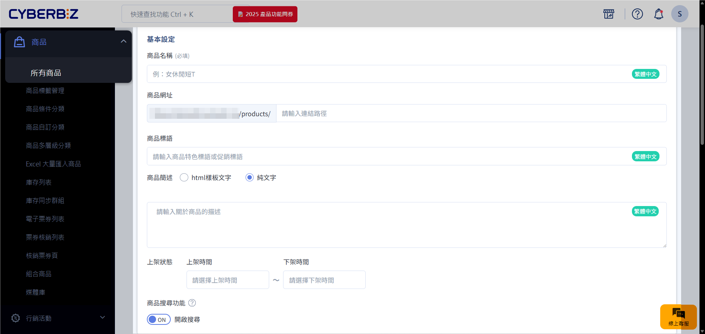
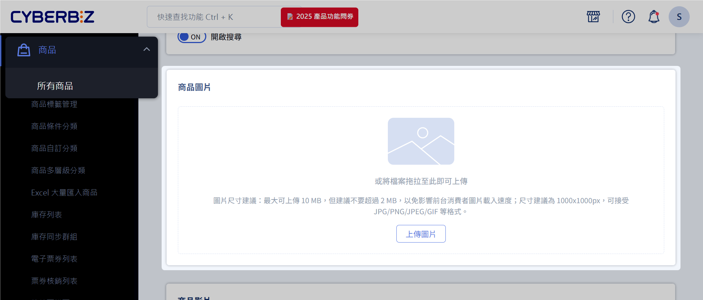
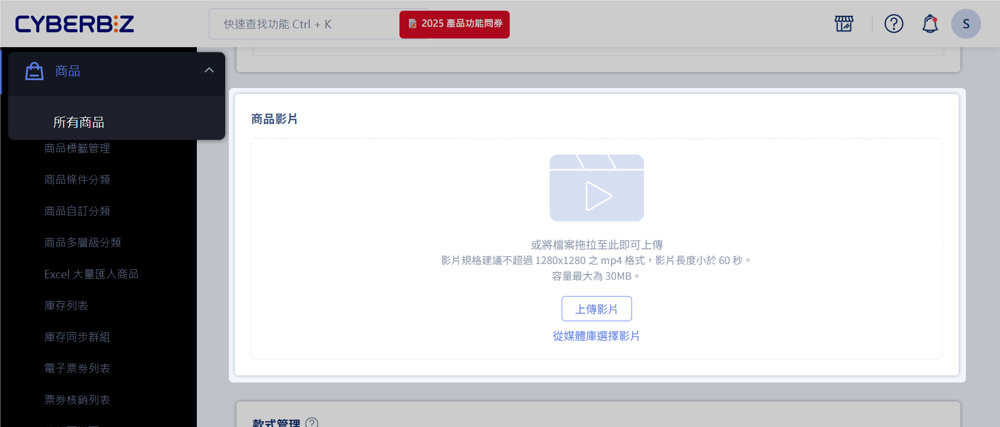
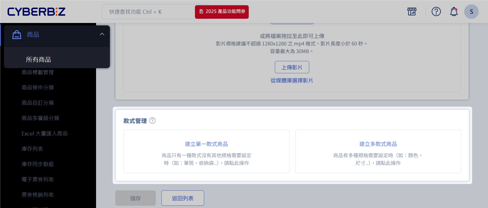

# 新增單一商品

建立並設定單一商品的基本資訊、圖片、影片與款式，完成上架流程。

??? tip "一次新增或上架多個商品？"
    透過 [Excel 大量匯入商品](Excel 大量匯入商品) 功能，您可以一次性上傳或更新多筆商品資訊，並快速套用相同欄位設定。

## 操作流程
1. 登入 CYBERBIZ 管理後台，前往 **商品 > 所有商品 > 新增商品**。
2. 依序填寫商品相關資訊：[基本設定](#基本設定)、[商品圖片](#商品圖片)、[商品影片](#商品影片)、[款式管理](#款式管理)。
3. 點擊 **儲存**，商品將依上架狀態所設定的時間自動上架或延後上架。	 

### 基本設定

| 欄位     | 功能說明         | 系統行為 / 備註                                         |
| ------ | ------------ | ------------------------------------------------- |
| 商品名稱（必填）   | 設定商品名稱       | 避免使用特殊符號（如 `\|` 或 `”`），不可使用 HTML。                 |
| 商品網址   | 設定商品頁面 URL   | 建議使用英文網址，有助於 SEO 與 GA 分析；若未設定，系統將自動套用 `商品名稱` 作為網址 |
| 商品標語   | 顯示於「商品頁面」的簡短文字  | 顯示於「商品頁面」，進階設定請參考[編輯商品標語與商品簡述](編輯商品標語與商品簡述)。                 |
| 商品簡述   | 簡短說明商品重點賣點   | 建議以 1–3 句呈現，避免過長段落與冗餘格。進階設定請參考[編輯商品標語與商品簡述](編輯商品標語與商品簡述)。 |
| 上架狀態   | 設定商品上架及下架時間  | 未填寫 → 商品永久上架 非上架時間 → 頁面顯示 404                  |
| 商品搜尋功能 | 設定商品是否可被站內搜尋 | `ON`：可被搜尋 `OFF`：無法被搜尋，但仍可透過「商品連結」供部分顧客購買。了解[商品排除搜尋效果](設定商品排除搜尋#適用範圍){ data-preview }        |

> 更多商品相關資訊設定，請參考[商品詳細資訊設定](#)。

### 商品圖片

#### 圖片規格
- 尺寸建議：1000 × 1000 像素 (px)。
- 檔案大小：最大 10 MB，建議不超過 2 MB，以提升網站載入效能。
- 平台兼容：可參考[設定 Google 購物廣告](#)，並提升廣告成效。

#### 上傳方式

=== ":material-file-upload-outline: 點選檔案"

	1. 點擊 **上傳圖片** 按鈕。
	2. 選取欲上傳的商品圖片檔案。
	3. 點擊 **開啟**，圖片即上傳完成。

	{ .screemshot }

=== ":material-drag: 拖曳檔案"

	1. 將圖片直接拖曳至上傳區域。
	2. 放開滑鼠，圖片會自動上傳。

	{ .screenshot }

### 商品影片
:lucide-lock:{ title="適用方案" } | PLUS 企業  :lucide-toggle-right:{ title="適用功能" } | 拖拉版型

> 商品影片功能僅適用 `PLUS 版` 跟 `企業版` 用戶，以及 `拖拉版型` 網站。詳細設定參考[設定商品影片](設定商品影片)。

#### 影片規格
為確保影片能順利上傳、處理及於前台正常播放，請遵循以下技術規格：

| 規格項目     | 限制 / 說明             |
| -------- | ------------------- |
| **解析度**  | 最大支援 1280 × 1280 像素 |
| **建議比例** | 9:16[^商品影片比例]            |
| **影片格式** | 僅支援 MP4 格式          |
| **影片長度** | 最長 60 秒             |
| **檔案大小** | 最大 30 MB[^商品影片大小]        |
| **音訊支援** | 不支援音訊輸出[^商品影片音訊限制]         |

#### 上傳方式

=== ":material-package-variant-closed-plus: 新增商品時上傳影片"
	1. 登入 CYBERBIZ 管理後台，前往 **商品 > 新增商品**。
	2. 填寫[商品基本資訊](新增單一商品#基本設定)。
	3. 在商品影片區塊點擊 **上傳** 按鈕，選擇本機影片檔案。
	4. 確認影片與商品資訊無誤後，點擊 **儲存**。
	5. 系統將處理影片上傳，請耐心等待完成。
	
=== ":material-movie-plus-outline: 為既有商品新增影片"
	1. 登入 CYBERBIZ 管理後台，前往 **商品 > 新增商品**。
	2. 在商品列表中，點擊欲編輯的商品名稱，進入商品編輯頁面。
	3. 在商品影片區塊點擊 **上傳** 按鈕，選擇本機影片檔案。
	4. 確認影片正確後，點擊 **儲存**。
	5. 系統將處理影片上傳，請耐心等待完成。

### 款式管理

#### 單一款式商品
適用於無多種顏色、尺寸等規格的商品。

=== "價格與庫存設定"

	{ .screenshot }
	
	| 欄位 | 說明 | 備註 / 版本差異 |
	|------|------|----------------|
	| 售價 | 實際銷售金額 | 必填 |
	| 定價 | 建議售價 |  |
	| 成本價 | 供內部分析使用 | `專業版` 與 `專業PLUS版` 不適用 |
	| 紅利折抵 | 可參考[紅利購物金設定](#) | 需設定才能折抵 |
	| SKU | 商品編號 | 串倉、POS 系統必填 |

=== "庫存管理"

	{ .screenshot }

	| 欄位 | 說明 | 備註 / 版本差異 |
	|------|------|----------------|
	| 管理庫存 | 開啟後可設定下列欄位 |  |
	| 庫存量 | 可販售數量 |  |
	| 安全庫存水位 | 低於此數量時通知商家 | 後台路徑：訊息推播 → **Email 通知樣板** ([查看圖片](#)) |
	| 庫存不足時 | 設定為 `停止銷售` 或`繼續銷售` | `停止銷售`：避免超賣，若仍想購買，可使用「聯絡店家」。 `繼續銷售`：允許預購商品。 |

	

	
	- { title="停止銷售" }
	- { title="預購商品" }
	
	

	!!! tip "庫存不足時繼續銷售，即為預購商品"
		若將商品「庫存不足時」設定為 *繼續銷售*，系統會將該商品視為 *預購商品*，即使庫存不足，顧客仍可下單，詳情請看[設定預購商品](設定多購物車#預購商品)。一般現貨商品，「庫存不足時」設定請使用 *停止銷售* 以避免超賣。  

=== "收貨與物流"

	{ .screenshot }

	| 欄位 | 說明 | 範例 / 備註 |
	|------|------|-------------|
	| 收貨地址 | 是否需填寫地址 | 一般網購商品建議填寫，可選擇 `不需填寫` |
	| 材積 | 包裹長 + 寬 + 高 ≤ 上限值[^台灣材積算法] | - 材積 > 105 cm → 僅可宅配 - 材積 > 150 cm → 宅配可分箱並加印託運單 - 詳見 [超商排除材積](#) |
	| 重量 | 商品重量 | - 超商 ≤ 5 kg - 宅配 ≤ 20 kg - 海外物流依重量計價 |
	| 產品廠商編號 | 可註記廠商編號 | 方便內部管理與物流使用 |

	!!! example "材積計算範例"
        假設寄送一箱月餅禮盒，5 盒/箱，超商材積限制 105 公分。 
	
		| 單盒材積 | 總材積計算 | 判斷結果 | 配送方式 |
		|----------|------------|----------|----------|
		| 20 公分  | 20 × 5 = 100 < 105 | :material-check: 符合超商材積限制 | 超商取貨 |
		| 25 公分  | 25 × 5 = 125 > 105 | :material-close: 超過限制 | 宅配 |

#### 多款式商品
適用於具有多種規格（如顏色、尺寸）的商品。

1. 設定商品規格與每組項目，每組至少需有一個項目。

	{ .screenshot }
	
2. 可修改欄位名稱及商品屬性。

	{ .screenshot }
	
3. 完成設定後，各款式可單獨管理售價、庫存與 SKU。

	{ .screenshot }

## 常見問題

??? quote "商品名稱可以使用特殊符號或 HTML 嗎？"
    商品名稱**不可使用特殊符號**（如 `\|` 或 `”`），也**不可使用 HTML 標籤**。請使用純文字設定商品名稱。

??? quote "CKEDITOR 編輯器支援哪些功能？"
    CKEDITOR 編輯器主要支援**文字排版、圖片與連結編輯**。若需更進階的排版功能，建議使用拖拉版型。

??? quote "多款式商品設定時，每組款式項目有數量限制嗎？"
    多款式商品設定時，**每組款式至少需有一個項目**。例如，若設定「顏色」為款式，則至少需新增一個顏色選項。
    
## 延伸閱讀

- [批次修改商品資訊](批次修改商品資訊)   
- [設定商品排除搜尋](設定商品排除搜尋)  

[^既有商品定義]: 已經在後台完成建立並具備所有必要欄位內容的銷售品項。
[^台灣材積算法]: 此為台灣國內物流材積的計算方式。
[^批次匯入注意]: 批次匯入前，請先熟悉單一商品的欄位設定與規格要求，以確保批次資料正確。 
[^商品影片比例]: 此比例最佳化於 Facebook 廣告版位，提供更佳觀看體驗。
[^商品影片大小]: 影片於前台的載入速度會受使用者網路影響，建議在符合規格下盡量壓縮檔案。
[^商品影片音訊限制]: 所有上傳影片將以靜音模式播放。
