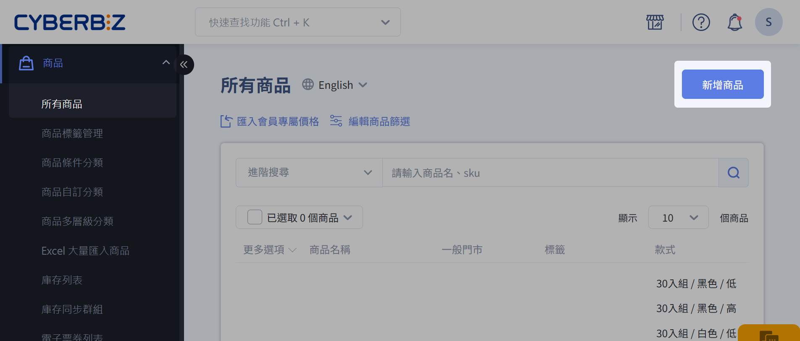
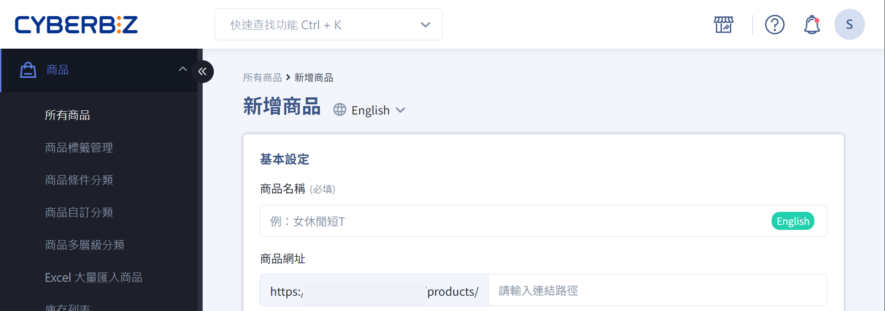
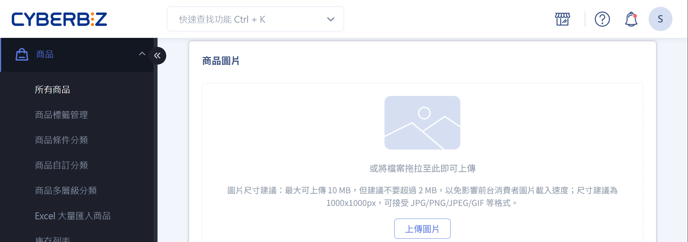
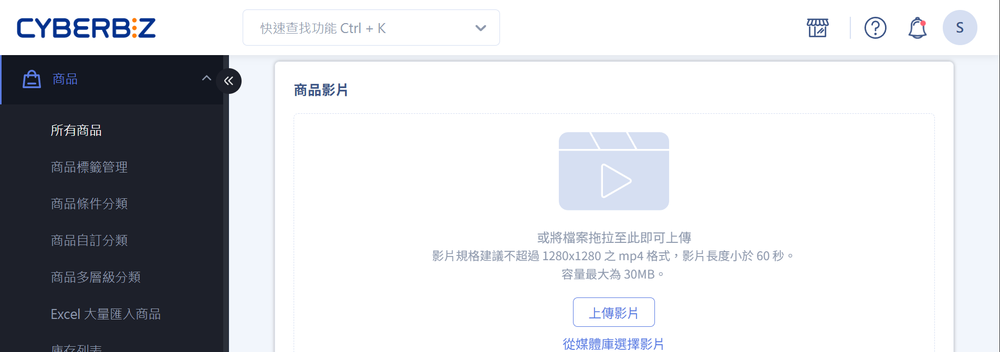
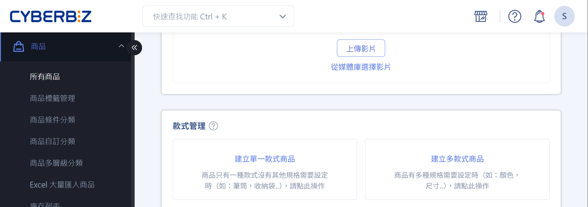
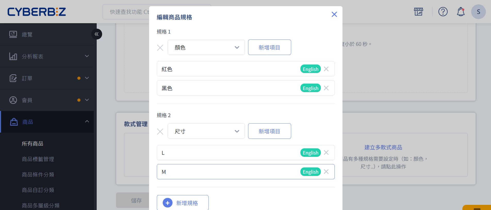
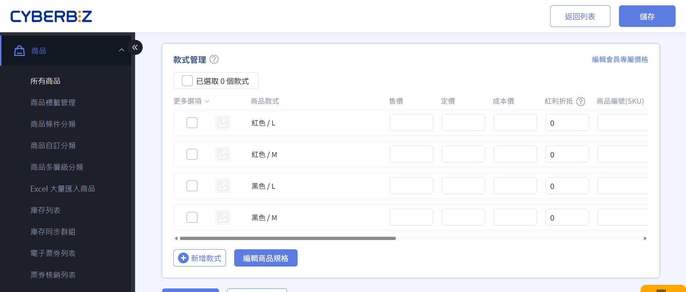
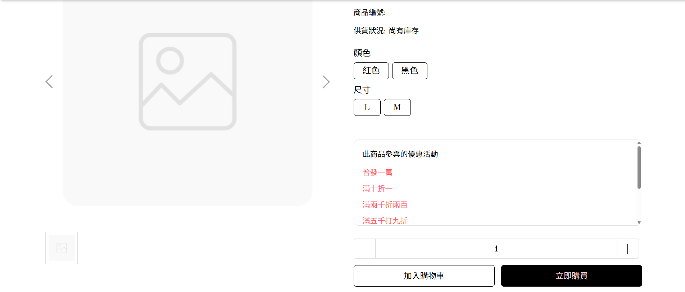
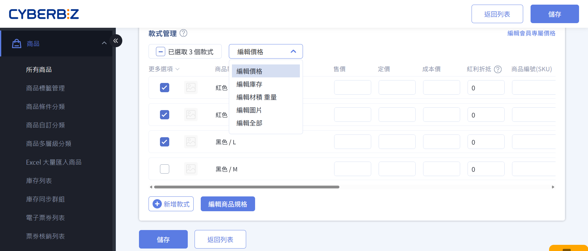

# 新增單一商品

建立並設定單一商品的基本資訊、圖片、影片與款式，完成上架流程。
{ .subtitle }

{ title="新增商品： 商品 > 所有商品 > 新增商品" .hero-page }

## 操作流程
1. 登入 CYBERBIZ 管理後台，前往 **商品 > 所有商品 > 新增商品**。
2. 依序填寫商品相關資訊：
	- [基本設定](#基本設定)
	- [商品圖片](#商品圖片)
	- [商品影片](#商品影片)
	- [款式管理](#款式管理)
3. 點擊 **儲存**，商品將依上架狀態所設定的時間自動上架或延後上架。	 

### 基本設定
{ title="商品基本設定：商品 > 所有商品 > 新增商品 > 基本設定" }

| 欄位     | 功能說明         | 系統行為 / 備註                                         |
| ------ | ------------ | ------------------------------------------------- |
| 商品名稱:lucide-asterisk:   | 設定商品名稱       | 避免使用特殊符號（如 `|` 或 `”`），不可使用 HTML。                 |
| 商品網址   | 設定商品頁面 URL   | 建議使用英文網址，有助於 SEO 與 GA 分析。 若未設定，系統將自動套用 *商品名稱* 作為網址 |
| 商品標語   | 顯示於 *商品頁面* 的簡短文字  | 顯示於商品頁面。[了解進階設定](編輯商品標語與商品簡述.md){ data-preview }。                 |
| 商品簡述   | 簡短說明商品賣點   | 建議以 1–3 句呈現，避免過長段落與冗餘格。[了解進階設定](編輯商品標語與商品簡述.md){ data-preview }。 |
| 上架狀態   | 設定商品上架及下架時間  | 未填寫 → 商品永久上架 非上架時間 → 頁面顯示 404。                  |
| 商品搜尋功能 | 設定商品是否可被站內搜尋 | *ON*：可被搜尋 *OFF*：無法被搜尋，但仍可透過 *商品連結* 供部分顧客購買。[了解更多](設定商品排除搜尋#適用範圍)。        |

### 商品圖片

{ title="商品圖片：商品 > 所有商品 > 新增商品 > 商品圖片" }

- 尺寸建議：1000 × 1000 像素 (px)。
- 檔案大小：最大 10 MB，建議不超過 2 MB，以提升網站載入效能。
- 平台兼容：可參考[設定 Google 購物廣告](#)，並提升廣告成效。

### 商品影片
[:lucide-lock:{ title="適用方案" }](../../resources/conventions#適用方案) | PLUS 企業  [:lucide-toggle-right:{ title="適用功能" }](../../resources/conventions#適用功能) | 拖拉版型

| 規格項目     | 說明             |  備註 |
| -------- | ------------------- | --- | 
| **解析度**  | 最高支援 1280 × 1280 像素 | |
| **建議比例** | 9:16 | 此比例最佳化於 Facebook 廣告版位，提供更佳觀看體驗。|
| **影片格式** | 僅支援 MP4 格式   | |
| **影片長度** | 最長 60 秒    | |
| **檔案大小** | 最大 30 MB  | 影片的載入速度會受使用者網路影響，建議在符合規格下盡量壓縮檔案。|
| **音訊支援** | 不支援音訊輸出 | 上傳影片將以靜音模式播放。|

> 了解更多[商品影片相關功能跟設定](設定商品影片.md){ data-preview }。

### 款式管理

{ title="商品款式管理：商品 > 所有商品 > 新增商品 > 款式管理" }

??? note "了解商品款式、規格跟規格項目"

	- 規格 = 商品的分類方式（例如：顏色、尺寸）
	- 規格項目 = 特定分類下的選項內容（例如：顏色下的紅色、尺寸下的　M 號）
	- 款式 = 實際販售的規格組合（例如：紅色 + M 號）

	| 顏色 \\ 尺寸規格 | S 號 | M 號 | 
	|--------------|------|------| 
	| 紅色 | 款式 1 | 款式 2 | 
	| 藍色 | 款式 3 | 款式 4 |

#### 建立款式商品
	
根據商品規格建立不同類型商品：

- [單一款式商品](#單一款式商品)：商品只有一種規格，如單一顏色跟尺寸。
- [多款式商品](#多款式商品)：商品有多種規格需要設定，如不同的顏色跟尺寸。

=== "單一款式商品"

	1. 點擊 **建立單一款式商品**，進入商品編輯頁面。
	2. 依照需求設定以下商品款式資訊欄位，完成後點擊 **儲存** 套用設定。

	##### 商品價格與編號

	| 欄位 | 說明 | 備註 / 版本差異 |
	|------|------|----------------|
	| 售價 | 實際銷售金額 | 必填 |
	| 定價 | 建議售價 |  |
	| 成本價 :lucide-lock: | 供內部分析使用 | *專業* 與 *專業PLUS* 版不適用 |
	| 紅利折抵 | 可參考[紅利購物金設定](#) | 需設定才能折抵 |
	| 商品編號 (SKU) | 商品編號 | 串倉、POS 系統必填 |

	##### 庫存管理

	| 欄位 | 說明 | 備註 / 版本差異 |
	|------|------|----------------|
	| 管理庫存 | 開啟後可設定下列欄位 |  |
	| 庫存量 | 可販售數量 | 已開啟管理庫存並設定 *有限* 庫存量的商品可以在[庫存列表](商品管理快速上手#庫存列表)中快速檢視。 |
	| 安全庫存水位 | 低於此數量時通知商家 | 系統會發信通知給[已設定的收件者](../store/系統通知設定.md){ data-preview }。|
	| 庫存不足時 | 商品庫存為 0 時，是否允許顧客購買。 `停止銷售`：庫存為 0 時顯示 *聯絡店家* 選項。 `繼續銷售`：庫存為 0 時顯示 *預購商品* 選項。 | `停止銷售`：一般商品建議選項，選擇以避免商品超賣。 `繼續銷售`：預購商品選項，選擇以開放商品預購。 了解如何[設定預購通路](設定多購物車#設定預購通路)。 |
  
	##### 物流設定
	
	| 欄位 | 說明 | 備註 / 版本差異 |
	|------|------|----------------|
	| 收貨地址 | 設定是否需填寫地址 | 一般網購商品皆需填寫，數位商品可設定為 *不需填寫* |
	| 材積 | 包裹長 + 寬 + 高 （台灣國內物流材積的計算方式）| 材積 > *105* cm → 僅可宅配  材積 > *150* cm → 宅配可分箱並加印託運單 了解[進階設定](設定商品超商物流限制與排除選項.md){ data-preview }。 |
	| 重量 | 商品重量。*請注意各家物流重量上限* | 超商 ≤ *5* kg 宅配 ≤ *20* kg 海外物流通常依 *重量* 計價 |
	| 產品廠商編號 | 可註記廠商編號 | 方便內部管理與物流使用 |
		
	??? example "材積計算範例"
		假設寄送一箱月餅禮盒，5 盒/箱，超商材積限制 105 公分。 
	
		| 單盒材積 | 總材積計算 | 判斷結果 | 配送方式 |
		|----------|------------|----------|----------|
		| 20 公分  | 20 × 5 = 100 < 105 | :material-check: 符合超商材積限制 | 超商取貨 |
		| 25 公分  | 25 × 5 = 125 > 105 | :material-close: 超過限制 | 宅配 |

=== "多款式商品"

	1. 點擊 **建立多款式商品**，進入編輯頁面。
	2. 設定商品規格與規格項目，每個規格下至少需有一個項目。  
	
	    > 規格數量最多 3 種，可直接在欄位中自訂欲新增的規格名稱。  
	    > 規格項目的數量可設 N 項，可自訂名稱。

		
		
	3. 可修改欄位名稱及商品屬性。
	
		{ .screenshot }
		
	4. 完成設定後，各款式可單獨管理售價、庫存與 SKU。

		{ title="多款式商品後台顯示" }

		{ title="多款式商品前台顯示" }

#### 批次操作多款式商品

透過批次操作選單，一次套用相同的商品資訊（如價格、庫存、圖片、材積與重量）至多個款式商品。

1. 選取欲批次設定的商品款式。
2. 點擊 **Select**，選擇批次操作選項（如價格、庫存等），進入編輯頁面。
3. 輸入相關商品資訊，點擊 **套用** 以套用變更。

## 常見問題

??? quote "商品名稱可以使用特殊符號或 HTML 嗎？"
    商品名稱**不可使用特殊符號**（如 `\|` 或 `”`），也**不可使用 HTML 標籤**。請使用純文字設定商品名稱。
    
??? quote "多款式商品設定時，有規格項目的數量限制嗎？"
    每個款式至少需有 *1* 個項目。例如，若設定顏色規格，則至少需新增一種顏色選項。

## 延伸閱讀

- [新增大量商品](Excel 大量匯入商品)
- [批次修改商品資訊](批次修改商品資訊)   
- [設定商品排除搜尋](設定商品排除搜尋)  

