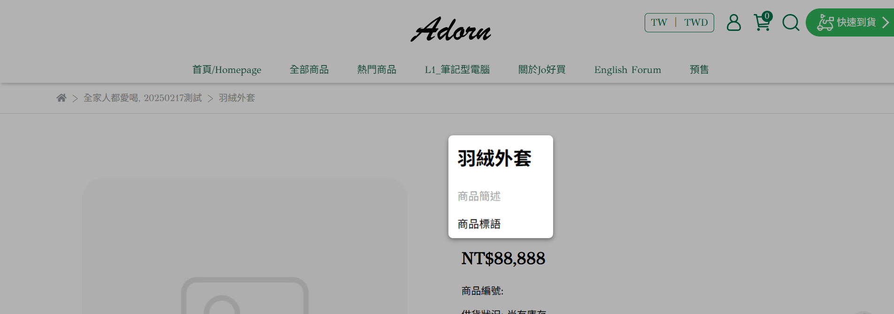

# 新增單一商品

建立並設定單一商品的基本資訊、圖片、影片與款式，上架商品。
{ .subtitle }

{ title="新增商品： 商品 > 所有商品 > 新增商品" .hero-page }

---

1. 登入 CYBERBIZ 管理後台，前往 **商品 > 所有商品 > 新增商品**。
2. 依序填寫 *商品資訊* 內容：
	- [基本設定](#基本設定)
	- [商品圖片](#商品圖片)
	- [商品影片](#商品影片)
	- [款式管理](#款式管理)
3. 點擊 **儲存**，商品將依上架狀態所設定的時間自動上架或延後上架。	 

!!! info "更多商品相關設定，請參閱[編輯商品描述與商品設定](編輯商品描述與商品設定.md)。"
  
## 基本設定

- 商品名稱：避免使用特殊符號（如 `|` 或 `”`），不可使用 HTML。
- 商品網址：建議使用英文網址，有助於 SEO 與 GA 分析。若未設定，系統將自動套用 *商品名稱* 作為網址。
- 商品標語：顯示於 *商品頁面* 的簡短文字。瞭解 [如何客製文字樣式](編輯商品簡述與商品標語.md)。
- 商品簡述：建議以 1–3 句呈現，避免過長段落與冗餘格。顯示於 *商品頁面* 的簡短文字。瞭解 [如何客製文字樣式](編輯商品簡述與商品標語.md)。
- 上架狀態：設定商品上架及下架時間，未填寫 → 商品永久上架；非上架時間 → 頁面顯示 404。
- 商品搜尋功能： `ON` 可被搜尋；`OFF` 無法被搜尋，但仍可透過 *商品連結* 供部分顧客購買。瞭解 [關閉商品搜尋效果](設定商品搜尋可見性.md#商品排除搜尋效果)。

前台顯示畫面

## 商品圖片

- 尺寸建議：1000 × 1000 像素 (px)。
- 檔案大小：最大 10 MB，建議不超過 2 MB，以提升網站載入效能。
- 平台兼容：可參考[設定 Google 購物廣告](../integrations/設定 Google 購物廣告)，並提升廣告成效。

## 商品影片
[:lucide-lock:{ title="適用方案" }](../../resources/conventions#適用方案) | PLUS / 企業  [:lucide-toggle-right:{ title="適用功能" }](../../resources/conventions#適用功能) | 拖拉版型

- 解析度：最高支援 1280 × 1280 像素。
- 建議比例：9:16，此比例最佳化於 Facebook 廣告版位。
- 影片格式：僅支援 MP4 格式。
- 影片長度：最長 60 秒。
- 檔案大小：最大 30 MB，載入速度會受使用者網路影響，建議在符合規格下盡量壓縮檔案。
- 音訊支援：目前不支援音訊輸出，上傳影片將以靜音模式播放。

!!! info "更多商品影片相關設定，請參閱[設定商品影片](設定商品影片.md)。"

## 款式管理
	
根據商品規格建立不同類型商品：

- [單一款式商品](#單一款式商品)：商品只有一種規格，如單一顏色跟尺寸。
- [多款式商品](#多款式商品)：商品有多種規格需要設定，如不同的顏色跟尺寸。

??? note "商品款式、規格跟規格項目差異"

	- 規格 = 商品的分類方式（例如：顏色、尺寸）
	- 規格項目 = 特定分類下的選項內容（例如：顏色下的紅色、尺寸下的　M 號）
	- 款式 = 實際販售的規格組合（例如：紅色 + M 號）

	| 顏色 \\ 尺寸規格 | S 號 | M 號 | 
	|--------------|------|------| 
	| 紅色 | 款式 1 | 款式 2 | 
	| 藍色 | 款式 3 | 款式 4 |

### 單一款式商品

1. 點擊 **建立單一款式商品**，進入商品編輯頁面。
2. 依照需求設定以下商品款式資訊欄位，完成後點擊 **儲存** 套用設定。

#### 商品價格與編號

- 售價：實際銷售金額。
- 定價：建議售價。
- 成本價 :lucide-lock:：供內部分析使用，*專業* 與 *專業PLUS* 版不適用。
- 紅利折抵：設定可折抵紅利上限。
- 商品編號 SKU：商品編號，串倉、POS 系統必填。

#### 庫存管理

- 管理庫存：開啟以設定庫存相關欄位。
- 庫存量：可販售商品數量。設定有限庫存量的商品可以在[庫存列表](quickstart#庫存列表)中快速檢視。
- 安全庫存水位：低於此數量，系統會發信通知給[已設定之收件者](../store/系統通知設定)，進一步了解如何[設定到貨通知](設定商品到貨通知.md){ data-preview }。
- 庫存不足時：商品庫存為 0 時，是否允許顧客購買。
	- `停止銷售`：一般商品建議選項，避免商品超賣。了解如何[設定到貨通知](設定商品到貨通知)。 
	- `繼續銷售`：預購商品選項，選擇以開放商品預購。庫存 0 時顯示 *預購商品* 選項。了解如何[設定預購通路](設定多購物車#設定預購通路)。

#### 物流設定

- 收貨地址：設定是否需填寫地址。一般網購商品皆需填寫，數位商品可設定為 *不需填寫*。
- 材積：包裹長 + 寬 + 高 [^1]。了解[進階設定](設定商品超商物流限制與排除選項.md){ data-preview }。
> 材積 > *105* cm → 僅可宅配；材積 > *150* cm → 宅配可分箱並加印託運單  
- 重量：商品重量，*請注意各家物流重量上限* [^2]。
> 超商 ≤ *10* kg；宅配 ≤ *20* kg。
- 產品廠商編號：可註記廠商編號。方便內部管理與物流使用。
	
??? example "材積計算範例"
	假設寄送一箱月餅禮盒，5 盒/箱，超商材積限制 105 公分。 

	| 單盒材積 | 總材積計算 | 判斷結果 | 配送方式 |
	|----------|------------|----------|----------
	| 20 公分  | 20 × 5 = 100 < 105 | :material-check: 符合超商材積限制 | 超商取貨 |
	| 25 公分  | 25 × 5 = 125 > 105 | :material-close: 超過限制 | 宅配 |

### 多款式商品

1. 點擊 **建立多款式商品**，進入編輯頁面。
2. 設定商品規格與規格項目，每個規格下至少需有一個項目。  
> 最多可設定 3 種規格，可直接在欄位中自訂規格名稱。每個規格下的項目數量不限，同樣可自訂名稱。

	
	
3. 可修改欄位名稱及商品屬性。

	{ .screenshot }
	
4. 完成設定後，各款式可單獨管理售價、庫存與 SKU。

	{ title="多款式商品後台顯示" }

	{ title="多款式商品前台顯示" }

#### 批次操作多款式商品

透過批次操作選單，一次套用相同的商品資訊（如價格、庫存、圖片、材積與重量）至多個款式商品。

1. 選取欲批次設定的商品款式。
2. 點擊 **操作選單**，選擇批次操作選項（如價格、庫存等），進入編輯頁面。
3. 輸入相關商品資訊，點擊 **套用** 以套用變更。

## 後續步驟

- :lucide-import:{ .lg }   
  [__新增大量商品__](Excel 大量匯入商品.md){ data-preview }   
  透過 Excel 批量匯入商品，批次上架商品。
- :lucide-boxes:{ .lg }   
  [__新增組合商品__](新增與設定組合商品.md#新增組合商品)  
  建立指定或任選組合商品。
- :lucide-edit-3:{ .lg }   
  [__編輯商品描述與設定__](編輯商品描述與商品設定.md){ data-preview }   
  編輯商品描述及設定頁籤資訊。
- :lucide-bell:{ .lg }   
  [__商品到貨通知__](設定商品到貨通知.md){ data-preview }  
  設定到貨通知，通知顧客追蹤商品已補貨。
- :lucide-check-square:{ .lg }   
  [__批次修改商品資訊__](批次修改商品描述與配送設定.md){ data-preview }  
  批次更新多筆商品的資訊與設定。
- :lucide-search-x:{ .lg }   
  [__設定商品排除搜尋__](設定商品搜尋可見性.md){ data-preview }   
  設定商品不在特定搜尋結果中顯示。

## 常見問題

??? quote "商品名稱可以使用特殊符號或 HTML 嗎？"
    商品名稱**不可使用特殊符號**（如 `\|` 或 `”`），也**不可使用 HTML 標籤**。請使用純文字設定商品名稱。
    
??? quote "多款式商品設定時，有規格項目的數量限制嗎？"
    每個款式至少需有 *1* 個項目。例如，若設定顏色規格，則至少需新增一種顏色選項。

[^1]: 台灣國內物流材積計算方式。
[^2]: 海外物流通常依重量計價。