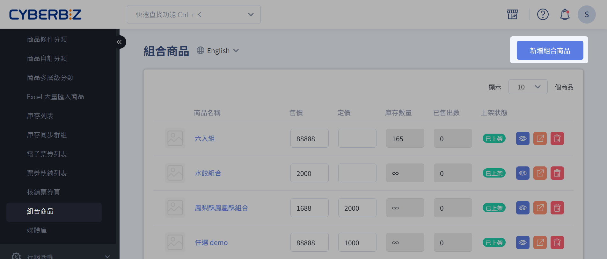
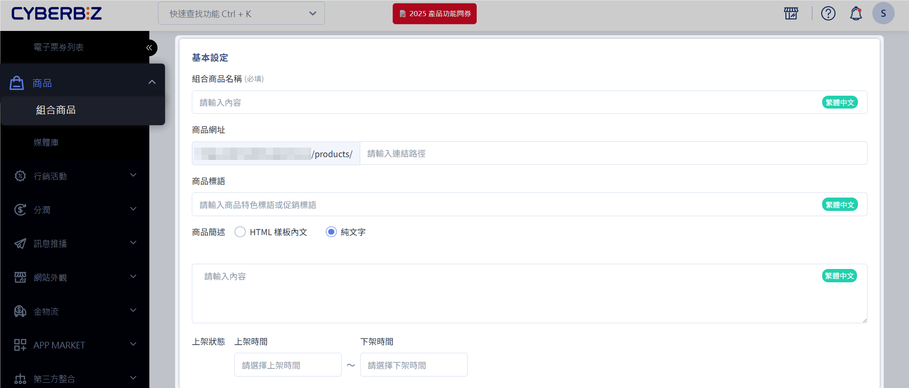
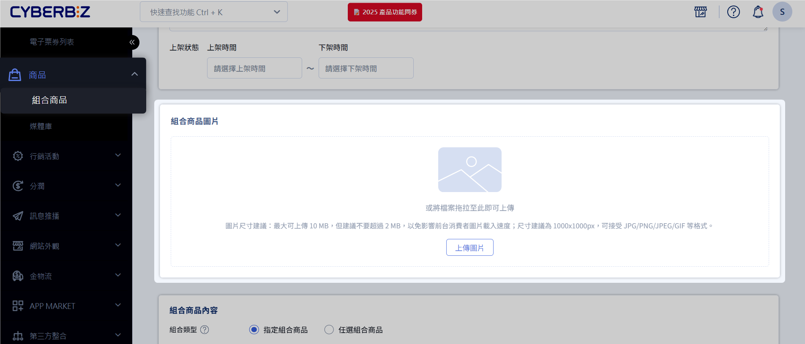

# 新增組合商品

:lucide-lock:{ title="適用方案" } | PLUS 企業  
:lucide-toggle-right:{ title="適用功能" } | 拖拉版型

建立 *指定組合商品* 或 *任選組合商品*。

??? tip "應用情境"
	- 提高銷售額：組合產品可以鼓勵顧客購買多個產品，從而提高銷售額。
	- 提高利潤：將多個產品組合在一起，可以創造出更高的價值，從而增加利潤。
	- 增加顧客忠誠度：組合產品可以提供更好的價值和體驗，從而增加顧客忠誠度，使他們更有可能回來購買。
	- 清理庫存：如果某些產品庫存積壓，零售商可以將它們與其他產品組合在一起，提供折扣，從而清理庫存。
	- 創造品牌形象：組合產品可以創造品牌形象，幫助零售商建立自己的品牌，增加品牌認知度。
## 使用須知

### 適用行銷活動

=== ":material-check-circle: 適用"
	| 行銷活動 | 備註說明 | 適用狀態 |
	|-----------|-----------|-----------|
	| 優惠券、免運券 |  | :material-check: |
	| 訂單金額免運門檻（超商 + 宅配） |  | :material-check: |
	| 首購禮（活動規則 : 消費門檻） |  | :material-check: |
	| 滿額送紅利 (會員紅利點數) |  | :material-check: |
	| 分潤 |  | :material-check: |
	| 推薦分潤折扣碼 |  | :material-check: |
	| 紅利折抵 |  | :material-check: |
	| 指定組合品：定期定額、一頁式活動頁 | | :material-check: |

=== ":material-alert: 有條件適用"
	| 行銷活動 | 備註說明 | 適用狀態 |
	|-----------|-----------|-----------|
	| 訂單加價購 | 組合品不能作為 **加價購品** | :material-alert-outline: |
	| 訂單滿額贈 | 組合品不能作為 **滿額贈品** | :material-alert-outline: |

=== ":material-close-circle: 不適用"
	| 行銷活動 | 備註說明 | 適用狀態 |
	|-----------|-----------|-----------|
	| 任選折扣 |  | :material-close: |
	| 紅配綠 |  | :material-close: |
	| 單品折扣 |  | :material-close: |
	| 綁商品送優惠券 |  | :material-close: |
	| 綁商品送紅利 |  | :material-close: |
	| 首購禮（商品標籤） |  | :material-close: |
	| 商品多層級分類滿額折扣 |  | :material-close: |
	| 滿額送優惠券 (全館活動 – 優惠券) |  | :material-close: |
	| 紅利商城 |  | :material-close: |
	| 商品限購 |  | :material-close: |
	| 全館活動 (金額/百分比) |  | :material-close: |
	| 商品加價購 |  | :material-close: |
	| 商品滿額贈 / 商品滿件贈 |  | :material-close: |
	| 任選組合品 | | :material-close: |

### 出貨說明
組合商品訂單成立後，系統在產生超商/宅配託運單時，會產出以下四份檔案：

-   訂單明細
-   出貨明細
-   揀貨單
-   託運單

所有檔案皆包含組合商品內所有子商品的詳細資訊。

### 庫存管理
組合商品是否可供購買（庫存是否足夠），取決於其子商品的庫存數量及設定。若其中任一子商品庫存不足，且該子商品設定為「庫存不足停止銷售」，則該組合商品將無法購買。

|**子商品 A 款式設定**|**子商品 B 款式設定**|**商品組合 C (A + B) 可購買數量**|
|---|---|---|
|**庫存不足停止銷售** (庫存數量 = 10)|**庫存不足停止銷售** (庫存數量 = 20)|**10**|
|**庫存不足繼續銷售** (庫存數量 = 10)|**庫存不足停止銷售** (庫存數量 = 20)|**20**|
|**無限數量** (不管理庫存)|**庫存不足停止銷售** (庫存數量 = 20)|**20**|
|**庫存不足繼續銷售** (庫存數量 = 10)|**庫存不足繼續銷售** (庫存數量 = 10)|**無限**|
|**無限數量** (不管理庫存)|**庫存不足繼續銷售** (庫存數量 = 10)|**無限**|
|**庫存不足停止銷售** (庫存數量 = 0)|**庫存不足停止銷售** (庫存數量 = 20)|**庫存不足**|

### 組合品價差計算

在訂單報表、Excel/CSV 匯出及 API 回傳中，系統會提供「組合品價差」欄位，幫助商家快速對帳及分析折扣分配。

**計算方式**

假設組合品售價 **850 元**，包含子商品：

| 子商品 | 單價 |
|--------|-----|
| A      | 100 |
| B      | 300 |
| C      | 500 |

折扣總額 = 商品總價 (100 + 300 + 500) - 組合品售價 (850) = **50 元**

**按比例分配折扣**

| 子商品 | 計算公式                       | 原始結果 | 捨去後折扣 |
|--------|--------------------------------|----------|------------|
| A      | 50 × 100 / 900                 | 5.56     | 5          |
| B      | 50 × 300 / 900                 | 16.67    | 16         |
| C      | 50 × 500 / 900                 | 27.78    | 27         |

**分配剩餘折扣與最終價格**

| 子商品 | 分配後折扣 | 最終價格 | 組合品價差 |
|--------|------------|----------|------------|
| A      | 5 + 1 = 6  | 94       | 6          |
| B      | 16 + 1 = 17| 283      | 17         |
| C      | 27 + 0 = 27| 473      | 27         |

> **說明**：`組合品價差` = 子商品原價 - 最終價格。

## 操作流程
### 新增組合商品

1. 登入 CYBERBIZ 管理後台，前往 **商品 > 組合商品**。
2. 點選 **新增組合商品**。

### 編輯組合商品基本設定
在編輯頁面中，依據需求設定組合商品的基本資訊。

#### 基本設定
請自行設定 `組合商品名稱` `商品網址` `商品標語` `商品簡述` `上架狀態` 等相關內容。
> 建議在 `商品標語` 或 `商品簡述` 中說明組合商品內容物。可進一步[客製商品標語及商品簡述的文字風格](編輯商品標語與商品簡述)。

#### 組合商品圖片
建議自行製作包含組合商品內容物的圖片，以清晰呈現商品組合。

### 設定組合商品內容
設定組合商品包含的子商品，此處可設定為指定組合商品或任選組合商品。

- [指定組合商品](#指定組合商品)：所有商品固定，消費者無法彈性選擇。 
- [任選組合商品](#任選組合商品)：顧客在預設的商品清單中，彈性選擇欲購買的商品組合。只要達到「任選組合總數」的數量即可。

!!! warning "商品一旦建立後，組合類型不可修改。"

#### 指定組合商品

1. 選取 **指定組合商品**。
2. 在 **組合商品內容** 區塊，搜尋欲加入組合的商品。

	{ .screenshot }

3. 商品會依照不同款式分別列出，勾選欲加入組合的商品。
4. 點選 **將商品加入組合商品**。

	{ .screenshot }

5. 編輯組合商品內容
> **指定購買數**：此組合商品內容包含的子商品數量，例如：A 商品 × N 個。   
> **組合商品定價**：組合商品的原始價格。    
> **組合商品售價**：組合商品的實際銷售價格；若售價低於定價，前台將會顯示優惠價格的 UI。  
> **紅利點數**：此組合商品可折抵的紅利點數上限。

	{ .screenshot }

#### 任選組合商品
1. 選取「任選組合商品」。
2. 在「任選組合總數」欄位中填入數值，決定消費者需選購子商品的總數。
> 例如設定為 5，則顧客需選購 5 個子商品才得以將組合品加入購物車。

	{ .screenshot }

3. 商品會依照不同款式分別列出，勾選欲加入組合的商品。
4. 點選「將商品加入組合商品」。

	{ .screenshot }

5. 編輯組合商品內容
> 組合商品定價：設定組合商品的原始價格。  
> 組合商品售價：設定組合商品的實際銷售價格；若售價低於定價，前台將會顯示優惠價格的 UI。  
> 紅利點數：設定此組合商品可折抵的紅利點數上限。

	{ .screenshot }

6. 設定完成畫面
	
	庫存數量計算方式請參考[庫存管理](#stock)的商品組合C。

	{ .screenshot }

	=== "前台結帳畫面"

		 消費者必須選購到後台設定的任選數量，才得以將組合商品加入購物車。

		 
		  
		 如果達到任選數量上限，會有 UI 提示消費者「已達上限」。

		 

	=== "購物車畫面"

		

## 常見問題
??? quote "組合商品可以修改組合類型嗎？"
    商品一旦建立後，組合類型（指定組合或任選組合）即無法修改。若需更改，建議重新建立商品。

??? quote "組合商品內的子商品庫存不足會影響銷售嗎？"
    是的，若組合商品內的任一子商品庫存不足，且該子商品設定為「庫存不足停止銷售」，則整個組合商品將無法購買。

## 延伸閱讀

- [編輯商品描述與設定](#)
