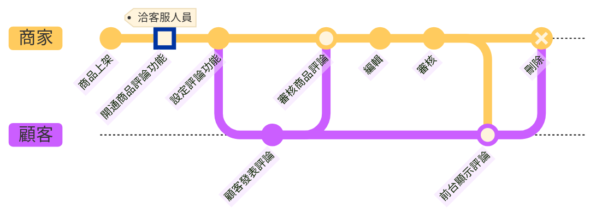
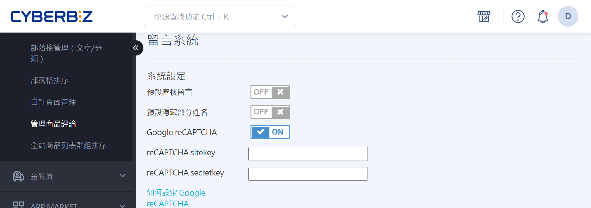
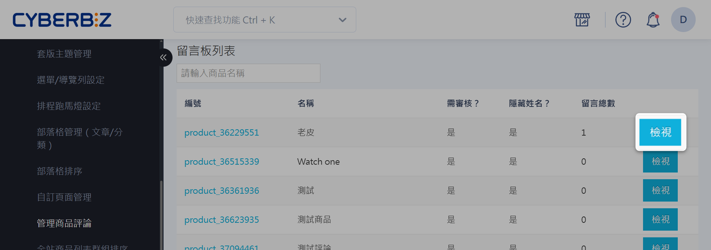
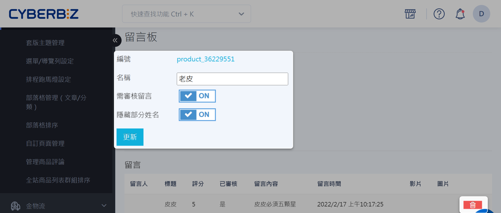
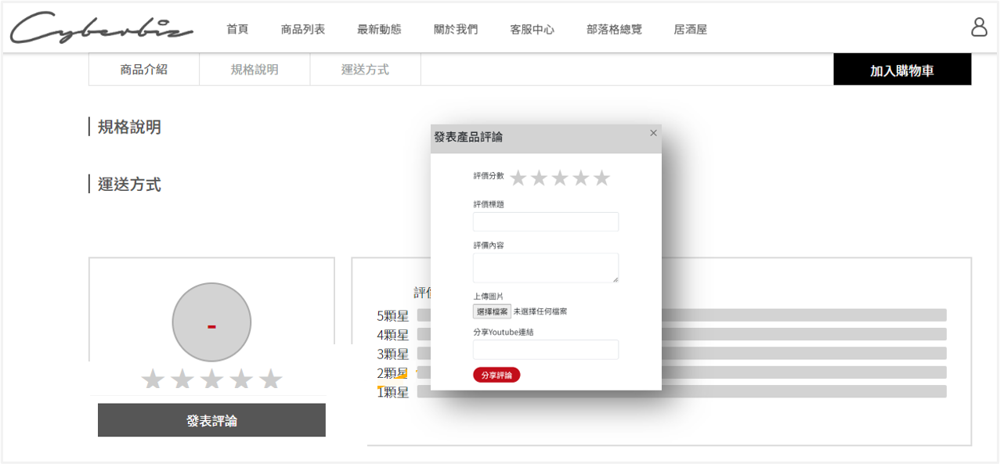
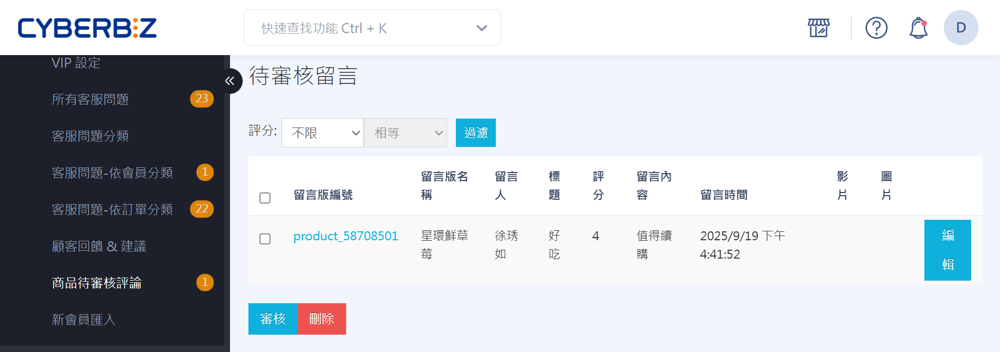
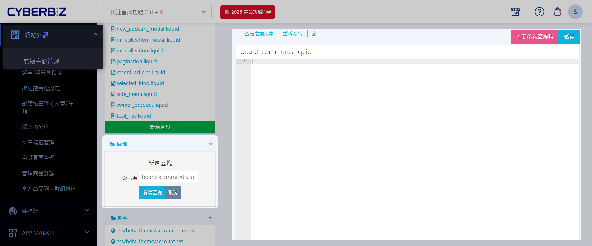

# 管理商品評論
啟用商品評論功能，收集顧客回饋，管理留言板，並審核評論以提升品牌信任度。
{ .subtitle }

 [:lucide-tag:{ title="適用方案" }](../../resources/conventions#適用方案) | PLUS / 企業

- { title="商品頁商品評論區" }
- { title="商品評論提示" }

## 使用須知

- 需先洽客服人員開通商品評論功能。	
- FB分享功能 : 需至「第三方整合」→「臉書 Facebook 設定」→「設定 應用程式ID (APP ID) 及 應用程式密鑰 (App Secret)」填寫完畢，才可以使用。

### 商品評論流程

## 操作流程
### 設定商品評論功能

1. 登入 CYBERBIZ 電商後台，前往 **網站外觀 > 管理商品評論**。
2. 依照需求變更設定。
	- **預設審核留言**：設定顧客留言後，商家是否需要手動審核。
	- **預設隱藏部分姓名**：設定顧客留言時，是否部分隱藏其姓名。
	- **Google reCAPTCHA**：安全驗證機制，防止垃圾訊息與機器人留言。瞭解 [如何設定留言區 reCAPTCHA](啟用留言區 reCAPTCHA)。
	- **審核後贈送紅利點數**：設定商家審核通過顧客評論後，是否自動贈送紅利點數。
3. 點擊 **更新**，套用變更。

#### 檢視留言板
所有商品的留言板皆可在此細部設定，按下 **檢視** 可對個別留言板進行編輯。

#### 設定留言板
在留言板列表點擊「檢視」特定留言板，可進入留言版編輯頁，對各別留言板進行設定。點擊 **垃圾桶 :material-trash-can-outline:** 可刪除商品評論。

### 發表商品評論

!!! note "顧客需登入會員後，方可於商品頁面發表評論。"

1. 顧客在商品頁面點選 **發表評論** 按鈕。
2. 系統將跳出彈跳視窗，顧客可在此填寫星級評價與評論內容。

### 審核商品評論

商家可在後台審核顧客提交的商品評論。

1. 登入 CYBERBIZ 管理後台，前往 **會員 > 商品待審核評論**。
2. 選擇審核動作。
	- **審核**：將評論顯示於前台，通過審核後即可公開。
	- **刪除**：刪除該評論。  
	- **編輯**：修改評論內容，進行調整或修正。  

### 隱藏商品評論功能

若您暫時不希望顯示商品評論功能，可透過樣版編輯器隱藏。

!!! danger "若選擇自行移除程式碼，CYBERBIZ 將不提供恢復功能協助。"

=== "拖拉版型"

	１. 登入 CYBERBIZ 後台，前往 **網站外觀 > 套版主題管理 > 選擇操作 : CSS/HTML編輯器**。
	2. 在「區塊」選單中點選「新增區塊」。將新增區塊命名為 `board_comments.liquid`。
	3. 點擊打開新增的 `board_comments.liquid` 的區塊檔案。  
    4. 將檔案內容（右方區域）留白即可隱藏商品評論功能。點擊 :material-trash-can-outline: 刪除 `board_comments.liquid` 文件即可恢復商品評論功能。

	

=== "一般版型"

	1. 登入 CYBERBIZ 後台，前往 **網站外觀 > 套版主題管理 > 選擇操作 : CSS/HTML編輯器**。

	2. 搜尋並打開 `product.liquid` 文件，找到 `shop.plugins.board_comments` 這段程式碼。  
	3. 以 HTML 註解符號 `<!--` 與 `-->` 包覆整段程式碼以 *註解程式碼*，即可停用並隱藏商品評論功能，無需刪除程式碼。

	4. 點擊 **儲存** 套用更新。

    { .screenshot }

## 後續步驟

- [__啟用留言區 reCAPTCHA__](啟用留言區 reCAPTCHA)  
  防止機器人訊息及垃圾留言。
- [__FB 分享商品評論__]()  
  

## 常見問題

??? quote "顧客發表評論是否需要登入會員？"
    是的，顧客必須登入會員後才能發表商品評論。

??? quote "如果自行移除樣版編輯器中的程式碼，CYBERBIZ 會提供恢復功能嗎？"
    若您自行移除樣版編輯器中的程式碼，CYBERBIZ 不提供恢復功能等操作。請務必自行保留程式碼備份。