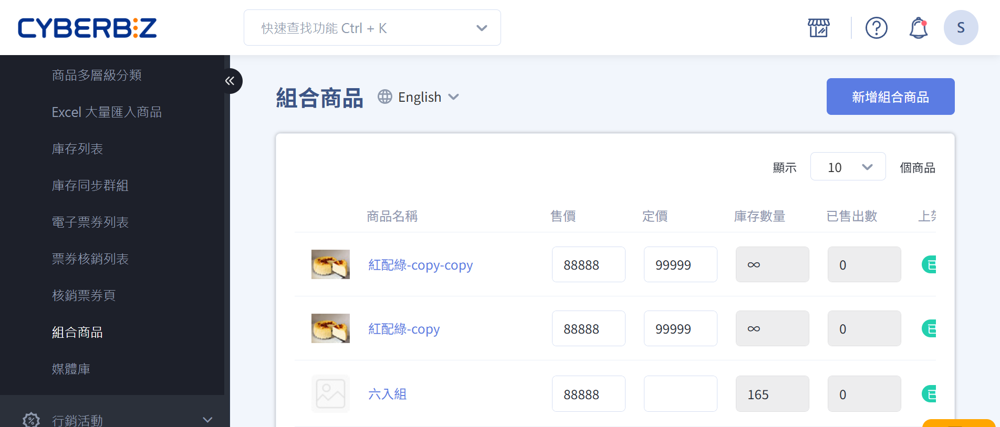
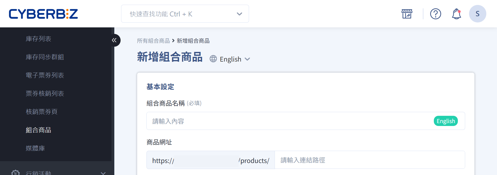
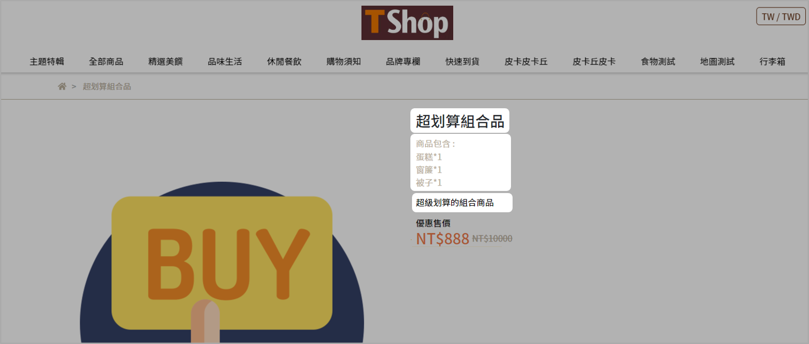
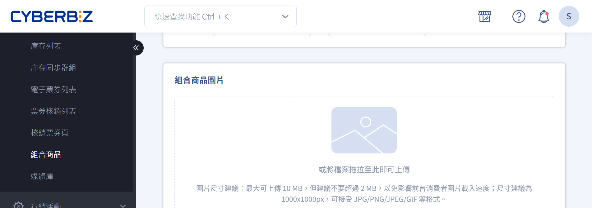
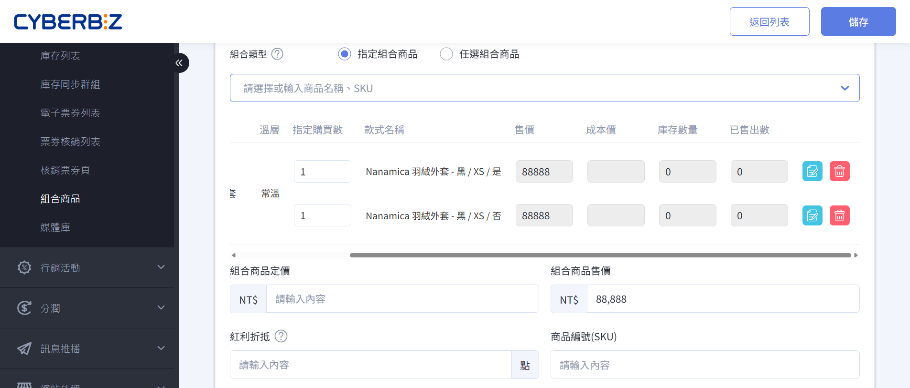
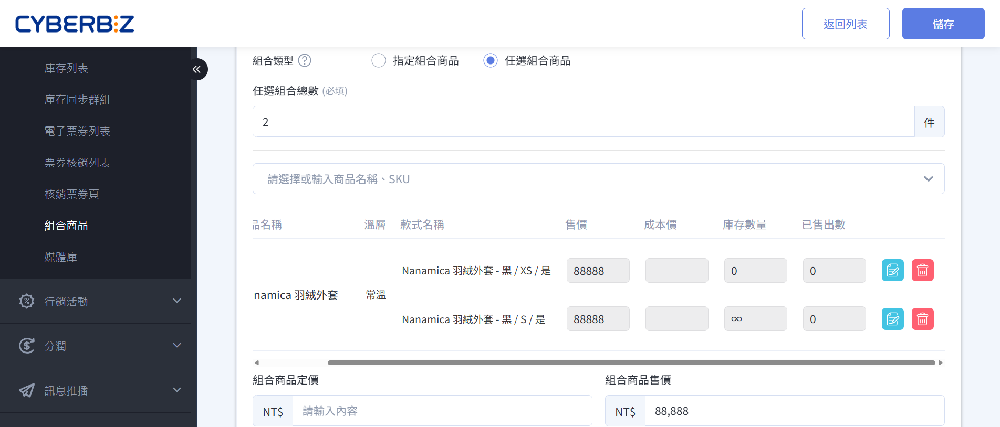
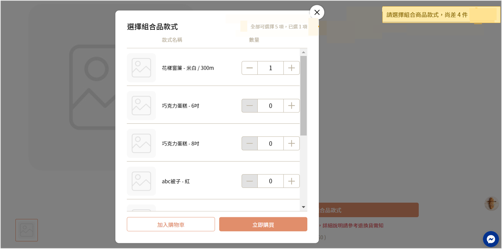
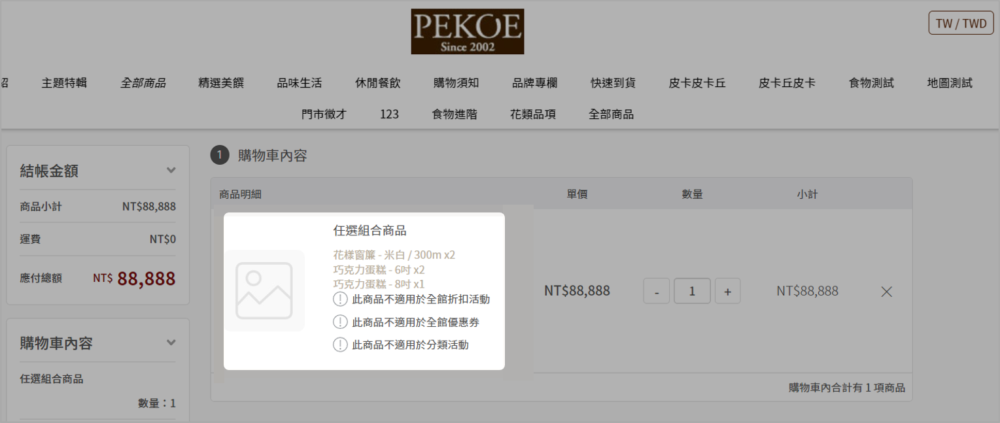

# 組合商品指南

建立 *指定組合商品*  或 *任選組合商品*，整合子商品定價、庫存與銷售規則。
{ .subtitle }

[:lucide-lock:{ title="適用方案" }](../../resources/conventions#適用方案) | PLUS / 企業  [:lucide-toggle-right:{ title="適用功能" }](../../resources/conventions#適用功能) | 拖拉版型
{ .doc-badge }

{ title="新增組合商品：商品 > 新增組合商品" .hero-page }

## 組合商品說明

組合商品是將兩個或以上的商品組合成單一商品進行販售的商品類型。商家可設定固定內容的 *指定組合商品*，或讓消費者自行選擇內容的 *任選組合商品*。常見的應用情境如下：

- 套裝優惠：將多個商品打包，以組合價格吸引購買。
- 活動促銷：例如聖誕禮盒、周年慶組合。
- 增加平均訂單價值：鼓勵一次購買多個商品，提高銷售額。
- 清理庫存：將銷售速度較慢的商品與熱銷商品組合販售，加速庫存周轉。

## 組合商品功能限制

- 組合商品不支援設定商品標籤、商品類型、商品廠商、[Google 產品類別](../integrations/設定 Google 購物廣告#設定-google-商品類別)、SEO、快速到貨及商品關聯群組。  
- 暫不支援組合商品的批次新增或批次編輯。  
- 組合商品不計入子商品重量，系統皆認定為 0 公斤，結帳頁判斷物流材積限制。

### 組合商品適用行銷活動

=== ":material-check-circle: 適用"
	| 行銷活動 | 備註說明 | 適用狀態 |
	|-----------|-----------|-----------|
	| 優惠券、免運券 |  | :material-check: |
	| 訂單金額免運門檻（超商 + 宅配） |  | :material-check: |
	| 首購禮（活動規則 : 消費門檻） |  | :material-check: |
	| 滿額送紅利 (會員紅利點數) |  | :material-check: |
	| 分潤 |  | :material-check: |
	| 推薦分潤折扣碼 |  | :material-check: |
	| 紅利折抵 |  | :material-check: |
	| 指定組合品：定期定額、一頁式活動頁 | | :material-check: |

=== ":material-alert: 有條件適用"
	| 行銷活動 | 備註說明 | 適用狀態 |
	|-----------|-----------|-----------|
	| 訂單加價購 | 組合品不能作為 *加價購品* | :material-alert-outline: |
	| 訂單滿額贈 | 組合品不能作為 *滿額贈品* | :material-alert-outline: |

=== ":material-close-circle: 不適用"
	| 行銷活動 | 備註說明 | 適用狀態 |
	|-----------|-----------|-----------|
	| 任選折扣 |  | :material-close: |
	| 紅配綠 |  | :material-close: |
	| 單品折扣 |  | :material-close: |
	| 綁商品送優惠券 |  | :material-close: |
	| 綁商品送紅利 |  | :material-close: |
	| 首購禮（商品標籤） |  | :material-close: |
	| 商品多層級分類滿額折扣 |  | :material-close: |
	| 滿額送優惠券 (全館活動 – 優惠券) |  | :material-close: |
	| 紅利商城 |  | :material-close: |
	| 商品限購 |  | :material-close: |
	| 全館活動 (金額/百分比) |  | :material-close: |
	| 商品加價購 |  | :material-close: |
	| 商品滿額贈 / 商品滿件贈 |  | :material-close: |
	| 任選組合品 | | :material-close: |

## 組合商品出貨
組合商品訂單成立後，系統在產生超商/宅配託運單時，會產出以下四份檔案，所有檔案皆包含組合商品內所有子商品的詳細資訊：

-   訂單明細
-   出貨明細
-   揀貨單
-   託運單

## 子商品庫存管理

組合商品是否可供購買（庫存是否足夠），取決於其 *子商品* 的庫存數量及設定。若其中任一子商品庫存不足，且該子商品庫存不足時設定為 *停止銷售*，則該組合商品將無法購買。進一步瞭解[商品庫存相關設定](新增單一商品#庫存管理)。

!!! warning "子商品下架或停止販售的處理方式"  
	- 組合商品內的子商品 **上架狀態** 可為 _下架_ 或 _不公開_。
	  - 若子商品已停止販售，請將該子商品從組合商品中移除。

|**子商品 A 款式設定**|**子商品 B 款式設定**|**商品組合 C (A + B) 可購買數量**|
|---|---|---|
|庫存不足停止銷售 (庫存數量 = 10)|庫存不足停止銷售 (庫存數量 = 20)|10|
|庫存不足繼續銷售 (庫存數量 = 10)|庫存不足停止銷售 (庫存數量 = 20)|20|
|無限數量 (不管理庫存)|庫存不足停止銷售 (庫存數量 = 20)|20|
|庫存不足繼續銷售 (庫存數量 = 10)|庫存不足繼續銷售 (庫存數量 = 10)|無限|
|無限數量 (不管理庫存)|庫存不足繼續銷售 (庫存數量 = 10)|無限|
|庫存不足停止銷售 (庫存數量 = 0)|庫存不足停止銷售** (庫存數量 = 20)|庫存不足|

## 組合商品價差計算

在訂單報表、Excel/CSV 匯出及 API 回傳中，系統會提供 *組合品價差* 欄位，幫助商家快速對帳及分析折扣分配。

- 組合品折扣 = 子商品總價 − 組合品售價
- 折扣按比例分配給子商品
- 組合品價差 = 子商品原價 − 分配後最終價格

??? example "組合品價差計算範例"
	組合品售價：850 元；子商品原價總和：900 元；總折扣：50 元。

	|子商品|最終價格|組合品價差|
	|---|---|---|
	|A|94|6|
	|B|283|17|
	|C|473|27|

## 新增組合商品

1. 登入 CYBERBIZ 管理後台，前往 **商品 > 組合商品**。
2. 點選 **新增組合商品**。

### 編輯組合商品資訊

在編輯頁面中，設定組合商品的基本資訊。

#### 基本設定

請自行設定商品基本資訊，可參考[一般商品設定](新增單一商品#基本設定)。

- 組合商品名稱：避免使用特殊符號（如 `|` 或 `”`），不可使用 HTML。
- 商品網址：建議使用英文網址，有助於 SEO 與 GA 分析。若未設定，系統將自動套用 _商品名稱_ 作為網址。
- 商品標語：顯示於 _商品頁面_ 的簡短文字。瞭解 [如何客製文字樣式](http://localhost:8000/ec/products/%E7%B7%A8%E8%BC%AF%E5%95%86%E5%93%81%E7%B0%A1%E8%BF%B0%E8%88%87%E5%95%86%E5%93%81%E6%A8%99%E8%AA%9E/)。
- 商品簡述：建議以 1–3 句呈現，避免過長段落與冗餘格。顯示於 _商品頁面_ 的簡短文字。瞭解 [如何客製文字樣式](http://localhost:8000/ec/products/%E7%B7%A8%E8%BC%AF%E5%95%86%E5%93%81%E7%B0%A1%E8%BF%B0%E8%88%87%E5%95%86%E5%93%81%E6%A8%99%E8%AA%9E/)。
- 上架狀態：設定商品上架及下架時間，未填寫 → 商品永久上架；非上架時間 → 頁面顯示 404。

!!! tip "建議說明組合商品內容物"
	為避免消費者誤解商品內容，建議於 *商品簡述* 或 *商品標語* 中，清楚說明組合商品所包含的子商品項目與數量。

前台顯示畫面

!!! quote inline end ""
	- 商品名稱：超划算組合品
	- 商品簡述：  
	  商品包含   
	  蛋糕*1   
	  窗簾*1   
	  被子*1
	- 商品標語：超級划算的組合商品

!!! quote ""
	

#### 組合商品圖片
建議自行製作包含組合商品內容物的圖片，以清晰呈現商品組合。

### 設定組合商品內容

設定組合商品包含的子商品，可設定為以下兩種類型：

- [指定組合商品](#指定組合商品)：所有商品固定，消費者無法彈性選擇。 
- [任選組合商品](#任選組合商品)：顧客在預設的商品清單中，彈性選擇欲購買的商品組合。只要達到 *任選組合總數* 的數量即可。

!!! warning "組合商品一旦建立後，組合類型不可修改。"

=== "指定組合商品"

	1. 選取 **指定組合商品**。
	2. 在 **組合商品內容** 區塊，搜尋欲加入組合的商品。
	3. 商品會依照不同款式分別列出，勾選欲加入組合的商品。
	4. 點選 **將商品加入組合商品**。
	5. 編輯組合商品內容
	    - **指定購買數**：此組合商品內容包含的子商品數量，例如：A 商品 × N 個。   
	    - **組合商品定價**：組合商品的原始價格。    
	    - **組合商品售價**：組合商品的實際銷售價格；若售價低於定價，前台將會顯示優惠價格的 UI。  
        - **紅利折抵**：此組合商品可折抵的紅利點數上限。

	

=== "任選組合商品"
	1. 選取 **任選組合商品**。
	2. 在 **任選組合總數** 欄位中填入數值，決定消費者需選購子商品的總數。
	
	3. 商品會依照不同款式分別列出，勾選欲加入組合的商品。
	4. 點選 **將商品加入組合商品** 。
	5. 編輯組合商品內容：
	
		- 組合商品定價：設定組合商品的原始價格。  
	    - 組合商品售價：設定組合商品的實際銷售價格；若售價低於定價，前台將會顯示優惠價格的 UI。  
	    - 紅利折抵：設定此組合商品可折抵的紅利點數上限。

		> 庫存數量計算方式請參考[庫存管理](#子商品庫存管理)的商品組合 C。
		
	
	
	#### 前台結帳畫面
	
	 消費者必須選購到後台設定的任選數量，才得以將組合商品加入購物車。
	> 如果達到任選數量上限，會有 UI 提示消費者 **已達上限**。
	
	
	
	#### 購物車畫面

	結帳頁判斷組合商品是否符合物流材積限制。w
	> 組合商品內的商品僅支援單一溫層、不支援以[通路觸發多購物車](設定多購物車.md){ data-preview }。
	  
	

## 後續步驟

- :lucide-pencil:{ .lg }   
  [__編輯商品描述與商品設定__](編輯商品描述與商品設定)     
  匯入編輯過的商品 Excel 檔案，同步更新多筆商品的商品描述與配送相關設定。

## 常見問題
??? quote "組合商品可以修改組合類型嗎？"
    商品一旦建立後，組合類型（指定組合或任選組合）即無法修改。若需更改，建議重新建立商品。

??? quote "組合商品內的子商品庫存不足會影響銷售嗎？"
    是的，若組合商品內的任一子商品庫存不足，且該子商品設定為 *庫存不足時停止銷售*，則整個組合商品將無法購買。