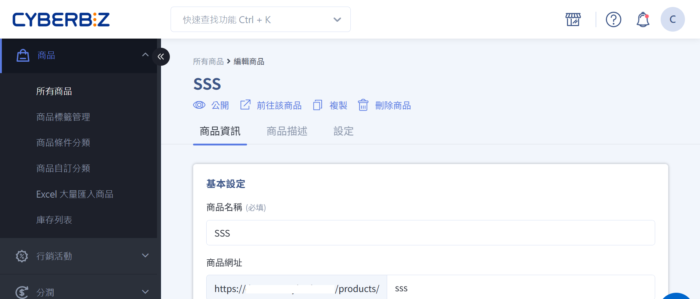
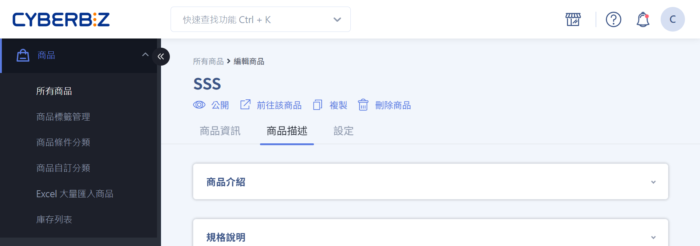
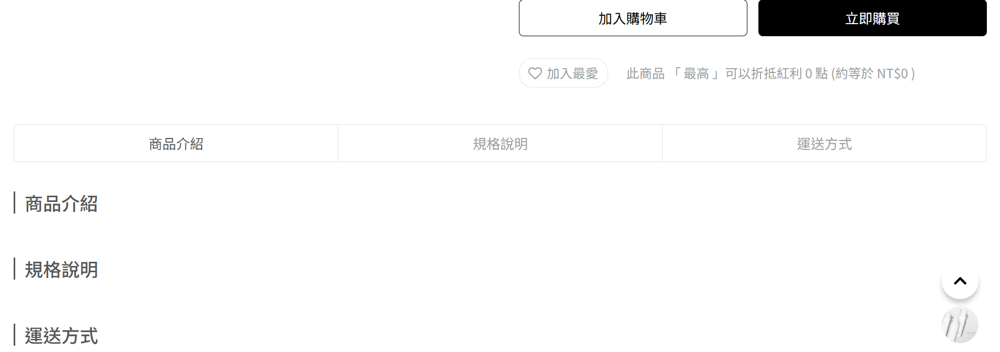
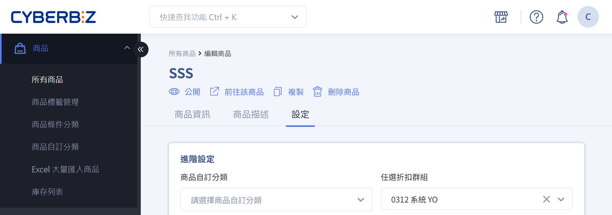
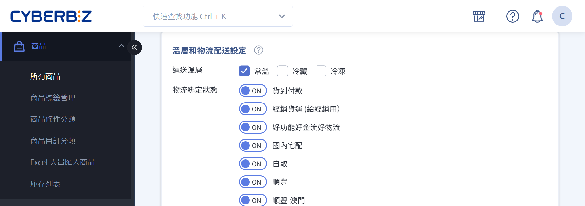
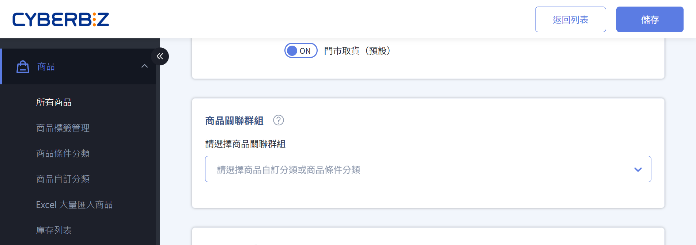
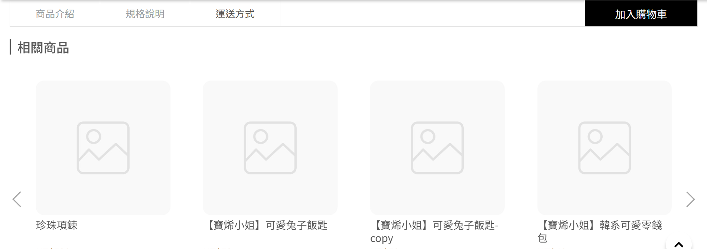

# 編輯商品描述與商品設定
設定商品內容、通路與物流屬性，確保前台呈現正確並支援搜尋與行銷需求。
{ .subtitle }

{ .hero-page }

## 商品編輯頁介紹

> :lucide-navigation: 後台路徑：商品 > 所有商品 > 欲編輯的商品名稱

在商品編輯頁面中，您可以編輯並設定商品的各項資訊與屬性，以便管理後台操作及前台展示。

快捷操作按鈕：

- :lucide-eye: 公開：設定商品是否公開。
- :lucide-external-link: 前往該商品：前往該商品的前台商品頁面。
- :lucide-copy: 複製：複製商品快速編輯。
- :lucide-trash-2: 刪除商品：刪除商品。

商品資訊設定主要分為三個頁籤：

- [商品資訊](新增單一商品#操作流程) ：商品名稱、規格、價格與庫存等核心資料。設定詳情請參閱[新增商品](新增單一商品#基本設定)。
- [商品描述](#商品描述)：商品說明、規格與運送資訊，呈現給前台顧客。
- [設定](#商品設定)：類型、通路、廠商、群組、標籤、物流與 SEO，管理後台屬性與行銷設定。

## 商品描述

使用文字編輯器修改以下欄位：

- **商品介紹**：提供詳細商品資訊
- **規格說明**：說明商品規格細節 
- **運送方式**：說明商品運送相關資訊

!!! info "進一步瞭解文字編輯器功能，請參閱 [文字編輯器使用教學](../get-started/文字編輯器使用教學)。"

前台顯示位置

## 商品設定

### 進階設定

- **自訂群組**：將商品加入已建立的商品群組。詳見 [建立商品自訂分類群組](建立商品自訂分類群組.md)。
- **任選折扣群組**：將商品加入已建立的任選折扣群組。詳見 [設定任選折扣群組](設定任選折扣群組)。
- **標籤**：為商品添加標籤，用於行銷活動（例如指定商品優惠券）。詳見 [管理商品標籤](管理商品標籤.md)。
- **商品類型**：為商品設定類型標籤，以便管理與篩選。此資訊也會顯示於前台，標籤內容可自訂。
- **商品通路**：設定商品可銷售的通路。不同通路（預購、現貨、常溫）的商品在結帳時會自動[拆分為多購物車](設定結帳拆分多購物車#多購物車結帳說明)。
- **商品廠商**：為商品添加廠商標籤，以便管理與篩選。此資訊也會顯示於前台，內容可自訂。
- **Google 產品類別**：設定商品類別以覆蓋 Google 自動判斷結果，提升廣告投放精準度。詳見 [設定 Google 購物廣告](設定 Google 購物廣告)。

!!! warning "商品類型、商品通路及商品廠商等設定一旦新增，無法刪除，請謹慎操作。"

### 溫層和物流配送設定

> :lucide-flame: 建議先完成 [物流方式設定](設定配送溫層跟物流（一般宅配）.md)，再進行本步驟，可直接選取適用的物流方式。

設定商品的運送溫層與可用的物流配送方式。

- **運送溫層**：指定商品可接受的運送溫層。詳見綁定[一般宅配](設定配送溫層跟物流（一般宅配）.md)及[宅配貨到付款](設定配送溫層跟物流（宅配貨到付款）.md)商品的配送物流、溫層與銷售通路。
- **物流綁定狀態**：指定商品可使用的物流配送方式。詳見如何[設定超商配送限制與物流排除](設定超商配送限制與物流排除.md)

### 設定相關商品

透過設定 *商品關聯群組*，商家可以自訂商品之間的關聯性，以提升商品頁下方 *相關商品* 區的展示效果，進而增加連帶銷售。

前台顯示位置

### SEO 設定

商品設定 SEO 可增加網頁在搜尋引擎上的排名，請依照商品特性設定。

- **網頁標題**：顯示於網頁瀏覽器，影響消費者搜尋時找到此商品頁的標題。
- **網頁描述**：顯示於網頁瀏覽器，影響消費者搜尋時找到此商品頁的描述。
- **網頁關鍵字**：通常不顯示於網頁瀏覽器，影響消費者搜尋時找到此商品頁的關鍵字。

## 後續步驟

- :lucide-import:{ .lg }   
  [__批次修改商品描述與設定__](批次修改商品描述與配送設定.md)     
  匯入編輯過的商品 Excel 檔案，同步更新多筆商品的商品描述與配送相關設定。

- :lucide-ban:{ .lg }     
  [__物流限制與排除選項__](設定超商配送限制與物流排除.md)  
  設定商品的配送物流條件，限制特定物流方式於結帳流程中的顯示與使用。

## 常見問題

??? quote "商品描述可以使用 HTML 標籤嗎？"
    商品描述區塊（商品介紹、規格說明、運送方式）支援文字編輯器，可進行文字排版、圖片與連結編輯。若需更進階的排版功能，建議使用拖拉版型。

??? quote "設定商品溫層與物流配送時，有什麼需要注意的？"
    建議您在設定商品溫層與物流方式前，先行設定好物流方式，以便直接選取適配的物流選項。

## 延伸閱讀
- [配送物流/溫層綁定（一般宅配）](設定配送溫層跟物流（一般宅配）.md)
- [設定配送溫層跟物流（宅配貨到付款）](設定配送溫層跟物流（宅配貨到付款）.md)

