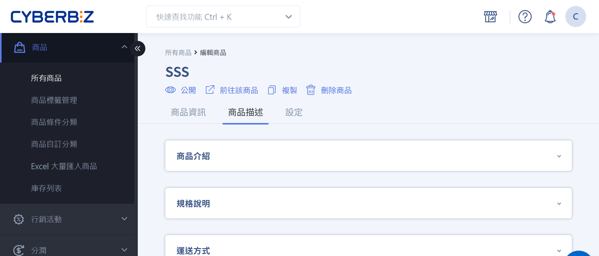

# 編輯商品描述與設定
設定商品內容、通路與物流屬性，確保前台呈現正確並支援搜尋與行銷需求。
{ .subtitle }

## 商品編輯頁介紹

在商品編輯頁面，你可以編輯、設定商品相關的各種資訊跟屬性。主要分為三個頁籤：

- [__商品資訊__](新增單一商品#操作流程)   
for content and structure
- [__商品描述__](#商品描述)   
for interactivity
- [__設定__](#設定)   
for text running out of boxes

## 操作流程

### 商品描述

1. 登入 CYBERBIZ 管理後台，前往 **商品 > 所有商品**。
2. 點擊欲編輯的商品名稱進入編輯商品頁面。
3. 依序編輯以下欄位：
	- 商品介紹：提供詳細商品資訊
	- 規格說明：說明商品規格細節 
	- 運送方式：說明商品運送相關資訊

{ .screenshot }

!!! tip "更新大量商品資料"
    若要一次更新多筆商品資料，可以透過[批次修改商品資訊](批次修改商品資訊)，快速套用描述、溫層、配送方式及銷售通路設定，節省操作時間。

### 設定
#### 進階設定

此區塊包含商品類型、商品通路、商品廠商、自訂群組、任選折扣群組、標籤及 Google 產品類別等設定。

| 欄位           | 功能說明                                                                                             |
|--------------|----------------------------------------------------------------------------------------------------|
| 自訂群組       | 快速將商品加入已建立的商品群組，請參考[設定商品分類群組](設定商品分類群組)。                                         |
| 任選折扣群組   | 快速將商品加入已建立的任選折扣群組，請參考 [任選折扣 一般](#)。                                           |
| 標籤           | 為商品添加標籤，通常用於行銷活動，例如指定商品優惠券，請參考[設定商品標籤](設定商品標籤)。                            |
| 商品類型       | 為商品添加類型標籤，以利商品管理篩選（資訊會顯示於前台），可自行設定。                                     |
| 商品通路       | 設定商品可銷售的通路，不同通路將「拆分購物車」（例如：預購、現貨、常溫、冷凍）。相關設定請參考 [[商品上架管理：配送通路綁定]] 及 [[批次修改商品溫層/配送方式/通路]]。 |
| 商品廠商       | 為商品添加廠商標籤，以利商品管理篩選（資訊會顯示於前台），可自行設定。                                     |
| Google 產品類別 | 選擇類別的方式，來覆蓋 Google 自動判斷的結果，可在廣告投放、分析成效中更加準確。詳細說明請參考[Google 購物廣告設定 (GMC)](#)。 |

!!! warning " *商品類型*、*商品通路*、*商品廠商* 等設定，新增後無法刪除。"

{ .screenshot }

#### 溫層和物流配送設定

此區塊用於設定商品的運送溫層與可用的物流配送方式。

| 項目           | 功能說明                                                                                             |
|--------------|----------------------------------------------------------------------------------------------------|
| 運送溫層設定   | 設定商品可接受的溫層，詳情請參考 [[設定商品配送屬性（一般宅配）]]、[[設定商品配送屬性（宅配貨到付款）]]、[[批次修改商品溫層/配送方式/通路]]、[[不同溫層舉例]]。 |
| 物流設定       | 設定商品可用的物流配送方式，詳情請參考 [[新版物流運費設定]]、[[不同配送物流舉例]]。                               |

!!! info "商品設定包含此商品可接受溫層、物流方式，建議先行設定物流方式後再做設定，可直接選到適配物流方式。"
    

{ .screenshot }

#### 設定相關商品

您可以依照商家商品自行設定「商品關聯群組」，來增加商品銷售。商品頁下方將呈現「相關商品」，通常連結「可能也喜歡」的商品。

{ .screenshot }

#### SEO 設定

商品設定 SEO 可增加網頁在搜尋引擎上的排名，請依照商品特性設定。

| 欄位           | 功能說明                                                                                             |
|--------------|----------------------------------------------------------------------------------------------------|
| 網頁標題       | 會顯示於網頁瀏覽器，影響消費者搜尋時找到此商品頁的標題。                                                 |
| 網頁描述       | 會顯示於網頁瀏覽器，影響消費者搜尋時找到此商品頁的描述。                                                 |
| 網頁關鍵字     | 通常不會顯示於網頁瀏覽器，影響消費者搜尋時找到此商品頁的關鍵字。                                           |

{ .screenshot }

## 常見問題

??? quote "商品描述可以使用 HTML 標籤嗎？"
    商品描述區塊（商品介紹、規格說明、運送方式）支援 CKEDITOR 編輯器，可進行文字排版、圖片與連結編輯。若需更進階的排版功能，建議使用拖拉版型。

??? quote "設定商品溫層與物流配送時，有什麼需要注意的？"
    建議您在設定商品溫層與物流方式前，先行設定好物流方式，以便直接選取適配的物流選項。

## 延伸閱讀
- [批次修改商品資訊](批次修改商品資訊)