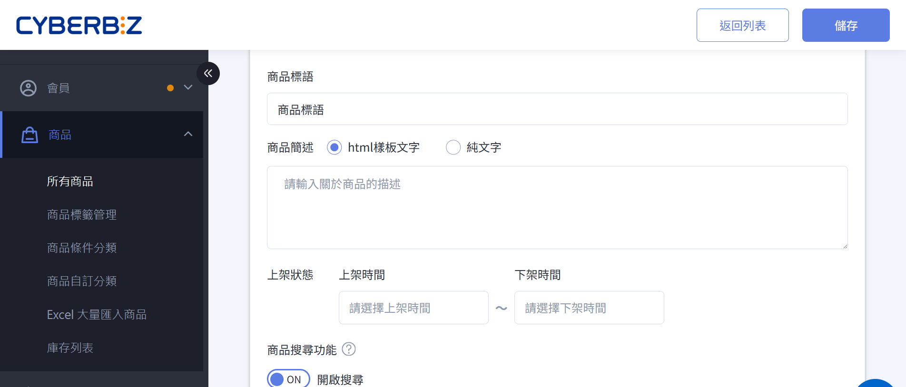
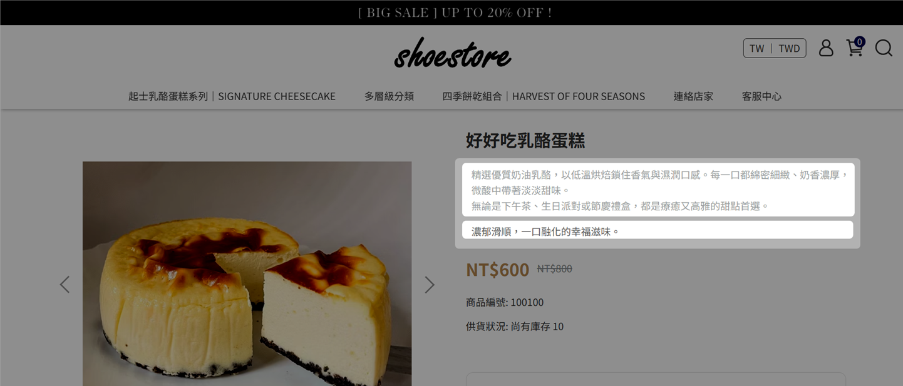
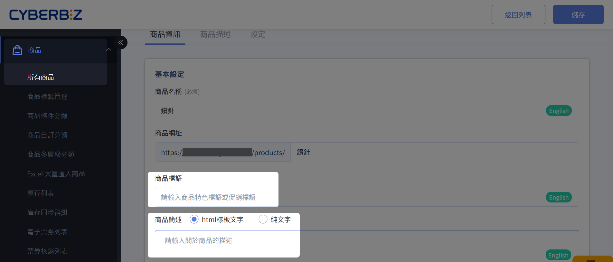
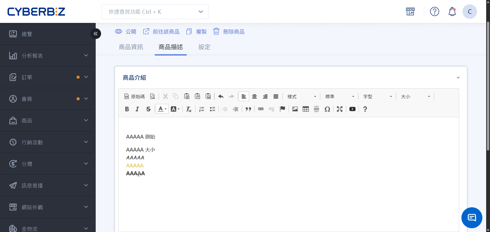
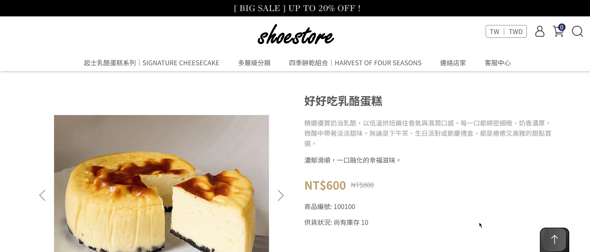

# 編輯商品簡述與商品標語
客製商品標語與商品簡述文字樣式、修改商品文案。
{ .subtitle }

{ .hero-page }

## 商品簡述與商品標語說明
 
*商品簡述* 與 *商品標語* 是顯示於商品頁面的文字欄位，用於補充商品特色與重點資訊。

**前台顯示位置**

!!! quote inline end ""
	- 商品簡述：精選優質奶油乳酪，以低溫烘焙鎖住香氣與濕潤囗感。每一囗都綿密細緻、奶香濃厚,微酸中帶著淡淡甜味。無論是下午茶、生日派對或節慶禮，都是療癒又高雅的甜點首選。
	- 商品標語：濃郁滑順，一囗融化的幸福滋味。

!!! quote ""
	{ title="商品簡述與標語前台顯示位置" }

## 商品簡述與商品標語修改

商家可以透過以下兩種方式客製商品簡述與商品標語的文字樣式，維持品牌一致性並強化行銷效果：

- [個別文案修改](#個別商品文案修改)：修改個別商品的文案樣式
- [全站樣式調整](#全站樣式調整)：修改全站 CSS 設定檔案

!!! info "商品語法設定優先規則"
    商品標語與商品簡述欄位的語法設定 **優先** 於樣板編輯器的全站樣式。若同時修改樣板編輯器與個別商品，系統將以個別商品設定為準。

## 個別商品文案修改
針對單一商品的 *商品標語* 與 *商品簡述* 進行客製化樣式設定。

1. 登入 CYBERBIZ 管理後台，前往 **商品 > 所有商品**。  
2. 在商品列表中，點選您欲編輯的商品名稱進入該商品編輯頁面。
3. 在 **商品資訊** 分頁中的 **商品標語** 和 **商品描述** 欄位輸入資訊，可[直接以 HTML 語法編輯](#產生-html-樣式碼)。  
4. 點擊 **儲存** 套用變更。

### 產生 HTML 樣式碼
若您不熟悉 HTML 語法，可透過以下步驟快速產生樣式碼

1. 在商品編輯頁面，點擊 **商品描述** 分頁，點擊展開 **商品介紹** 區塊。
2. 將編輯器模式從 **標準** 切換為 **標準(DIV)**。
3. 在編輯區輸入您想要的文字，並設定文字顏色、大小等樣式。  
4. 點擊編輯器中的 **:material-file-code-outline: 原始碼** 按鈕，複製產生的 HTML 程式碼。
5. 點擊 **捨棄變更** 將商品描述欄位內的程式碼刪除，以避免前台顯示錯誤。
6. 將複製的 HTML 程式碼貼入 **商品簡述** 欄位，點擊 **儲存** 以套用變更。

### 驗證前台顯示
前往商品頁面，確認文字樣式已依設定修改。

## 全站樣式調整
對所有商品頁面的 *商品標語* 與 *商品簡述* 進行統一的樣式調整。

### 查找目標 CSS 樣式

1. 按 ++ctrl+shift+c++（Windows/Linux）或 ++cmd+option+c++（Mac）直接開啟開發人員工具並啟用元素選取模式。  
2. 將滑鼠移至想修改的文字，點擊左鍵即可選取。  
3. 在 `Styles` 面板中，查找並複製相關的 CSS 程式碼。  

### 修改 CSS 樣式

!!! warning "程式碼修改注意事項"

	- 拖拉版型不支援部分程式碼編輯功能，請以後台開放功能為主，避免操作無效或錯誤。
	- 公開版型程式碼可自行調整，但 **務必先備份原始檔案**。  
	- 若需進一步客製化修改，請委託具備經驗的工程師處理，確保系統穩定性。

1. 登入 CYBERBIZ 管理後台，前往 **網站外觀 > 套版主題管理 > 選擇操作 > CSS/HTML 編輯器**。
2. 閱讀注意事項後勾選 **已閱讀**，再點擊 **我同意**。
3. 開啟 `css/theme_main.css` 檔案，備份一份原始檔案（建議）。
> 備份原始檔案可在修改出錯時快速還原，避免網站樣式異常或資料遺失。  
> 您也可以透過[恢復樣板設定](#)回溯先前版本。
4. 將複製的 CSS 程式碼貼到檔案的最下方。  
5. 根據需求，修改 `color` 或 `font-size` 等屬性值。您可參考 [色碼表 :material-open-in-new:](https://www.ifreesite.com/color/) 選擇合適顏色代碼。  
6. 點擊 **儲存** 套用修改設定。

{ .screenshot }

### 驗證前台顯示
回到商品頁面，確認所有商品的 *商品標語* 與 *商品簡述* 已統一更改為您設定的樣式。若不滿意修改結果，樣板編輯器提供查看之前版本功能，詳情參考[恢復樣板設定](#)。

> :lucide-triangle-alert: 個別商品標語與簡述的設定會覆蓋全站樣式設定。

## 常見問題
??? quote "為什麼我的群組頁面出現跑版？"
    這通常是 HTML 語法編輯錯誤所導致，例如標籤未正確閉合，如下文的錯誤範例。

    - :material-check: **正確寫法**： `浙江風味，甘鹹好下飯`
    - :material-close: **錯誤範例**： `浙江風味，甘鹹好下飯>`
    - :material-fire: **建議**：HTML 相關問題仍委託專業人士處理，CYBERBIZ 無法提供個別協助。

    { .screenshot }

??? quote "CYBERBIZ 是否提供個別程式碼修改協助？"
    CYBERBIZ 僅提供現有文件內修改資訊，無法提供文件外程式碼修改協助。若需進一步修改，可透過 [APP MARKET](https://appmarket.cyberbiz.io/category/store_design) 聯繫外部設計廠商。
