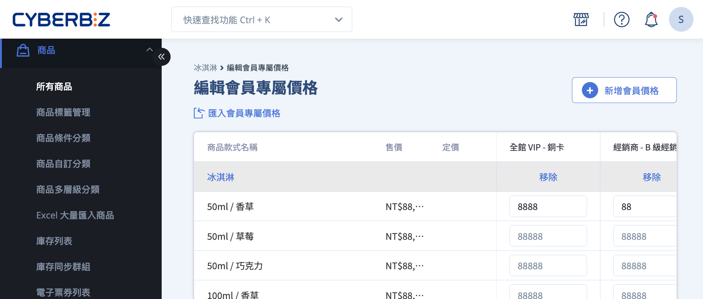
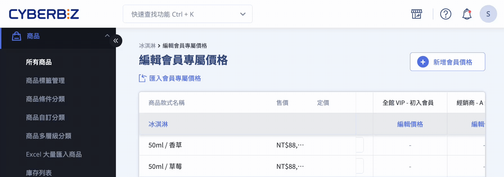
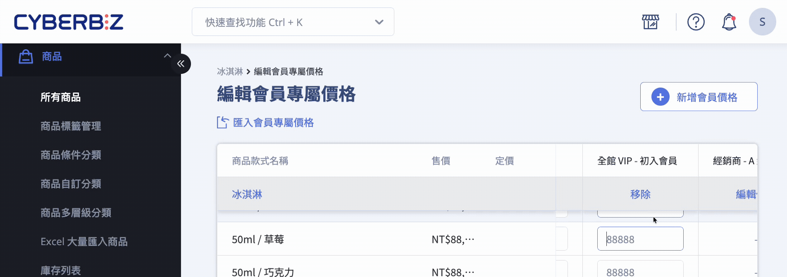
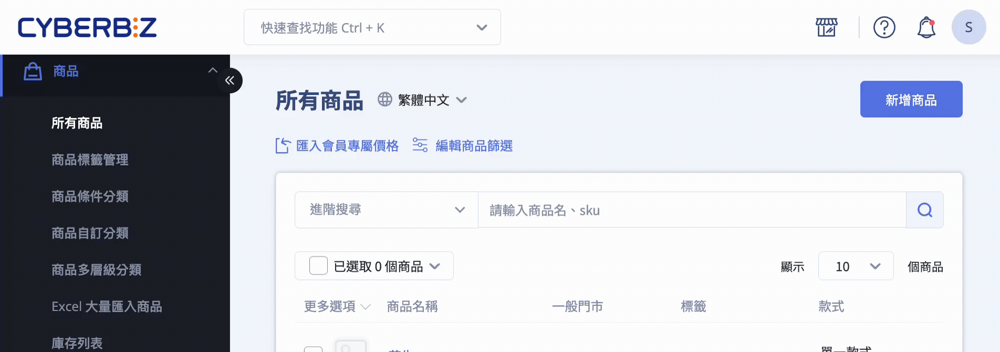
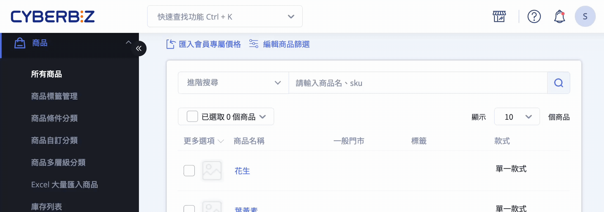
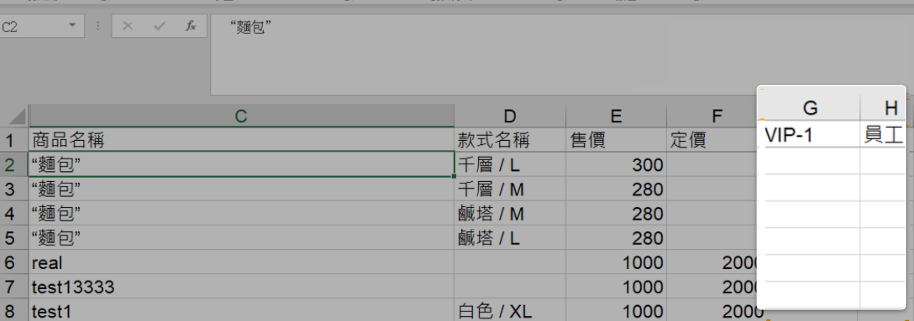
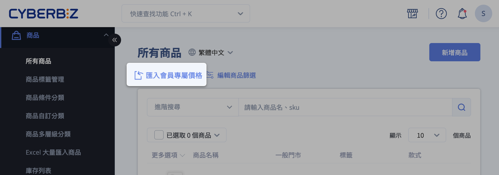
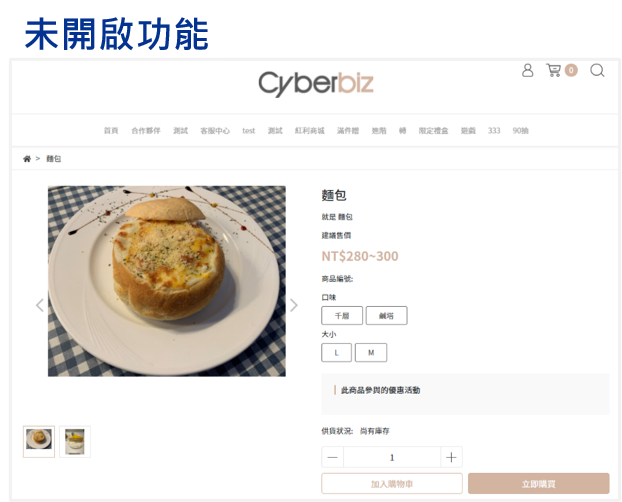
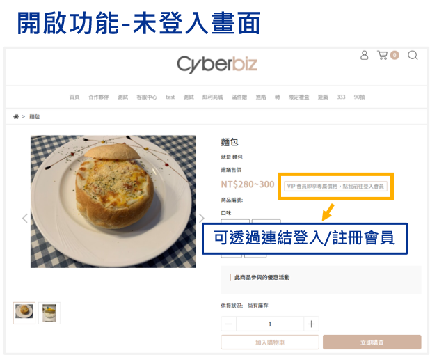
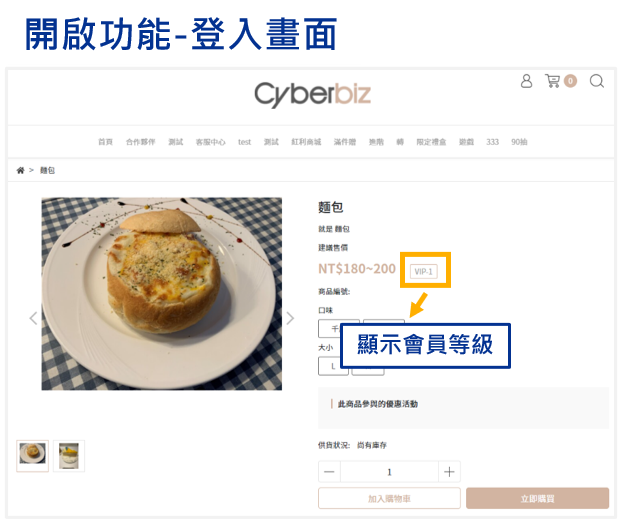

# 設定 VIP 會員專屬價格

為不同 VIP 會員群組設定專屬商品價格，管理會員優惠更靈活。
{ .subtitle } 

[:lucide-lock:{ title="適用方案" }](../../resources/conventions#適用方案) | 高手 / PLUS / 企業
{ .doc-badge }

{ .hero-page }

## VIP 會員專屬價格說明

!!! tip "應用情境"
	- 為不同 VIP 群組設定專屬的商品價格。
	- 透過單筆、多筆編輯或 Excel 匯入方式，靈活管理 VIP 專屬價格。
	- 開啟未登入顧客顯示 VIP 優惠提示，引導潛在 VIP 會員登入以查看專屬優惠。

## 前置條件

- 已[設定 VIP 會員群組](設定顧客 VIP 群組)。
- 若發佈新的 VIP 規則，請重新設定會員專屬價格，確保價格正確套用。

## 單筆設定會員專屬價格

1. 登入 CYBERBIZ 管理後台，前往 **商品 > 所有商品**。
2. 選擇商品，進入 **商品資訊** 頁籤。
3. 在 **款式管理** 區塊，點擊 **編輯會員專屬價格**。
4. 從下拉選單選擇 VIP 群組。
5. 點擊 **新增會員價格**，新增對應群組欄位，設定專屬價格。

### 編輯會員價格

- 點擊「編輯價格」輸入專屬價格。  
- 每個款式可設定不同價格，未設定時系統預設使用商品售價。

### 刪除會員價格

1. 點擊該群組欄位旁 **移除**。
2. 點擊 **刪除** 確認移除。

	
## 多筆設定會員專屬價格

1. 登入 CYBERBIZ 管理後台，前往 **商品 > 所有商品**。
2. 選取單筆或多筆商品。
3. 點擊上方「操作選單」，選擇 **編輯會員專屬價格**。
4. 從下拉選單選擇 VIP 群組。

### 編輯與刪除會員價格

- 點擊 **新增會員價格**，選擇 VIP 群組並編輯價格。
- 若要刪除群組價格，點擊欄位旁 **移除**。

> 每個款式可設定不同價格，未設定則使用商品售價。

## Excel 批次匯入/修改

### 步驟一：匯出會員專屬價格

1. 登入 CYBERBIZ 管理後台，前往 **商品 > 所有商品**。
2. 勾選欲編輯的商品。
3. 點擊上方「操作選單」，選擇 **匯出會員專屬價格**。

### 步驟二：編輯 Excel 檔案

1. 系統將 Excel 檔案寄至信箱，下載後開啟。
2. 在對應欄位設定商品專屬價格，儲存檔案。

### 步驟三：匯入 Excel 檔案

1. 前往 **商品 > 所有商品**。
2. 在商品列表上方，選擇 **匯入會員專屬價格**。
3. 上傳 Excel 檔案，點擊 **確認**。
4. 系統成功匯入後，會寄送通知信至信箱。

## 未登入 VIP 標籤顯示  

此功能旨在提醒未登入的 VIP 顧客，登入後可享有更優惠的價格。

1. 登入 CYBERBIZ 管理後台，前往 **網站外觀 > 套版主題管理 > 網站設定**。
2. 切換至 **商品頁面** 頁籤，勾選 **會員專屬價格標籤**。
3. 設定 **商品 VIP 標籤連結**，引導會員登入或註冊。

4. 登入 CYBERBIZ 管理後台，前往 **網站外觀 > 套版主題管理 > 網站設定**。
5. 切換至 **商品頁面** 頁籤，找到 **基本設定** 區塊。
6. 勾選 **會員專屬價格標籤** 以啟用功能。若未開啟，未登入的消費者在前台商品頁將不會看到標籤提醒。
7. 在 **商品 VIP 標籤連結** 欄位，可設定連結至商品註冊/登入網址，引導客戶進行登入。

{ .screenshot }

       
## 已登入會員顯示

已登入的會員，若其所屬的 VIP 群組有設定商品的會員專屬價格，則商品頁的商品售價將會顯示設定的會員專屬價格，並同時顯示該會員所屬的 VIP 群組名稱。

=== "未開啟功能"
	

=== "開啟功能 會員未登入"
	商品頁面顯示登入/註冊會員連結

	

=== "開啟功能 會員已登入"
	商品頁面顯示會員等級

	

## 常見問題
??? quote "設定會員專屬價格後，前台會如何顯示？"
    === ":material-alert-circle-outline: 原因"
        當會員登入後，若其所屬的 VIP 群組有設定專屬價格，前台商品頁會直接顯示該專屬價格。若未登入，則會顯示原價，並可選擇開啟「未登入 VIP 標籤顯示」功能，提示顧客登入以查看優惠。
    === ":material-lightbulb-on-outline: 解決方法"
        - **已登入會員：** 系統自動顯示 VIP 專屬價格。
        - **未登入會員：** 建議開啟「未登入 VIP 標籤顯示」功能，並設定登入/註冊連結，引導顧客登入。

??? quote "如果一個商品有多個 VIP 群組的專屬價格，系統會如何判斷？"
    === ":material-alert-circle-outline: 原因"
        通常系統會根據會員所屬的最高等級 VIP 群組，或依據內部設定的優先順序來顯示價格。
    === ":material-lightbulb-on-outline: 解決方法"
        請參考 CYBERBIZ 官方文件或聯繫客服，確認多個 VIP 群組價格的優先級判斷邏輯。

