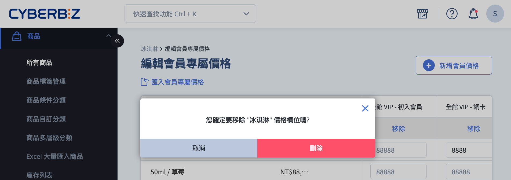
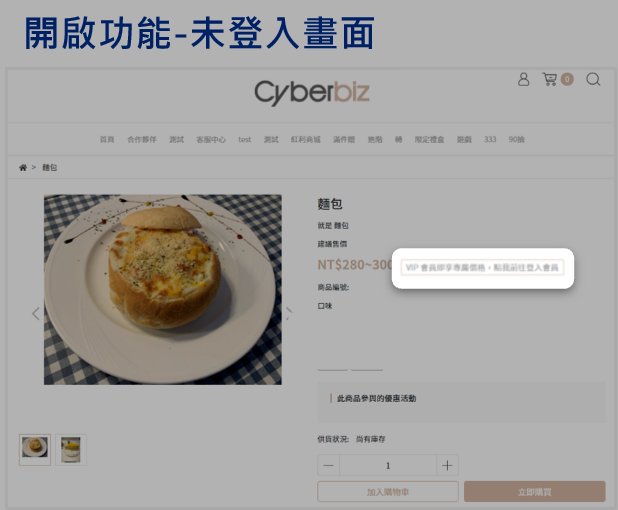
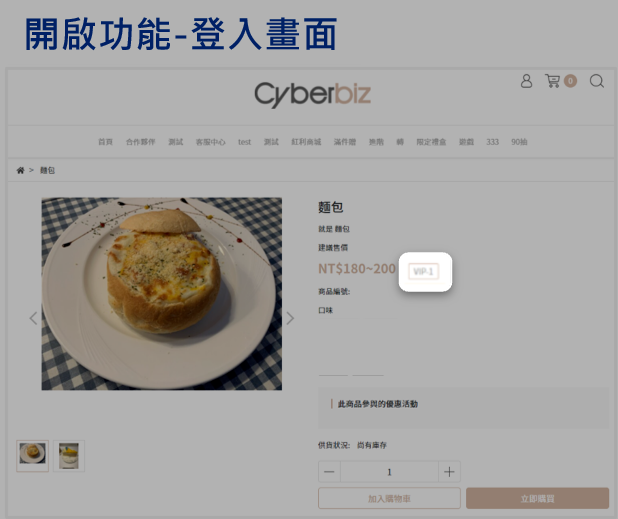

# 設定 VIP 會員專屬價格

為不同 VIP 會員群組設定專屬商品價格，管理會員優惠更靈活。
{ .subtitle } 

[:lucide-lock:{ title="適用方案" }](../../resources/conventions#適用方案) | 高手 / PLUS / 企業
{ .doc-badge }

{ .hero-page }

## VIP 會員專屬價格說明

**會員專屬價格** 能針對不同等級 VIP 會員設定差異化售價，提升高價值會員專屬感並刺激消費。

### 前置條件

- 已設定 VIP 群組。詳見 [如何設定 VIP 群組](設定 VIP 群組)。
- 若新增 VIP 規則，請重新設定會員專屬價格以確保價格正確套用。

## 單筆設定會員專屬價格

1. 登入 CYBERBIZ 管理後台，前往 **商品 > 所有商品**。
2. 選擇商品，進入 **商品資訊** 頁籤。
3. 在 **款式管理** 區塊，點擊 **編輯會員專屬價格**。
4. 從下拉選單選擇 VIP 群組。
5. 點擊 **新增會員價格**，新增對應群組欄位，設定專屬價格。

### 編輯會員價格

- 點擊「編輯價格」輸入專屬價格。  
- 每個款式可設定不同價格，未設定時系統預設使用商品售價。

### 刪除會員價格

1. 點擊該群組欄位中的 **移除**。
2. 點擊 **刪除** 確認移除。

	
## 多筆設定會員專屬價格

1. 登入 CYBERBIZ 管理後台，前往 **商品 > 所有商品**。
2. 選取單筆或多筆商品。
3. 點擊上方「操作選單」，選擇 **編輯會員專屬價格**。
4. 從下拉選單選擇 VIP 群組。

### 編輯與刪除會員價格

- 點擊 **新增會員價格**，選擇 VIP 群組並編輯價格。
- 若要刪除群組價格，點擊欄位中的 **移除**。

> 每個款式可設定不同價格，未設定則使用商品售價。

## Excel 批次匯入/修改

### 步驟一：匯出會員專屬價格

1. 登入 CYBERBIZ 管理後台，前往 **商品 > 所有商品**。
2. 勾選欲編輯的商品。
3. 點擊上方「操作選單」，選擇 **匯出會員專屬價格**。

### 步驟二：編輯 Excel 檔案

1. 系統將 Excel 檔案寄至信箱，下載後開啟。
2. 在對應欄位設定商品專屬價格，儲存檔案。

### 步驟三：匯入 Excel 檔案

1. 前往 **商品 > 所有商品**。
2. 在商品列表上方，選擇 **匯入會員專屬價格**。
3. 上傳 Excel 檔案，點擊 **確認**。
4. 系統成功匯入後，會寄送通知信至信箱。

## 會員專屬價格標籤

**會員專屬價格標籤** 搭配 **商品 VIP 標籤連結** 使用，用於提示未登入訪客登入會員以享受 VIP 專屬價格，提升註冊與轉換率。

### 功能定義與目的

- **顯示提示標籤**：商品頁面顯示提示文字（例如：登入看 VIP 價），提醒顧客登入享專屬優惠。
        
- **引導會員登入**：標籤可設定為點擊連結，引導訪客前往 **註冊或登入頁面**。
        
- **提升轉換率**：利用價格差異心理效應，提高訪客註冊與登入意願。

### 操作步驟

1. 登入 CYBERBIZ 管理後台，前往 **網站外觀 > 套版主題管理 > 網站設定**。    
2. 選擇 **商品頁面 > 基本設定**。
3. 設定以下欄位：
    
    - **會員專屬價格標籤**：前台標籤文字。        
    - **商品 VIP 標籤連結**：登入/註冊頁面網址。
 

### 前台顯示說明

若會員所屬 VIP 群組已設定專屬價格，前台商品頁將顯示會員專屬價格與 VIP 群組名稱。

=== "未開啟功能"

	未登入顧客不顯示標籤。
	
	

=== "開啟功能 會員未登入"
	顯示登入/註冊連結。

	

=== "開啟功能 會員已登入"
	顯示會員等級與專屬價格。

	

## 常見問題
??? quote "設定會員專屬價格後，前台會如何顯示？"
	會員登入後，若其 VIP 群組已設定專屬價格，前台會直接顯示。未登入則顯示原價，可選擇開啟「未登入 VIP 標籤顯示」提示登入。
	
	- **已登入會員：** 系統自動顯示專屬價格。  
	- **未登入會員：** 建議開啟標籤提示並設定登入/註冊連結。

??? quote "如果一個商品有多個 VIP 群組的專屬價格，系統會如何判斷？"
	系統依會員最高等級或內部設定優先順序顯示價格。詳情請參閱 [如何設定 VIP 群組](../members/設定 VIP 群組) 確認多群組價格優先順序。