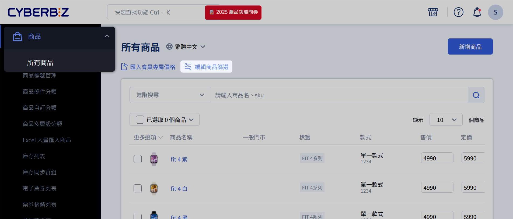
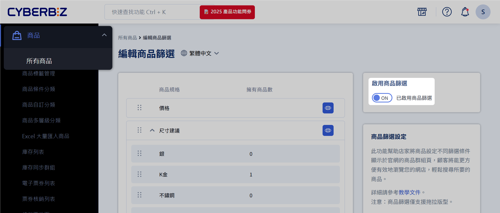
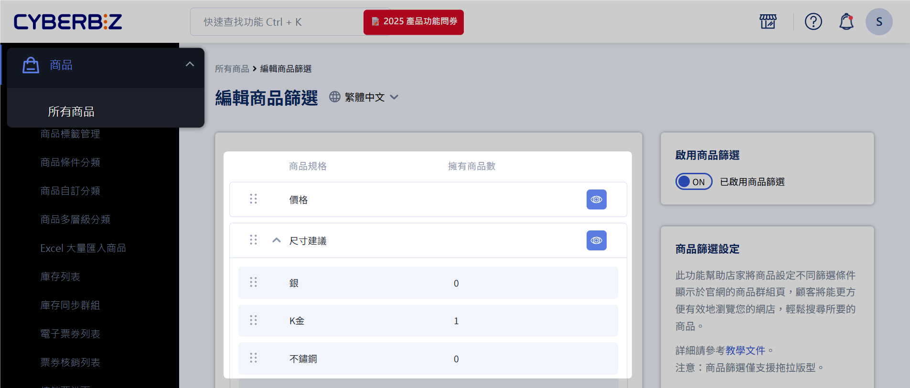

# 設定前台商品篩選器
設定顧客可以使用的商品篩選器與條件
{ .subtitle } 

[:lucide-lock:{ title="適用方案" }](../../resources/conventions#適用方案) | 進階(PLUS) / 高手(PLUS) / 企業  
[:lucide-toggle-right:{ title="適用功能" }](../../resources/conventions#適用功能) | 拖拉版型

  

## 使用須知

- :lucide-check: 支援自訂分類頁
- :lucide-check: 支援條件分類頁 `/collections`
- :lucide-x: 不支援多層級分類頁 `/categories`

### 預設篩選器
系統提供以下預設篩選器，其子條件固定且不可編輯：

| 篩選群組     | 條件/類型   | 說明                  |
| -------- | ------- | ------------------- |
| **價格**   | 任意價格區間  | 顧客可依價格範圍篩選商品        |
| **庫存量**  | 有庫存商品   | 庫存量 > 0 或庫存量無限      |
|          | 預購商品    | 庫存量 = 0 且設定 `庫存不足` 繼續銷售 |
| **紅利折抵** | 可折抵紅利商品 | 紅利折抵 > 0            |

!!! note "篩選器條件邏輯"
	| 邏輯類型 | 適用情境 | 篩選結果 | 範例 |
	|----------|----------|----------|------|
	| **交集（AND）** | 勾選 *不同篩選器* 的子條件 | 商品需同時符合所有條件 | `顏色:紅` 且 `尺寸:S` → 顯示顏色為 *紅色* 且尺寸為 *S* 的商品 |
	| **聯集（OR）** | 勾選 *同一篩選器* 的多個子條件 | 商品只要符合任一條件即可 | `顏色:紅` 或 `顏色:黑` → 顯示顏色為 *紅色* 或 *黑色* 的商品 |

!!! info "商品規格作為篩選項目"
	除了預設篩選器之外，系統會自動抓取商店所有的 *商品規格* 生成額外的篩選器，透過[編輯商品規格](#編輯商品規格)可修改篩選項目。

## 操作流程

### 設定商品篩選器（商家端）

1. 登入 CYBERBIZ 管理後台，前往 **商品 > 所有商品**。
2. 點擊 **編輯商品篩選** 按鈕，進入商品篩選器編輯頁面。

#### 啟用前台商品篩選器
點擊 **啟用商品篩選** 開關 :material-toggle-switch:，以開啟（ON）或關閉（OFF）前台商品篩選器顯示狀態。

#### 篩選器與子條件
系統會自動抓取商店內所有 **商品規格** 作為篩選器，例如 *顏色*、*尺寸*、*材質*。
	
- 篩選器：用於篩選商品的維度，例如「材質」。
- 子條件：篩選器下的具體選項，例如「棉」、「聚酯纖維」、「亞麻」。

	
#### 編輯商品規格
如需編輯商品規格，請依以下路徑操作：
	
1. 登入 CYBERBIZ 管理後台，前往 **商品 > 所有商品**。
2. 點選欲編輯的商品，進入商品編輯頁。
3. 在 **款式管理** 區塊中，點擊 **編輯商品規格**。

#### 調整篩選器與子條件排序
拖曳篩選器或子條件名稱左側的 :material-drag-vertical: 圖示，調整各自的顯示順序。
	
<video width="100%" controls>
<source src="https://www.cyberbiz.io/support/wp-content/uploads/%E5%95%86%E5%93%81%E7%AF%A9%E9%81%B8%E5%99%A8%E5%BD%B1%E7%89%8701.mov" type="video/mp4">
Your browser does not support the video tag.
</video>

#### 編輯篩選器顯示狀態
點擊篩選器右側的 :material-eye-outline: (公開) 或 :material-eye-off-outline: (未公開) 圖示，即可切換篩選器在前台的顯示狀態。
	
<video width="100%" controls>
<source src="https://www.cyberbiz.io/support/wp-content/uploads/%E5%95%86%E5%93%81%E7%AF%A9%E9%81%B8%E5%99%A8%E5%BD%B1%E7%89%8702.mov" type="video/mp4">
Your browser does not support the video tag.
</video>

### 前台顯示與操作（顧客端）

#### 前台顯示差異
商品篩選器在前台的顯示方式會因裝置類型而異。
	
=== ":material-monitor-dashboard: 桌機"
	桌機網頁前台最多顯示 5 個篩選器。若篩選器數量超過 5 個，顧客需點擊「所有篩選器」才能查看其餘選項。

	{ .screenshot }

=== ":material-cellphone: 手機"
	手機網頁前台的所有篩選器，皆需點擊「所有篩選器」才會顯示。

	

#### 子條件商品數顯示

子條件後方的括號數字，表示符合該子條件的商品數量。

#### 調整篩選條件

點擊 **所有篩選條件** 會彈出視窗，顧客可在彈窗內設定所有公開的篩選群組與選項。

#### 清除篩選條件
套用篩選器後，顧客可點擊 **清除所有篩選** 一次性移除所有已套用的子條件。
	

## 常見問題

??? quote "商品篩選器是否支援所有商品分類頁面？"
    否，商品篩選器僅適用於商品自訂分類與商品條件分類頁面（`/collections` 頁），不適用於商品多層級分類頁面（`/categories` 頁）。

??? quote "為什麼我的篩選器沒有顯示在前台？"
    請確認篩選器已在後台設定為 *公開* 狀態。此外，桌機前台最多顯示 5 個篩選器，手機前台則需點擊 *所有篩選器* 才會顯示。

## 延伸閱讀

- [編輯商品描述與設定](編輯商品描述與設定)
