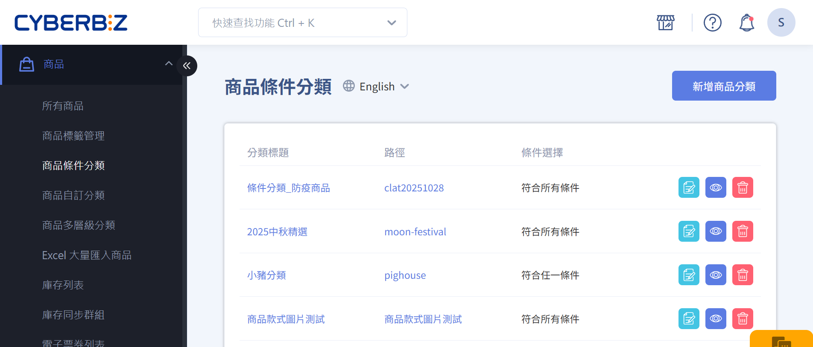
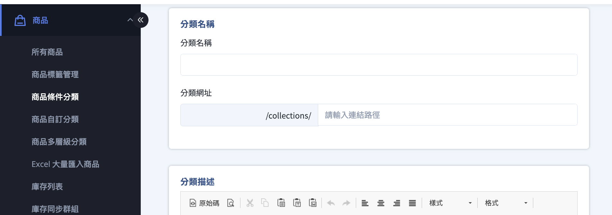
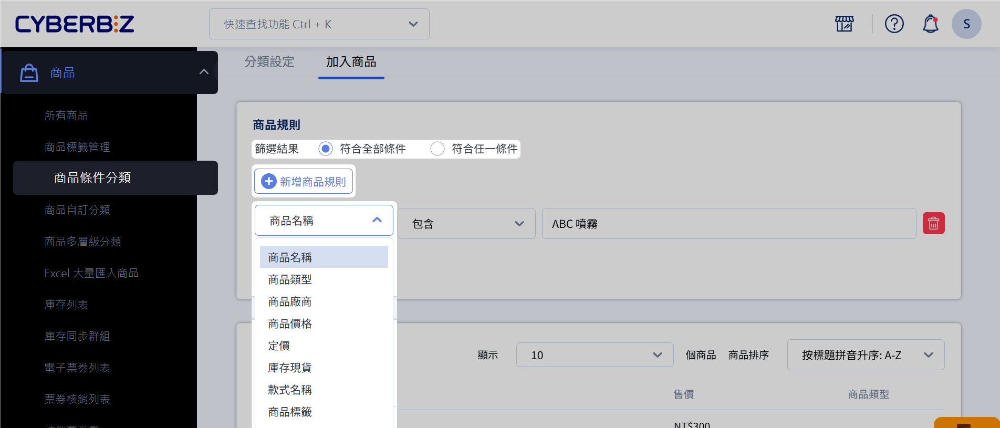
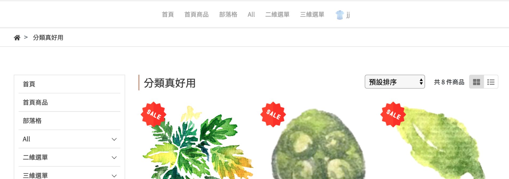
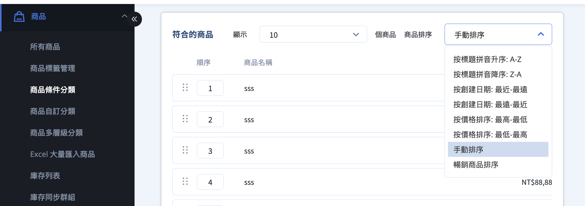
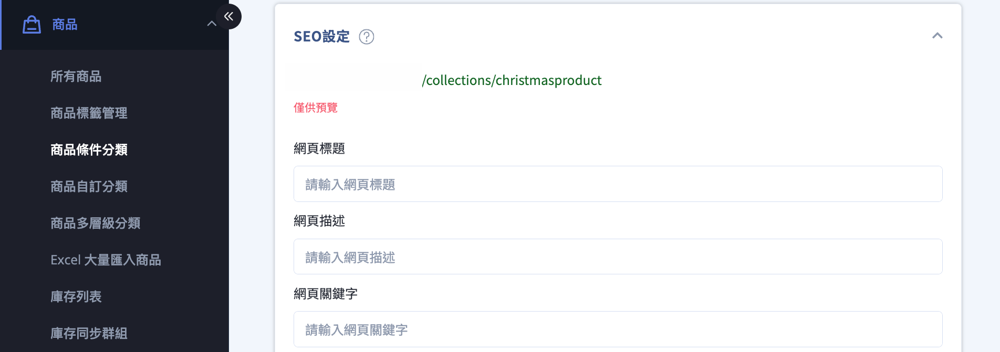

# 設定商品條件分類群組

依商品屬性與條件，自動將符合規則的商品加入指定的分類群組，無須手動維護商品清單。
{ .subtitle }

{ title="商品自動分類群組：商品 > 商品條件分類" .hero-page }

## 商品條件分類群組說明

**商品條件分類群組（又稱智慧群組）** 是一種依據商品屬性與條件，自動收錄商品的分類方式。  
系統會持續比對商品資料，並即時更新群組內的商品內容。

此類群組特別適合用於：

- 商品數量多、異動頻繁的商店
- 需依價格、庫存或標籤動態調整分類
- 搭配行銷活動或 SEO 分類頁使用

### 常見應用情境

- **自動化商品管理**  
  依價格區間、庫存狀態、關鍵字等條件，自動將商品歸類至對應群組。
- **精準行銷設定**  
  將符合條件的商品套用行銷活動，例如 [單品限時折扣](設定單品限時折扣群組.md)。
- **分類頁 SEO 優化**  
  為條件分類頁設定專屬描述與關鍵字，提升搜尋引擎曝光。
- **複雜商品結構管理**  
  支援多條件與多層篩選，適合商品結構較複雜的商店。

## 建立商品條件分類

1. 登入 CYBERBIZ 管理後台，前往 **商品 > 商品條件分類**。
2. 點擊 **新增商品分類**，進入分類編輯頁。
3. 設定以下基本資訊：
	- **分類名稱**
	- **分類網址**
	- **分類描述**
4. 點擊 **儲存**，完成分類建立。

## 設定商品篩選規則

建立條件後，系統會依規則自動將商品加入群組。

1. 在分類列表中，點擊欲設定的 **條件分類群組**。
2. 切換至 **加入商品** 頁籤。
3. 設定篩選方式與規則：
	- **篩選結果**：  
	 選擇商品需「符合所有條件」或「符合任一條件」。
	- 點擊 **新增商品規則**，設定商品條件（如價格、標籤、庫存等）。
4. 點擊 **儲存**，系統將即時更新群組內的商品清單，並顯示於下方商品列表中。

### 前台顯示效果說明

完成設定後，商品條件分類群組可顯示於前台商店頁面，並依設定內容自動更新。

### 調整群組內商品排序

您可以控制商品在前台分類頁中的顯示順序。

1. 點擊 **商品排序** 下拉選單。
2. 選擇排序方式：
	- **自動排序**：依系統規則排序
	- **手動排序**：自行調整商品順序
3. 若選擇手動排序，使用 :lucide-grip-vertical: 拖曳商品調整排列順序。

## 設定分類頁的 SEO 資訊

為條件分類頁設定 SEO 資訊，有助於搜尋引擎收錄與排名。

1. 在分類列表中，點擊欲設定的 **條件分類群組**。
2. 切換至 **分類設定** 頁籤。
3. 捲動至 **SEO 設定** 區塊，填寫：
	- 網頁標題
	- 描述
	- 關鍵字
4. 儲存設定以套用變更。

## 後續操作

- :lucide-menu:{ .lg }  
  [__選單導覽設定__](#)   
  將商品條件分類列表顯示於前台導覽列。
- [__POS 前台選單設定__](#)     

## 常見問題

??? quote "什麼情況不適合使用商品條件分類群組？"
	以下情況建議改用 **自訂分類群組**，而非條件分類群組：

	- 商品數量少，且不常異動
	- 分類邏輯需要人工判斷（例如主打商品、季節推薦）
	- 分類內容需完全手動控制，不希望因商品屬性變動而自動調整
	    
	條件分類適合「**規則明確、可自動化**」的分類需求；若需高度人工干預，建議使用自訂分類。

??? quote "商品條件分類群組與自訂分類群組有什麼差別？"
	兩者差異如下：

	- **商品條件分類群組（智慧群組）**
	    
	    - 依商品屬性與條件自動加入商品
	    - 商品內容會隨商品資料異動自動更新
	    - 適合大量商品或需動態維護的分類
	        
	- **自訂分類群組**
	    
	    - 由商家手動選擇商品加入
	    - 商品內容不會自動變動
	    - 適合精選商品或主題型分類

??? quote "商品條件分類群組可以手動加入或移除商品嗎？"
	不可以。條件分類群組的商品內容 **完全由篩選規則決定**，無法手動加入或移除單一商品。若需要手動調整商品內容，請改用 **自訂分類群組**。

??? quote "條件分類群組中的商品多久會更新一次？"
	商品條件分類會在以下情況即時或自動更新：

	- 商品資料（價格、庫存、標籤等）變更時
	- 分類篩選條件被修改並儲存後
	
	系統會重新比對商品資料，並更新群組內容，無須人工同步。

??? quote "條件分類群組可以用於多層級分類嗎？"
	可以。商品條件分類群組可作為 **多層級分類中的底層群組來源**，搭配大分類與中分類使用，建立清楚的分類架構。

??? quote "條件分類群組可以套用行銷活動嗎"
	可以。條件分類群組可用於設定多種行銷活動，例如：

	- 滿額折扣    
	- 分類折扣
	- 單品限時優惠
	
	只要商品符合條件並被納入群組，即可自動套用對應的活動規則。

??? quote "條件分類群組會影響前台商品排序嗎？"

	條件分類只負責「**商品是否被納入群組**」，不直接決定排序方式。商品在前台的顯示順序，需透過以下設定控制：
	
	- 群組內的 **商品排序方式（自動／手動）**
	- 前台頁面的排序邏輯設定