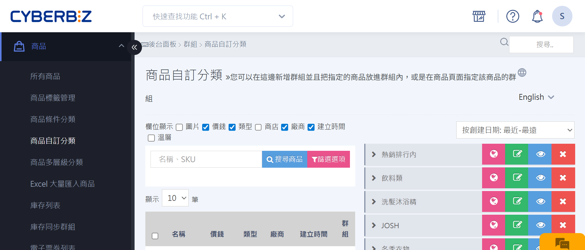
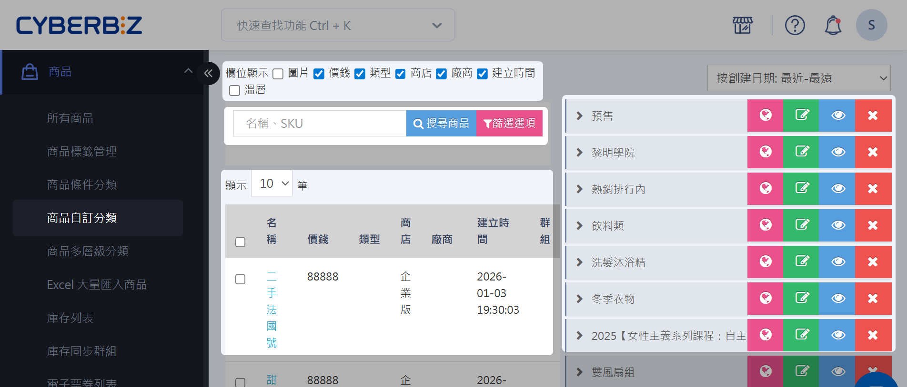
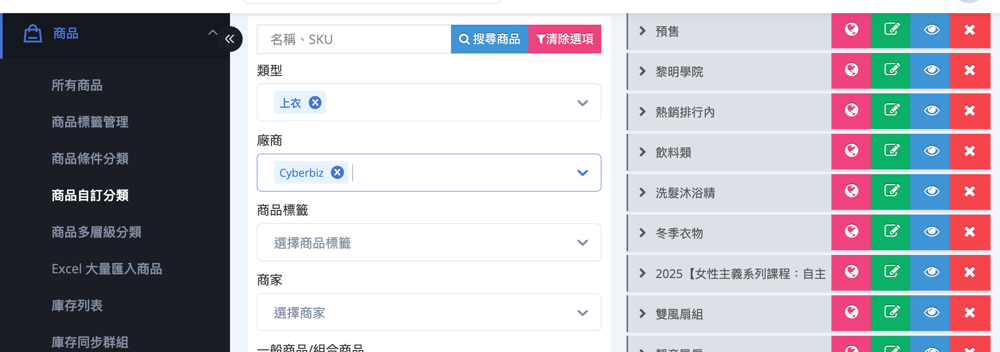
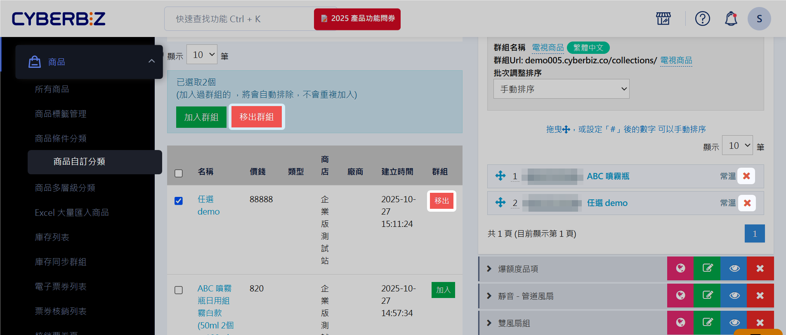
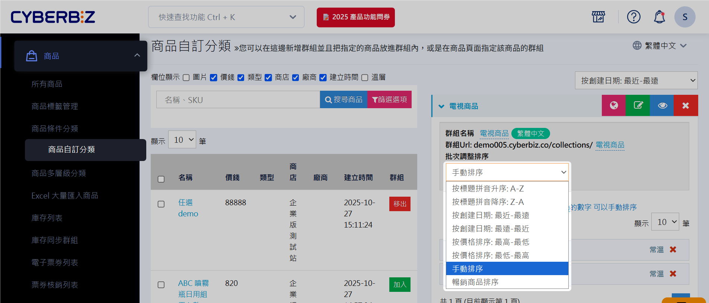

# 設定商品自訂分類群組
建立、編輯與管理商品自訂分類群組，優化商店頁面、支援行銷活動並提升 SEO 可見性。
{ .subtitle }

{ title="自訂商品分類群組：商品 > 商品自訂分類" .hero-page }

## 商品自訂分類介面說明

登入 CYBERBIZ 管理後台，前往 **商品 > 商品自訂分類** 進入管理介面。

介面功能：

- **欄位顯示**：勾選欲顯示於商品列表的欄位。
- **搜尋商品**：可輸入商品名稱或 SKU 快速定位商品。
- **篩選選項**：依商品類型、廠商、商品標籤或商家等條件篩選商品，點擊展開進行設定。
- **商品列表**：顯示符合搜尋與篩選條件的商品。
- **群組列表**：顯示已建立的自訂分類群組，可編輯群組名稱、網址與商品排序方式。



## 群組篩選器

群組篩選器協助快速篩選符合條件的商品，支援多條件組合。

### 篩選邏輯

- **篩選項目之間為「交集（AND）」**：商品需同時符合所有篩選項目才會被列出。
- **同一篩選項目內多個條件為「聯集（OR）」**：符合其中任一條件即符合該項目。



### 篩選選項

- **商品類型**：篩選指定類型商品，可選多個類型。
- **商品廠商**：篩選指定廠商商品，可選多個廠商。
- **商品標籤**：篩選包含指定標籤的商品，可選多個標籤。
- **商家**：商品來源，依 POS 或官網來源篩選商品。

### 篩選範例

**條件設定**

- 商品類型：舒壓小物、鋼琴 
- 商品廠商：根本、YAMAHA
- 商品標籤：舒壓、piano
- 商品來源：官網

**篩選結果**

商品需同時符合以下條件，才會被列入結果：

```
（商品類型 = 舒壓小物 或 鋼琴） AND（廠商 = 根本 或 YAMAHA） AND（標籤 = 舒壓 或 piano） AND（來源 = 官網）
```

篩選後商品將顯示於列表中。

## 建立自訂分類群組


1. 登入 CYBERBIZ 管理後台，前往 **商品 > 商品自訂分類**。
2. 在群組列表下方輸入新群組名稱，點擊 **新增群組**。
3. 點擊群組名稱，展開群組詳細資訊以便新增商品。

## 將商品加入分類群組

1. 點擊群組列表中的分類群組名稱，展開群組詳細資訊。    
2. 使用關鍵字或篩選條件定位商品。
    
    - **單筆加入**：勾選商品 → 點擊 **加入**    
    - **批次加入**：勾選多個商品 → 點擊 **加入群組**
        
3. 成功加入的商品會顯示於右方群組清單，包含商店、名稱及溫層等資訊。

### 移出商品

- **單筆移出**：點擊 **移出**，或直接點擊右方清單中的 :material-close:
- **批次移出**：勾選多個商品 → 點擊 **移出群組**



### 快捷按鈕功能

- :material-earth: **瀏覽群組頁**：前往前台查看群組展示頁面 
- :material-square-edit-outline: **編輯群組**：修改群組名稱、描述與 Meta Tag  
- :material-eye: **切換公開狀態**：控制群組在前台顯示
- :material-close: **刪除群組**：移除整個分類群組

### 調整商品排序

1. 點擊 **調整排序** 下拉選單，選擇自動排序或手動排序。
2. 若選擇 **手動排序**，使用 :material-arrow-all: 拖曳商品調整順序。
   
> :lucide-triangle-alert: 若商品名稱包含系統不支援標點符號，排序功能可能失效。請點擊名稱進入編輯頁面修正。



## 編輯分類描述與 SEO

1. 在群組列表中，點擊 **編輯群組** :material-square-edit-outline: 進入編輯頁面。    
2. 在 **群組描述** 頁籤中的編輯器，新增或修改文字描述。
3. 點擊 **儲存** 套用變更。
4. **設定群組頁橫幅**：可新增圖片、影片或文字，展示行銷重點。

	<div class="grid cards two-columns" markdown>
	
	- 
	- 

	</div>
    
5. **設定 Meta Tag**：在 **Meta Tag 設定** 頁籤輸入關鍵字及 SEO 相關資訊，提高搜尋排名。


## 後續步驟

<div class="grid cards" markdown>

- :lucide-filter:{ .lg }   
  [__條件分類群組__](設定商品條件分類群組.md){ data-preview }  
  設定條件讓系統自動將商品分類。
- :lucide-eye-off:{ .lg }  
  [__秘密商品群組__](設定秘密商品群組.md){ data-preview }     
  建立秘密商店，僅提供購買連結特定顧客。
- :lucide-percent:{ .lg }    
  [__設定商品加價購__](../marketing/設定商品加價購.md){ data-preview }    
  為指定商品群組設定加價購活動，提高客單價。
- :lucide-clock:{ .lg }  
  [__單品限時折扣__](../marketing/設定單品限時折扣群組.md) 
- :lucide-ban:{ .lg }  
  [__排除優惠群組__](#)  
  設定排除優惠群組，將商品從指定優惠活動中排除。
- :lucide-menu:{ .lg }  
   [__前台群組排序__]()  
   調整前台商品群組顯示順序
- :lucide-menu:{ .lg }  
   [__POS 前台選單設定__](#)  
   設定 POS 商品多層級分類，並建立商品自訂分類或商品類型。  
  
</div>

## 常見問題

??? quote "前台導覽列的商品的分類一次最多可以顯示幾個？"
	最多 20 個。

??? quote "如果我刪除了商品群組，群組內的商品會被刪除嗎？"
    不會。刪除商品群組僅會移除該分類群組，群組內的商品仍會保留在您的商品列表中。
