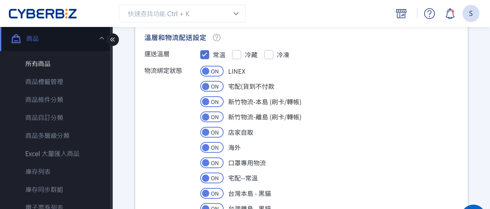
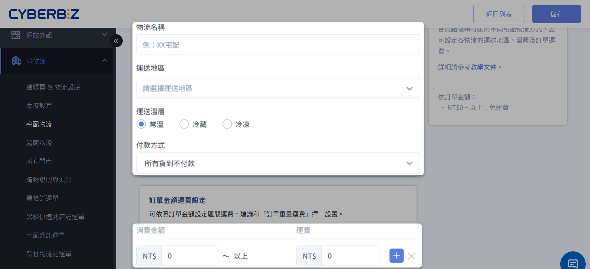
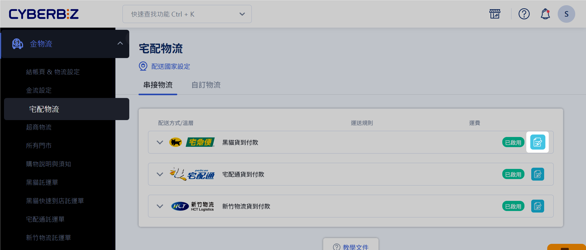
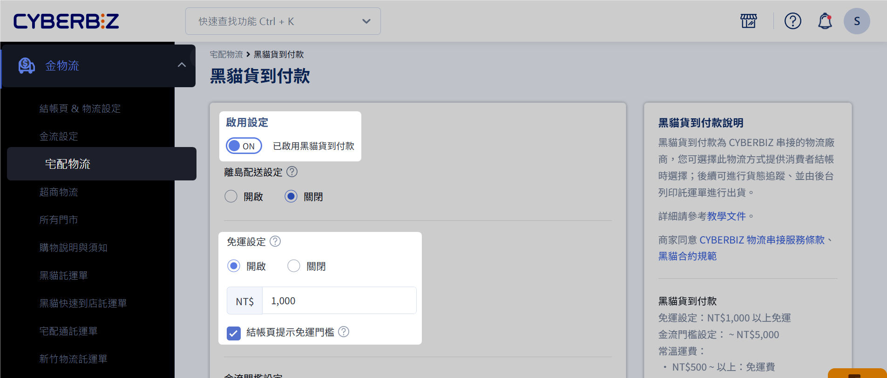
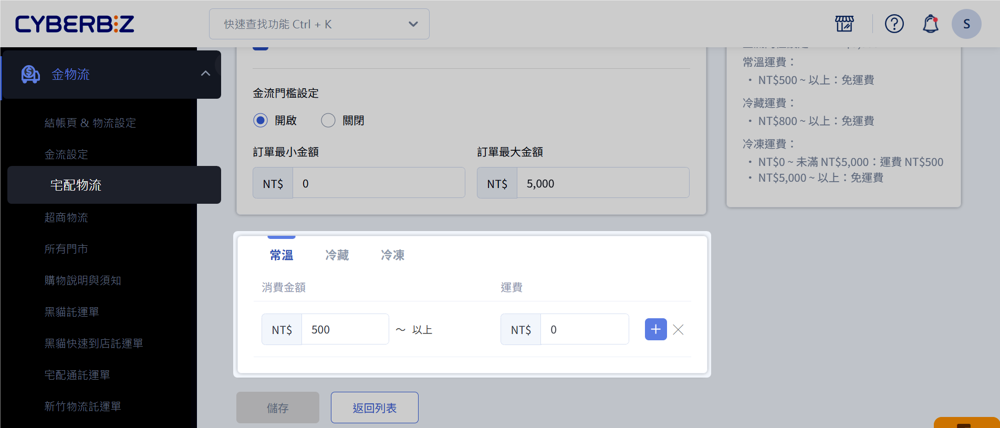
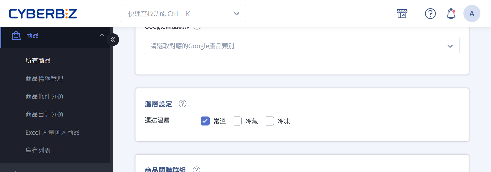
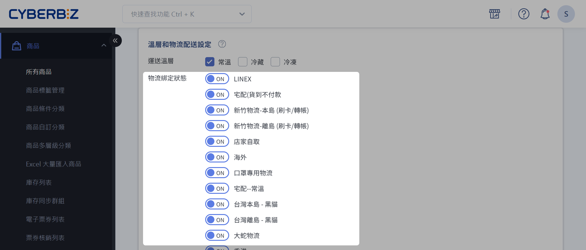

# 設定商品配送條件（物流、溫層與出貨通路）
設定商品的配送溫層與物流，並以一般宅配與貨到付款為例，說明運費設定、商品綁定及結帳拆單行為。
{ .subtitle } 

{ .hero-page }

## 配送條件綁定說明

商品配送條件綁定，指的是將商品明確設定為「可使用」或「僅能使用」特定的配送物流、配送溫層或出貨通路。
系統會依據這些綁定設定，在顧客結帳時判斷並顯示可用的配送選項。

## 配送條件綁定適用情境

- **配送物流綁定**：當商品僅能由特定物流配送（如黑貓、宅配通、郵局）時，可設定商品僅適用該物流。

- **配送溫層綁定**：針對需特殊溫層配送的商品（如常溫、冷藏、冷凍），可設定一個或多個適用溫層。

- **出貨通路綁定**：當商品分屬不同出貨地點（如不同倉庫、門市或廠商）時，可設定商品所屬的出貨通路。

## 設定物流不同溫層的運費

在設定商品的配送條件前，請先於後台建立各 *物流方式*，並為不同 *配送溫層* 設定對應的運費規則。  
完成設定後，相關物流選項才會顯示於商品編輯頁面，供後續綁定使用。

### 一般宅配（自訂物流）

以下說明如何建立可依不同配送溫層計費的宅配物流方式。

1. 登入 CYBERBIZ 管理後台，前往 **金物流 > 宅配物流**。
2. 點擊「自訂物流」頁籤。
3. 點擊「新增自訂物流」。
4. 依序完成以下設定：

	- **物流名稱**：輸入物流顯示名稱。
	
		!!! warning "物流名稱請勿重複或隨意變更"  
		    - 請勿使用與系統內建物流相同的名稱（例如：黑貓貨到付款、宅配通貨到付款），否則可能導致結帳錯誤或物流判斷異常。  
		    - 若變更物流名稱，原本已綁定該名稱的商品將會解除綁定，需重新設定商品配送方式。  
		    - 即使為同一物流商，不同配送溫層亦 **必須使用不同物流名稱**，例如：  
		    黑貓（常溫）／黑貓（冷藏）／黑貓（冷凍）。
	    
	- **運送地區**：選擇物流可配送的地區。
	    
	- **運送溫層**：選擇此物流適用的配送溫層（預設為常溫）。
	    
	- **訂單金額運費設定**：
	    
	    - 輸入「消費金額」與對應的「運費」。
	    - 若需設定多個金額區間，請點擊 **新增設定** 增加運費門檻。

5. 點擊 **儲存** 以套用設定。

完成後，該物流方式將顯示於商品編輯頁面的 **設定** 頁籤中，可進行後續的 [配送溫層綁定](#設定商品配送溫層) 與 [配送方式綁定](#設定商品配送方式)。

!!! warning "新增物流不會自動套用至限定物流商品"
	若商品已設定為「僅限特定物流」，後續新增的物流方式 *不會自動綁定* 至該商品。請手動將商品與新增物流進行綁定，否則該物流方式將 *不會顯示於結帳頁的配送選項*。[瞭解更多](#商品綁定後新增配送物流)。

### 宅配貨到付款

以下說明如何為既有宅配物流設定貨到付款與不同配送溫層的運費規則。

1. 登入 CYBERBIZ 管理後台，前往 **金物流 > 宅配物流**。
2. 找到欲設定的物流選項，點擊 :material-text-box-edit-outline: 進入編輯頁面。

	
	
3. 設定貨到付款與免運條件：

	- 開啟貨到付款功能。
	- 開啟免運並設定免運金額。

	!!! warning "貨到付款金額可能影響免運判斷"  
		若代收的訂單金額已達或超過設定的免運門檻，系統將忽略運費設定，該筆訂單視為免運費。

	

4. 設定不同配送溫層的運費：

	- 僅能依 **代收的訂單金額** 作為運費計算依據。
	- 請分別為各配送溫層設定對應的運費金額。

	

## 設定商品配送溫層

在完成[物流運費設定](#設定物流不同溫層的運費)後，您可以為個別商品設定其可使用的配送溫層與對應物流。  
如需了解綁定機制，請先參閱：[什麼是綁定配送條件](#配送條件綁定說明)。

**操作步驟**

1. 登入 CYBERBIZ 管理後台，前往 **商品 > 所有商品**。
2. 點擊欲設定的商品，進入商品編輯頁面。
3. 切換至 **設定** 頁籤。
4. 在 **溫層設定／溫層和物流配送設定** 區塊中，選取此商品適用的配送溫層（可複選，預設為 `常溫`）。

## 設定商品配送方式

[:lucide-lock:{ title="適用方案" }](../../resources/conventions#適用方案) | 
高手 / PLUS / 企業

您可以為個別商品設定其可使用的配送物流方式。如需了解綁定機制，請先參閱：[什麼是綁定配送條件](#配送條件綁定說明)。

**操作步驟**

1. 登入 CYBERBIZ 管理後台，前往 **商品 > 所有商品**。 
2. 點擊欲設定的商品，進入商品編輯頁面。
3. 在商品編輯頁面中，找到 **溫層和物流配送設定** 區塊，設定商品可使用的物流方式。

    - **物流綁定狀態說明**：
        - `ON`：此商品 *可使用* 該物流方式配送。
        - `OFF`：此商品 *不可使用* 該物流方式配送。
    - **預設行為**：商品建立時，系統預設已綁定所有可用的物流方式。     
    - **必要條件**：每個商品 *至少需綁定一種配送物流*，否則將無法進行配送。
        
    
    
4. **確認修改提醒**：首次變更物流綁定狀態時，系統會顯示設定提醒。請詳閱注意事項後，勾選並點擊 **確認**。 
> :lucide-triangle-alert: 若未完成確認，後續每次修改物流綁定時，系統皆會再次顯示提醒。

### 修改物流運費設定的注意事項
當您修改物流運費設定時，請留意以下事項：

#### 變更計算運費基準
若您變更計算運費的基準，必須重新設定物流的溫層、運費規則，以及商品頁面綁定配送物流的設定。

-   商品會 **預設為適用所有配送方式**。如需要綁定特定物流的商品，記得個別去設定。
-   商品頁面中快遞/物流名稱也會變更為目前您於「物流運費設定」建立的項目。

{ .screenshot }
{ .screenshot }

## 設定商品通路（出貨通路）

商品通路（亦稱出貨通路）用於指定商品的出貨來源，例如不同門市、倉庫或供應商。  
商品通路設定會影響 [*購物車拆分*](設定結帳拆分多購物車)、*結帳流程* 與 *訂單建立方式*。

**操作步驟**

1. 登入 CYBERBIZ 管理後台，前往 **商品 > 所有商品**。 
2. 點擊欲設定的商品，進入商品編輯頁面。
3. 點擊「設定」頁籤  
     

4. 選擇商品通路  
   - 預設為「請選擇通路」（無通路），表示**適用所有通路**  
   - 除「無通路」外，每個商品只能綁定 **單一通路**  
   - 若列表無符合的通路，可輸入文字新增通路名稱  
     

3. 新增商品通路名稱，點選「新增」  
   !!! warning "通路新增後無法刪除"  
       新增後的通路無法刪除，請確認輸入正確。  
     

---

## 步驟 2：購物車結帳行為範例

**範例**：商品通路設定台北門市、台中門市  

- 商品A（台北）  
- 商品B（台中）  
- 商品C（台北、台中皆可）  

1. 顧客將三個商品加入購物車  
   - 系統自動拆分為兩個購物車：  
     - 台北門市購物車 → 商品A、商品C  
     - 台中門市購物車 → 商品B、商品C  
     

2. 顧客先完成台北門市購物車結帳  
   - 建立台北門市訂單  
   - 台中門市購物車中商品C會自動更新數量，避免重複出貨  
     

3. 顧客再完成台中門市購物車結帳  
   - 建立台中門市訂單  
     

## 情境範例

### 商品綁定後新增配送物流

當商品已完成配送物流綁定後，*若新增新的配送物流方式*，系統將依商品原有的物流綁定設定，自動判斷是否套用該物流：

- 設定為「適用所有配送物流」的商品 ➜ 系統會 **自動套用並綁定** 新增的配送物流。
    
- 設定為「僅限特定配送物流」的商品 ➜ 系統 **不會自動綁定** 新增的配送物流。如需使用該物流，請前往商品設定頁手動補綁。

範例說明

|商品|已存在配送物流|商品原物流設定|新增配送物流後結果|
|---|---|---|---|
|商品 A|黑貓、宅配通|適用所有配送物流|:material-check: 自動綁定新竹物流|
|商品 B|黑貓、宅配通|僅限特定配送物流（黑貓）|:material-close: 不會自動綁定新竹物流（仍僅限黑貓）|

### 不同配送物流、溫層、出貨通路的運作說明

本節說明當商品同時設定不同的 *配送物流、配送溫層與出貨通路* 時，後台設定方式以及前台結帳行為。

#### 後台設定說明

後台配送相關設定分為三個層級，並會共同影響商品可用的配送選項與結帳拆單邏輯。

- 物流運費設定：完成設定後，商品設定頁面中才會顯示對應物流供商品綁定使用。
   > 如設定 *黑貓宅配*、*宅配通* 兩種物流方式。
    
- 配送溫層設定：系統內建三種配送溫層：**常溫、冷藏、冷凍**。商品設定頁面中可勾選商品適用的溫層（可複選）。

- 商品通路（出貨通路）設定：不同通路視為不同出貨來源，將影響結帳與拆單結果。
  > 如於商品編輯頁面中設定 *台北門市*、*台中門市* 兩個商品通路（出貨地點）。

#### 前台呈現與結帳行為

當顧客的購物車中包含不同 *配送物流、配送溫層或出貨通路* 的商品時，前台結帳流程如下：

1. 系統會依 **出貨通路** 分組顯示購物車內容。
2. 顧客需先選擇一個出貨通路。
3. 於該通路下，依序選擇可用的 **配送溫層** 與 **配送物流** 進行結帳。
4. 尚未完成結帳的商品將保留在購物車中，等待後續結帳。
5. 顧客需分別完成多個購物車的結帳流程，系統將建立多筆訂單。
  > :lucide-info: 若各購物車未達免運門檻，將分別計算並收取運費。

!!! tip "簡化配送條件設定以降低棄單風險"  
	當商品同時設定多個配送條件（商品通路、配送溫層、配送物流）時，系統會在結帳時依配送條件自動將商品拆分為多個購物車，*增加顧客結帳的複雜度及運費負擔*。瞭解 [多重配送條件如何影響結帳流程](設定結帳拆分多購物車#多購物車結帳說明)。

## 後續步驟

- :lucide-pencil:{ .lg }  
   [__批次修改配送設定__](批次修改商品描述與配送設定)   
   使用 Excel 批次修改多筆商品的配送設定。
- :lucide-shopping-cart:{ .lg }   
  [__多購物車結帳說明__](設定結帳拆分多購物車#多購物車結帳說明)   
  瞭解商品的多種配送條件如何在結帳時形成多購物車。
- :lucide-truck:{ .lg }  
  [__設定商品配送通路__](設定商品出貨通路)  
  綁定商品的出貨通路。

## 常見問題

??? quote "如果我修改了物流名稱，商品綁定會失效嗎？"
    是的，若您變更物流方式的名稱，原本商品綁定的物流都會被取消綁定。您需要到商品頁面重新綁定物流配送方式。

??? quote "我可以設定多個溫層給一個商品嗎？"
    可以。在商品編輯頁面的「設定」頁籤中，您可以勾選多個溫層來綁定商品。

??? quote "為什麼顧客結帳時會出現多個購物車？"
    當顧客購買的商品包含不同溫層、配送物流或出貨通路時，系統會自動將這些商品分屬在獨立的購物車中，每個購物車需獨立結帳。瞭解[更多](設定結帳拆分多購物車#多購物車結帳說明)。