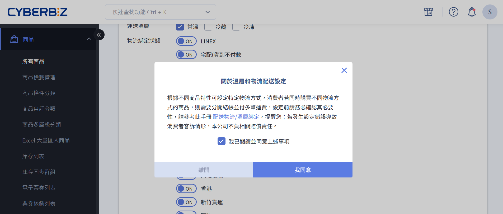

# 設定商品配送溫層跟物流（一般宅配）
設定並綁定宅配貨到付款商品的配送物流與溫層。
{ .subtitle } 

{ .hero-page }

## 配送條件綁定說明

商品配送條件綁定，指的是將商品明確設定為「可使用」或「僅能使用」特定的配送物流、配送溫層或出貨通路。
系統會依據這些綁定設定，在顧客結帳時判斷並顯示可用的配送選項。

## 配送條件綁定適用情境

- **配送物流綁定**：當商品僅能由特定物流配送（如黑貓、宅配通、郵局）時，可設定商品僅適用該物流。

- **配送溫層綁定**：針對需特殊溫層配送的商品（如常溫、冷藏、冷凍），可設定一個或多個適用溫層。

- **出貨通路綁定**：當商品分屬不同出貨地點（如不同倉庫、門市或廠商）時，可設定商品所屬的出貨通路。

## 使用須知

- 當購物車內的商品屬於不同 *配送屬性* 時，系統將自動[拆分成多購物車結帳](設定結帳拆分多購物車.md){ data-preview }，並個別計算優惠與運費。

## 設定物流不同溫層的運費

在設定商品配送條件前，請先於後台建立各物流方式，並為不同配送溫層設定對應的運費規則。

1. 登入 CYBERBIZ 管理後台，前往 **金物流 > 宅配物流**。
2. 點擊「自訂物流」頁籤。
3. 點擊「新增自訂物流」。
	- 輸入「物流名稱」。
	
	    !!! warning  "物流名稱請勿重複或隨意變更"
			- 請勿建立與系統內建物流相同的名稱（如「黑貓貨到付款」、「宅配通貨到付款」），否則可能導致結帳錯誤或物流判斷異常。  
			- 若變更物流名稱，原本綁定該名稱的商品將會解除綁定，需重新設定商品配送方式。  
			- 即使為同一物流商，不同配送溫層亦 *必須使用不同名稱*，例如：黑貓（常溫）／黑貓（冷藏）／黑貓（冷凍）。

	- 選擇「運送地區」及「運送溫層」（預設為常溫）。
	- 在「訂單金額運費設定」區塊，輸入「消費金額」與對應的「運費」。
	- 若要設定不同消費金額的運費門檻，請再次點擊「新增設定」。

1. 點擊「儲存」以套用變更。完成後，該物流方式將顯示於商品編輯頁面的設定頁籤中，可進行後續的 [商品配送溫層](#設定商品配送溫層)與[配送方式綁定](#設定商品配送方式)。

!!! warning "新增物流不會自動套用至限定物流商品"
	若商品已設定為「僅限特定物流」，後續新增的物流方式 *不會自動綁定* 至該商品。請手動將商品與新增物流進行綁定，否則該物流方式將 *不會顯示於結帳頁的配送選項*。[瞭解更多](#商品綁定後新增配送物流)。

## 設定商品配送溫層

完成[物流運費設定](#設定物流不同溫層的運費)後，您可以為個別商品綁定其適用的運送溫層。瞭解 [什麼是綁定配送條件](#配送條件綁定說明)。

1. 登入 CYBERBIZ 管理後台，前往 **商品 > 所有商品**。
2. 點擊欲設定的商品，進入商品編輯頁面。
3. 點擊 **設定** 頁籤。
4. 在 **溫層和物流配送設定** 區塊中，勾選此商品綁定運送的「溫層」（可複選）。預設為常溫。
5. 在 **溫層和物流配送設定** 區塊中，開啟欲綁定的物流。

{ .screenshot }

## 設定商品配送方式

[:lucide-lock:{ title="適用方案" }](../../resources/conventions#適用方案) | 
高手 / PLUS / 企業

您可以為個別商品綁定其可用的配送物流方式。瞭解 [什麼是綁定配送條件](#配送條件綁定說明)。

1. 登入 CYBERBIZ 管理後台，前往 **商品 > 所有商品**。
2. 點擊欲設定的商品，進入編輯頁面。
3. 在商品編輯頁面中，找到 **溫層和物流配送設定** 區塊。
	- 物流綁定狀態 :lucide-toggle-right: `ON` 代表可使用該快遞/物流配送；`OFF` 則代表此商品不適用於該快遞/物流配送。
	- 商品預設為全部物流選項皆綁定（即所有物流皆可配送）；至少需綁定一種配送物流。

	

4. 確認修改提醒：首次修改綁定狀態時，會跳出設定提醒。請閱讀完注意事項後，勾選並點擊「確認」。若未確認提醒，每次修改物流綁定都會跳出提醒。

	

### 修改物流運費設定的注意事項
當您修改物流運費設定時，請留意以下事項：

#### 變更計算運費基準
若您變更計算運費的基準，必須重新設定物流的溫層、運費規則，以及商品頁面綁定配送物流的設定。

-   商品會 **預設為適用所有配送方式**。如需要綁定特定物流的商品，記得個別去設定。
-   商品頁面中快遞/物流名稱也會變更為目前您於「物流運費設定」建立的項目。

{ .screenshot }
{ .screenshot }

## 情境範例

### 商品綁定後新增配送物流

當商品已完成配送物流綁定後，*若新增新的配送物流方式*，系統將依商品原有的物流綁定設定，自動判斷是否套用該物流：

- 設定為「適用所有配送物流」的商品 ➜ 系統會 **自動套用並綁定** 新增的配送物流。
    
- 設定為「僅限特定配送物流」的商品 ➜ 系統 **不會自動綁定** 新增的配送物流。如需使用該物流，請前往商品設定頁手動補綁。

範例說明

|商品|已存在配送物流|商品原物流設定|新增配送物流後結果|
|---|---|---|---|
|商品 A|黑貓、宅配通|適用所有配送物流|:material-check: 自動綁定新竹物流|
|商品 B|黑貓、宅配通|僅限特定配送物流（黑貓）|:material-close: 不會自動綁定新竹物流（仍僅限黑貓）|

### 不同配送物流、溫層、出貨通路

**後台設定**  

- 物流運費設定：設定黑貓、宅配通兩種物流配送方式，商品設定頁面就會有此兩種物流可選擇綁定。
- 溫層配送：已內建常溫、冷藏、冷凍三種，商品設定頁面會有此三種物流可選擇綁定。
- 商品頁面設定：設定台北門市、台中門市兩個商品通路（出貨地點）。

??? tip "簡化商品 *配送屬性* 設定以降低棄單風險"
	過多的商品配送屬性（商品通路、溫層、配送物流）會導致系統在結帳時自動將商品拆分至多個購物車。每個購物車需獨立結帳，並生成各自的訂單，且優惠與運費將分別計算。此情況會增加結帳步驟與運費成本，可能導致顧客棄單。建議僅在必要時設定多種配送屬性，以簡化購物流程並提升結帳體驗。
		
**前台呈現**  
當顧客購買了不同配送物流、溫層、出貨通路的商品時，前台畫面呈現如下：

- 最上方會列出不同的出貨通路，顧客先選擇一種出貨通路，再選擇該通路中其中一個配送溫層，溫層中再選擇配送物流，進行結帳。
- 剩餘未結帳的商品會保留在購物車中等待結帳。
- 顧客須完成多個購物車的結帳，建立多筆訂單（若未達各購物車免運門檻，則須支付多筆運費）。

## 後續步驟

- :lucide-pencil:{ .lg }  
   [__批次修改配送設定__](批次修改商品描述與配送設定)   
   使用 Excel 批次修改多筆商品的配送設定。
- :lucide-shopping-cart:{ .lg }   
  [__多購物車結帳說明__](設定結帳拆分多購物車#多購物車結帳說明)   
  瞭解商品的多種配送條件如何在結帳時形成多購物車。
- :fontawesome-brands-css3: __CSS__ for text running out of boxes
- :fontawesome-brands-internet-explorer: __Internet Explorer__ ... huh?

## 常見問題

??? quote "如果我修改了物流名稱，商品綁定會失效嗎？"
    是的，若您變更物流方式的名稱，原本商品綁定的物流都會被取消綁定。您需要到商品頁面重新綁定物流配送方式。

??? quote "我可以設定多個溫層給一個商品嗎？"
    可以。在商品編輯頁面的「設定」頁籤中，您可以勾選多個溫層來綁定商品。

??? quote "為什麼顧客結帳時會出現多個購物車？"
    當顧客購買的商品包含不同溫層、配送物流或出貨通路時，系統會自動將這些商品分屬在獨立的購物車中，每個購物車需獨立結帳。瞭解[[設定結帳拆分多購物車#多購物車結帳說明|更多]]。

## 延伸閱讀

- [批次修改商品溫層/配送方式/通路](#)
- [設定配送溫層跟物流（宅配貨到付款）](設定配送溫層跟物流（宅配貨到付款）.md)
