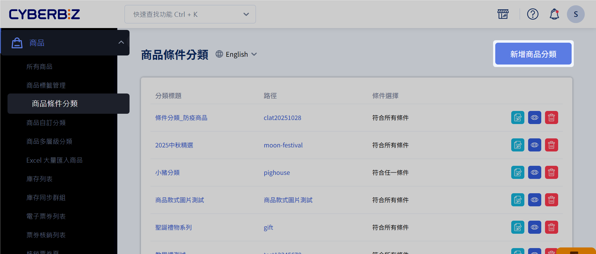
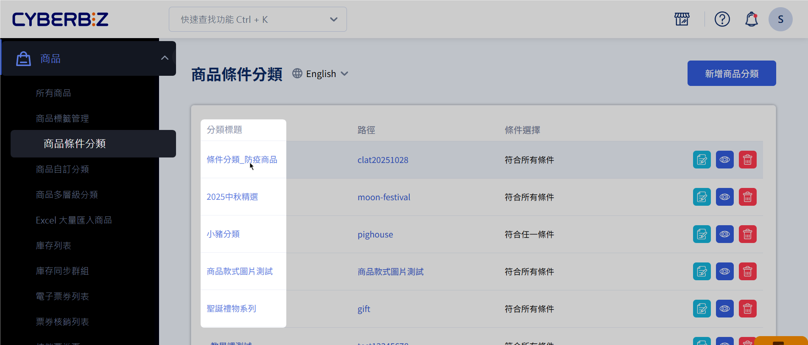
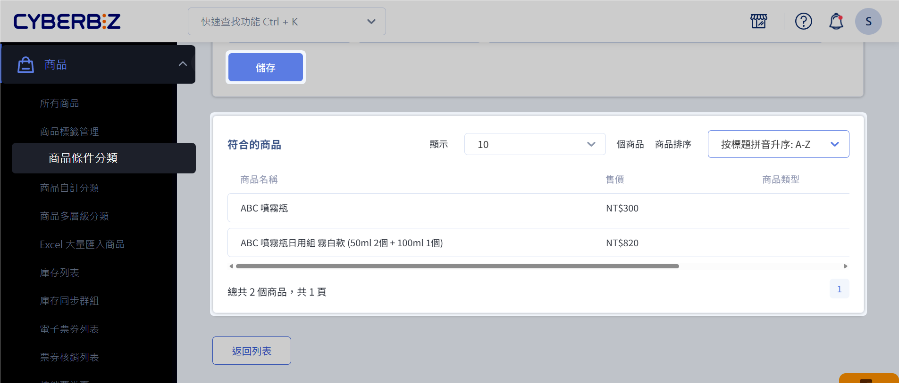

# 設定條件分類群組
依商品條件建立動態分類。
{ .subtitle }

{ title="商品自動分類群組：商品 > 商品條件分類" .hero-page }

!!! tip "應用情境"

	- 高效商品管理：依據商品價格、庫存、關鍵字等條件，自動將符合規則的商品歸類到特定群組，大幅提升管理效率。
	- 精準行銷活動：針對特定條件分類的商品進行行銷活動，例如[單品限時折扣](設定單品限時折扣群組)。
	- 優化搜尋引擎排名：透過設定分類描述與關鍵字，優化 SEO 表現，讓商品更容易被搜尋引擎找到。
	- 多層級條件篩選：支援設定多層篩選與搜尋條件，方便精準管理複雜的商品結構。

## 操作流程
### 建立商品條件分類
	
1. 登入 CYBERBIZ 管理後台，前往 **商品 > 商品條件分類**。
2. 點擊 **新增商品分類** 進入編輯頁面。

	

3. 輸入 **分類名稱**、 **分類網址**，並填寫 **分類描述**。

	

4. 點選 **儲存** 以建立新的商品條件分類。

### 設定商品篩選規則
1. 在條件分類列表中，點選欲加入商品的條件分類，進入編輯頁面。

	

2. 點擊 **加入商品** 分頁，開始設定商品篩選規則。
	- 篩選結果：選擇 **符合所有條件** 或 **符合任一條件** 邏輯。  
	- 新增商品規則：依據商品名稱、類型、廠商、價格、定價、庫存現貨、款式名稱、商品標籤等條件進行關鍵字查找與篩選。

	

3. 點擊 **儲存**，符合條件的商品將自動顯示於下方列表，表示商品已成功加入該分類。
> :lucide-triangle-alert: 若 *商品名稱* 包含系統不支援的標點符號，可能導致排序功能無法正常運作。
	
	
		

### 編輯 SEO 設定
1. 在商品條件分類頁面，下滑找到 **SEO 設定** 欄位。
2. 編輯網頁資訊，優化搜尋引擎，以提升網站搜尋排名。

{ .screenshot }

### 前台畫面顯示
完成設定後，商品條件分類將會顯示於商店前台。

{ .screenshot }

## 後續操作

- [__設定網站選單與導覽列__](#)     
將商品分類群組綁定至前台導覽列。

## 整合串接

=== "POS"

使用 POS 系統商家，若想管理商品並建立 POS 選單，請設定 POS 商品多層級分類，並建立商品自訂分類或商品類型。條件分類恕不支援 POS 系統。詳細操作可洽 [POS前台選單設定](https://www.cyberbiz.io/support/?p=11224)。

## 延伸閱讀

- [設定網站選單與導覽列](設定網站選單與導覽列)