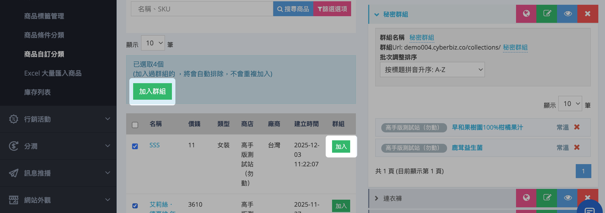
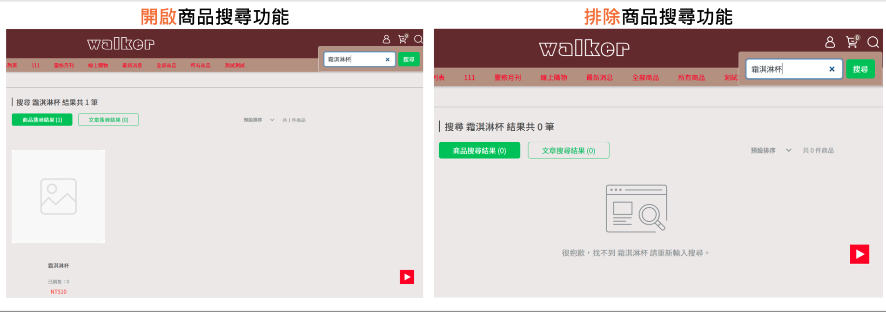

# 設定秘密商品群組
建立隱藏商品群組，透過專屬連結提供給特定顧客購買。
{ .subtitle }

## 秘密商品群組（秘密商店）說明

「秘密商店」是一種僅對特定顧客開放的購物頁面，透過專屬連結訪問。其內容由「秘密商品群組」組成，群組內商品可設定排除站內搜尋，確保一般顧客無法直接瀏覽。

建立秘密商店的主要用途包括：

- **VIP 客戶專屬優惠**：提供經銷商、團購主或員工專屬商品購買連結。
- **網紅分潤導購**：搭配第三方推薦碼追蹤銷售與分潤效果。
- **限量商品預售**：在正式上架前提供給特定會員購買。  

!!! warning "注意"
	- 請勿將秘密商店連結放置於官網導覽列，避免一般顧客誤入。
	- 秘密商店群組頁仍可能被 Google 搜尋索引，若需避免曝光，請至 [Google Search Console 設定排除頁面](https://www.cyberbiz.io/support/?p=25441#b)。

## 設定秘密商品群組

1. 登入 CYBERBIZ 管理後台，前往 **商品 > 商品自訂分類**。
2. 點選右下角 **新增群組**，輸入群組名稱。
3. 將商品加入群組：
	- **單品加入**：點擊 **加入**，將單一商品加入群組。
	- **批次加入**：在左側商品列表勾選多個商品 → 點擊 **加入群組**，一次將多個商品加入群組。
    
    

4. **排除商品站內搜尋**
	- 點擊秘密群組中的商品名稱，進入商品編輯頁面。
	- 在 **商品資訊** 頁籤中，將 **商品搜尋功能** 開關切換為 `關閉 (OFF)`，即可將商品排除站內搜尋。
	> :lucide-info: 瞭解[商品排除搜尋效果](設定商品搜尋可見性#商品排除搜尋效果)。

	

## 運用秘密群組

### 提供專屬連結給特定顧客

- 複製秘密群組網址，例如：`www.yourstore.com/collections/秘密群組`
- 將連結提供給經銷商、團購主或員工，他們即可透過此連結直接購買群組商品。

!!! warning "分享連結注意事項"
	- 僅提供給特定顧客或合作夥伴，避免在公開渠道分享。  
	- 確認群組內商品已設定為 **排除站內搜尋**，確保秘密商店的專屬性。

### 搭配第三方推薦碼進行分潤導購

- 參考 [推薦人分潤-推薦連結說明](https://www.cyberbiz.io/support/?p=1874) 設定第三方推薦碼。
    
- 將秘密群組網址與推薦碼結合，例如：

    - 原網址：`www.rayray.cyberbiz.co/collections/秘密群組`        
    - 搭配推薦碼：`www.rayray.cyberbiz.co/collections/秘密群組?rcode=RAYTEST`
        
- 將帶推薦碼的專屬連結提供給推薦人，即可開始追蹤分潤成效。
     
## 後續操作

- :lucide-menu:{ .lg }  
  [__商品自訂分類__](設定商品自訂分類群組.md)  
  自訂商品分類群組。
- :lucide-share-2:{ .lg }    
  [__推薦人分潤__](#)   
  搭配推薦連結，追蹤第三方導購成效並計算分潤。

## 常見問題

??? quote "建立秘密群組後，商品會自動排除搜尋嗎？"
    不會。秘密群組僅是將商品歸類，您仍需手動進入商品編輯頁面，將群組內商品的「商品搜尋功能」設定為 `關閉 (OFF)`，才能排除站內搜尋。

??? quote "秘密群組的商品可以被一般顧客購買嗎？"
    如果一般顧客獲得了秘密群組的直接連結，並且該群組內的商品沒有設定「關閉站內搜尋」，那麼他們仍然可以訪問並購買。為確保專屬性，建議將群組內商品設定為排除搜尋。